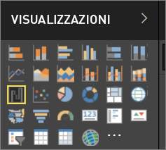

# Visualizzazioni nei report di Power BI

Le visualizzazioni, note anche come oggetti visivi, mostrano informazioni dettagliate individuate nei dati. Un report di Power BI può includere una singola pagina con un oggetto visivo oppure più pagine con molti oggetti visivi. Nel servizio Power BI gli oggetti visivi possono essere [aggiunti dai report ai dashboard](../service-dashboard-pin-tile-from-report.md).

È importante distinguere fra report *progettisti* e il report *consumer* se si è l'utente crea o modifica del report, quindi si ha una finestra di progettazione.  Finestre di progettazione dispone delle autorizzazioni di modifica per il report e il set di dati sottostante. In Power BI Desktop queste autorizzazioni consentono di aprire il set di dati nella vista Dati e creare oggetti visivi nella visualizzazione Report. Nel servizio Power BI, questo significa che è possibile aprire il set di dati o report nell'editor di report in [visualizzazione di modifica](../consumer/end-user-reading-view.md). Se un report o un dashboard è stato [condiviso con l'utente](../consumer/end-user-shared-with-me.md), l'utente è un **consumer** del report. È possibile visualizzare e interagire con il report e i rispettivi oggetti visivi, ma non sarà possibile salvare le modifiche principali.

Sono disponibili molti tipi diversi di oggetti visivi, direttamente dal riquadro VISUALIZZAZIONI di Power BI.

Per ampliare le opzioni, visitare il [sito della community di Microsoft AppSource](https://appsource.microsoft.com) per trovare e [scaricare](https://appsource.microsoft.com/marketplace/apps?page=1&product=power-bi-visuals) [oggetti visivi personalizzati](../developer/custom-visual-develop-tutorial.md) forniti da Microsoft e dalla community.

<iframe width="560" height="315" src="https://www.youtube.com/embed/SYk_gWrtKvM?list=PL1N57mwBHtN0JFoKSR0n-tBkUJHeMP2cP" frameborder="0" allowfullscreen></iframe>

  Se non si ha familiarità con Power BI o si ha bisogno di un ripasso, usare i collegamenti seguenti per apprendere le nozioni fondamentali delle visualizzazioni di Power BI.  In alternativa, usare il Sommario (sul lato sinistro di questo articolo) per trovare informazioni ancora più utili.

## Aggiungere una visualizzazione in Power BI

[Creare visualizzazioni](power-bi-report-add-visualizations-i.md) nelle pagine dei report. Scorrere l'[elenco delle visualizzazioni disponibili e delle esercitazioni sulle visualizzazioni disponibili](power-bi-visualization-types-for-reports-and-q-and-a.md). 

## Caricare una visualizzazione personalizzata e usarla in Power BI

Aggiungere una visualizzazione personalizzata creata dall'utente o trovata nel [sito della community di Microsoft AppSource](https://appsource.microsoft.com/marketplace/apps?product=power-bi-visuals). Approccio creativo Esaminare il codice sorgente e usare gli [strumenti di sviluppo](../developer/custom-visual-develop-tutorial.md) per creare un nuovo tipo di visualizzazione e [condividerlo con la community](../developer/office-store.md). Per altre informazioni sullo sviluppo di oggetti visivi personalizzati, vedere [Sviluppo di un oggetto visivo personalizzato di Power BI](../developer/custom-visual-develop-tutorial.md).

## Modificare il tipo di visualizzazione

Provare a [modificare il tipo di visualizzazione](power-bi-report-change-visualization-type.md) per trovare quello più adatto ai propri dati.

## Aggiungere la visualizzazione

Quando si ottiene la visualizzazione desiderata, nel servizio Power BI è possibile [aggiungerla a un dashboard](../service-dashboard-pin-tile-from-report.md) come riquadro. Se si modifica la visualizzazione usata nel report dopo l'aggiunta, il riquadro non subisce modifiche nel dashboard: se si tratta di un grafico a linee, rimane un grafico a linee, anche se nel report è stato modificato in un grafico ad anello.

## Limitazioni e considerazioni
- A seconda origine dati e il numero di campi (misure o colonne), un oggetto visivo può caricato lentamente.  È consigliabile limitare gli oggetti visivi da 10 a 20 campi dei totali, sia per motivi di prestazioni e migliorare la leggibilità. 

- Il limite massimo per gli oggetti visivi è 100 campi (misure o colonne). Se l'oggetto visivo non riesce a caricare, ridurre il numero di campi.   

## Passaggi successivi

* [Tipi di visualizzazione in Power BI](power-bi-visualization-types-for-reports-and-q-and-a.md)
* [Oggetti visivi personalizzati](../power-bi-custom-visuals.md)