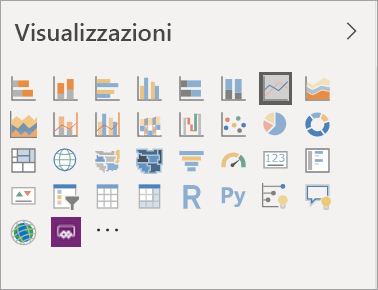
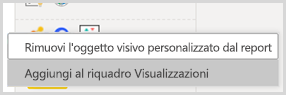
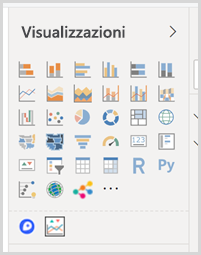

# Visualizzazioni nei report di Power BI

[!INCLUDE[consumer-appliesto-yyyn](../includes/consumer-appliesto-yyyn.md)]    

Le visualizzazioni, note anche come oggetti visivi, mostrano informazioni dettagliate individuate nei dati. Un report di Power BI può includere una singola pagina con un oggetto visivo oppure più pagine con molti oggetti visivi. Nel servizio Power BI gli oggetti visivi possono essere [aggiunti dai report ai dashboard](../create-reports/service-dashboard-pin-tile-from-report.md).

È importante distinguere tra *designer* di report e *consumer* di report.  Una persona che crea o modifica un report è un designer.  I designer hanno autorizzazioni di modifica per il report e per il set di dati sottostante. In Power BI Desktop queste autorizzazioni consentono di aprire il set di dati nella vista Dati e creare oggetti visivi nella visualizzazione Report. Nel servizio Power BI è quindi possibile aprire il set di dati o il report nell'editor di report in [Visualizzazione di modifica](../consumer/end-user-reading-view.md). Se un report o un dashboard è stato [condiviso con l'utente](../consumer/end-user-shared-with-me.md), l'utente è un *consumer* del report. Sarà possibile visualizzare e interagire con il report e con gli oggetti visivi di questo, ma non sarà possibile eseguire tante modifiche quante ne può eseguire un *designer*.

Sono disponibili molti tipi diversi di oggetti visivi direttamente dal riquadro Visualizzazioni di Power BI.

Per altre opzioni, visitare il [sito della community di Microsoft AppSource](https://appsource.microsoft.com) per trovare e [scaricare](https://appsource.microsoft.com/marketplace/apps?page=1&product=power-bi-visuals) gli [oggetti visivi di Power BI](../developer/visuals/custom-visual-develop-tutorial.md) forniti da Microsoft e dalla community.

Se non si ha familiarità con Power BI o si ha bisogno di un ripasso, usare i collegamenti seguenti per apprendere le nozioni fondamentali delle visualizzazioni di Power BI.  In alternativa, usare il Sommario (sul lato sinistro di questo articolo) per trovare informazioni ancora più utili.

## Aggiungere una visualizzazione in Power BI

[Creare visualizzazioni](power-bi-report-add-visualizations-i.md) nelle pagine dei report. Scorrere l'[elenco delle visualizzazioni disponibili e delle esercitazioni sulle visualizzazioni disponibili.](power-bi-visualization-types-for-reports-and-q-and-a.md) 

## Caricare una visualizzazione personalizzata e usarla in Power BI

Aggiungere una visualizzazione personalizzata creata dall'utente o trovata nel [sito della community di Microsoft AppSource](https://appsource.microsoft.com/marketplace/apps?product=power-bi-visuals). Approccio creativo Esaminare il codice sorgente e usare gli [strumenti di sviluppo](../developer/visuals/custom-visual-develop-tutorial.md) per creare un nuovo tipo di visualizzazione e [condividerlo con la community](../developer/visuals/office-store.md). Per altre informazioni sullo sviluppo di oggetti visivi personalizzati, vedere [Sviluppo di un oggetto visivo personalizzato di Power BI](../developer/visuals/custom-visual-develop-tutorial.md).

## Personalizzare il riquadro di visualizzazione (anteprima)

Se ci si rende conto di usare lo stesso oggetto visivo personalizzato in molti report, è possibile aggiungere la visualizzazione personalizzata al riquadro delle visualizzazioni. Per aggiungere la visualizzazione al riquadro, fare clic con il pulsante destro del mouse sull'oggetto visivo.

Dopo che è stato aggiunto, un oggetto visivo viene spostato verso l'alto e inserito tra gli altri oggetti visivi predefiniti. Questo oggetto visivo è ora collegato all'account usato per eseguire l'accesso e verrà incluso automaticamente in tutti i nuovi report creati durante la connessione con questo account. In questo modo è molto facile standardizzare in base a un oggetto visivo specifico senza doverlo aggiungere a ogni report.

Durante il periodo di anteprima di questa funzionalità, in Power BI Desktop vengono visualizzati solo gli oggetti visivi aggiunti. Perché questa funzionalità sia disponibile, è anche necessario eseguire l'accesso.

## Modificare il tipo di visualizzazione

Provare a [modificare il tipo di visualizzazione](power-bi-report-change-visualization-type.md) per trovare quello più adatto ai propri dati.

## Aggiungere la visualizzazione

Quando si ottiene la visualizzazione desiderata, nel servizio Power BI è possibile [aggiungerla a un dashboard](../create-reports/service-dashboard-pin-tile-from-report.md) come riquadro. Se si modifica la visualizzazione usata nel report dopo l'aggiunta, il riquadro non subisce modifiche nel dashboard: se si tratta di un grafico a linee, rimane un grafico a linee, anche se nel report è stato modificato in un grafico ad anello.

## Limitazioni e considerazioni
- A seconda dell'origine dati e del numero di campi (misure o colonne), il caricamento di un oggetto visivo può essere lento.  È consigliabile limitare il numero totale di campi negli oggetti visivi a 10 -20, sia per motivi di leggibilità che di prestazioni. 

- Il limite massimo per gli oggetti visivi è di 100 campi (misure o colonne). Se non si riesce a caricare un oggetto visivo, ridurne il numero di campi.   

## Passaggi successivi

* [Tipi di visualizzazione in Power BI](power-bi-visualization-types-for-reports-and-q-and-a.md)
* [Oggetti visivi di Power BI](../developer/visuals/power-bi-custom-visuals.md)
