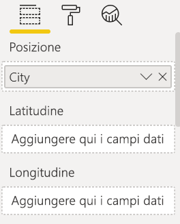
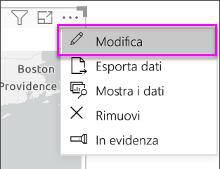
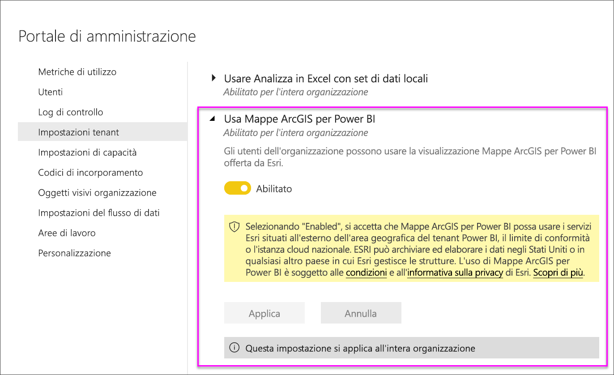

# Creare mappe di ArcGIS Maps in Power BI Desktop

[!INCLUDE [power-bi-visuals-desktop-banner](../includes/power-bi-visuals-desktop-banner.md)]

Questa esercitazione è stata scritta dal punto di vista di una persona che crea una mappa di ArcGIS Maps for Power BI. Quando un *progettista* condivide una mappa di ArcGIS Maps for Power BI con un collega, quest'ultimo potrà vederla e interagire con essa, ma non salvare le modifiche. Per altre informazioni sulla visualizzazione di una mappa di ArcGIS Maps, vedere [Interazione con le mappe ArcGIS in Power BI](power-bi-visualizations-arcgis.md).

Dalla combinazione tra le mappe ArcGIS e Power BI nasce una soluzione di mapping di livello superiore, che non si limita alla presentazione di punti su una mappa. È possibile scegliere tra mappe di base, tipi di posizione, temi, stili per i simboli e livelli di riferimento per creare visualizzazioni mappa ricche di dettagli e di grande impatto visivo. La combinazione di livelli di dati autorevoli su una mappa con l'analisi spaziale consente di ottenere informazioni più approfondite sui dati nella visualizzazione.

 Sebbene in un dispositivo mobile non sia possibile creare una mappa di ArcGIS Maps for Power BI, è possibile visualizzarne una e interagire con essa. Vedere [Interacting with ArcGIS maps](power-bi-visualizations-arcgis.md) (Interazione con le mappe ArcGIS).

> [!TIP]
> GIS è l'acronimo per Geographic Information System (Sistema informativo geografico).

L'esempio seguente usa un'area di disegno di colore grigio scuro per mostrare le vendite per area geografica come mappa termica su un livello demografico relativo al reddito medio netto 2016. Come si spiegherà più avanti, le mappe di ArcGIS Maps for Power BI offrono funzionalità avanzate di mapping praticamente illimitate, dati demografici e visualizzazioni mappa ancora più interessanti per poter ottenere i migliori risultati.

> [!TIP]
> Visitare la [pagina di Esri su ArcGIS Maps for Power BI](https://www.esri.com/powerbi) per trovare molti esempi e leggere testimonianze. Vedere quindi l'[introduzione ad ArcGIS Maps for Power BI](https://doc.arcgis.com/en/maps-for-powerbi/get-started/about-maps-for-power-bi.htm) fornita da Esri.

## Consenso dell'utente
ArcGIS Maps for Power BI è fornito da Esri (https://www.esri.com) ). L'uso di Mappe ArcGIS per Power BI è soggetto alle condizioni e all'informativa sulla privacy di Esri. Gli utenti di Power BI che vogliono usare le mappe di ArcGIS per gli oggetti visivi di Power BI devono confermare il proprio consenso nell'apposita finestra.

**Risorse**

[Condizioni](https://go.microsoft.com/fwlink/?LinkID=826322)

[Informativa sulla privacy](https://go.microsoft.com/fwlink/?LinkID=826323)

[Pagina del prodotto Mappe ArcGIS per Power BI](https://www.esri.com/powerbi)

## Prerequisiti

Questa esercitazione usa Power BI Desktop e il [file Retail Analysis Sample PBIX](https://download.microsoft.com/download/9/6/D/96DDC2FF-2568-491D-AAFA-AFDD6F763AE3/Retail%20Analysis%20Sample%20PBIX.pbix). È anche possibile creare mappe di ArcGIS Maps for Power BI usando il servizio Power BI. 

1. Nella sezione in alto a sinistra della barra dei menu selezionare **File** \> **Apri**.
   
2. Trovare il **file Retail Analysis Sample PBIX** salvato nel computer locale.

1. Aprire **Retail Analysis Sample** nella visualizzazione report .

1. Seleziona  per aggiungere una nuova pagina.

   
## Creare una visualizzazione mappa di ArcGIS Maps for Power BI

Osservare come vengono create alcune visualizzazioni e quindi usare la procedura seguente per provare usando il [file Retail Analysis Sample PBIX](../sample-datasets.md).
    

   > [!NOTE]
   > Questo video usa una versione precedente di Power BI Desktop.
   > 

> [!VIDEO https://www.youtube.com/embed/EKVvOZmxg9s]

1. Selezionare l'icona ArcGIS Maps for Power BI dal riquadro Visualizzazioni.
   
        

2. Power BI aggiunge un modello vuoto all'area di disegno report. Per questa esercitazione verrà usata la versione gratuita.
   
   

3. Dal riquadro **Campi** trascinare un campo di dati nei bucket **Località** o **Latitudine** e/o **Longitudine**. In questo esempio viene usato **Store > City**.
   
   > [!NOTE]
   > Mappe ArcGIS per Power BI rileva automaticamente se i campi selezionati saranno meglio visualizzati come forma o come punto su una mappa. È possibile modificare il valore predefinito nelle impostazioni (vedere sotto).
   > 
   > 
   
    

4. Dal riquadro **Campi** trascinare una misura sui bucket **Dimensione** per regolare la modalità di visualizzazione dei dati. In questo esempio viene usato **Sales > Last Year Sales**.
   
    

È stata creata la prima mappa di ArcGIS Maps for Power BI. È ora possibile perfezionarla e formattarla usando mappe di base, tipi di località, temi e altro ancora.

## Impostazioni e formattazione per ArcGIS Maps for Power BI
Per accedere alle caratteristiche di formattazione di **Mappe ArcGIS per Power BI**:

1. Accedere a funzionalità aggiuntive selezionando **Altre azioni** (...) nell'angolo in alto a destra della visualizzazione e scegliendo **Modifica**.
   
   
   
   La visualizzazione si espande e le funzionalità disponibili vengono mostrate nella parte superiore. Ogni funzionalità, se selezionata, apre un riquadro attività che fornisce opzioni dettagliate. 
   
   
   

> [!TIP]
> **Esri** fornisce una [documentazione completa](https://go.microsoft.com/fwlink/?LinkID=828772) nel set di funzionalità di **Mappe ArcGIS per Power BI**.

### Mappe di base
Vengono fornite quattro mappe di base: Canvas grigio scuro, Tela grigio chiaro, OpenStreetMap e Vie.  *Vie* è la mappa di base standard di ArcGIS.

Per applicare una mappa di base, selezionarla nel riquadro attività.

### Location type
ArcGIS Maps for Power BI rileva automaticamente il modo migliore per visualizzare i dati sulla mappa, selezionandoli da punti o confini. Le opzioni Tipo di luogo consentono di ottimizzare queste selezioni.

**Confini** funziona solo se i dati contengono valori geografici standard. ArcGIS Maps for Power BI determina automaticamente la forma da visualizzare sulla mappa. I valori geografici standard includono paesi, province, codici di avviamento postale e così via. Tuttavia, proprio come con la geocodifica, Power BI potrebbe non rilevare che un campo deve essere un limite per impostazione predefinita o potrebbe non trovare un limite per i dati.  

### Map theme
Vengono forniti quattro temi di mappa. Power BI seleziona automaticamente i temi **Solo luogo** o **Dimensioni**, in base al campo o ai campi aggiunti ai bucket **Posizione** e **Dimensione**. Per impostazione predefinita, la mappa usa il tema **Dimensioni**, essendo stati aggiunti campi a entrambi i bucket. Provare gli altri temi e tornare a **Dimensioni** prima di procedere con il passaggio successivo.  

<table>
<tr><th>Tema</th><th>Descrizione</th>
<tr>
<td>Location Only</td>
<td>Traccia punti dati o confini riempiti sulla mappa in base al campo aggiunto al bucket Posizione.</td>
</tr>
<tr>
<td>Heat Map</td>
<td>Traccia l'intensità dei dati sulla mappa. Le aree di maggiore attività o valore sono rappresentate da colori più forti e luminosi. </td>
</tr>
<tr>
<td>Dimensione</td>
<td>Traccia punti dati sulla mappa in base al campo aggiunto al bucket Dimensione.</td>
</tr>
<tr>
<td>Clustering</td>
<td>I punti all'interno del raggio del cluster specificato vengono raggruppati in un unico simbolo che rappresenta il numero di punti in tale area della mappa. </td>
</tr>
</table>

### Symbol style
Gli stili dei simboli consentono di ottimizzare la modalità di presentazione dei dati sulla mappa. Gli stili dei simboli sono sensibili al contesto in base al tipo di posizione selezionato e al tema della mappa. L'esempio seguente mostra il tema della mappa impostato su **Dimensioni** e diverse modifiche degli stili dei simboli apportate a trasparenza, stile e dimensioni. 

### Pins
Per attirare l'attenzione su specifici punti della mappa è possibile aggiungere puntine.  

1. Selezionare la scheda **Puntine**.
2. Digitare le parole chiave (ad esempio indirizzi, posti e punti di interesse), nella casella di ricerca e selezionare dall'elenco a discesa. Verrà visualizzato un simbolo sulla mappa e sarà ingrandita automaticamente la località. I risultati della ricerca vengono salvati come schede località nel riquadro Puntine. È possibile salvare fino a 10 schede località.
   
   
3. Alla posizione selezionata viene aggiunta una puntina, di cui è possibile cambiare il colore.
   
   
4. Aggiungere ed eliminare puntine.
   
   

### Drive time
Il riquadro Drive time (Tempo di guida) consente di selezionare una località e quindi determinare quali altre funzionalità della mappa sono comprese entro un raggio o un tempo di guida specificato. L'esempio seguente mostra un raggio di 50 miglia da Washington D.C.  Attenersi alla procedura seguente per creare un livello di tempo di guida personalizzato. 
    

1. Scegliere lo strumento di selezione singola e selezionare una puntina o una bolla. In questo esempio è stata selezionata una puntina per l'aeroporto Charlotte Douglas.

   
   
   > [!TIP]
   > Risulta più semplice selezionare una località se si fa zoom avanti sulla mappa. Per ingrandire la mappa, usare l'icona + o scorrere con il mouse.
   > 
   > 
2. Si supponga di essere diretti all'aeroporto Charlotte Douglas per un paio di giorni e che si voglia capire quali negozi si trovano a una distanza ragionevole in auto. Modificare l'area di ricerca in **Tempo di guida** e impostare la distanza su **25** minuti. Selezionare OK.    
   
    

    

3. Sono presenti due negozi nel raggio del tempo di guida di 25 minuti. Il raggio è indicato in viola. Selezionare qualsiasi località per visualizzarne i dettagli. Facoltativamente, cambiare il formato del raggio modificandone colore e profilo.
   
    

### Layer di riferimento
#### Layer di riferimento - dati demografici
Mappe ArcGIS per Power BI fornisce una selezione di livelli demografici che consentono di contestualizzare i dati da Power BI.

1. Selezionare la scheda **Layer di riferimento** e quindi scegliere **Dati demografici**.
2. Ogni livello (o layer) elencato ha una casella di controllo. Aggiungere un segno di spunta per aggiungere tale livello alla mappa.  In questo esempio è stato aggiunto reddito medio del nucleo familiare. 
   
    
3. Ogni livello è interattivo. Passare il mouse su una bolla per visualizzare i dettagli. Fare clic su un'area ombreggiata per visualizzare i dettagli sotto forma di grafici. In questo esempio è stato selezionato il codice postale 28227 e sono disponibili due grafici da visualizzare.
   
    

#### Layer di riferimento - ArcGIS
ArcGIS Online consente alle organizzazioni di pubblicare mappe Web pubbliche. Inoltre, Esri fornisce un set predefinito di mappe Web grazie a Living Atlas. Nella scheda ArcGIS, è possibile cercare tutte le mappe Web pubbliche o la cartografia di Living Atlas e aggiungerle alla mappa come layer di riferimento.

1. Selezionare la scheda **Layer di riferimento** e quindi scegliere **ArcGIS**.
2. Immettere i termini di ricerca e quindi selezionare un livello di mappa. In questo esempio sono stati scelti i quartieri del Congresso negli Stati Uniti.
   
    
3. Per visualizzare i dettagli, selezionare un'area ombreggiata per aprire lo strumento *Select from reference layer* (Selezione dal layer di riferimento): Usare lo strumento di selezione del layer di riferimento per selezionare i limiti o gli oggetti nel layer di riferimento.

 

## Selezione dei punti dati
ArcGIS Maps for Power BI consente cinque modalità di selezione che consentono di selezionare i dati in modo accurato e rapido.

Modificare la modalità di selezione passando il puntatore del mouse sull'icona dello strumento di selezione singola mostrata nell'immagine seguente. Verrà espansa la barra nascosta per visualizzare altri strumenti:

Ogni strumento ha un ruolo specifico per la selezione dei dati: 

 Selezionare singoli punti dati.

 Disegna un rettangolo sulla mappa e seleziona i punti dati in essi contenuti.

 Consente di usare i limiti o i poligoni all'interno dei layer di riferimento per selezionare i punti dati in essi contenuti.

 Consente di selezionare i dati usando un livello buffer.

 Consente di selezionare punti dati simili tra loro.

> [!NOTE]
> È possibile selezionare un massimo di 250 punti dati alla volta.
> 
> 

 

## Chiedere assistenza
**Esri** fornisce una [documentazione completa](https://go.microsoft.com/fwlink/?LinkID=828772) nel set di funzionalità di **Mappe ArcGIS per Power BI**.

È possibile porre domande, ottenere informazioni aggiornate, segnalare problemi e trovare risposte nel [thread della community di Power BI correlato a **Mappe ArcGIS per Power BI**](https://go.microsoft.com/fwlink/?LinkID=828771).

Se si vuole proporre un miglioramento, inviare il suggerimento all'[elenco di idee di Power BI](https://ideas.powerbi.com).

 

## Gestione dell'uso di Mappe ArcGIS per Power BI all'interno dell'organizzazione
Power BI offre la possibilità a progettisti, amministratori tenant e amministratori IT di gestire l'uso di ArcGIS Maps for Power BI. Di seguito viene descritta la procedura valida per ogni ruolo. 

### Opzioni per i progettisti
In Power BI Desktop i progettisti possono disabilitare ArcGIS Maps for Power BI nella scheda Sicurezza. Selezionare **File** > **Opzioni e impostazioni** e quindi selezionare **Opzioni** > **Sicurezza**. Se disabilitato, Mappe ArcGIS non verrà caricato per impostazione predefinita.

### Opzioni per gli amministratori tenant
In PowerBI.com gli amministratori tenant possono disattivare ArcGIS Maps for Power BI per tutti gli utenti. Selezionare **Impostazioni** > **Portale di amministrazione** > **Impostazioni tenant**. Quando è disabilitato, Power BI non potrà più visualizzare l'icona di ArcGIS Maps for Power BI nel riquadro Visualizzazioni.

### Opzioni per l'amministratore IT
Power BI Desktop supporta l'uso di **Criteri di gruppo** per disabilitare ArcGIS Maps for Power BI in tutti i computer distribuiti in un'organizzazione.

<table>
<tr><th>Attributo</th><th>Valore</th>
</tr>
<tr>
<td>chiave</td>
<td>Software\Policies\Microsoft\Power BI Desktop&lt;/td&gt;
</tr>
<tr>
<td>valueName</td>
<td>EnableArcGISMaps</td>
</tr>
</table>

Il valore 1 (decimale) abilita Mappe ArcGIS per Power BI.

Il valore 0 (decimale) disabilita Mappe ArcGIS per Power BI.

## Considerazioni e limitazioni
Mappe ArcGIS per Power BI è disponibile nei seguenti servizi e applicazioni:

<table>
<tr><th>Servizio/App</th><th>Disponibilità</th></tr>
<tr>
<td>Power BI Desktop</td>
<td>Sì</td>
</tr>
<tr>
<td>Servizio Power BI (app.powerbi.com)</td>
<td>Sì</td>
</tr>
<tr>
<td>App Power BI per dispositivi mobili</td>
<td>Sì</td>
</tr>
<tr>
<td>Pubblica sul Web di Power BI</td>
<td>No</td>
</tr>
<tr>
<td>Power BI Embedded</td>
<td>No</td>
</tr>
<tr>
<td>Incorporamento del servizio Power BI (PowerBI.com)</td>
<td>No</td>
</tr>
</table>

In servizi o applicazioni in cui Mappe ArcGIS per Power BI non è disponibile, la visualizzazione verrà mostrata come oggetto visivo vuoto con il logo di Power BI.

Quando si esegue la geocodifica, l'operazione viene eseguita solo per i primi 1500 indirizzi stradali. La geocodifica dei nomi o dei paesi non è soggetta al limite di 1500 indirizzi.

 

**Come funziona ArcGIS Maps for Power BI?**
ArcGIS Maps for Power BI è fornito da Esri (https://www.esri.com) ). L'uso di ArcGIS Maps for Power BI è soggetto alle [condizioni](https://go.microsoft.com/fwlink/?LinkID=8263222) e all'[informativa sulla privacy](https://go.microsoft.com/fwlink/?LinkID=826323) di Esri. Gli utenti di Power BI che vogliono usare le mappe di ArcGIS per gli oggetti visivi di Power BI devono confermare il proprio consenso nell'apposita finestra. Per informazioni dettagliate, vedere Consenso dell'utente.  L'uso di ArcGIS Maps for Power BI di Esri è soggetti alle condizioni e all'informativa sulla privacy di Esri a cui è possibile accedere anche dal collegamento presente nella finestra di dialogo del consenso. Ogni utente deve confermare il proprio consenso prima di usare ArcGIS Maps for Power BI per la prima volta. Dopo che l'utente ha confermato il proprio consenso, i dati associati all'oggetto visivo vengono inviati ai servizi di Esri almeno per la geocodifica, ovvero la trasformazione delle informazioni sulla località in informazioni su latitudine e longitudine che possono essere rappresentate in una mappa. È probabile che i dati associati alla visualizzazione possano essere inviati ai servizi di Esri. Esri fornisce servizi come mappe di base, analisi spaziale, geocodifica e così via. L'oggetto visivo ArcGIS Maps for Power BI interagisce con questi servizi usando una connessione SSL protetta da un certificato fornito e gestito da Esri. Per altre informazioni su ArcGIS Maps for Power BI, vedere la [pagina del prodotto ArcGIS Maps for Power BI](https://www.esri.com/powerbi) di Esri.

Quando un utente si iscrive a una sottoscrizione Plus offerta da Esri tramite ArcGIS Maps for Power BI, entra in relazione diretta con Esri. Power BI non invia informazioni personali sull'utente a Esri. L'utente accede e considera attendibile un'applicazione AAD fornita da Esri usando la propria identità AAD. In questo modo, l'utente condivide le informazioni personali direttamente con Esri. Dopo che l'utente ha aggiunto il contenuto Plus a un oggetto visivo ArcGIS Maps for Power BI, anche gli altri utenti di Power BI hanno bisogno di una sottoscrizione Plus di Esri per visualizzare o modificare tale contenuto. 

Per domande tecniche dettagliate sul funzionamento di ArcGIS Maps for Power BI di Esri, contattare Esri tramite il sito del supporto.

**Quali dati vengono inviati a Esri?**
Per informazioni sui dati trasferiti a Esri, vedere il [sito della documentazione](https://doc.arcgis.com/en/maps-for-powerbi/get-started/data-transfer.htm).

**È previsto un addebito per l'uso di Mappe ArcGIS per Power BI?**

ArcGIS Maps for Power BI è fornito da **ESRI** senza alcun costo aggiuntivo. È necessario accettare il contratto utente.  

**Viene visualizzato un messaggio di errore in Power BI Desktop che indica che la cache è piena**

Si tratta di un bug in corso di risoluzione.  Nel frattempo, per cancellare la cache, provare a eliminare i file in questa posizione: C:\Users\\AppData\Local\Microsoft\Power BI Desktop\CEF e quindi riavviare Power BI.

**Mappe ArcGIS per Power BI supporta i file di forma di Esri?**

Mappe ArcGIS per Power BI rileva automaticamente i limiti standard come paesi, stati o province e codici di avviamento postale. Se è necessario fornire forme personalizzate, è possibile farlo usando [Shape Maps for Power BI Desktop](desktop-shape-map.md).

**È possibile visualizzare le proprie mappe ArcGIS offline?**

No, Power BI richiede la connettività di rete per visualizzare le mappe.

**È possibile collegarsi all'account ArcGIS online da Power BI?**

Non ancora. [Votando per questa idea](https://ideas.powerbi.com/forums/265200-power-bi-ideas/suggestions/9154765-arcgis-geodatabases) si riceverà un messaggio di posta elettronica quando si comincerà a lavorare su questa funzionalità.  

## Passaggi successivi
[Interazione con una mappa ArcGIS condivisa con l'utente](power-bi-visualizations-arcgis.md)

[Post di blog che annuncia la disponibilità di Mappe ArcGIS per Power BI](https://powerbi.microsoft.com/blog/announcing-arcgis-maps-for-power-bi-by-esri-preview/)

Altre domande? [Provare a rivolgersi alla community di Power BI](https://community.powerbi.com/)

