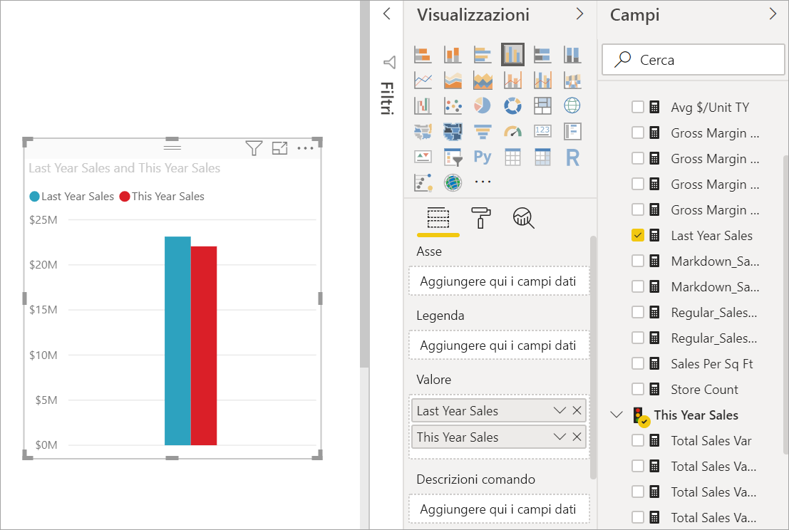

# Creare e usare i grafici ad aree di base

[!INCLUDE [power-bi-visuals-desktop-banner](../includes/power-bi-visuals-desktop-banner.md)]

Il grafico ad aree di base, detto anche grafico ad aree su più livelli, è basato sul grafico a linee. L'area compresa tra l'asse e la linea viene riempita con colori per indicare un volume. 

I grafici ad aree enfatizzano l'entità del cambiamento nel tempo e possono essere usati per attirare l'attenzione sul valore totale in una tendenza. Ad esempio, i dati che rappresentano il profitto nel tempo possono essere tracciati in un grafico ad aree per enfatizzare il profitto totale.

## Quando usare un grafico ad aree di base
I grafici ad aree di base rappresentano un'ottima scelta nelle seguenti situazioni:

* per vedere e confrontare la tendenza del volume su diverse serie temporali 
* per singole serie che rappresentano un set fisicamente numerabile

### Prerequisiti
Questa esercitazione usa il [file Retail Analysis Sample PBIX](https://download.microsoft.com/download/9/6/D/96DDC2FF-2568-491D-AAFA-AFDD6F763AE3/Retail%20Analysis%20Sample%20PBIX.pbix).

1. Nella sezione in alto a sinistra della barra dei menu selezionare **File** > **Apri**
   
2. Trovare la copia del **file Retail Analysis Sample PBIX**

1. Aprire il **file Retail Analysis Sample PBIX** nella visualizzazione report .

1. Selezione  per aggiungere una nuova pagina.

## Creare un grafico ad aree di base
 

1. Questa procedura consente di creare un grafico ad area che visualizza le vendite di quest'anno e quelle dell'anno precedente per mese.
   
   a. Nel riquadro Campi selezionare **Sales \> Last Year Sales** e **This Year Sales > Value**.

   

   b.  Convertire il grafico in un grafico ad area di base selezionando l'icona corrispondente nel riquadro Visualizzazioni.

   
   
   c.  Selezionare **Time \> FiscalMonth** per aggiungerlo all'area **Asse**.   
   
   
   d.  Per visualizzare il grafico in base al mese, selezionare i puntini di sospensione (in alto a destra dell'oggetto visivo) e scegliere **Ordina per mese**. Per modificare l'ordinamento, selezionare di nuovo i puntini di sospensione e selezionare **Ordinamento crescente** oppure **Ordinamento decrescente**.

## Evidenziazione e filtro incrociato
Per informazioni sull'uso del riquadro Filtri, vedere [Aggiungere un filtro a un report](../power-bi-report-add-filter.md).

Per evidenziare un'area specifica nel grafico, selezionare l'area o il bordo superiore.  Diversamente da altri tipi di visualizzazioni, se nella stessa pagina sono presenti altre visualizzazioni, evidenziando un grafico ad area di base non viene applicato il filtro incrociato alle altre visualizzazioni nella pagina del report. Sono comunque una destinazione per i filtri incrociati applicati da altre visualizzazioni nella pagina del report. 

1. Provare a selezionare il grafico ad area e a copiarlo nella pagina del report **New Store Analysis** (CTRL-C e CTRL-V).
2. Selezionare una delle aree ombreggiate del grafico ad area e quindi selezionare l'altra. Si noterà che questa operazione non ha alcun effetto sulle altre visualizzazioni nella pagina.
1. Ora selezionare un elemento. Si noti l'effetto sul grafico ad area: viene applicato il filtro incrociato.

     

Per altre informazioni, vedere [Interazioni tra le visualizzazioni nei report](../service-reports-visual-interactions.md).

## Considerazioni e risoluzione dei problemi   
* [Rendere il report più accessibile agli utenti con particolari esigenze](../desktop-accessibility.md)
* I grafici ad aree di base non sono efficaci per il confronto di valori a causa dell'occlusione sulle aree su più livelli. Power BI usa la trasparenza per indicare la sovrapposizione di aree. Questo, tuttavia, risulta efficace solo in presenza di due o tre aree diverse. Quando si deve confrontare la tendenza con più di tre misure, provare a usare i grafici a linee. Quando si deve confrontare il volume con più di tre misure, provare a usare la mappa ad albero.

## Passaggio successivo
[Report in Power BI](power-bi-visualization-card.md)  

