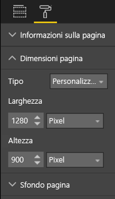
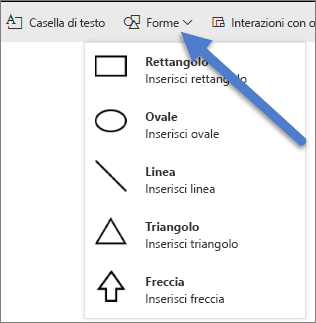
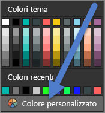
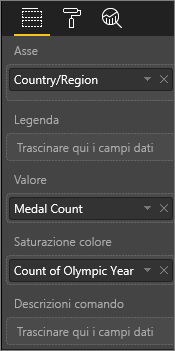

# Procedure consigliate per la progettazione di report e oggetti visivi
<!-- Shared newnav Include -->
[!INCLUDE [newnavbydefault](../includes/newnavbydefault.md)]

## Introduzione
Questo documento illustra le procedure consigliate per la progettazione di report in Power BI. Partendo dalla pianificazione, vengono presentati i principi di progettazione applicabili ai report, così come alle pagine e ai singoli oggetti visivi che compongono un report.  Molte di queste procedure consigliate sono valide anche per la progettazione di dashboard.

Ci auguriamo che questo white paper sia un punto di partenza utile e che le informazioni apprese possano essere applicate facilmente ai report e alle visualizzazioni specifici da creare e speriamo anche che gli utenti possano continuare a scambiarsi informazioni sull'argomento in community.powerbi.com. La progettazione di report BI e l'uso delle visualizzazioni sono argomenti di tendenza attualmente ed esistono molti leader di pensiero, blogger e siti Web che trattano approfonditamente questi argomenti da diverse prospettive (alla fine del documento ne sono elencati alcuni).   

> [!NOTE]
> I consigli forniti in questo white paper sono da considerarsi linee guida applicabili quando e dove risulta più appropriato. Per ogni principio descritto di seguito, esistono in genere motivi validi per non rispettare la regola.
> 
> 

*Siamo sommersi di informazioni non perché ce ne sono troppe, ma perché non sappiamo come gestirle.*
-- Stephen Few

## Informazioni di contesto e terminologia
In Power BI, un report può includere una o più pagine e nel loro insieme tutte le pagine sono collettivamente indicate come report. Gli elementi di base del report sono gli oggetti visivi (noti anche come visualizzazioni), le immagini autonome e le caselle di testo. Sono disponibili moltissime opzioni per la formattazione, dai singoli punti dati, agli elementi del report, fino alla pagina del report stessa.

Per iniziare verrà illustrata la fase di pianificazione del report, per continuare poi con i principi di progettazione di base dei report e i principi della progettazione visiva, concludendo infine con la presentazione delle procedure consigliate per i singoli tipi di oggetti visivi.

Nel sito **powerbi.com > Formazione** sono disponibili linee guida e istruzioni dettagliate per la creazione e l'uso dei report di Power BI.

## Prima di creare la prima visualizzazione valutare i requisiti
La creazione di un report inizia in effetti prima di creare il primo oggetto visivo, perché la pianificazione è fondamentale per ottenere un buon report.  Per iniziare, individuare i dati con cui è necessario lavorare e prendere nota dei requisiti per il report. Porsi domande del tipo "Qual è l'esigenza aziendale, come verranno usati questi dati e da chi?" Una domanda cruciale è "quali decisioni riuscirà a prendere il lettore in base a questo report?"

La progettazione si baserà sulle risposte a queste domande. Ogni report racconta una storia ed è importante assicurarsi che la storia corrisponda le esigenze aziendali. Si potrebbe cadere nella tentazione di aggiungere oggetti grafici per rappresentare con grande enfasi i dettagli, ma se queste informazioni non corrispondono alle esigenze aziendali il report non sarà di alcuna utilità e gli utenti potrebbero essere addirittura distratti dalla presenza di questi oggetti visivi. Potrebbe anche risultare impossibile estrapolare da questi dati le informazioni necessarie per prendere una specifica decisione. Il report consente di misurare quello che serve?

I report possono essere usati per molti scopi, tra i quali monitorare, scoprire, tenere traccia, stimare, misurare, gestire, testare e così via. Ad esempio, se l'esigenza aziendale è avere a disposizione un report sulle vendite che misura le prestazioni, si potrebbe progettare un report che esamina le vendite correnti, le confronta con le vendite precedenti, quindi aggiunge un confronto con la concorrenza e include alcuni indicatori KPI per attivare avvisi.  I lettori potrebbero anche avere la possibilità di eseguire il drill-down dei valori di vendita per valutare i potenziali effetti sulle vendite delle chiusure dei punti vendita o di problemi della supply chain.  Un altro drill-down disponibile potrebbe essere quello relativo alle vendite per negozio, area, prodotto, stagione e molto altro ancora.

È importante conoscere i destinatari e progettare un report che usi terminologia nota e offra dati con un livello di dettaglio e complessità allineati al livello di conoscenze dei clienti. Possono esistere varie tipologie di clienti e non sempre una sola versione del report è adatta a tutti. È opportuno progettare pagine del report separate in base ai livelli di esperienza e assicurarsi di etichettare ogni pagina nel modo più chiaro possibile per consentire ai clienti di individuare facilmente le pagine a loro destinate. I filtri dei dati rappresentano un'altra opzione, consentendo ai clienti di adattare la pagina alle loro esigenze. Richiedere la partecipazione dei clienti nella fase di pianificazione ed evitare l'errore di creare qualcosa in base a preconcetti delle loro esigenze.  Prepararsi a ricominciare e a ripetere il processo.

Dopo avere identificato le esigenze aziendali, i clienti e le metriche da includere, il passaggio successivo consiste nel selezionare gli oggetti visivi più adatti per raccontare la storia e nel presentare tali oggetti visivi nel modo più efficace possibile. Questo è un argomento piuttosto ampio e per iniziare verranno presentati alcuni principi di base della progettazione dei report.

## Principi della progettazione dei report
Lo spazio disponibile per una pagina del report è limitato e una delle più grandi difficoltà è adattare tutti gli elementi desiderati a tale spazio, garantendo allo stesso tempo che le informazioni siano facilmente comprensibili. Non bisogna neanche sottovalutare l'aspetto estetico. La chiave è trovare il giusto equilibrio tra estetica e utilità.

Di seguito verranno illustrati tre aspetti cruciali: layout, chiarezza ed estetica.

### Layout - area di disegno report
Nell'area di disegno report è disponibile una quantità limitata di spazio.  Se non è possibile adattare tutti gli elementi in una singola pagina, suddividere il report in più pagine.  Una pagina del report può essere adattata a un gruppo di destinatari specifico (ad esempio, risorse umane, IT, vendite, finanze) oppure a una domanda aziendale specifica (ad esempio, Qual è l'impatto dei prodotti difettosi sul tempo di inattività?, Qual è l'impatto della campagna di marketing sul sentiment?) oppure a una storia progressiva (ad esempio, la prima pagina è una panoramica che cattura l'attenzione, la seconda pagina continua la presentazione dei dati, la terza pagina offre approfondimenti e così via).  Se l'intero report rientra in una singola pagina, ben venga. In caso contrario, creare pagine separate con blocchi logici del contenuto,  senza dimenticare di assegnare nomi significativi e utili alle pagine.

L'operazione può essere paragonata all'allestimento di una galleria d'arte. Non si inserirebbero mai 50 opere in una piccola stanza, riempiendola anche di sedie e dipingendo ogni parete di un colore diverso. Il curatore sceglierebbe molto probabilmente opere con un tema comune, per disporle in un ambiente spazioso che consenta ai visitatori di muoversi liberamente e ammirarle nel migliore dei modi, oltre ad apporre schede informative per le opere in mostra. Tra l'altro, non è un caso che la maggior parte delle gallerie moderne abbia pareti semplici.
Per gli scopi di questo articolo si inizierà con un esempio di report che richiede molto lavoro.  Il report migliorerà progressivamente grazie all'applicazione delle procedure consigliate e dei principi di progettazione.

**Figura 1: serve molto lavoro per questa pagina di report confusa**

Questo esempio presenta molti problemi di progettazione correlati allo spazio (layout) che verranno esaminati di seguito:

* allineamento, ordine e uso della prossimità
* uso poco efficiente dello spazio e dell'ordinamento
* confusione

### Allineamento, ordine e prossimità
Il layout degli elementi del report influisce sulla comprensione e guida il lettore attraverso la pagina del report. Il modo in cui si aggiungono e posizionano gli elementi influisce sulla narrazione.  La storia potrebbe essere "iniziare da qui e poi guardare qui" oppure "questi 3 elementi sono correlati tra loro".

* Nella maggior parte delle culture le persone leggono da sinistra a destra e dall'alto verso il basso. Posizionare l'elemento più importante nell'angolo in alto a sinistra del report e poi organizzare il resto degli oggetti visivi in modo tale da agevolare spostamenti logici e la comprensione delle informazioni.
* Posizionare gli elementi che richiedono al lettore di effettuare una scelta a sinistra delle visualizzazioni su cui inciderà la scelta, ad esempio i filtri dei dati.
* Posizionare vicini gli elementi correlati. La prossimità implica una correlazione tra gli elementi.
* Un altro modo per indicare le relazioni consiste nell'aggiungere un bordo o uno sfondo colorato attorno a elementi correlati. Al contrario, aggiungere un divisore per distinguere le diverse sezioni di un report.
* Usare spazi vuoti per suddividere visivamente in blocchi le diverse sezioni della pagina del report.
* Riempire la pagina del report. Se rimane molto spazio vuoto in eccesso, ingrandire le visualizzazioni o ridurre l'area di disegno.
* Impostare le dimensioni degli elementi del report con un intento specifico, evitando che sia lo spazio disponibile a determinare le dimensioni di una visualizzazione.
* Impostare dimensioni maggiori per gli elementi importanti oppure aggiungere elementi visivi come una freccia per attirare l'attenzione.
* Allineare gli elementi nella pagina del report in modo intenzionalmente asimmetrico o simmetrico.

Nella prossima sezione verranno illustrati più in dettaglio i principi per l'allineamento.

#### Allineamento
Allineamento non significa che i diversi componenti devono avere le stesse dimensioni o che è necessario disporre lo stesso numero di componenti in ogni riga del report, ma significa semplicemente che la pagina ha una struttura in grado di facilitare l'esplorazione e la leggibilità.

Nel report aggiornato illustrato di seguito, si noterà che i componenti sono ora allineati nel bordo sinistro e destro e che ogni riga del report è allineata sia orizzontalmente che verticalmente. I filtri dei dati sono a sinistra degli oggetti visivi a cui si applicano.

**Figura 2: esempio di report migliorato con modifiche del layout**

Power BI include strumenti che consentono di allineare gli oggetti visivi. In Power BI Desktop, con più oggetti visivi selezionati, è possibile usare le opzioni **Allinea e Distribuisci** nella scheda della barra multifunzione **Strumenti visivi** per gestire l'allineamento e il posizionamento degli oggetti.

**Figura 3: allineare gli oggetti visivi in Power BI Desktop**

In Power BI online e Power BI Desktop è anche possibile controllare con precisione le dimensioni e la posizione degli oggetti visivi tramite la scheda **Generale** nel riquadro di formattazione per tutti gli oggetti visivi:

**Figura 4: impostare la posizione esatta per l'oggetto visivo**

Nella pagina del report di esempio (figura 2) le 2 schede e il bordo di grandi dimensioni sono allineati nella **posizione X** su 200.

#### Adattarsi allo spazio
Usare lo spazio disponibile nel migliore dei modi.  Se si sa già come verrà visualizzato il report, progettarlo tenendo presente questo aspetto. Ridurre lo spazio vuoto per riempire l'area di disegno.  Fare tutto il possibile per evitare la visualizzazione di barre di scorrimento per i singoli oggetti visivi.  Riempire lo spazio evitando un eccessivo affollamento degli oggetti visivi.

##### Regolare le dimensioni delle pagina
Riducendo le dimensioni della pagina, i singoli elementi diventano più grandi rispetto alla pagina nel suo complesso. Per procedere in questo modo, deselezionare gli oggetti visivi nella pagina e usare la scheda **Dimensioni pagina** nel riquadro di formattazione.  

Le figure seguenti mostrano una pagina di report con le dimensioni 4:3 e poi con le dimensioni 16:9. Si noti come il layout si adatti molto meglio alle dimensioni 16:9. C'è addirittura spazio sufficiente per rimuovere la barra di scorrimento dal secondo oggetto visivo.

**Figura 5a: il report con dimensioni di pagina 4:3**

**Figura 5b: il report con dimensioni di pagina 16:9**

Il report sarà visualizzato con le dimensioni 4:3, 16:9 o con altre proporzioni? Su schermi piccoli o molto grandi? Con tutte le dimensioni e proporzioni dello schermo possibili?  Tenere presenti questi aspetti durante la progettazione.

La pagina del report di esempio sembra un po' affollata. Con tutti gli oggetti visivi deselezionati, aprire il riquadro di formattazione selezionando l'icona a forma di rullo. Espandere **Dimensioni pagina** e impostare **Altezza** su 900.

**Figura 6: aumentare l'altezza della pagina**

#### Ridurre il disordine
Una pagina del report disordinata può impedire la comprensione immediata dei dati e gli utenti potrebbero addirittura decidere di non provarci nemmeno.  Eliminare tutti gli elementi del report che non sono necessari. Non aggiungere abbellimenti che non contribuiscono alla comprensione o a facilitare gli spostamenti. La pagina del report deve comunicare le informazioni nel modo più chiaro, rapido e logico possibile.

Edward Tufte definisce questo aspetto il "rapporto dati-inchiostro" nel suo libro *The Visual Display of Quantitative Information* (La rappresentazione visuale di informazioni quantitative).  In sostanza, rimuovere qualsiasi elemento non essenziale.

Rimuovere il superfluo consentirà di aumentare lo spazio vuoto nella pagina del report e ottenere un'area maggiore per applicare le procedure consigliate illustrate in precedenza nella sezione "Allineamento, ordine e prossimità".

L'esempio ha già un aspetto migliore. Sono stati rimossi vari elementi superflui e sono state aggiunte alcune forme per raggruppare gli elementi.  L'immagine di sfondo è stata rimossa, così come la casella di testo e la forma di freccia non necessarie, un oggetto visivo è stato spostato in un'altra pagina nel report e così via. È stata anche aumentata l'altezza della pagina per aumentare lo spazio vuoto, che in questo caso è giallo.

**Figura 7: esempio di report riordinato**

### Una storia a colpo d'occhio
Per stabilire l'efficacia del report, il test fondamentale è appurare se qualcuno senza alcuna conoscenza pregressa è in grado di capire rapidamente il report senza spiegazioni. I lettori dovrebbero essere in grado di capire a colpo d'occhio gli scopi della pagina e il contenuto di ogni tabella o grafico.   

Quando i lettori guardano il report, la loro attenzione deve essere attirata sull'elemento che devono esaminare per primo, per poi proseguire la lettura da sinistra a destra e dall'alto verso il basso.  È possibile cambiare questo comportamento aggiungendo segnali visivi come etichette delle caselle di testo, forme, bordi, dimensioni e colori.  

#### Caselle di testo
Talvolta i titoli delle visualizzazioni non sono sufficienti per raccontare tutta la storia.  Aggiungere caselle di testo per comunicare con gli utenti che visualizzano i report.  Le caselle di testo possono descrivere la pagina del report, un raggruppamento di oggetti visivi oppure un singolo oggetto visivo. Possono anche spiegare i risultati o definire in maggiore dettaglio un oggetto visivo, i componenti dell'oggetto visivo o le relazioni tra oggetti visivi. Le caselle di testo possono essere usate per attirare l'attenzione in base a diversi criteri indicati nella casella di testo.

Nel servizio Power BI, dalla barra dei menu superiore, selezionare **Casella di testo**. (In Power BI Desktop, selezionare **Casella di testo** nell'area **Inserisci** della barra multifunzione.)

**Figura 8: aggiungere una casella di testo**

Digitare nella casella vuota e quindi usare i controlli nella parte inferiore per impostare tipo di carattere, dimensioni, allineamento e altre caratteristiche. Usare i punti di ridimensionamento per definire le dimensioni della casella.

**Figura 9: formattare la casella di testo**

Non esagerare. Troppo testo in un report è un elemento di distrazione e distoglie l'attenzione dagli oggetti visivi. Se si scopre che serve una grande quantità di testo per rendere comprensibile una pagina del report, ricominciare da zero.  È possibile selezionare un diverso oggetto visivo che sia più esplicativo da solo? È possibile modificare i titoli originali degli oggetti visivi per renderli più comprensibili?   

#### Testo
Creare una guida di stile per il testo e applicarla a tutte le pagine del report. Selezionare un numero limitato di tipi di carattere, dimensioni del testo e colori.  Applicare la guida di stile non solo agli elementi testuali, ma anche alla scelta dei tipi di carattere per gli oggetti visivi (vedere la sezione Titoli ed etichette che fanno parte delle visualizzazioni, di seguito). Definire delle regole per l'uso di grassetto, corsivo, dimensione del carattere maggiore, colori e così via.  Cercare di evitare l'uso di testo solo in maiuscolo o della sottolineatura.

#### Forme
Anche le forme possono facilitare l'esplorazione e la comprensione. Usare le forme per raggruppare informazioni correlate, evidenziare i dati importanti e usare le frecce per indirizzare l'occhio del lettore. Le forme consentono ai lettori di capire da dove partire e come interpretare il report. Nell'ambito della progettazione questo concetto è spesso noto come *contrasto*.

**Figura 10a: forme nel servizio Power BI**

**Figura 10b: forme in Power BI Desktop**

La figura 11 mostra l'aspetto della pagina di esempio, che dopo le modifiche è più chiara  e meno confusa con un uso coerente di tipi di carattere, dimensioni del testo e colori.  Il titolo della pagina nell'angolo in alto a sinistra indica chiaramente il contenuto.

**Figura 11: esempio di report con applicate le linee guida per il testo e con l'aggiunta del titolo**

In questo esempio, il titolo della pagina del report è stato aggiunto nell'angolo in alto a sinistra, ovvero la prima posizione in cui guardano i lettori. Al titolo è stato applicato il tipo di carattere Segoe Bold con dimensione 28 per metterlo in risalto rispetto al resto della pagina.  La guida di stile per il testo prevede di non usare sfondi, titoli neri, legende ed etichette e queste regole sono state applicate a tutti gli oggetti visivi nella pagina, ove possibile (gli assi e le etichette del grafico combinato non sono modificabili).  Inoltre:

* Schede: **Etichetta categorie** disattivata, **Titolo** attivato e impostato su nero 12 pt centrato.
* Titoli degli oggetti visivi: se attivati, impostati su 12 pt con allineamento a sinistra.
* Filtri dei dati: **Intestazione** disattivata e **Titolo** attivato. **Elementi** > **Testo** lasciato su grigio e 10 pt.
* Grafici a dispersione e istogrammi: carattere nero per gli assi X e Y e i titoli degli assi X e Y, se usati.

#### Colore
Usare il colore per ottenere coerenza e uniformità.  Nella sezione dedicata ai principi della progettazione visiva di seguito si parlerà più diffusamente del colore. In questo contesto lo scopo è sottolineare l'importanza di selezionare il colore con ponderazione, in modo che non rappresenti un elemento di distrazione impedendo ai lettori di riuscire a comprendere rapidamente il report.  Troppi colori brillanti offuscano i sensi. In questa sezione viene perlopiù indicato cosa non fare con i colori.

#### Sfondi
Per gli sfondi delle pagine dei report scegliere colori che non mettano in secondo piano il contenuto del report, che non stonino con altri colori nella pagina o che non disturbino gli occhi in generale. Tenere presente che alcuni colori hanno un significato intrinseco.  Negli Stati Uniti, ad esempio, il colore rosso in un report viene in genere interpretato come "negativo".

**Figura 12: impostare lo sfondo del report**

L'obiettivo non è creare un'opera d'arte, ma un report funzionale. Scegliere un colore in grado di migliorare la leggibilità e mettere in risalto gli elementi del report.  

Da uno studio condotto sull'uso del colore e delle visualizzazioni nelle pagine Web risulta che un maggiore contrasto tra i colori velocizza la comprensione (The effect of text and background colour on visual search of Web pages [Effetto del colore di testo e sfondo sulla ricerca visiva di pagine Web] e **Determining Users' Perception of Web Page Visual Complexity and Aesthetic Characteristics** [Determinazione della percezione degli utenti della complessità visiva e delle caratteristiche estetiche delle pagine Web]).

Alcune procedure consigliate relative al colore sono state applicate al report di esempio di seguito (figure 20 e 21). Il cambiamento più significativo è l'impostazione del nero come colore di sfondo.  Il colore giallo era troppo brillante e stancante per gli occhi.  Nel grafico "Count of athlete name by year and class" (Conteggio degli atleti per anno e per classe), inoltre, la parte gialla delle barre scompariva sullo sfondo giallo.  Usando uno sfondo nero (o bianco) si ottiene il massimo contrasto e gli oggetti visivi diventano l'elemento focale.

Ecco gli ulteriori interventi effettuati per migliorare il report di esempio:

**Titolo della pagina**

Dopo aver impostato lo sfondo nero, il titolo è scomparso perché il campo casella di testo consente solo caratteri neri.   Per risolvere questo problema, è possibile aggiungere invece un titolo per la casella di testo.  Con la casella di testo selezionata, cancellare il testo e nella scheda Visualizzazioni selezionare **Titolo** e attivarlo. Selezionare la freccia per espandere le opzioni **Titolo**, digitare **Summer Olympic Games** (Giochi olimpici estivi) nel campo **Testo titolo** e selezionare il colore bianco in **Colore carattere**.

**Figura 13: aggiungere un titolo per la pagina**

**Schede**

Per gli oggetti visivi delle schede, aprire il riquadro di formattazione (icona a forma di rullo) e attivare **Sfondo**. Selezionare il colore bianco con trasparenza 0%. Attivare quindi **Titolo**, selezionare il color bianco in **Colore carattere** e il colore nero in **Colore di sfondo**.

**Filtri dei dati**

Fino a questo punto i due filtri dei dati hanno una formattazione diversa e ciò non ha senso dal punto di vista della progettazione. Per entrambi i filtri dei dati impostare il colore azzurro per lo sfondo.  L'azzurro è una buona scelta perché fa parte della tavolozza di colori della pagina. Infatti è presente nella mappa colorata, nella mappa ad albero e nell'istogramma.

**Figura 14: modificare il colore di sfondo dei filtri dei dati**

Aggiungere un bordo bianco sottile.

**Figura 15: aggiungere un bordo al filtro dei dati**

Il colore grigio per il tipo di carattere è difficile da vedere sullo sfondo azzurro, quindi è meglio impostare il colore bianco per **Elementi**.

**Figura 16: modificare il colore del carattere del filtro dei dati**

Infine, in **Titolo** impostare **Colore carattere** su bianco e aggiungere il nero come **Colore di sfondo**.

**Figura 17: formattare il titolo del filtro dei dati**

**Forma rettangolare**

Anche il rettangolo è scomparso nello sfondo nero.  Per risolvere questo problema, selezionare la forma e nel riquadro **Formato forma** attivare **Sfondo**.

**Figura 18: formattare la forma**

**Istogrammi, grafico a bolle, mappa colorata e mappa ad albero**

Aggiungere uno sfondo bianco per gli oggetti visivi rimanenti nella pagina del report. Dal riquadro di formattazione, espandere l'opzione **Linea** e impostare **Colore linea** su bianco e **Peso** su 3.

**Figura 19: aggiungere uno sfondo bianco per le visualizzazioni rimanenti**

**Figura 20: esempio di report con applicate le procedure consigliate per i colori (sfondo nero)**

**Figura 21: esempio di report con applicate le procedure consigliate per i colori (sfondo bianco)**
 

### Estetica
Molti degli elementi comunemente correlati all'estetica sono stati discussi in precedenza, ad esempio allineamento, colori, scelta del tipo di carattere e disordine.  Esistono però alcune altre procedure consigliate per la progettazione dei report che vale la pena presentare e che riguardano l'aspetto generale del report.  

Tenere presente che la funzione del report è soddisfare un'esigenza aziendale e non principi di estetica.  Un certo livello di gradevolezza è comunque necessario, in particolare per tenere conto delle prime impressioni. Il famoso consulente di Nashville Tony Bodoh spiega che "le emozioni entrano in gioco mezzo secondo prima della logica".  Le reazioni iniziali dei lettori alla pagina del report saranno a livello emotivo, prima che possano approfondire mentalmente. Se la pagina ha un aspetto poco professionale, confuso e disorganizzato, il lettore potrebbe non scoprire mai la storia che racconta.

Wayne Eckerson, rinomato blogger e analista del settore di TechTarget, propone un'analogia molto calzante.  La progettazione di un report può essere paragonata ad arredare una stanza.  Nel corso del tempo si acquista un vaso, un divano, un tavolo e un quadro.  Tutti questi oggetti sono belli singolarmente, ma anche se presi singolarmente hanno senso, nel loro insieme non sono armonici oppure sono tutti potenzialmente punti focali.

È necessario concentrarsi sugli aspetti seguenti:

* Creare un tema o un look comune per il report e applicarlo a tutte le pagine del report
* Usare singole immagini o altri elementi grafici come strumento di supporto evitando che rappresentino fonti di distrazione dal nucleo della storia
* E applicare tutte le procedure consigliate illustrate fino a questo punto dell'articolo.

## Principi di progettazione visiva
Abbiamo esaminato i principi della progettazione di report, ovvero come organizzare gli elementi del report in modo che la comprensione dei contenuti sia facile e immediata.  Verranno ora esaminati i principi della progettazione degli oggetti visivi.  Nella prossima sezione verranno presentati in modo approfondito i singoli oggetti visivi, illustrando anche le procedure consigliate per alcuni dei tipi di uso più comune.

In questa sezione verranno esaminati altri esempi, lasciando temporaneamente da parte la pagina del report di esempio usata finora.  Dopo aver esaminato i principi della progettazione visiva, si tornerà alla pagina del report di esempio per applicare i concetti appresi (con istruzioni dettagliate).  

### Pianificazione: scegliere l'oggetto visivo appropriato
Non solo è importante pianificare i report prima di iniziare a comporli, ma anche i singoli oggetti visivi richiedono una pianificazione attenta.  Per iniziare, ci si può chiedere qual è la storia che si vuole raccontare con un oggetto visivo per decidere il tipo di oggetto visivo ottimale per ottenere il risultato previsto. Per visualizzare informazioni sullo stato di avanzamento di un ciclo di vendita si può usare sicuramente un grafico a barre, ma un grafico a cascata o a imbuto potrebbe essere più efficace. L'ultima sezione di questo white paper "Tipi di oggetti visivi e procedure consigliate" illustra le procedure consigliate per alcuni dei tipi di oggetti visivi più comuni, con informazioni molto utili per prendere questo tipo di decisioni.  Non c'è da stupirsi se il primo tipo di oggetto visivo scelto risulta non essere la scelta ottimale.  È consigliabile provare più di un tipo di oggetto visivo per scoprire qual è il più efficace.

È fondamentale conoscere la differenza tra dati categorici e dati quantitativi e sapere quali tipi di oggetti visivi sono più adatti a uno specifico tipo di dati. I dati quantitativi, spesso definiti misure, sono solitamente numerici. I dati categorici vengono spesso indicati come dimensioni e possono essere classificati. Questo argomento verrà trattato in maggiore dettaglio nella sezione "Scegliere la misura corretta" più avanti.

Evitare la tentazione di usare tipi di oggetti visivi fantasiosi o più complessi, semplicemente per rendere più spettacolare il report. L'obiettivo è scegliere l'opzione più semplice per raccontare la storia. I grafici a barre orizzontali e i grafici a linee semplici possono trasmettere le informazioni rapidamente.  Sono familiari e comodi e la maggior parte dei lettori è in grado di interpretarli facilmente.  Un altro vantaggio è correlato al fatto che la maggior parte delle persone legge da sinistra a destra e dall'alto verso il basso e questi due tipi di grafico possono pertanto essere esaminati e capiti rapidamente.

Verificare se l'oggetto visivo scelto implica l'uso di barre di scorrimento per poter leggere la storia. Lo scorrimento dovrebbe essere evitato, se possibile.  Provare ad applicare filtri e usare gerarchie/drill-down. Se questi strumenti non consentono di eliminare la barra di scorrimento, è consigliabile scegliere un diverso tipo di oggetto visivo. Se non è proprio possibile evitare le barre di scorrimento, quelle orizzontali sono meglio tollerate di quelle verticali.

Anche dopo aver scelto l'oggetto visivo ottimale per gli scopi del report, per raccontare la storia potrebbero comunque servire altri elementi di supporto.  Qui entrano in gioco etichette, titoli, menu, colori e dimensioni. Questi elementi di progettazione verranno presentati più avanti nella sezione intitolata "Elementi di progettazione".

### Scegliere la misura corretta
La storia che racconta l'oggetto visivo è interessante? È rilevante?  Non creare oggetti visivi come puro esercizio di progettazione. Anche se i dati sembrano avere una storia interessante da raccontare, potrebbe non essere così. Non si deve avere paura di ricominciare da zero e cercare una storia più convincente. Può anche succedere che la storia sia in effetti interessante, ma deve essere misurata in modo diverso.

Si supponga, ad esempio, di voler misurare i risultati dei responsabili delle vendite. Quale misura si può usare a questo scopo?  Il modo migliore è misurare questi valori in base al totale delle vendite o al totale dei profitti, come crescita rispetto all'anno precedente o in termini di prestazioni rispetto a un obiettivo prestabilito? Un venditore potrebbe aver realizzato il massimo profitto e mostrando il totale dei profitti per venditore in un grafico a barre, questo venditore risulterebbe eccezionale rispetto gli altri.  Se lo stesso venditore ha anche un costo elevato delle vendite (spese di viaggio, costi di spedizione, costi di produzione e così via), la presentazione delle vendite come unica prospettiva non permette di raccontare la storia migliore.

#### Rispecchiare la realtà senza distorsioni
È possibile creare un oggetto visivo che distorce la verità. Esiste un sito Web in cui gli appassionati di dati condividono gli oggetti visivi inefficaci e il tema comune nei commenti è la delusione per la società che ha creato e distribuito l'oggetto visivo in questione.  Il messaggio trasmesso è quello dell'inaffidabilità.

È quindi importante creare oggetti visivi che non distorcono intenzionalmente la realtà e non sono manipolati per raccontare una storia preconfezionata.  Ecco un esempio:

**Figura 22: grafico che distorce la realtà**

Nel grafico di questo esempio esiste apparentemente una grande differenza tra le 4 società, e i risultati di CorpB sono notevolmente migliori rispetto alle altre 3 società.  S noti però che l'asse X non inizia da zero e che le differenze tra le società rientrano probabilmente entro il margine di errore.  Ecco gli stessi dati con un asse X che inizia da zero.

**Figura 23: grafico realistico**

I lettori si aspettano e spesso danno per scontato che l'asse X inizi da zero. Se si decide di non iniziare da zero, farlo in modo da non distorcere i risultati e considerare l'aggiunta di un segnale visivo o una casella di testo per evidenziare la deviazione dalla norma.  

### Elementi di progettazione
Dopo aver selezionato un tipo e una misura e aver creato l'oggetto visivo, è possibile mettere a punto la visualizzazione per ottenere la massima efficacia.  Questa sezione tratta questi elementi:

* Layout, spazio e dimensioni
* Elementi di testo: etichette, annotazioni, menu, titoli
* Ordinamento
* Interazioni visive
* Colore

#### Messa a punto degli oggetti visivi per un uso ottimale dello spazio
Per inserire più grafici in un report, ottimizzare il rapporto dati-inchiostro può essere utile per dare maggiore risalto alla storia raccontata dai dati. Come accennato in precedenza, il concetto di 'rapporto dati-inchiostro' è stato introdotto da Edward Tufte. L'obiettivo è rimuovere tutti i contrassegni possibili da un grafico senza compromettere la capacità del lettore di interpretare i dati.

Nel primo set di grafici riportati di seguito, sono presenti etichette degli assi (Jan 2014, Apr 2014 e così via) e titoli ("by Date") ridondanti. È inoltre necessario predisporre uno spazio orizzontale dedicato per i titoli di ogni grafico. Rimuovendo i titoli del grafico e attivando etichette singole per gli assi, è possibile rimuovere un po' di "inchiostro" e ottenere un migliore uso dello spazio complessivo. È anche possibile rimuovere le etichette dell'asse per i primi due grafici per ridurre ulteriormente l'inchiostro e usare più spazio per i dati.

Se fosse necessario mettere in evidenza periodi di tempo particolari, si potrebbero disegnare linee o rettangoli dietro tutti i grafici per guidare l'occhio del lettore e facilitare i confronti.

**Figura 24: prima**

**Figura 25: dopo**

**Per attivare e disattivare i titoli degli assi**

Selezionare l'oggetto visivo per renderlo attivo e aprire il riquadro di formattazione. Espandere le opzioni per **Asse X** o **Asse Y** e trascinare il dispositivo di scorrimento per **Titolo** per attivare o disattivare il titolo.

**Figura 26: attivare e disattivare i titoli degli assi**

**Per attivare e disattivare la etichette degli assi**

Selezionare l'oggetto visivo per renderlo attivo e aprire il riquadro di formattazione. Accanto a **Asse X** e **Asse Y** sono disponibili due dispositivi di scorrimento.  Trascinare il dispositivo di scorrimento per attivare o disattivare le etichette degli assi.

**Figura 27: attivare e disattivare la etichette degli assi**

> [!TIP]
> Un caso in cui può essere utile disattivare le etichette dell'asse Y è quando sono attivate le **Etichette dati**.
> 
> 

**Per rimuovere i titoli degli oggetti visivi**

Selezionare l'oggetto visivo per renderlo attivo e aprire il riquadro di formattazione. Impostare il dispositivo di scorrimento per **Titolo** sulla posizione Disattivato.

**Figura 28: rimuovere i titoli dagli oggetti visivi**

Tenere conto di come i lettori visualizzeranno il report e assicurarsi che gli oggetti visivi e il testo abbiano dimensioni appropriate e siano sufficientemente scuri per una facile lettura. Se nella pagina è presente un oggetto visivo in proporzione più grande, i lettori possono desumere che sia il più importante. Aggiungere spazio sufficiente tra gli oggetti visivi in modo che il report non risulti troppo affollato e confuso.  Allineare gli oggetti visivi in modo da guidare gli occhi dei lettori.

**Per ridimensionare un oggetto visivo**

Selezionare l'oggetto visivo per attivarlo. Trascinare uno dei punti di ridimensionamento per modificare le dimensioni.

**Figura 29: ridimensionare l'oggetto visivo**

**Per spostare un oggetto visivo**

Selezionare l'oggetto visivo per attivarlo. Selezionare e tenere premuta la barretta orizzontale di ridimensionamento al centro in alto nell'oggetto visivo e trascinarlo nella nuova posizione.

**Figura 30: spostare un oggetto visivo**

#### Titoli ed etichette che fanno parte delle visualizzazioni
Assicurarsi che titoli ed etichette siano leggibili e autoesplicativi. Il testo di titoli ed etichette deve avere dimensioni ottimali con colori ben distinguibili, ad esempio nero invece del colore grigio predefinito. Ricordarsi della guida di stile menzionata nella sezione "Testo" più indietro. Limitare il numero di colori e dimensioni: troppi colori e dimensioni diversi per i caratteri rendono la pagina troppo affollata e confusa.  Valutare la possibilità di usare lo stesso colore e le stesse dimensioni del carattere per il titolo di tutti gli oggetti visivi in una pagina del report e scegliere lo stesso allineamento per tutti i titoli in una pagina del report.  

**Riquadro di formattazione**

Per accedere a tutte le opzioni di formattazione elencate di seguito, selezionare l'icona a forma di rullo per aprire il riquadro di formattazione.

**Figura 31: aprire il riquadro di formattazione**

Selezionare quindi l'oggetto visivo da formattare e assicurarsi che sia attivo. Sono esempi di oggetti visivi **Asse X**, **Asse Y**, **Titolo**, **Etichette dati** e **Legenda**. L'esempio seguente mostra l'elemento **Titolo**.

**Figura 32: formattazione dell'oggetto visivo Titolo**

**Impostare le dimensioni del testo**

Le dimensioni del testo possono essere impostate per titoli ed etichette dati, ma non per gli assi X e Y o le legende.  Per le etichette dati in particolare, sperimentare con **Unità visualizzate** e il numero di **Posizioni decimali** fino a individuare il livello di dettaglio ottimale per la visualizzazione nel report.   

**Impostare l'allineamento del testo**

Le opzioni per l'allineamento del titolo sono a sinistra, a destra e al centro.  Scegliere una di queste impostazioni e applicarla a tutti gli oggetti visivi nella pagina.  

**Impostare la posizione del testo**

È possibile regolare la posizione del testo per alcuni assi Y e per la legenda.   Indipendentemente dalla posizione scelta, impostarla anche per gli altri assi Y e qualsiasi altra legenda nella pagina.

**Impostare la lunghezza dei titoli e delle etichette**

Regolare la lunghezza di titoli, titoli degli assi, etichette e legende. Se si decide di visualizzare uno di questi elementi, modificare la lunghezza (insieme alla dimensione del testo) consente di evitare troncature. Per gli oggetti **Titolo** e **Legenda**, l'impostazione è **Testo titolo** ed è la posizione in cui viene digitato il titolo effettivo che verrà visualizzato sull'oggetto visivo. Per **Asse X** e **Asse Y**, l'impostazione è **Stile** e la selezione viene effettuata in un elenco a discesa. Per **Etichette dati**, le impostazioni sono **Visualizzazione** e **Decimale**. Usare l'elenco a discesa **Visualizzazione** per selezionare le unità di misura: milioni, migliaia, nessuna, automatica e così via. Usare il campo **Decimale** per specificare il numero di posizioni decimali da visualizzare.

**Impostare il colore del testo**

È possibile configurare il colore del testo per titoli, assi ed etichette dati.  

#### Titoli ed etichette che non fanno parte delle visualizzazioni
Più indietro in questo white paper si è parlato dell'aggiunta di caselle di testo alle pagine del report. Talvolta i titoli delle visualizzazioni non sono sufficienti per raccontare tutta la storia.  È possibile aggiungere caselle di testo per comunicare informazioni aggiuntive ai lettori dei report.  
Per evitare che la pagina del report abbia un aspetto affollato o confuso, è importante usare in modo coerente i tipi di carattere, le dimensioni, i colori e le opzioni di allineamento per le caselle di testo. Per formattare il testo in un casella di testo, selezionare la casella di testo per visualizzare il menu di formattazione.

**Figura 33: formattare il tipo di carattere usato in una casella di testo**

#### Ordinamento
Un'opportunità veramente semplice per offrire velocemente informazioni dettagliate consiste nell'impostare l'ordinamento degli oggetti visivi. La disposizione dei grafici a barre in ordine decrescente o crescente in base al valore nelle barre, ad esempio, consente di visualizzare velocemente informazioni incrementali significative senza usare ulteriore spazio.

Per ordinare un grafico, selezionare i puntini di sospensione (...) nella parte superiore destra del grafico, selezionare **Ordina** e scegliere il campo per l'ordinamento e la direzione. Per altre informazioni, vedere [Change how a visual is sorted](../consumer/end-user-change-sort.md) (Modificare la modalità di ordinamento di un oggetto visivo).

#### Interazioni tra i grafici
Una delle funzionalità più interessanti di Power BI è la possibilità di modificare il modo in cui i grafici interagiscono tra loro.  Per impostazione predefinita, l'evidenziazione dei grafici è incrociata, ossia quando si seleziona un punto dati, i dati correlati in altri grafici vengono evidenziati e quelli non correlati attenuati. È possibile modificare questo comportamento per usare qualsiasi grafico come vero e proprio filtro, risparmiando spazio sulla pagina. A tale scopo, selezionare **Interazioni con oggetti visivi** nella barra dei menu.

**Figura 34: interazioni con oggetti visivi**

Per ogni oggetto visivo nella pagina, decidere quindi se si vuole usarlo per filtrare, evidenziare o non eseguire alcuna azione. Non tutti gli oggetti visivi possono essere evidenziati e per tali oggetti il controllo di evidenziazione non sarà disponibile. Per altre informazioni, vedere [Interazioni tra le visualizzazioni in un report di Power BI](../consumer/end-user-interactions.md).

> [!TIP]
> Per i lettori che non hanno familiarità con Power BI, potrebbe non essere immediatamente ovvio come funziona l'interazione con i report con un clic. Aggiungere caselle di testo per aiutarli a capire su cosa possono fare clic per accedere ad altre informazioni dettagliate.
> 
> 

#### Uso del colore negli oggetti visivi
Più indietro in questo white paper si è parlato dell'importanza di avere un piano per decidere come usare il colore in un report. Le informazioni in questa sezione saranno in parte ripetizioni, ma sono incentrate principalmente sull'uso del colore per i singoli oggetti visivi. Valgono gli stessi principi: usare il colore come elemento unificatore nel report, per mettere in risalto dati importanti e per migliorare la comprensione del lettore dell'oggetto visivo. Troppi colori diversi diventano un elemento di distrazione e per il lettore diventa difficile capire dove guardare. Non sacrificare la comprensione per l'estetica. Aggiungere colori solo se migliorano la comprensione.

> [!TIP]
> Tenere conto delle esigenze dei destinatari e di eventuali regole intrinseche per i colori.  Negli Stati Uniti, ad esempio, verde significa in genere "buono" e rosso significa "non buono".
> 
> 

Le informazioni in questa sezione sono suddivise negli argomenti seguenti:

1. Colore dei dati
2. Colore delle etichette dati
3. Colore per i valori categorici
4. Colore per i valori numerici

**Usare i colori per evidenziare dati interessanti**

Il modo più semplice per usare il colore è modificare il colore di uno o più punti dati per attirare l'attenzione su di essi. In questo esempio, il colore cambia quando il ciclo dei giochi olimpici è cambiato da 4 anni a 2 anni con alternanza di giochi invernali ed estivi.

**Figura 35: usare il colore per raccontare una storia**

È possibile modificare i colori dei punti dati nella scheda **Colori dati** nel riquadro di formattazione. Per personalizzare ogni punto dati singolarmente, assicurarsi che l'opzione **Mostra tutto** sia attivata.

**Figura 36: impostare i colori dei punti dati**

> [!NOTE]
> Power BI applica un tema predefinito agli oggetti visivi del report.  I colori del tema sono stati scelti per offrire varietà e contrasto. Per deviare dalla tavolozza del tema predefinito, selezionare **Colore personalizzato**.
> 
> 

**Figura 37: scegliere un colore personalizzato**

In Power BI Desktop, è anche possibile evidenziare gli outlier o una sezione di una linea usando una seconda serie:

**Figura 38: usare la versione desktop per tracciare gli outlier**

In questo esempio, i valori nella serie degli outlier esistono solo quando la temperatura media di agosto scende sotto i 60 gradi Fahrenheit (15° C). Questa operazione è stata eseguita creando una colonna calcolata DAX con questa formula:

Outliers = if(Editions[Temp]<60, Editions[Temp], BLANK())

In questo esempio, esistono 3 outlier: 1952, 1956 e 2000.

**Colori per etichette e titoli**

Esplorando tutte le opzioni di formattazione disponibili si scoprirà che è possibile aggiungere colori a titoli e legende in molte posizioni. Ad esempio, è possibile modificare il colore dei titoli di assi ed etichette dati. Procedere con cautela.  In generale, è consigliabile usare un solo colore per tutti i titoli di oggetti visivi.  Come per tutte le indicazioni fornite in questo white paper, ci sono sempre situazioni e motivi validi per ignorare le regole, ma se questo il caso, è importante farlo per una buona ragione.

**Colore per i valori categorici**

La legenda dei grafici con una serie include in genere un valore categorico. Ad esempio, ogni colore nella legenda seguente rappresenta una categoria diversa di paese/area geografica.

**Figura 39: colori predefiniti applicati**

I colori usati da Power BI per impostazione predefinita sono stati scelti per garantire una distinzione netta tra i valori categorici. Gli utenti cambiano a volte questi colori per adattarli alle combinazioni di colori aziendali e per altri motivi, ma ciò può causare problemi.

**Figura 40: colore applicato come sfumature diverse di un singolo colore**

Partendo da una singola tonalità e variando l'intensità del colore, questo oggetto visivo implica erroneamente un ordine tra le categorie, ovvero le bolle più scure possono essere interpretate come valori maggiori o minori su una particolare scala rispetto alle bolle più chiare. Se non per l'ordine alfabetico, per questo tipo di valore categorico non esiste in genere un ordine intrinseco.
Per modificare i colori predefiniti, aprire il riquadro di formattazione e selezionare **Colori dati**.

**Colori per i valori numerici**

Per i campi con una qualche forma di ordine intrinseco e valore numerico, è anche possibile colorare i punti dati in base al valore. Questo può essere utile per mostrare la distribuzione dei valori nei dati e consente di visualizzare due variabili in un singolo grafico. Ad esempio, in questo grafico è chiaro che anche se la Cina ha il maggior numero di medaglie, sono Giappone e Thailandia i paesi che hanno partecipato a un maggior numero di giochi olimpici.

**Figura 41: colorare i punti dati in base al valore**

Per creare questo grafico, aggiungere un valore per il campo Saturazione colore e quindi impostare i colori nel riquadro di formattazione.

**Figura 42: aggiungere un campo Saturazione colore**

**Figura 43: impostare i colori usati per la saturazione**

È possibile usare i colori anche per evidenziare la varianza rispetto a un valore centrale. Ad esempio, impostare il verde per i valori positivi e il rosso per quelli negativi. Tenere presente le differenze culturali durante l'assegnazione dei colori a valori positivi o negativi. Non tutte le culture usano il rosso e il verde con questo significato.

**Figura 44: uso dei colori per evidenziare la varianza rispetto a un valore centrale**
 

### Principi di progettazione visiva applicati alla pagina del report di esempio
A questo punto, i principi di progettazione visiva illustrati nella sezione precedente vengono applicati al report di esempio.

Prima

**Figura 45: report di esempio (prima)**

Dopo

**Figura 46: report di esempio (dopo)**

#### Cosa è stato fatto?
1. Filtro dei dati: rimozione dei campi vuoti dai filtri dei dati aggiungendo un filtro a livello di pagina per selezionare solo oro, argento e bronzo. Disattivazione di **Comandi di selezione** per **Selezione singola** e **Seleziona tutto**.
2. Grafico a bolle: ci sono così tanti elementi nella legenda che escono dalla schermata.  Rimozione della legenda e attivazione delle **Etichette categorie**. I clienti possono passare il puntatore sulle bolle per visualizzare i dettagli. Abbreviazione del titolo e rimozione dell'indicazione "by countryregion" (in base a paese/area geografica) perché è ovvio. Attivazione delle etichette per entrambi gli assi, in modo che il grafico sia più facile da capire.
3. Mappa colorata: modifica dei **Colori dati** per metterli in maggiore risalto. Attivazione di **Divergente** e impostazione del colore rosa per **Minimo** e del colore rosso per **Massimo**.
4. Mappa ad albero: rimozione del filtro impostato solo per USA. Impostazione di **Etichette dati** su una posizione decimale. L'oggetto visivo usava il campo della classe, non molto utile perché sempre uguale a 33% (oro/argento/bronzo).  Selezione di un campo diverso più interessante, quello del genere. Modifica del colore per gli sport acquatici (blu) e per l'atletica (grigio) per scopi di progettazione.
5. Grafico a barre superiore: abbreviazione del titolo, rimozione delle etichette dati, disattivazione del titolo della legenda. Modifica dell'ordine delle parole nel titolo per coerenza con il grafico inferiore.
6. Grafico a barre inferiore: ordinamento crescente in base all'anno per coerenza con il grafico superiore. Modifica dei colori in base alla classe. Modifica del titolo. Disattivazione della legenda per lasciare più spazio ai dati. Attivazione delle etichette dati che non verranno visualizzate nel report (perché l'oggetto visivo è troppo piccolo perché le etichette siano leggibili), ma verranno visualizzate quando l'oggetto visivo viene aperto in modalità messa a fuoco. [Informazioni sulla modalità messa a fuoco](../consumer/end-user-focus.md). Aggiunta del conteggio dei valori univoci per gli eventi a **Descrizioni comando**, in modo che quando si passa il puntatore su una colonna in pila la descrizione comando indichi anche il numero di gare disputate per tale anno.
7. Interazioni con gli oggetti visivi: interazioni disattivate per entrambe le schede perché devono sempre visualizzare il numero totale di giochi e sport.

## Tipi di oggetti visivi e procedure consigliate
Power BI include molti tipi di oggetti visivi predefiniti.  A questi si possono aggiungere gli oggetti visivi personalizzati disponibili da Microsoft e dalla community di Power BI. Tutte le opzioni disponibili per gli oggetti visivi diventano così troppo numerose per poterle documentare in modo esaustivo in questo white paper. Verranno quindi esaminati alcuni dei tipi di oggetti visivi predefiniti più usati.  

### Grafici a linee

I grafici a linee sono uno strumento efficace per esaminare i dati nel tempo.  L'analisi dei dati in formato tabella non sfrutta in effetti la velocità con la quale gli occhi sono in grado di individuare picchi, valli, cicli e schemi.  
L'esempio seguente mostra le tendenze per il numero di medaglie assegnate e il numero di atleti vincitori di tali medaglie.  

**Figura 47: grafici a linee**

#### Procedure consigliate
* Quando gli utenti guardano un grafico a linee, la prima cosa che notano è l'andamento della linea.  Questo significa che l'asse X deve essere tale da generare una curva significativa, ad esempio con categorie temporali o di distribuzione.  Se si inseriscono campi categorici come prodotti o campi geografici sull'asse X, il grafico a linee non sarà interessante, perché l'andamento della curva non fornirebbe informazioni significative.
* Se si decide di inserire più grafici una sopra l'altro come in questo esempio, per facilitare i confronti tra le serie, allineare l'asse X. Usare i filtri per assicurarsi di visualizzare lo stesso intervallo di valori.  Se si tratta di intervalli di date, assicurarsi che gli intervalli siano uguali,  ad esempio dal 1896 al 2012 in entrambi i grafici.
* Usare tutto lo spazio.  Se appropriato per i dati in questione, impostare i punti di inizio e fine per l'asse Y in modo da eliminare lo spazio vuoto nella parte superiore e inferiore del grafico, per consentire agli utenti di concentrarsi sui punti dati effettivi. A tale scopo, selezionare l'icona del rullo per aprire il riquadro di formattazione. Espandere l'area **Asse Y** e impostare i punti **Inizio** e **Fine**.
  
  
  
  **Figura 48: impostare i punti di inizio e fine**
* Un altro motivo per impostare in modo esplicito i punti di inizio e fine è quando si mettono a confronto due o più grafici nella stessa pagina usando lo stesso campo per l'asse Y.  Ad esempio, se si esaminano i numeri totali di eventi e il conteggio per il Regno Unito è compreso nell'intervallo da 1 a 70 e per l'Australia nell'intervallo da 1 a 12, i due grafici a linee visualizzeranno assi Y molto diversi (figura 49). Ciò rende difficile un confronto a colpo d'occhio. In questo caso, è invece necessario impostare i grafici per l'uso dello stesso intervallo per l'asse Y (figura 50).
  
  
  
  **Figura 49: grafici a linee con assi Y diversi**
  
  
  
  **Figura 50: grafici a linee con assi Y corrispondenti**

Per altre informazioni, vedere:

* [Customize the X and Y axes](power-bi-visualization-customize-x-axis-and-y-axis.md) (Personalizzare gli assi X e Y)
* [Line charts and irregular intervals](http://www.perceptualedge.com/articles/visual_business_intelligence/line_graphs_and_irregular_intervals.pdf) (Grafici a linee e intervalli irregolari)
* [Line charts 101](http://www.columnfivemedia.com/data-visualization-101-line-charts) (Tutto sui grafici a linee)

### Grafici a barre o istogrammi

Se i grafici a linee sono lo standard per rappresentare i dati nel tempo, i grafici a barre sono progettati per esaminare un valore specifico in categorie diverse.  Ordinando le barre in base al numero, diventano immediatamente visibili i valori maggiori e la distribuzione.  I grafici a barre orizzontali sono particolarmente adatti a etichette lunghe.  

**Figura 51: grafico a barre orizzontali**

#### Procedure consigliate
* Visualizzare le etichette dati per i valori.  In questo modo è più semplice identificare i valori specifici. A tale scopo, aprire il riquadro di formattazione e attivare **Etichette dati**.
  
  
  
  **Figura 52: attivare le etichette dati**
* Il grafico a barre riportato sopra è particolarmente utile per confrontare una misura con molte altre **in uno specifico momento nel tempo**.  Mentre il grafico a linee illustrato in precedenza mostra la tendenza nel tempo, il grafico a barre mostra la tendenza per una singola categoria in un momento specifico nel tempo.  Basta un'occhiata a questo grafico per scoprire che la Spagna presenta uno dei tassi di disoccupazione peggiori del mondo, ovvero il 25%.
* Quando un intero grafico a barre o istogramma non rientra nello spazio assegnato, Power BI aggiunge barre di scorrimento. Quando possibile, e se appropriato, strutturare l'oggetto visivo e il report in modo da mostrare l'intero grafico, così che il lettore possa ottenere una panoramica dell'intera distribuzione.  Purtroppo ciò non è possibile in questo esempio, dato il numero significativo di paesi di tutto il mondo.
  
  Un modo per limitare i valori inclusi è usare un filtro. Ad esempio, aggiungere un filtro a livello dell'oggetto visivo per mostrare il paese solo se il tasso di disoccupazione è superiore al 20%.
* I grafici a barre o gli istogrammi supportano il drill-down.  Questo è un ottimo modo per far rientrare più informazioni in un oggetto visivo senza occupare spazio.  L'esempio seguente include una gerarchia per aree geografiche > paesi.  È possibile fare doppio clic sulla barra di un'area geografica per eseguire il drill-down e visualizzare i paesi inclusi in tale area.  Per altre informazioni, vedere [Eseguire il drill-down in una visualizzazione](../consumer/end-user-drill.md).
  
  
  
  **Figura 53: drill-down**

Per altri dettagli su grafici a barre e istogrammi:

* [Bar charts 101](http://blog.newscred.com/article/data-visualization-101-bar-charts) (Tutto sui grafici a barre)
* [Data Visualization Catalogue: Bar Chart](http://www.datavizcatalogue.com/methods/bar_chart.html#.VYV-hY3bLJw) (Catalogo di visualizzazioni dei dati: grafico a barre)
* [Data Visualization Catalogue: Multi-set Bar Chart](http://www.datavizcatalogue.com/methods/multiset_barchart.html#.VYV_gI3bLJw) (Catalogo di visualizzazioni dei dati: grafico a barre multiset)

### Grafici a barre o istogrammi a colonne in pila

È possibile aggiungere un'altra dimensione ai grafici a barre o agli istogrammi impilando categorie diverse all'interno della barra o della colonna.  In questo modo il grafico fornisce informazioni su una tendenza complessiva (in base ad altezza/lunghezza), ma mostra anche l'influenza delle singole categorie su tale tendenza. Il grafico seguente mostra l'aumento dei ricavi delle principali squadre di calcio fino al superamento dei 6 miliardi nel 2014.

**Figura 54: istogramma a colonne in pila**

Questo istogramma a colonne in pila mostra la crescita nel tempo dei ricavi totali e indica una crescita costante delle categorie Commercial (Pubblicità) e Broadcasting (Diritti TV) che contribuiscono all'aumento complessivo dei ricavi.  Con questo grafico, però, non è facile confrontare l'impatto di ognuna delle 3 categorie sulle altre. Ad esempio, qual è il rapporto tra la crescita della categoria Commercial e quella della categoria Broadcasting o Match Day (Ricavi da stadio)?  Per questi dati sarebbe una scelta migliore un grafico a linee oppure un oggetto visivo complementare appropriato.  

**Figura 55: conversione in grafico a linee**

In questo grafico a linee è più facile vedere che la maggiore crescita riguarda la pubblicità, seguita da diritti TV e ricavi da stadio.

#### Procedure consigliate
* Come nel caso delle barre e delle colonne, è possibile scegliere la visualizzazione orizzontale o verticale.   La disposizione orizzontale è preferibile in presenza di etichette lunghe, quella verticale con dati di serie temporali.  
* Evitare i grafici a barre o gli istogrammi a colonne in pila per la visualizzazione di tendenze e altri schemi di variazioni nel tempo.  In questo caso sono più appropriati altri tipi di grafici, come i grafici a linee.
* È anche possibile impostare la distribuzione in base al volume totale o come percentuale del totale.  
* Come sottolineato da Few *è difficile confrontare i segmenti di una barra in pila. Se i segmenti vengono disposti affiancati e crescono tutti verso l'alto partendo dalla stessa linea di base, è più facile confrontarne l'altezza, cosa invece difficile in caso di segmenti impilati. Inoltre, anche se è abbastanza facile vedere le variazioni dei ricavi di mese in mese, è piuttosto difficile esaminare le variazioni dei ricavi in altre categorie*.  
* I grafici in pila 100% sono una scelta ottimale per la rappresentazione di percentuali.  Nell'esempio seguente, il grafico mostra la distribuzione delle categorie per ogni squadra.  Le percentuali sono relative e consentono di individuare immediatamente gli schemi. Ad esempio i ricavi dell'Everton provengono principalmente dai diritti TV (oltre il 70%), mentre questa categoria rappresenta solo il 20% dei ricavi per il Paris Saint-Germain.  La scelta di una visualizzazione orizzontale rende più semplice inserire le etichette per i nomi delle squadre e visualizzare l'impatto del tipo di ricavi.
  
  
  
  **Figura 56: grafico a barre in pila orizzontali**

Per altre informazioni sui grafici in pila, vedere:

* [Data Visualization Catalogue: Stacked bar graphs](http://www.datavizcatalogue.com/methods/stacked_bar_graph.html#top) (Catalogo di visualizzazioni dei dati: grafici a barre in pila)
* [When are 100% stacked bar graphs useful?](http://www.perceptualedge.com/blog/?p=2239) (Quando sono utili i grafici a barre in pila 100%?)

### Grafici a barre o istogrammi combinati

In Power BI è possibile combinare grafici a linee e istogrammi in un grafico combinato. Le scelte disponibili sono Grafico a linee e istogramma a colonne in pila e Grafico a linee e istogramma a colonne raggruppate. La possibilità di combinare due oggetti visivi separati in uno consente di risparmiare spazio prezioso nell'area di disegno.

I due screenshot seguenti sono un esempio di prima e dopo.  La prima pagina include due oggetti visivi separati: un istogramma che mostra la popolazione nel tempo e un grafico a linee che mostra il PIL (GDP) nel tempo. Questi grafici sono un buon candidato per un grafico combinato perché condividono lo stesso asse X (anno) e gli stessi valori (2002-2012).  Perché allora non combinarli per confrontare queste 2 tendenze su un singolo oggetto visivo?  La combinazione dei 2 grafici consente di confrontare i dati in modo più rapido.

La nuova pagina del report include un singolo oggetto visivo costituito da un grafico a linee e un istogramma a colonne in pila. Sarebbe stato altrettanto semplice creare un grafico a linee e istogramma a colonne raggruppate.  È ora più facile individuare una relazione tra le due tendenze.   Si può notare che, fino al 2008, la tendenza per popolazione e PIL era simile. A partire dal 2009, però, con l'appiattimento della crescita della popolazione il PIL è diventato più volatile.  

 **Figura 57: due grafici separati**

 **Figura 58: un singolo grafico combinato**

#### Procedure consigliate
I grafici combinati rappresentano una scelta ottimale quando entrambi gli oggetti visivi hanno in comune almeno un asse.

Esaminare prima di tutto gli assi e valutare se il grafico combinato è facile da leggere e interpretare  oppure se usa intervalli e valori diversi. Ad esempio, se la scala dell'asse Y dell'istogramma è molto più piccola della scala dell'asse Y del grafico a linee, il grafico combinato non sarà significativo.  Notare, ad esempio, la terza linea azzurra in basso.

   

   **Figura 59: un grafico a linee non riuscito**

Il grafico combinato non sarà significativo neanche se l'istogramma e il grafico a linee usano due diverse misure e non si creano assi doppi,  come nel caso di importi e percentuali. Assicurarsi di includere entrambi gli assi, per consentire al lettore di comprendere il grafico, e valutare anche la possibilità di aggiungere etichette per gli assi.

A tale scopo, aprire il riquadro di formattazione, espandere **Asse Y** e attivare **Mostra secondario** se l'opzione non è già attiva. Questa impostazione è talvolta difficile da trovare. Espandere **Asse Y (colonna)** e scorrere verso il basso fino a visualizzare **Mostra secondario**. Attivare anche **Titolo** per Asse Y (colonna) e **Titolo** per Asse Y (riga).

**Figura 60: mostrare l'asse secondario**

**Figura 61: creare invece un grafico combinato**

* Sfruttare i vantaggi del doppio asse. Si tratta di un modo molto efficace per confrontare più misure con intervalli di valori diversi e anche per illustrare la correlazione tra due misure in un singolo oggetto visivo.

Per altre informazioni, vedere gli argomenti su:

* [Grafico combinato in Power BI](power-bi-visualization-combo-chart.md)
* [The danger of dual-scaled Axes in visuals](http://www.perceptualedge.com/articles/visual_business_intelligence/dual-scaled_axes.pdf) (Il pericolo degli assi con doppia scala negli oggetti visivi)

### Grafico a dispersione

In alcuni casi, l'esigenza è quella di mostrare insieme molte variabili e un grafico a dispersione può essere molto utile per ottenere un quadro complessivo.  I grafici a dispersione visualizzano le relazioni tra 2 (a dispersione) o 3 (bolle) misure quantitative.  Un grafico a dispersione ha sempre due assi di valori per mostrare un set di valori numerici lungo un asse orizzontale e un altro set di dati numerici lungo un asse verticale. Nel grafico vengono visualizzati i punti in corrispondenza dell'intersezione di un valore numerico x e un valore numerico y, combinando questi valori in punti dati singoli. Questi punti dati possono essere distribuiti uniformemente o in maniera non uniforme sull'asse orizzontale, a seconda dei dati.

Un grafico a bolle sostituisce i punti dati con bolle, con le dimensioni della bolla che rappresentano una dimensione aggiuntiva dei dati.

Il grafico a bolle riportato di seguito riguarda l'America del Sud e confronta il PIL pro-capite (asse Y), il PIL totale (asse X) e la popolazione di ogni paese dell'America del Sud.  Le dimensioni delle bolle rappresentano la popolazione totale del paese in questione. Il Brasile ha la popolazione più grande (dimensioni della bolla) e la quota maggiore di PIL dell'America del Sud (molto distanziato sull'asse X).  Si noti, però, che il PIL pro-capite per Uruguay, Cile e Argentina è superiore a quello Brasile (molto più in alto sull'asse Y).

**Figura 62: PIL e popolazione dell'America del Sud in un grafico a bolle**

Se si aggiunge un asse di riproduzione, si possono seguire le orme di Hans Rosling e raccontare la storia con un'animazione (https://www.youtube.com/watch?v=PbaDBJWCeD4). Per aggiungere un asse di riproduzione, trascinare un campo di data/ora in **Asse di riproduzione**.

#### Procedure consigliate
* I grafici a dispersione e a bolle sono molto efficaci per raccontare una storia, ma non sono altrettanto utili per esplorare i dati.  Questo è ciò che Stephen Few sottolinea nel paragrafo seguente tratto dal suo blog: *Il punto di forza di questo approccio è quando viene usato per raccontare per una storia. Quando Rosling racconta cosa succede nel grafico mentre le bolle si spostano e cambiano i loro valori, segnalando quello che vuole far notare ai lettori, le informazioni prendono vita. I grafici a bolle animati, tuttavia, sono molto meno efficaci quando si tratta di analizzare i dati e comprenderli autonomamente. Dubito che Rosling usi questo metodo per individuare le storie dietro ai dati e credo invece che lo usi per raccontarle dopo averle scoperte. Non possiamo seguire più di una bolla mentre si spostano, quindi siamo obbligati a ripetere l'animazione più e più volte per farci un quadro abbastanza completo. Possiamo aggiungere tracce per le bolle selezionate e questo ci permette di vedere l'intero percorso seguito da queste bolle, ma se si usano le tracce per troppe bolle il grafico diventa velocemente troppo affollato. Fondamentalmente, quello che voglio sottolineare è che questo non è il modo ideale per visualizzare queste informazioni per scopi esplorativi e di analisi.*
* Aggiungere etichette per gli assi X e Y per favorire la comprensione.  In particolare con i grafici a bolle, sono molti i componenti che entrano in gioco e le etichette aiutano i lettori a capire l'oggetto visivo.
* Aggiungere etichette dati per rendere più semplice interpretare l'oggetto visivo.  In particolare con i grafici a bolle, quando la legenda include molti elementi, può essere difficile distinguere colori simili.  Nell'oggetto visivo precedente, i colori della legenda per Suriname, Colombia ed Ecuador sono molto simili.
* Può succedere di creare un grafico a dispersione e vedere un solo punto dati che aggrega tutti i valori sugli assi X e Y oppure un grafico che aggrega tutti i valori lungo una singola riga orizzontale o verticale.  Per risolvere questi problemi, aggiungere un campo all'area **Dettagli** per indicare a Power BI come raggruppare i valori. Il campo deve essere univoco per ogni punto che si desidera tracciare. Per informazioni, vedere [Esercitazione: Grafici a dispersione e grafici a bolle in Power BI](power-bi-visualization-scatter.md).

### Mappe ad albero

Le mappe ad albero possono essere molto utili per fornire una panoramica efficace delle dimensioni relative di componenti diversi che costituiscono un intero, soprattutto quando questi componenti possono essere raggruppati in categorie.  Per l'analisi di una nuova attività, ad esempio, la disponibilità di una mappa ad albero dei componenti principali può essere molto utile per evidenziare la distribuzione complessiva.

Nel primo grafico riportato di seguito, è possibile stabilire immediatamente che il Brasile rappresenta circa la metà del PIL dell'America del Sud America e che le dimensioni di Colombia e Cile sono molto simili.

Per ottenere un contesto più ampio senza perdere la panoramica dell'impatto dei principali paesi che contribuiscono, è possibile creare gerarchie visive con i membri delle categorie (paesi) annidati all'interno delle aree geografiche. La seconda mappa ad albero permette prima di tutto di farsi un'idea delle dimensioni relative delle aree geografiche e, in secondo luogo, consente di individuare i singoli paesi che contribuiscono maggiormente all'interno di ogni area. È possibile vedere che esistono tre aree di grandi dimensioni (Europa, Asia e America del Nord) e all'interno di tali aree sono facilmente individuabili i paesi principali.

La limitazione principale di una mappa ad albero è la capacità limitata di confrontare i diversi rettangoli, oltre a quelli principali.  Si tratta di un grafico appropriato per una panoramica, ma gli istogrammi e i grafici a barre sono probabilmente una scelta migliore per farsi un'idea più precisa delle dimensioni relative dei diversi componenti.
 
La prima mappa ad albero, ad esempio, offre un'indicazione generale dell'ordine di grandezza del PIL, ma è difficile identificare le differenze specifiche tra i paesi, in particolare per i riquadri più piccoli senza etichetta. Per questi dati, quando l'esigenza è confrontare un singolo raggruppamento, un grafico a barre o un istogramma può essere una scelta migliore.

**Figura 63: confronto dei PIL in America del Sud in una mappa ad albero**

Nel prossimo grafico è stato aggiunto un ulteriore livello di dati, ovvero l'area geografica, ed è possibile vedere il contributo complessivo in base alle aree geografiche, così come l'impatto relativo all'interno delle singole aree. Tenere presente che quando si procede in questo modo con misure non sommative (ad esempio, medie), la somma dei dettagli potrebbe non rappresentare il valore effettivo al livello aggregato.

**Figura 64: PIL per area geografica e paese con una mappa ad albero**

Per altre informazioni sulle mappe ad albero, fare clic sui collegamenti di seguito.

* [Panoramica delle mappe ad albero](http://www.perceptualedge.com/articles/b-eye/treemaps.pdf)
* [Data Visualization Catalogue: Tree maps](http://www.datavizcatalogue.com/methods/treemap.html#.VYhylI3bL7Y) (Catalogo di visualizzazioni dei dati: mappe ad albero)

### Altri grafici
#### Grafici a torta o ad anello

In generale, i grafici a barre, gli istogrammi e i grafici a linee saranno appropriati nella maggior parte dei casi. È ormai appurato che per gli uomini è difficile interpretare correttamente i grafici a torta e ad anello e in effetti questi grafici spesso distorcono i dati. Evitarli pertanto quando possibile. Stephen Few ha scritto un ottimo articolo sulla storia di questi grafici e i loro rischi in [Save the Pies for Dessert]\(Lasciare le torte per i dessert) [www.percetualedge.com/articles/08-21-07.pdf](http://www.perceptualedge.com/articles/08-21-07.pdf)

In questo articolo spiega l'unico caso in cui i grafici a torta possono essere utili, ovvero per il confronto delle relazioni tra le parti e il rispettivo intero. Ma anche in questo caso, questo tipo di grafico risulta raramente molto migliore, ad esempio, di un grafico a barre in pila 100%.

Un altro articolo divertente (con animazione) sui grafici a torta è disponibile nel [sito di Darkhorse Analytics](http://www.darkhorseanalytics.com/blog/salvaging-the-pie).

#### Misuratori radiali e indicatori KPI

I misuratori radiali sono apparentemente una buona scelta per rappresentare le prestazioni in riferimento a un obiettivo e sono molto popolari nei dashboard esecutivi. Hanno però due punti deboli principali. Come per i grafici a torta, è difficile interpretare l'angolo dell'area ombreggiata in relazione all'arco completo di 180 gradi o alla lancetta dell'obiettivo. Questo tipo di grafico usa anche molto spazio per visualizzare una sola metrica.

Una buona alternativa è un semplice indicatore KPI.

Gli indicatori KPI mostrano valore, stato, obiettivo, varianza dall'obiettivo e tendenza nella stessa quantità di spazio. Il colore verde diventa rosso se l'obiettivo non viene raggiunto e può essere giallo se viene raggiunto un eventuale obiettivo intermedio. È molto più semplice da leggere e interpretare rispetto al misuratore.

Per altre informazioni, vedere:

* [Grafici a misuratore radiale in Power BI](power-bi-visualization-radial-gauge-charts.md)
* [Indicatori KPI in Power BI](power-bi-visualization-kpi.md)

## Conclusioni
A questo punto è giunta l'ora di mettere alla prova queste procedure consigliate.  Invitiamo tutti gli utenti a condividere informazioni e procedure consigliate, così come a segnalare eventuali disaccordi con le nostre raccomandazioni  o buoni motivi per non rispettare le regole.  

### Bibliografia consigliata
Esistono molti libri validi sulle tecniche di progettazione visiva. Un libro da non perdere è *Information Dashboard Design* di Stephen Few, che affronta l'argomento in maggiore dettaglio in altri due libri: *Show Me the Numbers* e *Now You See It*. Sia Few che altri hanno tratto ispirazione da Edward R. Tufte, il cui libro *The Visual Display of Quantitative Information* è considerato un classico del settore. Tufte ha scritto anche *Visual Explanations*, *Envisioning Information* e *Beautiful Evidence*. Un'altra lettura consigliata è il nuovo libro di Andy Kirk *Data Visualization: A Handbook for Data Driven Design*. Alcuni altri autori raccomandati sono James Lachlan, William McKnight e Boris Evelson (Forrester), Darkhorse Analytics.

Altre domande? [Provare la community di Power BI](http://community.powerbi.com/)

