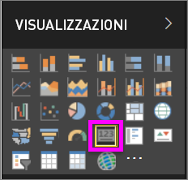
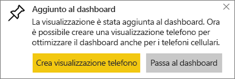
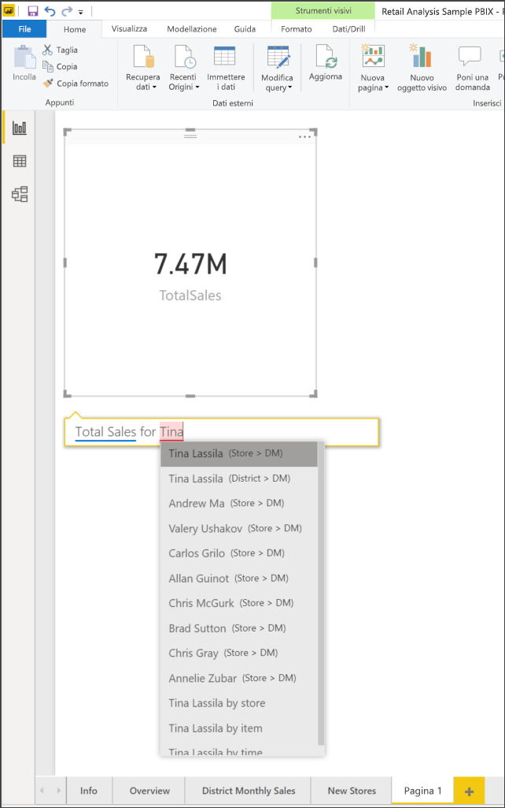
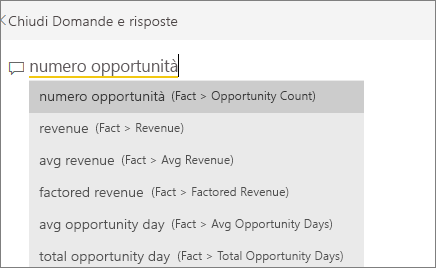
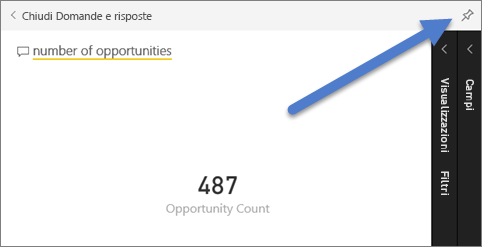
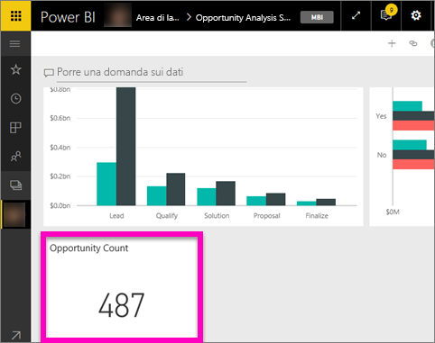
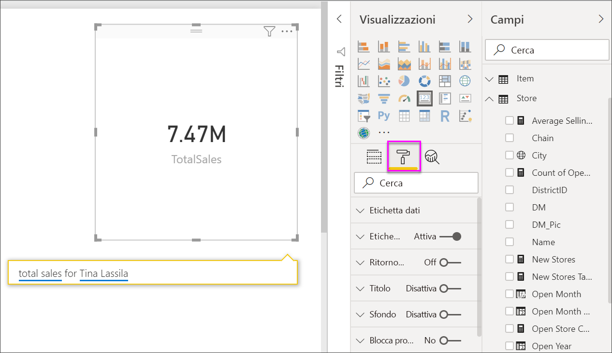
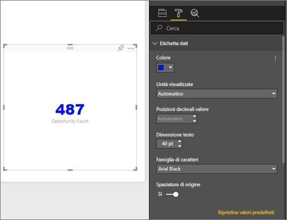
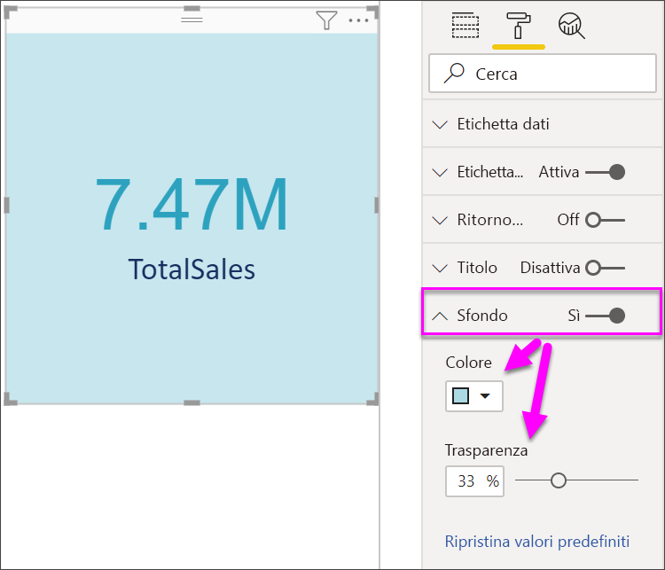

# Visualizzazioni Scheda
A volte l'unico elemento che si vuole visualizzare in un dashboard o in un report di Power BI è un solo numero, ad esempio le vendite totali, la quota di mercato anno per anno o le opportunità totali. Questo tipo di visualizzazione è denominato *Scheda*. Come quasi tutte le visualizzazioni native di Power BI, è possibile creare le Schede con l'editor di report o con Domande e risposte.

## Creare una scheda con l'editor di report
Per queste istruzioni si usa l'esempio di analisi delle vendite al dettaglio. Per seguire le istruzioni, [scaricare l'esempio](../sample-datasets.md) per il servizio Power BI (app.powerbi.com) o Power BI Desktop.   

1. Iniziare in una pagina di report vuota e selezionare il campo **Store** \> **Open store count**. Se si usa il servizio Power BI, sarà necessario aprire il report nella [Visualizzazione di modifica](../service-interact-with-a-report-in-editing-view.md).

    Power BI crea un istogramma con un numero.

   
2. Nel riquadro Visualizzazioni selezionare l'icona Scheda.

   
6. Passare il puntatore del mouse su una scheda e selezionare l'icona a forma di puntina  per aggiungere la visualizzazione al dashboard.

   
7. Aggiungere il riquadro a un dashboard esistente o a un nuovo dashboard.

   * Dashboard esistente: selezionare il nome del dashboard nell'elenco a discesa.
   * Nuovo dashboard: digitare il nome del nuovo dashboard.
8. Selezionare **Aggiungi**.

   Un messaggio di operazione completata (nell'angolo superiore destro) informa l'utente che è stata aggiunta la visualizzazione, come riquadro, al dashboard.

   
9. Selezionare **Vai al dashboard**. In quel punto è possibile [modificare e spostare](../service-dashboard-edit-tile.md) la visualizzazione aggiunta.

## Creare una scheda dalla casella delle domande di Domande e risposte
La casella delle domande di Domande e risposte rappresenta il modo più semplice per creare una scheda. La casella delle domande di Domande e risposte è disponibile in un dashboard o in un report del servizio Power BI e nella visualizzazione report Desktop. La procedura seguente illustra come creare una scheda da un dashboard del servizio Power BI. Se si vuole creare una scheda usando Domande e risposte in Power BI Desktop, [seguire queste istruzioni](https://powerbi.microsoft.com/blog/power-bi-desktop-december-feature-summary/#QandA) per usare Domande e risposte per i report di Desktop.

In questa procedura viene usato l'[esempio di analisi delle opportunità](../sample-opportunity-analysis.md).

1. Nella casella della domanda nella parte superiore del dashboard iniziare a digitare una domanda relativa ai dati. 

   

> [!TIP]
> In Visualizzazione di modifica in un report del servizio Power BI selezionare **Poni una domanda** sulla barra dei menu superiore. In un report di Power BI Desktop individuare uno spazio vuoto e fare doppio clic per aprire una casella delle domande.

2. Ad esempio, digitare "number of opportunities" nella casella della domanda.

   

   La casella delle domande fornisce suggerimenti e riformulazioni e visualizza infine il numero totale.  
4. Selezionare l'icona a forma di puntina  nell'angolo in alto a destra per aggiungere la scheda al dashboard.

   
5. Aggiungere la scheda, come un riquadro, a un dashboard esistente o a un nuovo dashboard.

   * Dashboard esistente: selezionare il nome del dashboard nell'elenco a discesa. I dashboard selezionabili sono solo quelli presenti nell'area di lavoro corrente.
   * Nuovo dashboard: digitare il nome del nuovo dashboard per aggiungerlo all'area di lavoro corrente.
6. Selezionare **Aggiungi**.

   Un messaggio di operazione riuscita (nell'angolo superiore destro) informa l'utente che è stata aggiunta la visualizzazione, come riquadro, al dashboard.  

   
7. Selezionare **Vai al dashboard** per visualizzare il nuovo riquadro. È quindi possibile [rinominare, ridimensionare, aggiungere un collegamento ipertestuale, riposizionare il riquadro e molto altro](../service-dashboard-edit-tile.md) nel dashboard.

   

## Formattare una scheda
Sono disponibili molte opzioni per la modifica di etichette, testo, colore e altri elementi. Il modo migliore per imparare a usare queste opzioni consiste nel creare una scheda e quindi esplorare il riquadro Formattazione. Di seguito sono descritte alcune delle opzioni di formattazione disponibili. 

Il riquadro Formattazione è disponibile quando si interagisce con la scheda in un report. Se si apportano modifiche a una scheda in un report, aggiungerla nuovamente per visualizzare le modifiche nel dashboard. 

1. Iniziare selezionando l'icona del rullo per aprire il riquadro Formattazione. 

    
2. Con la scheda selezionata, espandere **Etichetta dati** e modificare colore, dimensioni e famiglia di caratteri. Se si dispone di migliaia di archivi, è possibile usare **Unità visualizzate** per visualizzare il numero di archivi nell'ordine delle migliaia e controllare anche le cifre decimali. Ad esempio, 125,8 migliaia anziché 125.832,00.

3.  Espandere **Etichetta categorie** e modificare colore e dimensioni.

    

4. Espandere **Sfondo** e spostare il dispositivo di scorrimento su On.  È ora possibile modificare il colore di sfondo e la trasparenza.

    

5. Continuare a esplorare le opzioni di formattazione fino a quando l'aspetto della scheda corrisponde alle proprie esigenze. 

    

## Considerazioni e risoluzione dei problemi
Se la casella delle domande non viene visualizzata, contattare l'amministratore tenant o di sistema.    

## Passaggi successivi
[Grafici combinati in Power BI](power-bi-visualization-combo-chart.md)

[Tipi di visualizzazione in Power BI](power-bi-visualization-types-for-reports-and-q-and-a.md)
