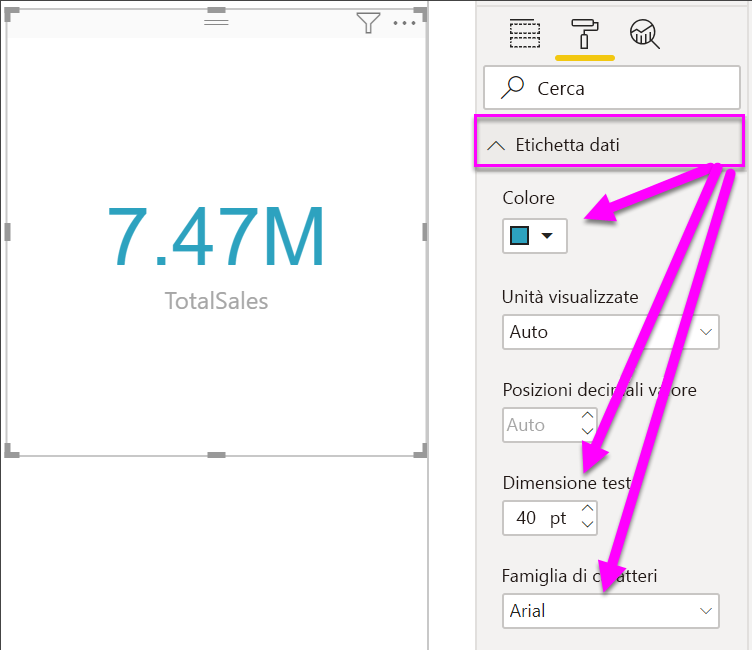

# Creare visualizzazioni Scheda

[!INCLUDE[consumer-appliesto-nyyn](../includes/consumer-appliesto-nyyn.md)]

[!INCLUDE [power-bi-visuals-desktop-banner](../includes/power-bi-visuals-desktop-banner.md)]

A volte l'unico elemento che si vuole visualizzare in un dashboard o in un report di Power BI è un solo numero, ad esempio le vendite totali, la quota di mercato anno per anno o le opportunità totali. Questo tipo di visualizzazione è denominato *Scheda*. Come quasi tutte le visualizzazioni native di Power BI, è possibile creare le Schede con l'editor di report o con Domande e risposte.

> [!NOTE]
> Per condividere il report con un collega di Power BI, è necessario che entrambi gli utenti abbiano licenze di Power BI Pro individuali o che il report venga salvato nella capacità Premium.

## Prerequisito

Questa esercitazione usa il [file Retail Analysis Sample PBIX](https://download.microsoft.com/download/9/6/D/96DDC2FF-2568-491D-AAFA-AFDD6F763AE3/Retail%20Analysis%20Sample%20PBIX.pbix)

1. Nella sezione in alto a sinistra della barra dei menu selezionare **File** \> **Apri**
   
2. Trovare la copia del **file Retail Analysis Sample PBIX**

1. Aprire il **file Retail Analysis Sample PBIX** nella visualizzazione report .

1. Seleziona  per aggiungere una nuova pagina.

## Opzione 1: Creare una scheda con l'editor di report

Il primo metodo per creare una scheda consiste nell'usare l'editor di report in Power BI Desktop.

1. Iniziare da una pagina di report vuota e selezionare il campo **Store** \> **Open store count**.

    Power BI crea un istogramma con un numero.

   

2. Nel riquadro Visualizzazioni selezionare l'icona della scheda.

   

È stata così completata la creazione di una scheda con l'editor di report. Di seguito è riportata la seconda opzione per la creazione di una scheda usando la casella delle domande di Domande e risposte.

## Opzione 2: Creare una scheda dalla casella delle domande di Domande e risposte
La casella delle domande di Domande e risposte è un'altra opzione che è possibile usare per la creazione di una scheda. La casella delle domande di Domande e risposte è disponibile nella visualizzazione report di Power BI Desktop.

1. Iniziare con una pagina del report vuota

1. Nella parte superiore della finestra selezionare l'icona **Poni una domanda**. 

    Power BI creerà una scheda e una casella per la domanda. 

   

2. Ad esempio, digitare "Total Sales for Tina" nella casella della domanda.

    La casella delle domande fornisce suggerimenti e riformulazioni e visualizza infine il numero totale.  

   

   

È stata così completata la creazione di una scheda con la casella delle domande di Domande e risposte. Di seguito sono riportati i passaggi per formattare la scheda in base alle esigenze specifiche.

## Formattare una scheda
Sono disponibili molte opzioni per la modifica di etichette, testo, colore e altri elementi. Il modo migliore per imparare a usare queste opzioni consiste nel creare una scheda e quindi esplorare il riquadro Formattazione. Di seguito sono descritte alcune delle opzioni di formattazione disponibili. 

Il riquadro Formattazione è disponibile quando si interagisce con la scheda in un report. 

1. Iniziare selezionando l'icona del rullo per aprire il riquadro Formattazione. 

    

2. Con la scheda selezionata, espandere **Etichetta dati** e modificare colore, dimensioni e famiglia di caratteri. Se si dispone di migliaia di archivi, è possibile usare **Unità visualizzate** per visualizzare il numero di archivi nell'ordine delle migliaia e controllare anche le cifre decimali. Ad esempio, 125,8 migliaia anziché 125.832,00.

    

3.  Espandere **Etichetta categorie** e modificare colore e dimensioni.

    

4. Espandere **Sfondo** e spostare il dispositivo di scorrimento su On.  È ora possibile modificare il colore di sfondo e la trasparenza.

    

5. Continuare a esplorare le opzioni di formattazione fino a quando l'aspetto della scheda corrisponde alle proprie esigenze. 

## Considerazioni e risoluzione dei problemi
Se la casella delle domande non viene visualizzata, contattare l'amministratore tenant o di sistema.    

## Passaggi successivi
[Grafici combinati in Power BI](power-bi-visualization-combo-chart.md)

[Tipi di visualizzazione in Power BI](power-bi-visualization-types-for-reports-and-q-and-a.md)
