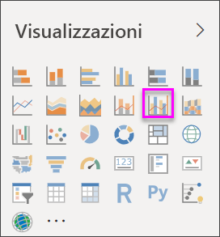
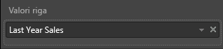
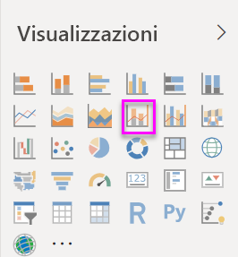
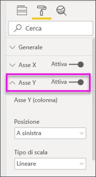
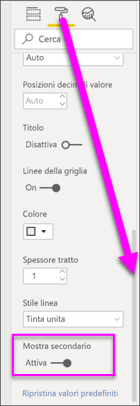

# Grafico combinato in Power BI

[!INCLUDE [power-bi-visuals-desktop-banner](../includes/power-bi-visuals-desktop-banner.md)]

Un grafico combinato in Power BI è una singola visualizzazione che combina un grafico a linee e un istogramma. La combinazione dei 2 grafici in uno permette di confrontare i dati in modo più rapido.

I grafici combinati possono avere uno o due assi Y.

## Quando usare un grafico combinato
I grafici combinati rappresentano un'ottima scelta nelle seguenti situazioni:

* quando si ha un grafico a linee e un istogramma con lo stesso asse X.
* per confrontare più misure con intervalli di valori diversi.
* per illustrare la correlazione tra due misure in una visualizzazione.
* per verificare se una misura incontra la destinazione definita da un'altra misura
* per risparmiare spazio nell'area di disegno.

### Prerequisiti
Questa esercitazione usa il [file Retail Analysis Sample PBIX](http://download.microsoft.com/download/9/6/D/96DDC2FF-2568-491D-AAFA-AFDD6F763AE3/Retail%20Analysis%20Sample%20PBIX.pbix).

1. Nella sezione in alto a sinistra della barra dei menu selezionare **File** > **Apri**
   
2. Trovare la copia del **file Retail Analysis Sample PBIX**

1. Aprire il **file Retail Analysis Sample PBIX** nella visualizzazione report .

1. Seleziona  per aggiungere una nuova pagina.

## Creare un grafico combinato di base ad asse singolo
Questo video mostra come creare un grafico combinato usando l’esempio di analisi di vendite e marketing.
   > [!NOTE]
   > Questo video usa una versione precedente di Power BI Desktop.
   > 
   > 
<iframe width="560" height="315" src="https://www.youtube.com/embed/lnv66cTZ5ho?list=PL1N57mwBHtN0JFoKSR0n-tBkUJHeMP2cP" frameborder="0" allowfullscreen></iframe>  

1. Iniziare in una pagina di report vuota e creare un istogramma che visualizzi le vendite dell'anno e il margine lordo per mese.

    a.  Nel riquadro Campi selezionare **Sales** \> **This Year Sales** > **Value**.

    b.  Trascinare **Sales** \> **Gross Margin This Year** nell'area **Valore**.

    c. Selezionare **Time** \> **FiscalMonth** per aggiungerlo all'area **Asse**.

    
5. Selezionare i puntini di sospensione (...) nell'angolo superiore destro della visualizzazione e selezionare **Sort by > FiscalMonth**. Per modificare l'ordinamento, selezionare di nuovo i puntini di sospensione e scegliere **Ordinamento crescente** oppure **Ordinamento decrescente**. Per questo esempio si userà l'opzione **Ordinamento crescente**.

6. Convertire l'istogramma in un grafico combinato. Sono disponibili due grafici combinati: **Grafico a linee e istogramma a colonne in pila** e **Grafico a linee e istogramma a colonne raggruppate**. Con l'istogramma selezionato, nel riquadro **Visualizzazioni** selezionare **Grafico a linee e istogramma a colonne raggruppate**.

    
7. Dal riquadro **Campi** trascinare **Sales** \> **Last Year Sales** all’area **Valori riga**.

   

   Il grafico combinato dovrebbe essere simile al seguente:

   

## Creare un grafico combinato con due assi
In questa attività, si confronteranno margine lordo e vendite.

1. Creare un nuovo grafico a linee che tiene traccia di **Gross Margin last year %** per **FiscalMonth**. Selezionare i puntini di sospensione per ordinare per **mese** e in **ordine crescente**.  
La % di margine lordo nel mese di gennaio ammontava al 35%, in aprile al 45%, per poi diminuire nel mese di luglio e aumentare nuovamente in agosto. Si vedrà un modello simile per le vendite dell’anno scorso e di quest'anno?

   
2. Aggiungere **This Year Sales > Value** e **Last Year Sales** al grafico a linee. La scala usata per **Gross Margin Last Year %** è notevolmente ridotta rispetto a quella di **Sales**, di conseguenza risulta difficile confrontarle.      

   
3. Per facilitare la lettura e l'interpretazione dell'oggetto visivo, convertire il grafico a linee in un grafico a linee e istogramma a colonne in pila.

   

4. Trascinare **% di margine lordo dello scorso anno** dai **Valori colonna** nei **Valori riga**. Power BI crea due assi, consentendo in tal modo di ridimensionare i set di dati in modo diverso: quello di sinistra misura i dollari in vendite, mentre quello di destra la percentuale. La risposta alla domanda è che effettivamente si vede un modello simile.

       

## Aggiungere titoli agli assi
1. Selezionare l'icona del rullo 
1.  per aprire il riquadro Formato.
1. Selezionare la freccia rivolta verso il basso per espandere le opzioni relative all' **asse Y** .
1. Per **Asse Y (colonna)** , impostare **Posizione** su **A sinistra**, **Titolo** su **Sì**, **Stile** su **Mostra solo titolo** e **Unità visualizzate** su **Milioni**.

   
4. In **Asse Y (colonna)** scorrere verso il basso fino a visualizzare **Mostra secondario**. Sono disponibili così tante opzioni per gli assi Y che potrebbe essere necessario usare entrambe le barre di scorrimento. Nella sezione Mostra secondario sono visualizzate le opzioni per la formattazione della parte di grafico a linee del grafico combinato.

   
5. Per **Asse Y (riga)** , lasciare **Posizione** su **A destra**, **Titolo** su **On** e impostare **Stile** su **Mostra solo titolo**.

   Il grafico combinato ora visualizzerà due assi, entrambi con un titolo.

   

6. È facoltativamente possibile modificare il tipo di carattere, le dimensioni e il colore del testo e configurare altre opzioni di formattazione per migliorare la visualizzazione e la leggibilità del grafico.

Da qui è possibile:

* [Aggiungere il grafico combinato come riquadro del dashboard](../service-dashboard-tiles.md).
* [Salvare il report](../service-report-save.md).
* [Rendere il report più accessibile agli utenti con particolari esigenze](../desktop-accessibility.md).

## Evidenziazione incrociata e filtro incrociato

Evidenziando una colonna o una linea in un grafico combinato vengono applicati l'evidenziazione incrociata e il filtro incrociato nelle altre visualizzazioni nella pagina del report e viceversa. Usare le [interazioni visive](../service-reports-visual-interactions.md) per modificare questo comportamento predefinito.

## Passaggi successivi

[Grafici ad anello in Power BI](power-bi-visualization-doughnut-charts.md)

[Tipi di visualizzazione in Power BI](power-bi-visualization-types-for-reports-and-q-and-a.md)
