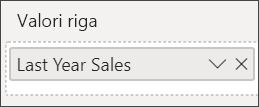

# Grafico combinato in Power BI

Un grafico combinato in Power BI è una singola visualizzazione che combina un grafico a linee e un istogramma. La combinazione dei due grafici in uno permette di confrontare i dati in modo più rapido.

I grafici combinati possono avere uno o due assi Y.

## Quando usare un grafico combinato

I grafici combinati rappresentano un'ottima scelta nelle seguenti situazioni:

* Quando si ha un grafico a linee e un istogramma con lo stesso asse X.

* Per confrontare più misure con intervalli di valori diversi.

* Per illustrare la correlazione tra due misure in un'unica visualizzazione.

* Per verificare se una misura incontra la destinazione definita da un'altra misura.

* Per risparmiare spazio nell'area di disegno.

## Prerequisiti

I grafici combinati sono disponibili nel servizio Power BI e in Power BI Desktop. Questa esercitazione usa il servizio Power BI per creare un grafico combinato. Assicurarsi di avere le credenziali utente per accedere a Power BI.

Questo video mostra come creare un grafico combinato usando l’esempio di analisi di vendite e marketing.

<iframe width="560" height="315" src="https://www.youtube.com/embed/lnv66cTZ5ho?list=PL1N57mwBHtN0JFoKSR0n-tBkUJHeMP2cP" frameborder="0" allowfullscreen></iframe>  

## Creare un grafico combinato semplice ad asse singolo

Per seguire la procedura, aprire il servizio Power BI e connettersi all'esempio **Retail Analysis Sample**. Per creare un grafico combinato personalizzato, accedere a Power BI e selezionare **Recupera dati** > **Esempi** > **Retail Analysis Sample** > **Connetti**. Verrà visualizzato il dashboard di **Retail Analysis Sample**.

1. Dal dashboard di "Retail Analysis Sample" selezionare il riquadro **Total Stores** per aprire il report **Store Sales Overview**.

1. Selezionare **Modifica report** per aprire il report in Visualizzazione di modifica.

1. Nella parte inferiore della pagina selezionare **+** per aggiungere una nuova pagina del report.

1. Creare un istogramma che visualizzi le vendite dell'anno e il margine lordo per mese.

    1. Nel riquadro Campi selezionare **Sales** \> **This Year Sales** > **Value**.

    1. Trascinare **Sales** \> **Gross Margin This Year** nell'area **Valore**.

    1. Selezionare **Time** \> **FiscalMonth** per aggiungerlo all'area **Asse**.

        

1. Selezionare i puntini di sospensione nell'angolo superiore destro della visualizzazione e selezionare **Ordina per > FiscalMonth**. Per modificare l'ordinamento, selezionare di nuovo i puntini di sospensione e scegliere **Ordinamento crescente** oppure **Ordinamento decrescente**.

1. Convertire l'istogramma in un grafico combinato. Sono disponibili due grafici combinati: **Grafico a linee e istogramma a colonne in pila** e **Grafico a linee e istogramma a colonne raggruppate**. Con l'istogramma selezionato, nel riquadro **Visualizzazioni** selezionare **Grafico a linee e istogramma a colonne raggruppate**.

    

1. Dal riquadro **Campi** trascinare **Sales** > **Last Year Sales** nell'area **Valori riga**.

    

    Il grafico combinato dovrebbe essere simile al seguente:

    

## Creare un grafico combinato con due assi

In questa attività, si confronteranno margine lordo e vendite.

1. Creare un nuovo grafico a linee che tiene traccia della **percentuale di margine lordo dello scorso anno** per ogni **mese**. Selezionare i puntini di sospensione per ordinare per **mese** e in **ordine crescente**.

    

     La % di margine lordo nel mese di gennaio ammontava al 35%, in aprile al 45%, per poi diminuire nel mese di luglio e aumentare nuovamente in agosto. Si vedrà un modello simile per le vendite dell’anno scorso e di quest'anno?

1. Aggiungere **This Year Sales** > **Valore** e **Last Year Sales** al grafico a linee. La scala usata per **Gross Margin Last Year %** è notevolmente ridotta rispetto a quella di **Sales**, di conseguenza risulta difficile confrontarle.

    

1. Per facilitare la lettura e l'interpretazione dell'oggetto visivo, convertire il grafico a linee in un grafico a linee e istogramma a colonne in pila.

    

1. Trascinare **% di margine lordo dello scorso anno** dai **Valori colonna** nei **Valori riga**. 

    

    Power BI crea due assi, consentendo al servizio di ridimensionare diversamente i set di dati. L'asse di sinistra misura i dollari, mentre quello di destra misura le percentuali. Ed ecco la risposta alla domanda: Esiste un modello simile.

## Aggiungere titoli agli assi

1. Selezionare l'icona del rullo  per aprire il riquadro Formato.

1. Selezionare la freccia rivolta verso il basso per espandere le opzioni relative all' **asse Y** .

1. Per **Asse Y (colonna)** selezionare queste opzioni:

    | Impostazione | Valore |
    | ------- | ----- |
    | Posizione | Selezionare **Sinistra**. |
    | Unità visualizzate | Selezionare **Milioni**. |
    | Titolo | Spostare il dispositivo di scorrimento su **Attiva**. |
    | Stile | Selezionare **Mostra solo titolo**. |
    | Mostra secondario | Spostare il dispositivo di scorrimento su **Attiva**.  In questo modo è possibile visualizzare le opzioni per la formattazione della parte di grafico a linee del grafico combinato. |

1. Per **Asse Y (riga)** selezionare queste opzioni:

    | Impostazione | Valore |
    | ------- | ----- |
    | Posizione | Selezionare **Destra**. |
    | Titolo | Spostare il dispositivo di scorrimento su **Attiva**. |
    | Stile | Selezionare **Mostra solo titolo**. |

    Il grafico combinato mostra ora due assi, entrambi con titoli.

    

1. È facoltativamente possibile modificare il tipo di carattere, le dimensioni e il colore del testo e configurare altre opzioni di formattazione per migliorare la visualizzazione e la leggibilità del grafico.

Da qui è possibile:

* [Aggiungere il grafico combinato come riquadro del dashboard](../service-dashboard-tiles.md).

* [Salvare il report](../service-report-save.md).

* [Rendere il report più accessibile agli utenti con particolari esigenze](../desktop-accessibility.md).

## Evidenziazione incrociata e filtro incrociato

Evidenziando una colonna o una linea in un grafico combinato vengono applicati l'evidenziazione incrociata e il filtro incrociato nelle altre visualizzazioni nella pagina del report. Usare le [interazioni visive](../service-reports-visual-interactions.md) per modificare questo comportamento predefinito.

## Passaggi successivi

[Grafici ad anello in Power BI](power-bi-visualization-doughnut-charts.md)

[Tipi di visualizzazione in Power BI](power-bi-visualization-types-for-reports-and-q-and-a.md)