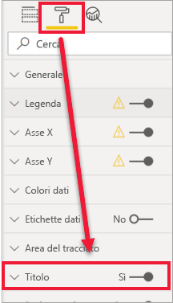
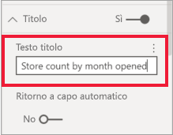
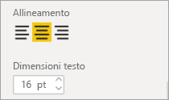
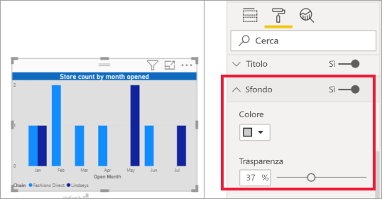
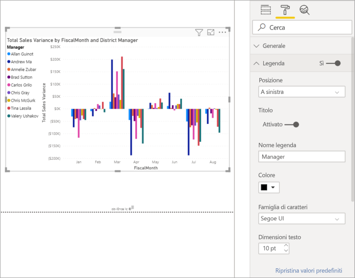

# Personalizzare i titoli, gli sfondi e le legende delle visualizzazioni

Questa esercitazione illustra alcuni modi disponibili per personalizzare le visualizzazioni. Esistono numerose opzioni per la personalizzazione delle visualizzazioni. Il modo migliore per conoscerle tutte è esplorando il riquadro **Formato** (selezionare l'icona del rullo). Per iniziare, questo articolo illustra come personalizzare il titolo, la legenda e lo sfondo di una visualizzazione, nonché come aggiungere un tema.

Non è possibile personalizzare tutte le visualizzazioni. Vedere l'[elenco completo](#visualization-types-that-you-can-customize) delle visualizzazioni per altri dettagli.

## Prerequisiti

- Servizio Power BI o Power BI Desktop

- Report Retail Analysis Sample

## Personalizzazione dei titoli delle visualizzazioni nei report

Per seguire la procedura, accedere a Power BI Desktop e aprire il report [Retail Analysis Sample](../sample-datasets.md).

> [!NOTE]
> quando si aggiunge una visualizzazione a un dashboard, questa diventa un riquadro del dashboard. È possibile personalizzare anche i riquadri, [ridimensionandoli e aggiungendo nuovi titoli, sottotitoli e collegamenti ipertestuali](../service-dashboard-edit-tile.md).

1. Passare alla pagina **New Stores** del report **Retail Analysis Sample**.

1. Selezionare l'istogramma a colonne raggruppate **Open Store Count by Open Month and Chain**.

1. Nel riquadro **Visualizzazioni** selezionare l'icona del rullo per mostrare le opzioni di formattazione.

1. Selezionare **Titolo** per espandere tale sezione.

   

1. Spostare il dispositivo di scorrimento per **Titolo** su **Attiva**.

1. Per modificare il titolo, immettere *Store count by month opened* nel campo **Testo titolo**.

    

1. Impostare il colore bianco per **Colore carattere** e il blu per **Colore sfondo**.    

    a. Selezionare l'elenco a discesa e scegliere un colore in **Colori tema**, **Colori recenti** o **Colore personalizzato**.
    
    

    b. Selezionare l'elenco a discesa per chiudere la finestra del colore.

1. Aumentare le dimensioni del testo fino a **16 pt**.

1. L'ultima personalizzazione da apportare al titolo del grafico consiste nell'allinearlo al centro della visualizzazione.

    

    A questo punto dell'esercitazione il titolo dell'istogramma a colonne raggruppate sarà simile al seguente:

    

Salvare le modifiche apportate e passare alla sezione successiva.

Se dovesse risultare necessario annullare tutte le modifiche, selezionare **Ripristina valori predefiniti** nella parte inferiore del riquadro di personalizzazione **Titolo**.

## Personalizzare gli sfondi delle visualizzazioni

Usare lo stesso istogramma a colonne raggruppate selezionato ed espandere le opzioni per **Sfondo**.

1. Spostare il dispositivo di scorrimento per **Sfondo** su **Attiva**.

1. Selezionare l'elenco a discesa e scegliere un colore grigio.

1. Impostare **Trasparenza** su **74%** .

A questo punto dell'esercitazione lo sfondo dell'istogramma a colonne raggruppate sarà simile al seguente:

Salvare le modifiche apportate e passare alla sezione successiva.

Se dovesse risultare necessario annullare tutte le modifiche, selezionare **Ripristina valori predefiniti** nella parte inferiore del riquadro di personalizzazione **Sfondo**.

## Personalizzare le legende delle visualizzazioni

1. Aprire la pagina del report **Overview** e selezionare il grafico **Total Sales Variance by FiscalMonth and District Manager**.

1. Nella scheda **Visualizzazioni** selezionare l'icona del rullo per aprire il riquadro Formato.

1. Espandere le opzioni **Legenda**:

    

1. Spostare il dispositivo di scorrimento per **Legenda** su **Attiva**.

1. Spostare la legenda a sinistra della visualizzazione.

1. Aggiungere un titolo alla legenda impostando **Titolo** su **Attiva**.

1. Immettere *Manager* nel campo **Nome legenda**.

1. Impostare **Colore** su nero.

Salvare le modifiche apportate e passare alla sezione successiva.

Se dovesse risultare necessario annullare tutte le modifiche, selezionare **Ripristina valori predefiniti** nella parte inferiore del riquadro di personalizzazione **Legenda**.

## Personalizzare i colori usando un tema

I temi dei report consentono di applicare modifiche alla struttura dell'intero report, ad esempio usando i colori aziendali, modificando i set di icone o applicando una nuova formattazione visuale predefinita. Quando si applica un tema del report, tutti gli oggetti visivi del report usano i colori e la formattazione del tema selezionato.

Per applicare un tema al report, selezionare **Cambia tema** dalla barra dei menu. Scegliere un tema.  Il report seguente usa il tema **Solare**.

 

## Tipi di visualizzazione che è possibile personalizzare

Ecco un elenco delle visualizzazioni e delle opzioni di personalizzazione disponibili per ognuna:

| Visualizzazione | Titolo | Sfondo | Legenda |
|:--- |:--- |:--- |:--- |
| Area | sì | sì |sì |
| Barre | sì | sì |sì |
| Scheda | sì | sì |n/a |
| Scheda con più righe | sì | sì | n/a |
| Colonna | sì | sì | sì |
| Grafico combinato | sì | sì | sì |
| Grafico ad anello | sì | sì | sì |
| Mappa colorata | sì | sì | sì |
| Grafico a imbuto | sì | sì | n/a |
| Misuratore | sì | sì | n/a |
| Fattore di influenza chiave | sì | sì | n/a |
| Indicatore KPI | sì | sì | n/a |
| Linea | sì | sì | sì |
| Mappa | sì | sì | sì |
| Matrice | sì | sì | n/a |
| Torta | sì | sì | sì |
| Domande e risposte | sì | sì | n/a |
| Dispersione | sì | sì | sì |
| Forma | sì | sì | sì |
| Filtro dei dati | sì | sì | n/a |
| Tabella | sì | sì | n/a |
| Casella di testo | no | sì | n/a |
| Mappa ad albero | sì | sì | sì |
| Waterfall | sì | sì | sì |

## Passaggi successivi

- [Personalizzare le proprietà degli assi X e Y](power-bi-visualization-customize-x-axis-and-y-axis.md)

- [Introduzione alla formattazione dei colori e alle proprietà degli assi](service-getting-started-with-color-formatting-and-axis-properties.md)

Altre domande? [Provare la community di Power BI](https://community.powerbi.com/)
