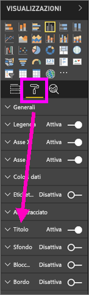
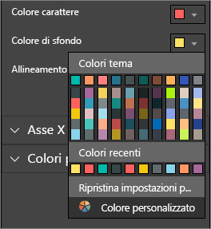
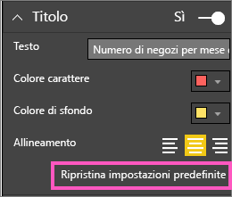
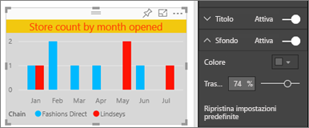
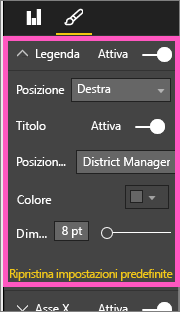
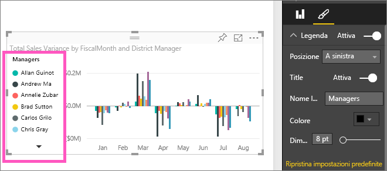

# Personalizzare i titoli, le legende e gli sfondi delle visualizzazioni
Questa esercitazione illustra alcuni modi disponibili per personalizzare le visualizzazioni.   Il numero di opzioni disponibili per la personalizzazione delle visualizzazioni è molto elevato, quindi è consigliabile esplorare il riquadro Formattazione, selezionando l'icona a forma di rullo per pittura.  Per iniziare, questo articolo illustra come personalizzare il titolo, la legenda e lo sfondo di una visualizzazione.  

Non tutte le visualizzazioni sono personalizzabili. Per sapere quali, [vedere l'elenco completo](#list).  

Il video seguente illustra come personalizzare le visualizzazioni in un report (andare avanti veloce fino al minuto 4:50 del video). Seguire quindi le istruzioni sotto il video per fare una prova in prima persona con i propri dati.

<iframe width="560" height="315" src="https://www.youtube.com/embed/IkJda4O7oGs" frameborder="0" allowfullscreen></iframe>

### Prerequisiti
- Servizio Power BI o Power BI Desktop
- Esempio di analisi delle vendite al dettaglio

## Personalizzazione dei titoli delle visualizzazioni nei report
Per seguire la procedura, accedere al servizio Power BI (app.powerbi.com) e [aprire il report Esempio di analisi delle vendite al dettaglio](../sample-datasets.md) in [Visualizzazione di modifica](../service-interact-with-a-report-in-editing-view.md).

> [!NOTE]
> quando si aggiunge una visualizzazione a un dashboard, questa diventa un riquadro del dashboard.  È possibile personalizzare anche i riquadri, [ridimensionandoli e aggiungendo nuovi titoli, sottotitoli e collegamenti ipertestuali](../service-dashboard-edit-tile.md).
> 
> 

1. Passare alla pagina "New Stores" del report e selezionare l'istogramma "Open Store Count by Open Month".
2. Nel riquadro Visualizzazioni selezionare l'icona del rullo per mostrare le opzioni di formattazione.  Selezionare quindi **Titolo** per espandere tale sezione.  

   
3. Per attivare e disattivare il  **titolo** , selezionare il dispositivo di scorrimento. Per il momento lasciarlo impostato su **Sì**.  

   
4. Modificare il testo in **Testo titolo** digitando **Store count by month opened** nel campo di testo.  
5. Modificare il colore in **Colore carattere** in arancione e in **Colore sfondo** in giallo.

   * Selezionare l'elenco a discesa e scegliere un colore in **Colori tema**, **Colori recenti**o **Colore personalizzato**.
   * Selezionare l'elenco a discesa per chiudere la finestra del colore.  
     

   Per ripristinare i colori predefiniti in qualsiasi momento, scegliere **Ripristina valori predefiniti** nella finestra del colore.
6. Aumentare le dimensioni del testo fino a 12.
7. L'ultima personalizzazione da apportare al titolo del grafico consiste nell'allinearlo al centro della visualizzazione. Il titolo è allineato a sinistra per impostazione predefinita.  
   

    A questo punto dell'esercitazione il **titolo** dell'istogramma dovrebbe essere simile al seguente:  
    

    Per ripristinare tutte le personalizzazioni apportate al titolo fino a questo momento, selezionare **Ripristina impostazioni predefinite**nella parte inferiore del riquadro di personalizzazione **Titolo** .  
    

## Personalizzare gli sfondi delle visualizzazioni
Usare lo stesso istogramma selezionato ed espandere le opzioni di Sfondo.

1. Per attivare e disattivare lo sfondo, selezionare il dispositivo di scorrimento Sì (o No). Per il momento lasciarlo impostato su **Sì**.
2. Impostare il colore di sfondo su grigio al 74%.

   * Selezionare l'elenco a discesa e scegliere un grigio in **Colori tema**, **Colori recenti** o **Colore personalizzato**.
   * Impostare la trasparenza su 74%.   
     

   Per ripristinare tutte le personalizzazioni apportate allo sfondo del titolo fino a questo momento, selezionare **Ripristina valori predefiniti**nella parte inferiore del riquadro di personalizzazione **Sfondo** .

## Personalizzare le legende delle visualizzazioni
1. Aprire la pagina del report **Overview** e selezionare il grafico "Total Sales Variance by FiscalMonth and District Manager".
2. Selezionare l’icona del pennello nella scheda Visualizzazione per aprire il pannello di formattazione.  
3. Espandere le opzioni nella **Legenda** .

      
4. Per attivare e disattivare la legenda, selezionare il dispositivo di scorrimento Sì (o No). Per il momento lasciarlo impostato su **Sì**.
5. Spostare la legenda a sinistra della visualizzazione.    
6. Aggiungere un titolo alla legenda, impostando il **Titolo** su **Sì** e nel campo **Nome legenda** digitare **Managers**.
   

   Per ripristinare tutte le personalizzazioni apportate alla legenda fino a questo momento, selezionare **Ripristina impostazioni predefinite**nella parte inferiore del riquadro di personalizzazione **Legenda** .

## Tipi di visualizzazione personalizzabili

| Visualizzazione | Titolo | Sfondo | Legenda |
|:--- |:--- |:--- |:--- |
| grafico ad area |sì |sì |sì |
| grafico a barre |sì |sì |sì |
| scheda |sì |sì |n/a |
| scheda con più righe |sì |sì |n/a |
| colonna |sì |sì |sì |
| combinato |sì |sì |sì |
| anello |sì |sì |sì |
| mappa colorata |sì |sì |sì |
| imbuto |sì |sì |n/a |
| misuratore |sì |sì |n/a |
| kpi |sì |sì |n/a |
| linee |sì |sì |sì |
| mappa |sì |sì |sì |
| matrice |sì |sì |n/a |
| torta |sì |sì |sì |
| dispersione |sì |sì |sì |
| filtro dei dati |sì |sì |n/a |
| tabella |sì |sì |n/a |
| casella di testo |no |sì |n/a |
| mappa ad albero |sì |sì |sì |
| cascata |sì |sì |sì |

## Passaggi successivi
[Personalizzare gli assi X e Y](power-bi-visualization-customize-x-axis-and-y-axis.md)  
[Personalizzare le proprietà di colori e assi](service-getting-started-with-color-formatting-and-axis-properties.md)  
[Power BI - Concetti di base](../consumer/end-user-basic-concepts.md)  
Altre domande? [Provare la community di Power BI](http://community.powerbi.com/)

