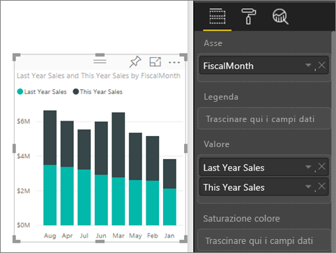
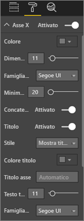
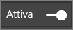
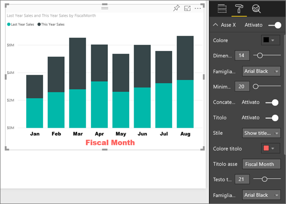
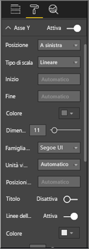
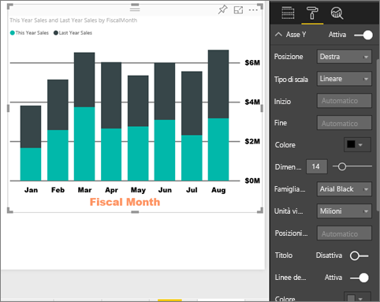
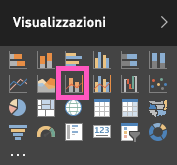

# Personalizzare le proprietà degli assi X e Y

Questa esercitazione illustra i diversi modi disponibili per personalizzare gli assi X e Y degli oggetti visivi. Non tutti gli oggetti visivi contengono assi. I grafici a torta, ad esempio, non hanno assi. Le opzioni di personalizzazione variano inoltre da un oggetto visivo all'altro. Sono disponibili troppe opzioni per poterle descrivere tutte in un singolo articolo, quindi verranno presentate alcune delle personalizzazioni degli assi usate più di frequente e verrà illustrato l'uso del riquadro **Formato** per gli oggetti visivi nell'area di disegno report di Power BI.  

> [!NOTE]
> Le informazioni in questa pagina si applicano sia al servizio Power BI che a Power BI Desktop. Queste personalizzazioni, disponibili quando si seleziona l'icona **Formato** (icona del rullo ), sono presenti anche in Power BI Desktop.

Nel video Amanda personalizzerà gli assi X e Y dimostrando anche i diversi modi disponibili per controllare la concatenazione quando si usano le funzionalità di drill down e drill-up.

<iframe width="560" height="315" src="https://www.youtube.com/embed/9DeAKM4SNJM" frameborder="0" allowfullscreen></iframe>

## Prerequisiti

- Servizio Power BI

- Report Retail Analysis Sample

## Personalizzare la visualizzazione degli assi X e Y nei report

Per seguire la procedura, accedere al [servizio Power BI](https://app.powerbi.com) e aprire il report [Retail Analysis Sample](../sample-datasets.md) nella visualizzazione [Modifica report](../service-interact-with-a-report-in-editing-view.md).

### Creare una visualizzazione istogramma a colonne in pila

Prima di poter personalizzare la visualizzazione, è necessario crearla.

1. Nel servizio Power BI espandere **Area di lavoro personale**.

1. Scorrere verso il basso e selezionare **Retail Analysis Sample** nell'elenco **Set di dati**.

1. Nel riquadro **Visualizzazioni** selezionare l'icona dell'istogramma a colonne in pila.

    

1. Per impostare i valori dell'asse X, nel riquadro **Campi** Selezionare **Time** > **FiscalMonth**.

1. Per impostare i valori dell'asse Y, nel riquadro **Campi** selezionare**Sales** > **Last Year Sales** e **Sales** > **This Year Sales** > **Valore**.

    

### Personalizzare l'asse X

A questo punto è possibile personalizzare l'asse X.

1. Nel riquadro **Visualizzazioni** selezionare **Formato** (icona del rullo ) per visualizzare le opzioni di personalizzazione.

1. Espandere le opzioni di Asse X.

   

1. Spostare il dispositivo di scorrimento per **Asse X** su **Attiva**.

    

    Talvolta potrebbe essere preferibile disattivare l'asse X per visualizzare una maggiore quantità di dati.

1. Formattare il colore, le dimensioni e il tipo di carattere del testo:

    - **Colore**: selezionare nero

    - **Dimensioni testo**: immettere *14*

    - **Famiglia di caratteri**: selezionare **Arial Black**

1. Impostare il dispositivo di scorrimento per **Titolo** su **Attiva** per visualizzare il nome dell'asse X. In questo caso, il titolo è **FiscalMonth**.

1. Formattare il colore, le dimensioni e il tipo di carattere del testo del titolo:

    - **Colore titolo**: selezionare arancione

    - **Titolo asse**: immettere *Fiscal Month*

    - **Dimensioni testo titolo**: immettere *21*

Dopo aver completato le personalizzazioni, l'istogramma a colonne in pila avrà un aspetto simile al seguente:

Salvare le modifiche apportate e passare alla sezione successiva.

Se dovesse risultare necessario annullare tutte le modifiche, selezionare **Ripristina valori predefiniti** nella parte inferiore del riquadro di personalizzazione **Asse X**.

### Personalizzare l'asse Y

Si vedrà ora come personalizzare l'asse Y.

1. Espandere le opzioni di Asse Y.

   

1. Spostare il dispositivo di scorrimento per **Asse Y** su **Attiva**.  

    

    Talvolta potrebbe essere preferibile disattivare l'asse Y per visualizzare una maggiore quantità di dati.

1. Spostare la **Posizione** dell'asse Y su **Destra**.

1. Formattare il colore, le dimensioni e il tipo di carattere del testo:

    - **Colore**: selezionare nero

    - **Dimensioni testo**: immettere *14*

    - **Famiglia di caratteri**: selezionare **Arial Black**

1. Impostare **Unità visualizzate** su **Milioni** e **Posizioni decimali valore** su *0*.

1. Per questa visualizzazione, un titolo dell'asse Y non migliorerà l'aspetto visivo, quindi lasciare **Titolo** impostato su **Disattiva**.  

1. È ora possibile evidenziare le linee della griglia modificando il colore e aumentando lo spessore del tratto:

    - **Colore**: selezionare grigio scuro

    - **Spessore tratto**: immettere *2*

Dopo tutte queste personalizzazioni, l'aspetto dell'istogramma dovrebbe essere simile al seguente:

## Personalizzazione di visualizzazioni con due assi Y

Per questo esempio verrà creato prima di tutto un grafico combinato che esamina l'impatto del numero di negozi sulle vendite. Si tratta dello stesso grafico creato nell'[esercitazione sulla creazione di un grafico combinato](power-bi-visualization-combo-chart.md). Si continuerà quindi formattando i due assi Y.

### Creare un grafico con due assi Y

1. Creare un nuovo grafico a linee che tenga traccia della % del margine lordo dello scorso anno sulle vendite per mese (**Sales > Gross Margin last year %** per **Time > FiscalMonth**).

    

    > [!NOTE]
    > Per informazioni su come ordinare i valori in base al mese, vedere [Ordinamento in base ad altri criteri](../consumer/end-user-change-sort.md#other).

    Nel mese di gennaio la percentuale del margine lordo era 35%, con un picco in aprile del 45%, un calo nel mese di luglio e un altro picco in agosto. Si vedrà un modello simile per le vendite dell’anno scorso e di quest'anno?

1. Aggiungere **This Year Sales > Value** e **Last Year Sales** al grafico a linee.

    

    La scala di **Gross Margin Last Year %** (linea blu lungo la linea della griglia in corrispondenza di **0M%** ) è notevolmente più piccola rispetto a quella di **Sales**, di conseguenza risulta difficile confrontarle. Inoltre, le percentuali delle etichette dell'asse Y non sono ottimali.

1. Per facilitare la lettura e l'interpretazione dell'oggetto visivo, convertire il grafico a linee in un grafico a linee e istogramma a colonne in pila.

   

1. Trascinare **% di margine lordo dello scorso anno** dai **Valori colonna** nei **Valori riga**.

    

    A questo punto sono disponibili l'istogramma a colonne in pila creato nella prima sezione con un grafico a linee sovrapposto. Facoltativamente, ripetere le procedure apprese sopra per formattare il colore e le dimensioni del tipo di carattere degli assi.

   

   Power BI crea due assi Y consentendo di ridimensionare separatamente i set di dati. L'asse di sinistra misura i dollari, mentre quello di destra misura le percentuali.

### Formattare l'asse Y secondario

1. Nel riquadro **Visualizzazioni** selezionare l'icona del rullo per visualizzare le opzioni di formattazione.

1. Espandere le opzioni di Asse Y.

1. Scorrere verso il basso fino a individuare l'opzione **Mostra secondario**. Verificare che sia impostata su **Attiva**.

   

1. (Facoltativo) Personalizzare le due assi. Se si cambia **Posizione** per l'asse delle colonne o l'asse di riga, le due assi si scambiano di posto.

### Aggiungere titoli a entrambi gli assi

Con una visualizzazione così complicata può risultare utile aggiungere titoli agli assi.  I titoli consentono ai colleghi di comprendere il senso della visualizzazione.

1. Impostare **Titolo** su **Sì** per **Asse Y (colonna)** e **Asse Y (riga)** .

1. Impostare **Stile** su **Mostra solo titolo** per entrambi gli assi.

   

1. Il grafico combinato mostra ora due assi, entrambi con titoli.

   

Per altre informazioni, vedere [Suggerimenti e consigli per la formattazione dei colori in Power BI](service-tips-and-tricks-for-color-formatting.md).

## Considerazioni e risoluzione dei problemi

Se l'asse X è stato categorizzato dal proprietario del report come tipo di data, verrà visualizzata l'opzione **Tipo** e sarà possibile selezionare tra continuo o categorico.

## Passaggi successivi

- [Visualizzazioni nei report di Power BI](power-bi-report-visualizations.md)

- [Personalizzare i titoli, le legende e gli sfondi delle visualizzazioni](power-bi-visualization-customize-title-background-and-legend.md)

- [Introduzione alla formattazione dei colori e alle proprietà degli assi](service-getting-started-with-color-formatting-and-axis-properties.md)

- [Concetti di base del servizio Power BI per i consumer](../consumer/end-user-basic-concepts.md)

Altre domande? [Provare la community di Power BI](http://community.powerbi.com/)
