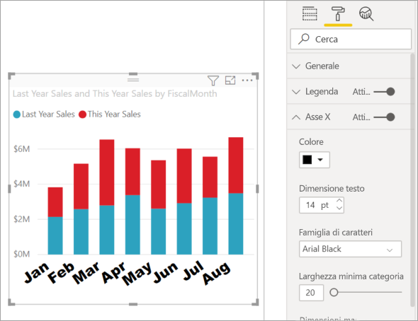
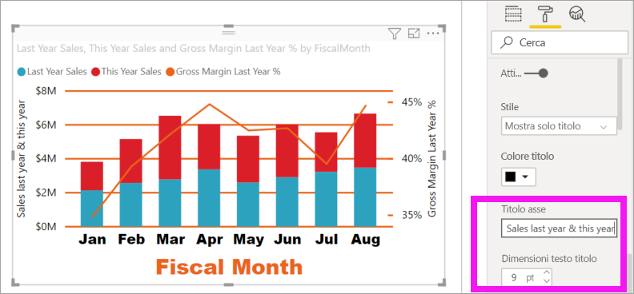

# Personalizzare le proprietà degli assi X e Y

[!INCLUDE [power-bi-visuals-desktop-banner](../includes/power-bi-visuals-desktop-banner.md)]

Questa esercitazione illustra i diversi modi disponibili per personalizzare gli assi X e Y degli oggetti visivi. Non tutti gli oggetti visivi contengono assi. I grafici a torta, ad esempio, non hanno assi. Le opzioni di personalizzazione variano inoltre da un oggetto visivo all'altro. Le opzioni disponibili sono troppe per poterle descrivere tutte in un singolo articolo, quindi verranno presentate alcune delle personalizzazioni usate più di frequente e verrà illustrato l'uso del riquadro **Formato** per gli oggetti visivi nell'area di disegno report di Power BI.  

Nel video Amanda personalizzerà gli assi X e Y dimostrando anche i diversi modi disponibili per controllare la concatenazione quando si usano le funzionalità di drill-down e drill-up.

> [!NOTE]
> Questo video usa una versione precedente di Power BI.

<iframe width="560" height="315" src="https://www.youtube.com/embed/9DeAKM4SNJM" frameborder="0" allowfullscreen></iframe>

## Prerequisiti

- Power BI Desktop

- [Esempio di analisi delle vendite al dettaglio ](https://download.microsoft.com/download/9/6/D/96DDC2FF-2568-491D-AAFA-AFDD6F763AE3/Retail%20Analysis%20Sample%20PBIX.pbix)

## Aggiungere una nuova visualizzazione

Prima di poter personalizzare la visualizzazione, è necessario crearla.

1. In Power BI Desktop aprire l'esempio di analisi delle vendite al dettaglio.  

2. Nella parte inferiore selezionare l'icona con il segno più giallo per aggiungere una nuova pagina. 

    

1. Nel riquadro **Visualizzazioni** selezionare l'icona dell'istogramma a colonne in pila. Viene aggiunto un modello vuoto all'area di disegno report.

    

1. Per impostare i valori dell'asse X, nel riquadro **Campi** selezionare **Time** > **FiscalMonth**.

1. Per impostare i valori dell'asse Y, nel riquadro **Campi** selezionare**Sales** > **Last Year Sales** e **Sales** > **This Year Sales** > **Valore**.

    

    A questo punto è possibile personalizzare l'asse X. Power BI offre opzioni quasi illimitate per la formattazione della visualizzazione. 

## Personalizzare l'asse X
Sono disponibili molte funzionalità personalizzabili per l'asse X. È possibile aggiungere e modificare le etichette dati e il titolo dell'asse X. Per le categorie, è possibile modificare la larghezza, le dimensioni e la spaziatura interna di barre, colonne, linee e aree. Per i valori è possibile modificare le unità visualizzate, le posizioni decimali e le linee della griglia. L'esempio seguente mostra la personalizzazione di un istogramma. Aggiungere alcune personalizzazioni per acquisire familiarità con le opzioni, quindi esplorare il resto autonomamente.

### Personalizzare le etichette dell'asse X
Le etichette dell'asse X vengono visualizzate sotto le colonne del grafico. Al momento, sono grigie, piccoli e difficili da leggere, quindi verranno cambiate.

1. Nel riquadro **Visualizzazioni** selezionare **Formato** (icona del rullo . ) per visualizzare le opzioni di personalizzazione.

2. Espandere le opzioni dell'asse X.

   

3. Spostare il dispositivo di scorrimento per **Asse X** su **Attiva**.

    

    Si potrebbe scegliere di impostare l'asse X su **Disattiva** se, ad esempio, la visualizzazione è autoesplicativa senza etichette oppure se la pagina del report è piena ed è necessario creare spazio per visualizzare più dati.

4. Formattare il colore, le dimensioni e il tipo di carattere del testo:

    - **Colore**: selezionare nero

    - **Dimensioni testo**: immettere *14*

    - **Famiglia di caratteri**: selezionare **Arial Black**

    - **Spaziatura interna**: immettere *40%*

        
    
5. Se il testo dell'asse X visualizzato in diagonale non è di proprio gradimento, sono disponibili diverse opzioni. 
    - Impostare le dimensioni del testo su un valore inferiore a 14.
    - Ingrandire la visualizzazione. 
    - Visualizzare un numero minore di colonne e aggiungere una barra di scorrimento aumentando il valore di **Larghezza minima categoria**. 
    
    In questo esempio è stata selezionata la seconda opzione ed è stata ingrandita la visualizzazione trascinando una delle barre di ridimensionamento. Ora il testo di 14 punti rientra nella visualizzazione senza la necessità di mostrarlo in diagonale o con una barra di scorrimento. 

   

### Personalizzare il titolo dell'asse X
Quando è **attivato**, il titolo dell'asse X viene visualizzato sotto le etichette dell'asse X. 

1. Per iniziare, impostare il titolo dell'asse X su **Attiva**.  

    

    La prima cosa da notare è che la visualizzazione ha ora un titolo predefinito dell'asse X.  In questo caso, il titolo è **FiscalMonth**.

   

1. Formattare il colore, le dimensioni e il tipo di carattere del testo del titolo:

    - **Colore titolo**: selezionare arancione

    - **Titolo asse**: digitare *Fiscal Month* (con uno spazio)

    - **Dimensioni testo titolo**: immettere *18*

    Dopo aver completato le personalizzazioni, l'istogramma in pila avrà un aspetto simile al seguente:

    

1. Salvare le modifiche apportate e passare alla sezione successiva. Se dovesse risultare necessario annullare tutte le modifiche, selezionare **Ripristina valori predefiniti** nella parte inferiore del riquadro di personalizzazione **Asse X**. Si vedrà ora come personalizzare l'asse Y.

## Personalizzare l'asse Y
Per l'asse Y è possibile personalizzare molte funzionalità. È possibile aggiungere e modificare le etichette dati, il titolo e le linea della griglia dell'asse Y. Per i valori, è possibile modificare le unità visualizzate, le posizioni decimali, il punto iniziale e il punto finale. Per le categorie, è possibile modificare la larghezza, le dimensioni e la spaziatura interna di barre, colonne, linee e aree. 

Nell'esempio seguente viene proseguita la personalizzazione di un istogramma. Apportare alcune modifiche per acquisire familiarità con le opzioni, quindi esplorare il resto autonomamente.

### Personalizzare le etichette dell'asse Y
Per impostazione predefinita, le etichette dell'asse Y vengono visualizzate a sinistra. Al momento, sono grigie, piccoli e difficili da leggere, quindi verranno cambiate.

1. Espandere le opzioni di Asse Y.

   

1. Spostare il dispositivo di scorrimento per **Asse Y** su **Attiva**.  

    

    Talvolta potrebbe essere preferibile disattivare l'asse Y per visualizzare una maggiore quantità di dati.

1. Formattare il colore, le dimensioni e il tipo di carattere del testo:

    - **Colore**: selezionare nero

    - **Dimensioni testo**: immettere *10*

    - **Unità visualizzate**: selezionare **Milioni**

    

### Personalizzare il titolo dell'asse Y
Quando è **attivato**, il titolo dell'asse Y viene visualizzato accanto alle etichette dell'asse X. Per questa visualizzazione, un titolo dell'asse Y non migliorerà l'aspetto visivo, quindi lasciare **Titolo** impostato su **Disattiva**. I titoli dell'asse Y verranno aggiunti a un oggetto visivo a doppio asse più avanti in questa esercitazione. 

### Personalizzare le linea della griglia
È ora possibile evidenziare le linee della griglia modificando il colore e aumentando lo spessore del tratto:

- **Colore**: selezionare arancione

- **Spessore tratto**: immettere *2*

Dopo tutte queste personalizzazioni, l'aspetto dell'istogramma dovrebbe essere simile al seguente:

## Personalizzazione di visualizzazioni con due assi Y

Alcune visualizzazioni possono beneficiare dalla presenza di due assi Y. I grafici combinati rappresentano un esempio valido. Prima di formattare i due assi Y, creare un grafico combinato che confronta le tendenze per le vendite e il margine lordo.  

### Creare un grafico con due assi Y

1. Selezionare l'istogramma e cambiarlo in *Grafico a linee e istogramma a colonne in pila*. 

    
   

2. Trascinare **Sales** > **Gross Margin Last Year %** dal riquadro Campi al bucket **Valori riga**.

    

    
3. Riformattare la visualizzazione per rimuovere le etichette dell'asse X in diagonale. 

   

   Power BI crea due assi Y consentendo di ridimensionare separatamente i valori. L'asse di sinistra misura i dollari, mentre quello di destra misura le percentuali.

### Formattare il secondo asse Y
Poiché all'inizio la visualizzazione includeva un unico asse Y formattato, Power BI ha creato il secondo asse Y usando le stesse impostazioni. Ma è possibile cambiarle. 

1. Nel riquadro **Visualizzazioni** selezionare l'icona del rullo per visualizzare le opzioni di formattazione.

1. Espandere le opzioni di Asse Y.

1. Scorrere verso il basso fino a individuare l'opzione **Mostra secondario**. Verificare che sia impostata su **Attiva**. L'asse Y secondario rappresenta il grafico a linee.

   

1. (Facoltativo) Personalizzare il colore del carattere, le dimensioni e le unità visualizzate per i due assi. Se si cambia **Posizione** per l'asse delle colonne o l'asse di riga, le due assi si scambiano di posto.

### Aggiungere titoli a entrambi gli assi

Con una visualizzazione così complessa, può risultare utile aggiungere titoli agli assi.  I titoli consentono ai colleghi di comprendere il senso della visualizzazione.

1. Impostare **Titolo** su **Sì** per **Asse Y (colonna)** e **Asse Y (riga)** .

1. Impostare **Stile** su **Mostra solo titolo** per entrambi gli assi.

   

1. Il grafico combinato mostra ora due assi, entrambi con titoli.

   

1. Formattare i titoli. In questo esempio uno dei titoli è stato abbreviato e sono state ridotte le dimensioni dei caratteri di entrambi. 
    - Dimensioni carattere: **9**
    - **Titolo asse** abbreviato per il primo asse Y (istogramma): Sales last year & this year

    

Per altre informazioni, vedere [Suggerimenti e consigli per la formattazione dei colori in Power BI](service-tips-and-tricks-for-color-formatting.md) e [Personalizzare i titoli, le legende e gli sfondi delle visualizzazioni](power-bi-visualization-customize-title-background-and-legend.md). Prossimamente saranno disponibili nuovi aggiornamenti per la formattazione dei titoli. 

## Passaggi successivi

- [Visualizzazioni nei report di Power BI](power-bi-report-visualizations.md)

Altre domande? [Provare la community di Power BI](https://community.powerbi.com/)
