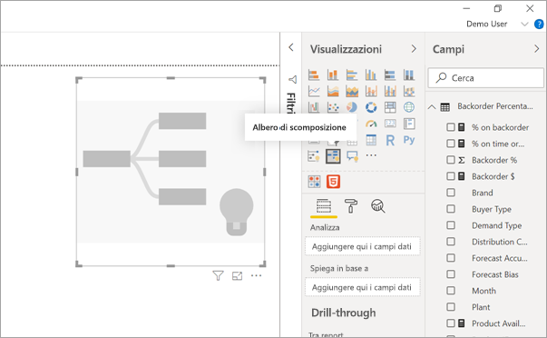
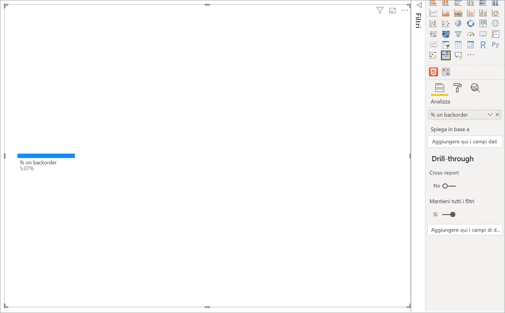
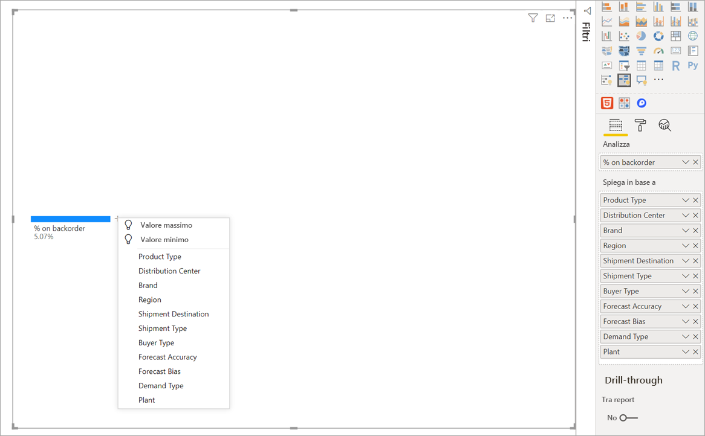
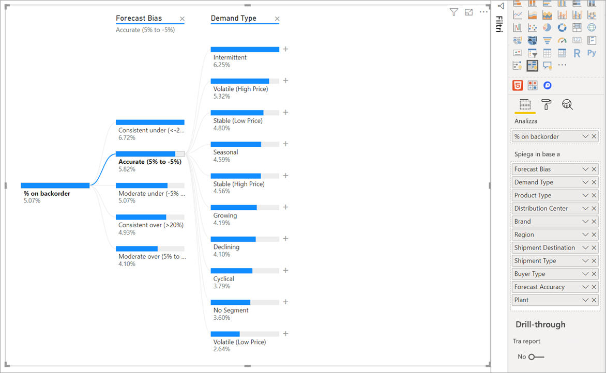
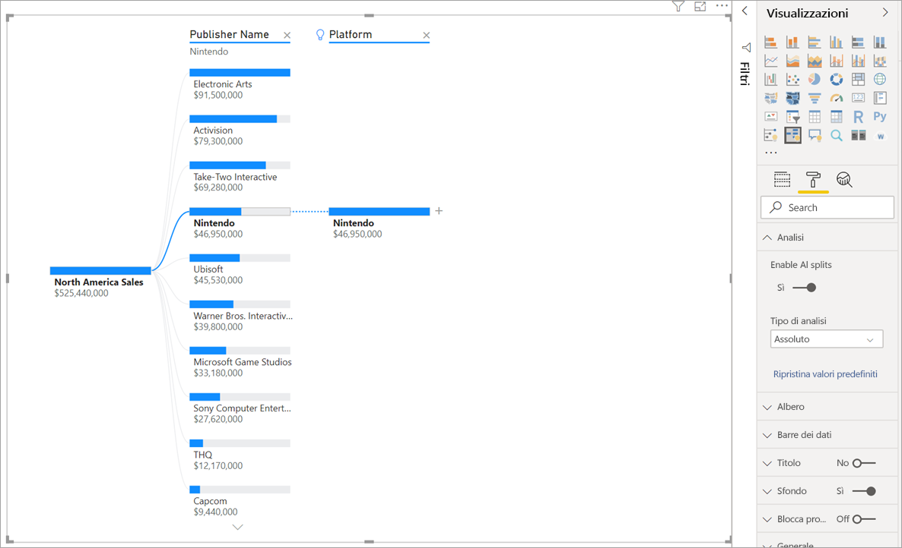
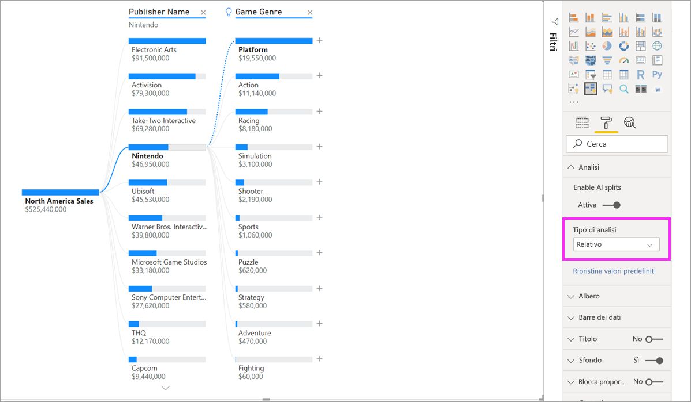
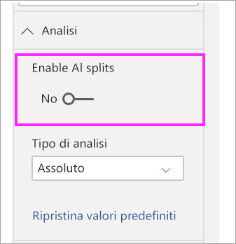

# Creare e visualizzare oggetti visivi albero di scomposizione in Power BI (anteprima)

[!INCLUDE[consumer-appliesto-nyyn](../includes/consumer-appliesto-nyyn.md)]

[!INCLUDE [power-bi-visuals-desktop-banner](../includes/power-bi-visuals-desktop-banner.md)]

L'oggetto visivo albero di scomposizione in Power BI consente di visualizzare i dati in più dimensioni. Aggrega automaticamente i dati e consente di eseguire il drill-down nelle dimensioni in qualsiasi ordine. È anche una visualizzazione di intelligenza artificiale a cui è possibile chiedere di trovare la dimensione successiva in cui eseguire il drill-down in base a criteri specifici. Questo lo rende uno strumento prezioso per l'esplorazione ad hoc e l'esecuzione dell'analisi della causa radice.

Questa esercitazione usa due esempi:

- Uno scenario di catena di approvvigionamento che analizza la percentuale di prodotti della società inclusi in ordini arretrati (esauriti).  
- Uno scenario di vendita che suddivide le vendite di videogiochi in base a diversi fattori, ad esempio il tipo di gioco e l'editore.

> [!NOTE]
> Per condividere il report con un collega di Power BI, è necessario che entrambi gli utenti abbiano licenze di Power BI Pro individuali o che il report venga salvato nella capacità Premium.    

## Inizia
Selezionare l'icona dell'albero di scomposizione dal riquadro Visualizzazioni.

La visualizzazione richiede due tipi di input.

**Analizza**: specificare la metrica che si vuole analizzare. Deve essere una misura o un'aggregazione.  
**Spiega con**: specificare una o più dimensioni di cui si vuole eseguire il drill-down.

Dopo che la misura è stata trascinata nell'area campi, l'oggetto visivo si aggiorna visualizzando la misura aggregata. Nell'esempio che segue è visualizzata la percentuale media di prodotti in ordini arretrati (5,07%) 

Il passaggio successivo richiede di aggiungere una o più dimensioni di cui si vuole eseguire il drill-down. Aggiungere questi campi al bucket **Spiega con**. Si noti che accanto al nodo radice viene visualizzato un segno più. Selezionando il segno + è possibile scegliere il campo di cui eseguire il drill-down. È possibile eseguire il drill-down dei campi in qualsiasi ordine.

Se si seleziona **Forecast bias** (Distorsione previsione), l'albero viene espanso e la misura viene suddivisa in base ai valori della colonna. È possibile ripetere questo processo scegliendo un altro nodo in cui eseguire il drill-down.

Se si seleziona un nodo dall'ultimo livello, i dati vengono filtrati in modo incrociato. Se si seleziona un nodo da un livello precedente, il percorso viene modificato.

Se si interagisce con altri oggetti visivi, l'albero di scomposizione viene filtrato in modo incrociato. In conseguenza di ciò, l'ordine dei nodi all'interno dei livelli può variare.
Nell'esempio che segue, l'albero è stato filtrato in modo incrociato per Ubisoft. Il percorso si aggiorna e le vendite di Xbox passano dalla prima alla seconda posizione, superate dalle vendite di PlayStation. 

Se si filtra in modo incrociato l'albero per Nintendo, le vendite di Xbox sono vuote, perché non esistono giochi Nintendo sviluppati per Xbox. La Xbox e il relativo percorso successivo vengono esclusi dalla visualizzazione.

Nonostante la scomparsa del percorso, i livelli esistenti, in questo caso Game Genre (Tipo di gioco), rimangono fissati all'albero. Se si seleziona il nodo Nintendo, quindi, l'albero viene espanso automaticamente fino a Game Genre (Tipo di gioco).

## Suddivisioni di intelligenza artificiale

È possibile usare le cosiddette suddivisioni di intelligenza artificiale per comprendere quali parti dei dati esaminare immediatamente dopo. Queste suddivisioni vengono visualizzate nella parte superiore dell'elenco e sono contrassegnate da una lampadina. Lo scopo delle suddivisioni è di facilitare l'individuazione dei valori massimo e minimo nei dati.

L'analisi può funzionare in due modi, a seconda delle preferenze dell'utente. Il comportamento predefinito è il seguente:

**Valore massimo**: prende in considerazione tutti i campi disponibili e determina di quale eseguire il drill-down per ottenere il valore massimo della misura in corso di analisi.  
**Valore minimo**: prende in considerazione tutti i campi disponibili e determina di quale eseguire il drill-down per ottenere il valore minimo della misura in corso di analisi.  

Se si seleziona **Valore massimo** nell'esempio degli ordini arretrati, si ottiene quanto segue: 

La lampadina visualizzata accanto a **Product Type** (Tipo di prodotto) indica che si tratta di una suddivisione di intelligenza artificiale. L'albero visualizza anche una linea tratteggiata che suggerisce il nodo **Patient Monitoring** (Monitoraggio pazienti), in quanto risulta essere il valore più alto per gli ordini arretrati (9,2%). 

Passare il mouse sulla lampadina per visualizzare una descrizione comando. In questo esempio la descrizione comando è "% on backorder is highest when Product Type is Patient Monitoring" (La percentuale degli ordini arretrati raggiunge il massimo quando Product Type (Tipo di prodotto) è Patient Monitoring (Monitoraggio pazienti)).

È possibile configurare l'oggetto visivo in modo che trovi suddivisioni di intelligenza artificiale **relative** anziché **assolute**. 

La modalità relativa cerca valori elevati che si distinguono dal resto dei dati nella colonna. Ecco un esempio che illustra quanto appena affermato: 

Nello screenshot qui sopra è possibile esaminare le vendite di videogiochi in America del Nord. Prima si è suddiviso l'albero per **Publisher Name** (Nome editore) e quindi è stato eseguito il drill-down di Nintendo. La selezione di **Valore massimo** comporta l'espansione di **Platform is Nintendo** (Piattaforma è Nintendo). Dato che Nintendo (editore) sviluppa solo prodotti per le console Nintendo, è presente un solo valore e quindi non sorprende che abbia il valore più alto.

Una suddivisione più interessante, tuttavia, è rappresentata dal valore massimo in relazione ad altri valori della stessa colonna. Se si cambia Tipo di analisi da **Assoluto** a **Relativo**, si ottiene il risultato seguente per Nintendo: 

Questa volta il valore consigliato è **Platform within Game Genre** (Piattaforma all'interno di Game Genre (Tipo di gioco)).  Platform (Piattaforma) non produce un valore assoluto superiore a quello di Nintendo (19.950.000 dollari rispetto a 46.950.000 dollari). Si tratta tuttavia di un valore che si distingue.

Più precisamente, dato che per Game Genre (Tipo di gioco) sono presenti 10 valori, in caso di suddivisione uniforme il valore previsto per Platform (Piattaforma) è di 4,6 milioni di dollari. Dato che il valore di Platform (Piattaforma) è di quasi 20 milioni di dollari, il risultato è interessante, in quanto è quattro volte superiore al risultato previsto.

Il calcolo è il seguente:

North America Sales (Vendite America del Nord) per Platform (Piattaforma)/Abs (Avg (North America Sales (Vendite America del Nord) per Game Genre (Tipo di gioco)))  
rispetto a  
North America Sales (Vendite America del Nord) per Nintendo/Abs (Avg (North America Sales (Vendite America del Nord) per Platform (Piattaforma)))  

Che corrispondono a:

19.550.000/(19.550.000 + 11.140.000 +... + 470.000 + 60.000/10) = 4,25x  
rispetto a  
46.950.000/(46.950.000/1) = 1x  

Se si preferisce non usare le suddivisioni di intelligenza artificiale nell'albero, è anche possibile disattivarle nelle opzioni di formattazione **Analisi**:  

## Interazioni dell'albero con le suddivisioni di intelligenza artificiale

È possibile avere più livelli di intelligenza artificiale successivi. È anche possibile combinare tipi diversi di livelli di intelligenza artificiale, passando da Valore massimo a Valore minimo e viceversa: 

Se nell'albero si seleziona un altro nodo, le suddivisioni di intelligenza artificiale ricalcolano da capo. Nell'esempio che segue nel livello **Forecast Bias** (Distorsione previsione) il nodo selezionato è stato cambiato. I livelli successivi cambiano per produrre i valori massimo e minimo corretti 

I livelli di intelligenza artificiale vengono ricalcolati anche quando si applica un filtro incrociato all'albero di scomposizione in base a un altro oggetto visivo. Nell'esempio riportato di seguito, è possibile notare che la percentuale degli ordini arretrati più alta è quella di Plant (Stabilimento) #0477.

Se però si seleziona **April** (Aprile) nel grafico a barre, le modifiche più alte a **Product Type (Tipo di prodotto) sono dovute ad Advanced Surgical** (Chirurgia avanzata). In questo caso, non solo i nodi sono stati riordinati, ma è stata scelta una colonna completamente diversa. 

Se si vuole che i livelli di intelligenza artificiale si comportino come i livelli non di intelligenza artificiale, selezionare la lampadina per ripristinare il comportamento predefinito. 

È possibile concatenare più livelli di intelligenza artificiale,ma un livello non di intelligenza artificiale non può seguire un livello di intelligenza artificiale. Se si esegue una suddivisione manuale dopo una divisione AI, la lampadina del livello di intelligenza artificiale non viene più visualizzata e il livello viene trasformato in un livello normale. 

## Blocco

Un creatore di contenuti può bloccare i livelli per gli utenti finali dei report. Quando un livello è bloccato, non può essere rimosso o modificato. Un utente finale può esplorare percorsi diversi all'interno del livello bloccato, ma non può modificare il livello stesso. Un creatore di contenuti può passare il mouse sui livelli esistenti per visualizzare l'icona del lucchetto. È possibile bloccare un numero illimitato di livelli ma non è possibile avere livelli sbloccati che precedono livelli bloccati.

Nell'esempio che segue i primi due livelli sono bloccati. Questo significa che gli utenti finali del report possono modificare i livelli 3 e 4 e persino aggiungere nuovi livelli in seguito. Non è tuttavia possibile modificare i primi due livelli:

## Limitazioni note

Il numero massimo di livelli per l'albero è 50. Il numero massimo di punti dati che è possibile visualizzare in una sola volta nell'albero è 5000. I livelli vengono troncati in modo da visualizzare i primi n. Attualmente il numero di primi n per livello è impostato su 10. 

L'albero di scomposizione non è supportato negli scenari seguenti:  
-   Analysis Services locale

Le suddivisioni di intelligenza artificiale non sono supportate negli scenari seguenti:  
-   Azure Analysis Services
-   Query diretta
-   Server di report Power BI
-   Pubblica sul Web
-   Misure complesse e misure tratte da schemi di estensione in "Analizza"

Altre limitazioni dell'anteprima:
- Power BI per dispositivi mobili  
- Aggiunta al dashboard
- Funzionalità Mostra i dati
- Supporto di Q&A all'interno

## Passaggi successivi

[Grafico ad anello di Power BI](power-bi-visualization-doughnut-charts.md)

[Visualizzazioni di Power BI](power-bi-report-visualizations.md)

