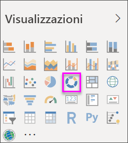

# Grafici ad anello in Power BI
Un grafico ad anello è simile a un grafico a torta perché mostra la relazione delle parti rispetto a un intero. L'unica differenza è data dal fatto che il centro è vuoto e consente di inserire un'etichetta o un'icona.

## Creare un grafico ad anello
Queste istruzioni usano l'esempio di analisi delle vendite al dettaglio per creare un grafico ad anello che mostra le vendite dell'anno corrente per categoria. Per seguire le istruzioni, [scaricare l'esempio](../sample-datasets.md) per il servizio Power BI o per Power BI Desktop.

1. Iniziare con una pagina del report vuota. Se si usa il servizio Power BI, assicurarsi di aprire il report nella [Visualizzazione di modifica](../service-interact-with-a-report-in-editing-view.md).

2. Dal riquadro Campi selezionare **Sales** \> **Last Year Sales**.  
   
3. Dal riquadro Visualizzazioni selezionare l'icona per il grafico ad anello  per convertire il grafico a barre in un grafico ad anello. Se **Last Year Sales** non è nell'area **Valori**, trascinarlo in tale area.
     
   

4. Selezionare **Elemento** \> **Categoria** per aggiungerlo all'area **Legenda**. 
     
    

5. Facoltativamente, [modificare le dimensioni e il colore del testo del grafico](power-bi-visualization-customize-title-background-and-legend.md). 

## Considerazioni e risoluzione dei problemi
* La somma dei valori del grafico ad anello deve essere pari al 100%.
* Un eccessivo numero di categorie ne rende difficile la lettura e l'interpretazione.
* I grafici ad anello sono particolarmente indicati per confrontare una specifica sezione con l'intero, invece di confrontare singole sezioni reciprocamente. 

## Passaggi successivi
[Grafici a imbuto in Power BI](power-bi-visualization-funnel-charts.md)

[Tipi di visualizzazione in Power BI](power-bi-visualization-types-for-reports-and-q-and-a.md)

