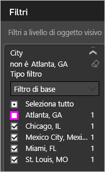

# Esportare dati dalle visualizzazioni

È possibile [visualizzare in Power BI i dati](service-reports-show-data.md) usati per creare una visualizzazione e anche esportarli in Excel come file con estensione *xlsx* o *csv*. L'opzione per esportare i dati richiede una licenza Pro o Premium e le autorizzazioni di modifica per il set di dati e il report. <!--If you have access to the dashboard or report but the data is classified as *highly confidential*, Power BI will not allow you to export the data.-->

Osservare in che modo i dati vengono esportati da una delle visualizzazioni nel report, salvati come file con estensione *xlsx* e aperti in Excel. Seguire quindi tutte le istruzioni riportate sotto il video per provare a farlo da soli.

<iframe width="560" height="315" src="https://www.youtube.com/embed/KjheMTGjDXw" frameborder="0" allowfullscreen></iframe>

## Esportare dati da un dashboard di Power BI

1. Selezionare i puntini di sospensione (...) nell'angolo superiore destro della visualizzazione.

    

1. Scegliere l'icona **Esporta dati**.

    

1. Power BI esporta i dati in un file con estensione *csv*. Se è stato applicato un filtro alla visualizzazione, l'app filtrerà i dati scaricati.

1. Il browser richiederà di salvare il file.  Dopo il salvataggio, aprire il file con estensione *csv* in Excel.

    

## Esportare dati da un report

Per iniziare, aprire il [report dell'esempio di analisi dell'approvvigionamento](../sample-procurement.md) in Visualizzazione di modifica. Aggiungere una nuova pagina del report vuota. Seguire quindi questa procedura per aggiungere un'aggregazione e un filtro a livello di visualizzazione.

1. Creare un nuovo **Istogramma in pila**.

1. Nel riquadro **Campi** selezionare **Location > City** (Posizione > Città) e **Invoice > Discount Percent** (Fattura > Percentuale sconto).  Potrebbe essere necessario spostare **Discount Percent** (Percentuale sconto) nell'area **Valore**.

    

1. Modificare l'aggregazione per **Discount Percent** da **Count** a **Average**. Nell'area **Valore** selezionare la freccia a destra di **Discount Percent** (Percentuale sconto), o **Count of Discount Percent** (Valore percentuale sconto), e scegliere **Media**.

    

1. Aggiungere un filtro a **City** (Città), selezionare tutte le città e quindi rimuovere **Atlanta**.

    

   È ora possibile provare a usare entrambe le opzioni di esportazione dei dati.

1. Selezionare i puntini di sospensione (...) nell'angolo superiore destro della visualizzazione. Selezionare **Esporta dati**.

    

    In Power BI online, se la visualizzazione contiene un'aggregazione (ad esempio se si modifica **Count** in *average*, *sum* o *minimum*), si avranno due opzioni:

    - **Riepilogo dati**

    - **Dati sottostanti**

    In Power BI Desktop è disponibile solo l'opzione **Riepilogo dati**. Per altre informazioni sulle aggregazioni, vedere [Aggregazioni in Power BI](../service-aggregates.md).

1. Da **Esporta dati** selezionare **Riepilogo dati**, scegliere *.xlsx* o *.csv* e quindi selezionare **Esporta**. Power BI esporta i dati.

    

    Se sono stati applicati filtri alla visualizzazione, i dati verranno esportati come filtrati. Quando si seleziona **Esporta**, il browser richiede di salvare il file. Una volta salvato, aprire il file in Excel.
    
    Vengono esportati tutti i dati usati dalla gerarchia, non solo quelli usati per il livello drill attuale per l'oggetto visivo. Se, ad esempio, la visualizzazione non è stata ancora sottoposta a drill-down dal primo livello, i dati esportati includeranno tutti i dati nella gerarchia, non solo quelli usati per creare l'oggetto visivo al relativo livello drill attuale.

    **Riepilogo dati**: selezionare questa opzione se si vogliono esportare i dati di ciò che viene visualizzato nell'oggetto visivo.  Questo tipo di esportazione consente di visualizzare solo i dati (colonne e misure) scelti per creare l'oggetto visivo.  Se l'oggetto visivo contiene un'aggregazione, è necessario esportare i dati aggregati. Ad esempio, se è presente un grafico a barre che mostra quattro barre, si otterranno quattro righe di dati. Il riepilogo dati è disponibile in file con estensione *xlsx* e *csv*.

    In questo esempio, l'esportazione di Excel mostra un totale per ogni città. Poiché è stata filtrata, la città di Atlanta non è inclusa nei risultati. La prima riga del foglio di calcolo mostra i filtri usati da Power BI per l'estrazione dei dati.

    

1. Provare ora a selezionare **Dati sottostanti**, *.xlsx* e quindi **Esporta**. Power BI esporta i dati. 

    > [!NOTE]
    > A seconda delle impostazioni del report, è possibile che non sia disponibile l'opzione per esportare i dati sottostanti.

    Se sono stati applicati filtri alla visualizzazione, i dati verranno esportati come filtrati. Quando si seleziona **Esporta**, il browser richiede di salvare il file. Una volta salvato, aprire il file in Excel.
    
    Vengono esportati tutti i dati usati dalla gerarchia, non solo quelli usati per il livello drill attuale per l'oggetto visivo. Se, ad esempio, la visualizzazione non è stata ancora sottoposta a drill-down dal primo livello, i dati esportati includeranno tutti i dati nella gerarchia, non solo quelli usati per creare l'oggetto visivo al relativo livello drill attuale.

    >[!WARNING]
    >L'esportazione dei dati sottostanti consente agli utenti di visualizzare tutti i dati dettagliati, ovvero ogni colonna nei dati. Gli amministratori del servizio Power BI possono disattivare questa funzionalità per la loro organizzazione. Se si dispone di un set di dati, è possibile impostare le colonne proprietarie su **nascosto** in modo che non vengono visualizzate nell'elenco **Campi** nel servizio Power BI o in Power BI Desktop.

    **Dati sottostanti**: selezionare questa opzione se si vogliono visualizzare i dati nell'oggetto visivo ***e*** i dati aggiuntivi dal modello. Per i dettagli, vedere il grafico riportato di seguito. Se la visualizzazione contiene un'aggregazione, se si seleziona *Dati sottostanti* l'aggregazione viene rimossa. Quando si seleziona **Esporta**, Power BI esporta i dati in un file con estensione *xlsx* e il browser richiede di salvare il file. Una volta salvato, aprire il file in Excel.

    In questo esempio, l'esportazione Excel mostra una riga per ogni singola riga City (Città) nel set di dati e la percentuale di sconto per la specifica voce. Power BI appiattisce i dati. Non li aggrega. La prima riga del foglio di calcolo mostra i filtri usati da Power BI per l'estrazione dei dati.  

    

## Esportare i dettagli dei dati sottostanti

I dati visualizzati quando si seleziona **Dati sottostanti** possono variare. Per comprendere questi dettagli può essere necessario richiedere l'aiuto dell'amministratore o del reparto IT. Nella visualizzazione report di Power BI Desktop o del servizio Power BI viene visualizzata una *misura* nell'elenco **Campi** con un'icona a forma di calcolatrice . Power BI Desktop consente di creare misure. Questo non è possibile nel servizio Power BI.

| L'oggetto visivo contiene | Cosa viene visualizzato nell'esportazione  |
|---------------- | ---------------------------|
| Aggregazioni | la *prima* aggregazione e i dati non nascosti dell'intera tabella per tale aggregazione |
| Aggregazioni | dati correlati: se l'oggetto visivo usa dati da altre tabelle di dati che sono *correlate* alla tabella di dati che contiene l'aggregazione (purché tale relazione sia \*: 1 o 1:1) |
| Misure | Tutte le misure dell'oggetto visivo *e* tutte le misure di qualsiasi tabella di dati che contenga una misura usata nell'oggetto visivo |
| Misure | Tutti i dati non nascosti delle tabelle contenenti la misura (purché la relazione sia \*:1 o 1:1) |
| Misure | Tutti i dati di tutte le tabelle correlate alla tabella contenente le misure tramite una catena di \*:1 o 1:1 |
| Solo misure | Tutte le colonne non nascoste di tutte le tabelle correlate (per espandere la misura) |
| Solo misure | I dati di riepilogo per tutte le righe duplicate per le misure del modello |

### Impostare le opzioni di esportazione

I progettisti di report di Power BI controllano i tipi di opzioni per l'esportazione dei dati che sono disponibili per i consumer. Le scelte disponibili sono:

- Consenti agli utenti finali di esportare i dati di riepilogo dal servizio Power BI o da Server di report di Power BI

- Consenti agli utenti finali di esportare sia i dati di riepilogo che i dati sottostanti dal servizio o da Server di report

- Non consentire agli utenti finali di esportare dati dal servizio o da Server di report

    > [!IMPORTANT]
    > Si consiglia ai progettisti di report di ricontrollare i report esistenti e reimpostare manualmente l'opzione di esportazione in base alle esigenze.

Per impostare queste opzioni:

1. Iniziare con Power BI Desktop.

1. Nell'angolo superiore sinistro selezionare **File** > **Opzioni e impostazioni** > **Opzioni**.

1. In **FILE CORRENTE** selezionare **Impostazioni report**.

    

1. Effettuare una selezione nella sezione **Esporta dati**.

È anche possibile aggiornare questa impostazione nel servizio Power BI.

È importante notare che se le impostazioni del portale di amministrazione di Power BI sono in conflitto con le impostazioni del report per l'esportazione dei dati, le impostazioni di amministrazione sostituiranno quelle di esportazione dei dati.

## Limitazioni e considerazioni
Queste limitazioni e considerazioni si applicano a Power BI Desktop e al servizio Power BI, tra cui Power BI Pro e Premium.

- Per esportare i dati da un oggetto visivo, è necessario disporre dell'[autorizzazione di compilazione per il set di dati sottostante](https://docs.microsoft.com/power-bi/service-datasets-build-permissions).

-  Il numero massimo di righe che **Power BI Desktop** e il **servizio Power BI** possono esportare da un **report in modalità di importazione** in un file *CSV* è 30.000.

- Il numero massimo di righe che le applicazioni possono esportare da un **report in modalità di importazione** in un file *XLSX* è 150.000.

- L'esportazione mediante *Dati sottostanti* non funziona nei casi seguenti:

  - La versione è anteriore al 2016.

  - Le tabelle nel modello non hanno una chiave univoca.
    
  -  Un amministratore o un progettista di report ha disabilitato questa funzionalità.

- L'esportazione tramite *Dati sottostanti* non funziona se si abilita l'opzione *Mostra elementi senza dati* per la visualizzazione esportata da Power BI.

- Quando si usa DirectQuery, Power BI può esportare al massimo 16 MB di dati non compressi. Tra i risultati imprevisti può verificarsi il caso in cui l'esportazione è inferiore al numero massimo di righe. Ciò può accadere se:

    - Sono presenti molte colonne.

    - Alcuni dati sono difficili da comprimere.

    - Sono in gioco altri fattori che aumentano la dimensione del file e riducono il numero di righe che può esportare Power BI.

- Se la visualizzazione usa dati provenienti da più tabelle di dati e non esiste alcuna relazione per le tabelle nel modello di dati, Power BI esporta solo i dati per la prima tabella.

- Gli oggetti visivi personalizzati e gli oggetti visivi R non sono attualmente supportati.

- In Power BI è possibile rinominare un campo (colonna) facendo doppio clic sul campo e digitando un nuovo nome. Power BI fa riferimento al nuovo nome come un *alias*. Anche se un report di Power BI può contenere nomi di campi duplicati, Excel non consente i duplicati. Pertanto, quando Power BI esporta i dati in Excel, gli alias dei campi vengono reimpostati sui nomi di campo (colonna) originali.  

- Se nel file con estensione *csv* sono presenti caratteri Unicode, il testo in Excel potrebbe non essere visualizzato correttamente. Esempi di caratteri Unicode sono i simboli di valuta e le parole straniere. Per visualizzare correttamente i caratteri Unicode è possibile aprire il file nel Blocco note. Se si vuole aprire il file in Excel, come soluzione alternativa è possibile importare il file con estensione *csv*. Per importare il file in Excel:

  1. Aprire Excel.

  1. Passare alla scheda **Dati**.
  
  1. Selezionare **Carica dati esterni** > **Da testo**.
  
  1. Passare alla cartella locale in cui è archiviato il file e selezionare il file con estensione *csv*.

- Gli amministratori di Power BI possono disabilitare l'esportazione dei dati.

Altre domande? [Provare a rivolgersi alla community di Power BI](https://community.powerbi.com/)
