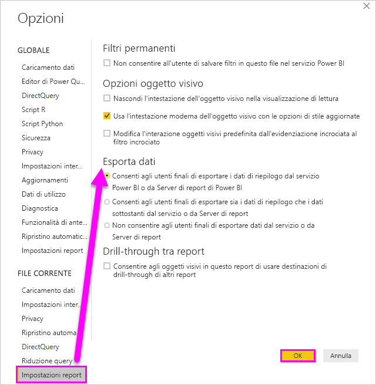

# Esportare i dati usati per creare una visualizzazione

> [!IMPORTANT]
> Non tutti i dati possono essere visualizzati o esportati da tutti gli utenti. Quando si creano dashboard e report, sono disponibili misure di sicurezza adottate da amministratori e progettisti di report. Alcuni dati sono limitati, nascosti o riservati e non possono essere visualizzati o esportati senza autorizzazioni speciali. 

## Utenti autorizzati a esportare i dati

Se si hanno le autorizzazioni appropriate, è possibile visualizzare ed esportare i dati usati da Power BI per creare una visualizzazione. Spesso i dati sono riservati o limitati a utenti specifici. In questi casi, non è possibile visualizzarli o esportarli. Per informazioni dettagliate, vedere la sezione **Limitazioni e considerazioni** alla fine di questo documento. 

## Visualizzazione ed esportazione dei dati

È possibile [visualizzare in Power BI i dati](service-reports-show-data.md) usati per creare una visualizzazione e anche esportarli in Excel come file con estensione *xlsx* o *csv*. Per usare l'opzione per l'esportazione dei dati, è necessario disporre di una licenza Pro o Premium e delle autorizzazioni di modifica per il set di dati e il report. <!--If you have access to the dashboard or report but the data is classified as *highly confidential*, Power BI will not allow you to export the data.-->

Osservare in che modo i dati vengono esportati da una delle visualizzazioni nel report, salvati come file con estensione *xlsx* e aperti in Excel. Seguire quindi tutte le istruzioni riportate sotto il video per provare a farlo da soli. Tenere presente che questo video usa una versione precedente di Power BI.

<iframe width="560" height="315" src="https://www.youtube.com/embed/KjheMTGjDXw" frameborder="0" allowfullscreen></iframe>

## Esportare dati da un dashboard di Power BI

1. Selezionare Altre opzioni (...) nell'angolo in alto a destra della visualizzazione.

    

1. Scegliere l'opzione **Esporta in CSV**.

    

1. Power BI esporta i dati in un file con estensione *csv*. Se è stato applicato un filtro alla visualizzazione, verrà filtrato anche il file di esportazione con estensione csv. 

1. Il browser richiederà di salvare il file.  Dopo il salvataggio, aprire il file con estensione *csv* in Excel.

    

## Esportare dati da un report

Per iniziare, aprire il [report dell'esempio di analisi dell'approvvigionamento](../create-reports/sample-procurement.md) del servizio Power BI in modalità di visualizzazione Modifica. Aggiungere una nuova pagina del report vuota. Seguire quindi questa procedura per aggiungere un'aggregazione, una gerarchia e un filtro a livello di visualizzazione.

### Creare un istogramma a colonne in pila

1. Creare un nuovo **Istogramma in pila**.

    

1. Nel riquadro **Campi** selezionare **Location > City** (Posizione > Città), **Location > Country/Region** (Posizione > Paese/Area geografica) e **Invoice > Discount Percent** (Fattura > Percentuale sconto).  Potrebbe essere necessario spostare **Discount Percent** (Percentuale sconto) nell'area **Valore**.

    

1. Modificare l'aggregazione per **Discount Percent** da **Count** a **Average**. Nell'area **Valore** selezionare la freccia a destra di **Discount Percent** (Percentuale sconto), o **Count of Discount Percent** (Valore percentuale sconto), e scegliere **Media**.

    

1. Aggiungere un filtro a **City** (Città), selezionare tutte le città e quindi rimuovere **Atlanta**.

    

   
1. Eseguire il drill-down di un livello nella gerarchia. Attivare ed eseguire il drill-down fino al livello **City** (Città). 

    

È ora possibile provare a usare entrambe le opzioni di esportazione dei dati.

### Esportare il ***riepilogo dati***
Selezionare l'opzione **Riepilogo dati** se si vogliono esportare i dati di ciò che viene visualizzato nell'oggetto visivo.  Questo tipo di esportazione consente di mostrare solo i dati (colonne e misure) usati per creare l'oggetto visivo.  Se l'oggetto visivo contiene un'aggregazione, è necessario esportare i dati aggregati. Se, ad esempio, si ha un grafico a barre con quattro barre, si otterranno quattro righe di dati di Excel. Il riepilogo dati è disponibile nel servizio Power BI come file con estensione *xlsx* e *csv* e in Power BI Desktop come file con estensione csv.

1. Selezionare i puntini di sospensione (...) nell'angolo superiore destro della visualizzazione. Selezionare **Esporta dati**.

    

    Nel servizio Power BI, dal momento che la visualizzazione contiene un'aggregazione (**Conteggio** è stata sostituita con *Media*), saranno disponibili due opzioni:

    - **Riepilogo dati**

    - **Dati sottostanti**

    Per altre informazioni sulle aggregazioni, vedere [Aggregazioni in Power BI](../create-reports/service-aggregates.md).

    > [!NOTE]
    > In Power BI Desktop è disponibile solo l'opzione per esportare il riepilogo dati come file con estensione csv. 
    
    
1. Da **Esporta dati** selezionare **Riepilogo dati**, scegliere *.xlsx* o *.csv* e quindi selezionare **Esporta**. Power BI esporta i dati.

    

1. Quando si seleziona **Esporta**, il browser richiede di salvare il file. Una volta salvato, aprire il file in Excel.

    

    In questo esempio, l'esportazione di Excel mostra un totale per ogni città. Poiché è stata filtrata, la città di Atlanta non è inclusa nei risultati. La prima riga del foglio di calcolo mostra i filtri usati da Power BI per l'estrazione dei dati.
    
    - Vengono esportati tutti i dati usati dalla gerarchia, non solo quelli usati per il livello drill attuale per l'oggetto visivo. È stato ad esempio eseguito il drill-down a livello di città, ma l'esportazione include anche i dati relativi ai paesi.  

    - I dati esportati vengono aggregati. Viene generato un totale, su un'unica riga, per ogni città.

    - Poiché sono stati applicati filtri alla visualizzazione, i dati vengono esportati come filtrati. Si noti che sulla prima riga è indicato **Filtri applicati: City non è Atlanta, GA**. 

### Esporta dati ***sottostanti***

Selezionare questa opzione se si vogliono visualizzare i dati nell'oggetto visivo ***e*** dati aggiuntivi dal set di dati. Per i dettagli, vedere il grafico seguente. Se la visualizzazione contiene un'aggregazione, se si seleziona **Dati sottostanti** l'aggregazione viene rimossa. In questo esempio, l'esportazione Excel mostra una riga per ogni singola riga City (Città) nel set di dati e la percentuale di sconto per la specifica voce. Power BI rende flat i dati, non li aggrega.  

Quando si seleziona **Esporta**, Power BI esporta i dati in un file con estensione *xlsx* e il browser richiede di salvare il file. Una volta salvato, aprire il file in Excel.

1. Selezionare i puntini di sospensione (...) nell'angolo in alto a destra della visualizzazione. Selezionare **Esporta dati**.

    

    Nel servizio Power BI, dal momento che la visualizzazione contiene un'aggregazione (**Conteggio** è stata sostituita con **Media**), saranno disponibili due opzioni:

    - **Riepilogo dati**

    - **Dati sottostanti**

    Per altre informazioni sulle aggregazioni, vedere [Aggregazioni in Power BI](../create-reports/service-aggregates.md).

    > [!NOTE]
    > In Power BI Desktop è disponibile solo l'opzione per esportare il riepilogo dati. 
    
    
1. In **Esporta dati** selezionare **Dati sottostanti** e quindi **Esporta**. Power BI esporta i dati.

    

1. Quando si seleziona **Esporta**, il browser richiede di salvare il file. Una volta salvato, aprire il file in Excel.

    
    
    - Questo screenshot mostra solo una piccola parte del file di Excel, che contiene più di 100.000 righe.  
    
    - Vengono esportati tutti i dati usati dalla gerarchia, non solo quelli usati per il livello drill attuale per l'oggetto visivo. È stato ad esempio eseguito il drill-down a livello di città, ma l'esportazione include anche i dati relativi ai paesi.  

    - Poiché sono stati applicati filtri alla visualizzazione, i dati vengono esportati come filtrati. Si noti che sulla prima riga è indicato **Filtri applicati: City non è Atlanta, GA**. 

## Protezione dei dati proprietari

Il set di dati può includere contenuti che non devono essere visualizzati da tutti gli utenti. Se non si presta attenzione, l'esportazione dei dati sottostanti può consentire agli utenti di visualizzare tutti i dati dettagliati relativi all'oggetto visivo, ovvero ogni colonna e ogni riga dei dati. 

Per gli amministratori e i progettisti di Power BI sono disponibili diverse strategie da adottare per proteggere i dati proprietari. 

- I progettisti [decidono quali *opzioni di esportazione*](#set-the-export-options) sono disponibili per gli utenti.  

- Gli amministratori di Power BI possono disattivare l'esportazione dei dati per l'organizzazione. 

- I proprietari del set di dati possono impostare la sicurezza a livello di riga, che limita l'accesso agli utenti con diritti di sola lettura. Se tuttavia è stata configurata un'area di lavoro per le app e sono state assegnate le autorizzazioni di modifica ai membri, i ruoli di sicurezza a livello di riga non verranno applicati. Per altre informazioni, vedere [Sicurezza a livello di riga](../admin/service-admin-rls.md).

- I progettisti di report possono nascondere le colonne in modo che non compaiano nell'elenco **Campi**. Per altre informazioni, vedere [Proprietà dei set di dati](../developer/automation/api-dataset-properties.md).

- Gli amministratori di Power BI possono aggiungere [etichette di riservatezza](../admin/service-security-data-protection-overview.md) a dashboard, report, set di impostazioni e flussi di dati. Possono quindi applicare le impostazioni di protezione, ad esempio la crittografia o le filigrane, durante l'esportazione dei dati. 

- Gli amministratori di Power BI possono usare [Microsoft Cloud App Security](../admin/service-security-data-protection-overview.md) per monitorare l'accesso e l'attività degli utenti, eseguire l'analisi dei rischi in tempo reale e impostare controlli specifici delle etichette. Le organizzazioni possono ad esempio usare Microsoft Cloud App Security per configurare un criterio che impedisca agli utenti di scaricare dati sensibili da Power BI in dispositivi non gestiti. 

## Esportare i dettagli dei dati sottostanti

I dati visualizzati quando si seleziona **Dati sottostanti** possono variare. Per comprendere questi dettagli può essere necessario richiedere l'aiuto dell'amministratore o del reparto IT. 

>

| L'oggetto visivo contiene | Cosa viene visualizzato nell'esportazione  |
|---------------- | ---------------------------|
| Aggregazioni | la *prima* aggregazione e i dati non nascosti dell'intera tabella per tale aggregazione |
| Aggregazioni | dati correlati: se l'oggetto visivo usa dati da altre tabelle di dati che sono *correlate* alla tabella di dati che contiene l'aggregazione (purché tale relazione sia \*: 1 o 1:1) |
| Misure* | Tutte le misure dell'oggetto visivo *e* tutte le misure di qualsiasi tabella di dati che contenga una misura usata nell'oggetto visivo |
| Misure* | Tutti i dati non nascosti delle tabelle contenenti la misura (purché la relazione sia \*:1 o 1:1) |
| Misure* | Tutti i dati di tutte le tabelle correlate alla tabella contenente le misure tramite una catena di \*:1 o 1:1 |
| Solo misure | Tutte le colonne non nascoste di tutte le tabelle correlate (per espandere la misura) |
| Solo misure | I dati di riepilogo per tutte le righe duplicate per le misure del modello |

\* Nella visualizzazione Report di Power BI Desktop o del servizio Power BI viene mostrata una *misura* nell'elenco **Campi** con un'icona a forma di calcolatrice . Le misure possono essere create in Power BI Desktop.

### Impostare le opzioni di esportazione

I progettisti di report di Power BI controllano i tipi di opzioni per l'esportazione dei dati che sono disponibili per i consumer. Scegliere tra:

- Consenti agli utenti finali di esportare i dati di riepilogo dal servizio Power BI o da Server di report di Power BI

- Consenti agli utenti finali di esportare sia i dati di riepilogo che i dati sottostanti dal servizio o da Server di report

- Non consentire agli utenti finali di esportare dati dal servizio o da Server di report

    > [!IMPORTANT]
    > Si consiglia ai progettisti di report di ricontrollare i report esistenti e reimpostare manualmente l'opzione di esportazione in base alle esigenze.

Per impostare queste opzioni:

1. Iniziare con Power BI Desktop.

1. Nell'angolo superiore sinistro selezionare **File** > **Opzioni e impostazioni** > **Opzioni**.

1. In **FILE CORRENTE** selezionare **Impostazioni report**.

    

1. Effettuare una selezione nella sezione **Esporta dati**.

È anche possibile aggiornare questa impostazione nel servizio Power BI.

È importante notare che se le impostazioni del portale di amministrazione di Power BI sono in conflitto con le impostazioni del report per l'esportazione dei dati, le impostazioni di amministrazione sostituiranno quelle di esportazione dei dati.

## Limitazioni e considerazioni
Queste limitazioni e considerazioni si applicano a Power BI Desktop e al servizio Power BI, tra cui Power BI Pro e Premium.

- Per esportare i dati da un oggetto visivo, è necessario disporre dell'[autorizzazione di compilazione per il set di dati sottostante](https://docs.microsoft.com/power-bi/service-datasets-build-permissions).

-  Il numero massimo di righe che **Power BI Desktop** e il **servizio Power BI** possono esportare da un **report in modalità di importazione** in un file *CSV* è 30.000.

- Il numero massimo di righe che le applicazioni possono esportare da un **report in modalità di importazione** in un file *XLSX* è 150.000.

- L'esportazione mediante *Dati sottostanti* non funziona nei casi seguenti:

  - La versione è anteriore al 2016.

  - Le tabelle nel modello non hanno una chiave univoca.
    
  -  Un amministratore o un progettista di report ha disabilitato questa funzionalità.

- L'esportazione tramite *Dati sottostanti* non funziona se si abilita l'opzione *Mostra elementi senza dati* per la visualizzazione esportata da Power BI.

- Quando si usa DirectQuery, Power BI può esportare al massimo 16 MB di dati non compressi. Tra i risultati imprevisti può verificarsi il caso in cui l'esportazione è inferiore al numero massimo di righe, ossia 150.000. Ciò può accadere se:

    - Sono presenti molte colonne.

    - Alcuni dati sono difficili da comprimere.

    - Sono in gioco altri fattori che aumentano la dimensione del file e riducono il numero di righe che può esportare Power BI.

- Se la visualizzazione usa dati provenienti da più tabelle di dati e non esiste alcuna relazione per le tabelle nel modello di dati, Power BI esporta solo i dati per la prima tabella.

- Gli oggetti visivi di Power BI e gli oggetti visivi R non sono attualmente supportati.

- In Power BI è possibile rinominare un campo (colonna) facendo doppio clic sul campo e digitando un nuovo nome. Power BI fa riferimento al nuovo nome come un *alias*. Anche se un report di Power BI può contenere nomi di campi duplicati, Excel non consente i duplicati. Pertanto, quando Power BI esporta i dati in Excel, gli alias dei campi vengono reimpostati sui nomi di campo (colonna) originali.  

- Se nel file con estensione *csv* sono presenti caratteri Unicode, il testo in Excel potrebbe non essere visualizzato correttamente. Esempi di caratteri Unicode sono i simboli di valuta e le parole straniere. Per visualizzare correttamente i caratteri Unicode è possibile aprire il file nel Blocco note. Se si vuole aprire il file in Excel, come soluzione alternativa è possibile importare il file con estensione *csv*. Per importare il file in Excel:

  1. Aprire Excel.

  1. Passare alla scheda **Dati**.
  
  1. Selezionare **Carica dati esterni** > **Da testo**.
  
  1. Passare alla cartella locale in cui è archiviato il file e selezionare il file con estensione *csv*.

- Quando si esporta in *file CSV* alcuni caratteri verranno preceduti dal carattere di escape **'** .

- Gli amministratori di Power BI possono disabilitare l'esportazione dei dati.

Altre domande? [Provare a rivolgersi alla community di Power BI](https://community.powerbi.com/)
