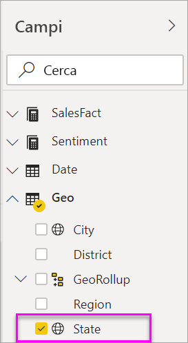
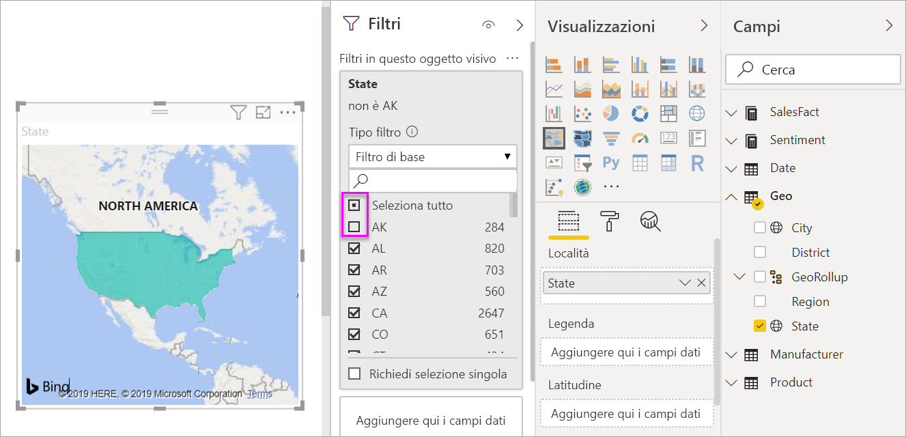

# Mappe colorate (cloroplete) in Power BI
Nelle mappe colorate vengono usate ombreggiature, tinte o motivi per visualizzare proporzionalmente le differenze relative a un valore in un'area geografica.  In questo modo è possibile visualizzare queste differenze relative con ombreggiature chiare (frequenza o valore minore) e scure (frequenza o valore maggiore).    

## Cosa viene inviato a Bing
Power BI si integra con Bing per fornire coordinate della mappa predefinite (un processo denominato geocodifica). Quando si crea una visualizzazione mappa nel servizio Power BI o Power BI Desktop, i dati contenuti nei bucket **Posizione**, **Latitudine** e **Longitudine** (usati per creare tale visualizzazione) vengono inviati a Bing.

L'utente, o l'amministratore, potrebbe dover aggiornare il firewall per consentire l'accesso agli URL usati da Bing per la geocodifica.  Questi URL sono:
- https://dev.virtualearth.net/REST/V1/Locations    
- https://platform.bing.com/geo/spatial/v1/public/Geodata    
- https://www.bing.com/api/maps/mapcontrol

Per altre informazioni sui dati inviati a Bing e per suggerimenti su come migliorare i risultati della geocodifica, vedere [Suggerimenti e consigli per le visualizzazioni mappa](power-bi-map-tips-and-tricks.md).

## Quando usare una mappa colorata
Le mappe colorate sono ideali nelle circostanze seguenti:

* per visualizzare informazioni quantitative su una mappa
* per mostrare motivi e relazioni spaziali
* quando i dati sono standardizzati
* quando si usano dati socioeconomici
* quando le aree geografiche definite sono importanti
* per ottenere una panoramica della distribuzione nelle varie località geografiche

### Prerequisiti
- Servizio Power BI o Power BI Desktop
- Sales and Marketing Sample

Per seguire la procedura, tenere presente che nell'esercitazione viene usato il servizio Power BI e non Power BI Desktop.

## Creare una mappa colorata di base
Il video seguente mostra come creare una mappa di base e convertirla in una mappa colorata.

<iframe width="560" height="315" src="https://www.youtube.com/embed/ajTPGNpthcg" frameborder="0" allowfullscreen></iframe>

### Ottenere i dati e aggiungere una nuova pagina vuota al report
1. Per creare una mappa colorata personalizzata, [scaricare l'esempio di analisi delle vendite e marketing](../sample-datasets.md) accedendo a Power BI e selezionando **Recupera dati \> Esempi \> Vendite e marketing \> Connetti**.
2. Quando viene visualizzato il messaggio di conferma, chiuderlo e selezionare la scheda **Report**. Scegliere quindi **Esempio di analisi di vendite e marketing** per aprire il report.

   
3. Power BI apre il report. Selezionare **Modifica report** per aprire il report in [visualizzazione di modifica](../service-interact-with-a-report-in-editing-view.md).

4. Aggiungere una nuova pagina selezionando il segno più (+) di colore giallo nella parte inferiore dell'area di disegno del report.

    

### Creare una mappa colorata
1. Nel riquadro Campi selezionare il campo **Geo** \> **State**.    

   
5. [Convertire il grafico](power-bi-report-change-visualization-type.md) in una mappa colorata. Si noti che **State** ora è presente nell'area **Location**. Bing Mappe usa il campo nell'area **Location** per creare la mappa.  La posizione può essere una qualsiasi tra quelle valide, ad esempio paesi, stati, province, CAP o altri codici postali. Bing Mappe fornisce le forme di mappa colorata per le varie posizioni a livello mondiale. Se non è presente una voce valida nell'area Località, Power BI non può creare la mappa colorata.  

   
6. Filtrare la mappa in modo da visualizzare solo gli Stati Uniti continentali.

   a.  Nella parte inferiore del riquadro Visualizzazioni cercare l'area **Filtri** .

   b.  Passare il puntatore su **State** e fare clic sulla freccia di espansione.  
   

   c.  Apporre un segno di spunta accanto a **All** e rimuovere quello accanto ad **AK**.

   
7. Selezionare **SalesFact** \> **Sentiment** per aggiungerlo all'area **Saturazione colore**. Il campo nell'area **Saturazione colore** controlla l'ombreggiatura della mappa.  
   
8. L'ombreggiatura applicata alla mappa colorata delle valutazioni è di colore verde e rosso, in cui il rosso rappresenta valori di valutazione inferiori e il verde valori superiori, corrispondenti a una valutazione più positiva.  Nella figura seguente è evidenziato lo stato del Wyoming (WY) in cui il valore del sentiment è particolarmente alto (74).  
   
9. [Salvare il report](../service-report-save.md).
##    Rettificare la formattazione dei colori
Power BI consente un ampio controllo sull'aspetto della mappa colorata.
1. Selezionare l'icona del rullo per aprire il riquadro Formattazione.

    

2. Selezionare **Colori dati** per visualizzare le opzioni relative ai colori.
3. Impostare i valori Minimo e Massimo per i colori su giallo e blu. Aggiungere quindi i valori Minimo e Massimo in base ai dati. Sperimentare con questi controlli fino a ottenere l'aspetto voluto. 

    

## Evidenziazione e filtro incrociato
Per informazioni sull'uso del riquadro Filtri, vedere [Aggiungere un filtro a un report](../power-bi-report-add-filter.md).

Evidenziando una località in una mappa colorata viene applicato il filtro incrociato con le altre visualizzazioni nella pagina del report e viceversa.

1. Per seguire la procedura, prima di tutto salvare il report selezionando **File > Salva**. 

2. Copiare la mappa colorata tramite CTRL-C.

3. Nella parte inferiore dell'area di disegno del report selezionare la scheda **Sentiment** per aprire la pagina Sentiment del report.

    

4. Spostare e ridimensionare le visualizzazioni nella pagina per creare spazio e quindi incollare con CTRL-V la mappa colorata del report precedente.

   

5. Selezionare uno stato nella mappa colorata.  per evidenziare le altre visualizzazioni nella pagina. Selezionando **Texas**, ad esempio, viene illustrato che Sentiment è 74 e il Texas si trova in Central District \#23.   
   
2. Selezionare un punto dati nel grafico a linee VanArsdel - Sentiment by Month per filtrare la mappa colorata in modo da visualizzare i dati relativi a Sentiment per VanArsdel e non per la concorrenza.  
   

## Considerazioni e risoluzione dei problemi
I dati delle mappe possono essere ambigui.  Ad esempio, Washington può corrispondere sia a un nome di città che di stato. I dati geografici sono probabilmente archiviati in colonne distinte, una per i nomi di città e una per i nomi di stati o province, di conseguenza Bing potrebbe non essere in grado di indicare a cosa si riferisce il nome Washington. Se il set di dati contiene già i dati relativi a latitudine e longitudine, Power BI include speciali campi per ovviare alle ambiguità dei dati delle mappe. È sufficiente trascinare il campo che contiene i dati relativi alla latitudine nell'area Visualizzazioni \> Latitudine e fare  altrettanto per i dati relativi alla longitudine.    

Se si dispone delle autorizzazioni per modificare il set di dati in Power BI Desktop, guardare questo video per informazioni su come risolvere le ambiguità della mappa.

<iframe width="560" height="315" src="https://www.youtube.com/embed/Co2z9b-s_yM" frameborder="0" allowfullscreen></iframe>

Se i dati relativi a latitudine e longitudine non sono disponibili, [seguire queste istruzioni per aggiornare il set di dati](https://support.office.com/article/Maps-in-Power-View-8A9B2AF3-A055-4131-A327-85CC835271F7).

Per ulteriori informazioni sulle visualizzazioni mappa, vedere [Suggerimenti e consigli per le visualizzazioni mappa](../power-bi-map-tips-and-tricks.md).

## Passaggi successivi

[Forme mappa](desktop-shape-map.md)

[Tipi di visualizzazione in Power BI](power-bi-visualization-types-for-reports-and-q-and-a.md)