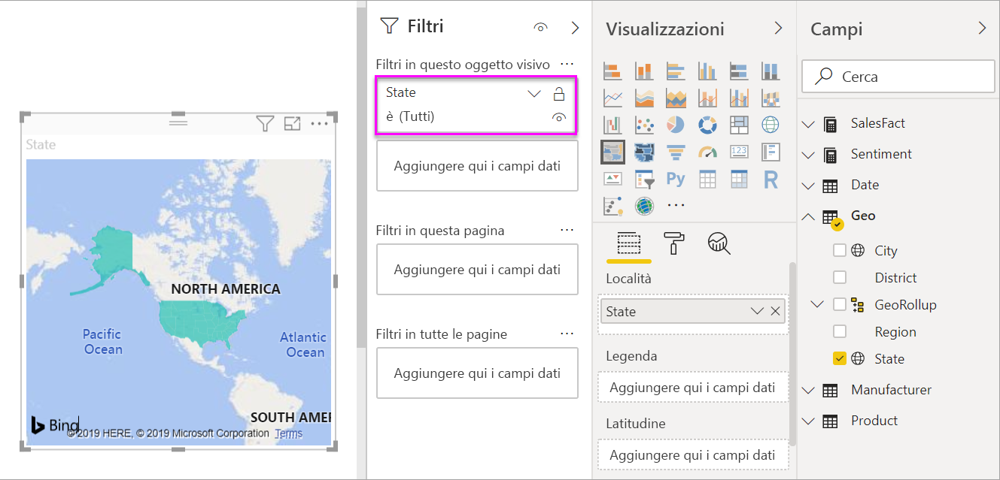
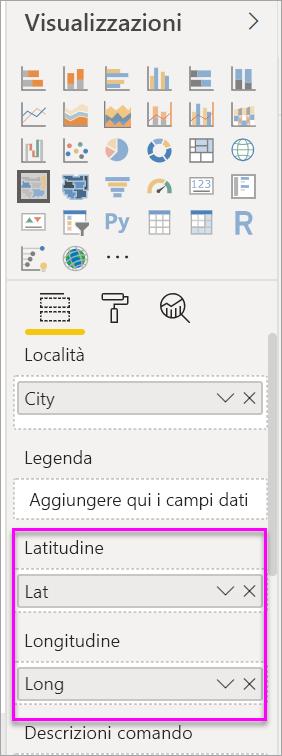

# Creare e usare mappe colorate (coropletiche) in Power BI

[!INCLUDE[consumer-appliesto-nyyn](../includes/consumer-appliesto-nyyn.md)]

[!INCLUDE [power-bi-visuals-desktop-banner](../includes/power-bi-visuals-desktop-banner.md)]

Nelle mappe colorate vengono usate ombreggiature, tinte o motivi per visualizzare proporzionalmente le differenze relative a un valore in un'area geografica.  In questo modo è possibile visualizzare queste differenze relative con ombreggiature chiare (frequenza o valore minore) e scure (frequenza o valore maggiore).    

## Cosa viene inviato a Bing
Power BI si integra con Bing per fornire coordinate della mappa predefinite (un processo denominato geocodifica). Quando si crea una visualizzazione mappa nel servizio Power BI o Power BI Desktop, i dati contenuti nei bucket **Posizione**, **Latitudine** e **Longitudine** (usati per creare tale visualizzazione) vengono inviati a Bing.

L'utente, o l'amministratore, potrebbe dover aggiornare il firewall per consentire l'accesso agli URL usati da Bing per la geocodifica.  Questi URL sono:
- https://dev.virtualearth.net/REST/V1/Locations    
- https://platform.bing.com/geo/spatial/v1/public/Geodata    
- https://www.bing.com/api/maps/mapcontrol

Per altre informazioni sui dati inviati a Bing e per suggerimenti su come migliorare i risultati della geocodifica, vedere [Suggerimenti e consigli per le visualizzazioni mappa](power-bi-map-tips-and-tricks.md).

## Quando usare una mappa colorata
Le mappe colorate sono ideali nelle circostanze seguenti:

* per visualizzare informazioni quantitative su una mappa
* per mostrare motivi e relazioni spaziali
* quando i dati sono standardizzati
* quando si usano dati socioeconomici
* quando le aree geografiche definite sono importanti
* per ottenere una panoramica della distribuzione nelle varie località geografiche

### Prerequisiti
Questa esercitazione usa il [file Sales and Marketing Sample PBIX](https://download.microsoft.com/download/9/7/6/9767913A-29DB-40CF-8944-9AC2BC940C53/Sales%20and%20Marketing%20Sample%20PBIX.pbix).
1. Nella sezione in alto a sinistra della barra dei menu selezionare **File** > **Apri**.
   
2. Trovare la copia del **file Sales and Marketing Sample PBIX**

1. Aprire il **file Sales and Marketing Sample PBIX** nella visualizzazione report .

1. Seleziona  per aggiungere una nuova pagina.

> [!NOTE]
> Per condividere il report con un collega di Power BI, è necessario che entrambi gli utenti abbiano licenze di Power BI Pro individuali o che il report venga salvato nella capacità Premium.    

### Creare una mappa colorata
1. Nel riquadro Campi selezionare il campo **Geo** \> **State**.    

   
2. [Convertire il grafico](power-bi-report-change-visualization-type.md) in una mappa colorata. Si noti che **State** ora è presente nell'area **Location**. Bing Mappe usa il campo nell'area **Location** per creare la mappa.  La posizione può essere una qualsiasi tra quelle valide, ad esempio paesi, stati, province, città, CAP o altri codici postali e così via. Bing Mappe fornisce le forme di mappa colorata per le varie posizioni a livello mondiale. Se non è presente una voce valida nell'area Località, Power BI non può creare la mappa colorata.  

   
3. Filtrare la mappa in modo da visualizzare solo gli Stati Uniti continentali.

   a.  A sinistra del riquadro Visualizzazioni individuare il riquadro **Filtri**. Espanderlo se è ridotto a icona

   b.  Passare il puntatore su **Stato** e selezionare la freccia di espansione  
   

   c.  Apporre un segno di spunta accanto a **All** e rimuovere quello accanto ad **AK**.

   
4. Selezionare l'icona del rullo per aprire il riquadro Formattazione e scegliere **Colori dati**.

    

5. Selezionare i tre punti verticali e scegliere **Formattazione condizionale**.

    

6. Usare la schermata **Colore predefinito - Colori dati** per determinare come verrà applicata l'ombreggiatura alla mappa colorata. Le opzioni disponibili includono il campo su cui basare l'ombreggiatura e la modalità di applicazione dell'ombreggiatura. In questo esempio viene usato il campo **SalesFact** > **Sentiment** e il valore più basso per il sentiment viene impostato su arancione, mentre quello più alto su blu. I valori compresi tra il valore massimo e minimo saranno caratterizzati da varie sfumature di arancione e blu. La figura nella parte inferiore della schermata mostra l'intervallo di colori che verrà usato. 

    

7. L'ombreggiatura applicata alla mappa colorata delle valutazioni è di colore verde e rosso, in cui il rosso rappresenta valori di valutazione inferiori e il verde valori superiori, corrispondenti a una valutazione più positiva.  Per visualizzare altri dettagli, trascinare un campo nell'area delle descrizioni comandi.  In questo esempio è stato aggiunto il campo **SalesFact** > **Sentiment gap**. L'evidenziazione dello stato dell'Idaho (ID) indica che il gap del sentiment è basso, ovvero 6.
   

10. [Salvare il report](../service-report-save.md).

Power BI consente un ampio controllo sull'aspetto della mappa colorata. Sperimentare con questi controlli per i colori dei dati fino a ottenere l'aspetto voluto. 

## Evidenziazione e filtro incrociato
Per informazioni sull'uso del riquadro Filtri, vedere [Aggiungere un filtro a un report](../power-bi-report-add-filter.md).

Evidenziando una località in una mappa colorata viene applicato il filtro incrociato alle altre visualizzazioni nella pagina del report e viceversa.

1. Per seguire la procedura, prima di tutto salvare il report selezionando **File > Salva**. 

2. Copiare la mappa colorata tramite CTRL-C.

3. Nella parte inferiore dell'area di disegno del report selezionare la scheda **Sentiment** per aprire la pagina Sentiment del report.

    

4. Spostare e ridimensionare le visualizzazioni nella pagina per creare spazio e quindi incollare con CTRL-V la mappa colorata del report precedente. (Vedere le immagini seguenti)

   

5. Selezionare uno stato nella mappa colorata.  Le altre visualizzazioni nella pagina vengono evidenziate e filtrate in modo incrociato. Selezionando **Texas**, ad esempio, vengono filtrate in modo incrociato le schede e viene evidenziato in modo incrociato il grafico a barre. Da questo si appura che il sentiment è 75 e che il Texas si trova nel Central District #23.   
   
2. Selezionare un punto dati nel grafico a linee VanArsdel - Sentiment by Month per filtrare la mappa colorata in modo da visualizzare i dati relativi a Sentiment per VanArsdel e non per la concorrenza.  
   

## Considerazioni e risoluzione dei problemi
I dati delle mappe possono essere ambigui.  Ad esempio, Washington può corrispondere sia a un nome di città che di stato. I dati geografici sono probabilmente archiviati in colonne distinte, una per i nomi di città e una per i nomi di stati o province, di conseguenza Bing potrebbe non essere in grado di indicare a cosa si riferisce il nome Washington. Se il set di dati contiene già i dati relativi a latitudine e longitudine, Power BI include speciali campi per ovviare alle ambiguità dei dati delle mappe. È sufficiente trascinare il campo che contiene i dati relativi alla latitudine nell'area Visualizzazioni \> Latitudine e fare  altrettanto per i dati relativi alla longitudine.    

Se sono disponibili le autorizzazioni per modificare il set di dati in Power BI Desktop, guardare questo video per informazioni su come risolvere le ambiguità della mappa.

> [VIDEO https://www.youtube.com/embed/Co2z9b-s_yM ]

Se i dati relativi a latitudine e longitudine non sono disponibili, ma si dispone dell'accesso per la modifica del set di dati, [seguire queste istruzioni per aggiornare il set di dati](https://support.office.com/article/Maps-in-Power-View-8A9B2AF3-A055-4131-A327-85CC835271F7).

Per ulteriori informazioni sulle visualizzazioni mappa, vedere [Suggerimenti e consigli per le visualizzazioni mappa](../power-bi-map-tips-and-tricks.md).

## Passaggi successivi

[Forme mappa](desktop-shape-map.md)

[Tipi di visualizzazione in Power BI](power-bi-visualization-types-for-reports-and-q-and-a.md)
