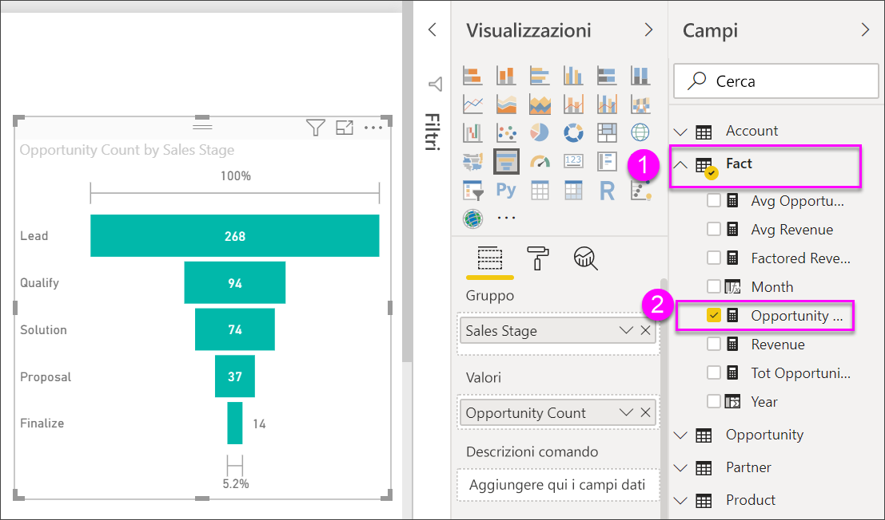

# Creare e usare grafici a imbuto

[!INCLUDE[consumer-appliesto-nyyn](../includes/consumer-appliesto-nyyn.md)]

[!INCLUDE [power-bi-visuals-desktop-banner](../includes/power-bi-visuals-desktop-banner.md)]

Un grafico a imbuto consente di visualizzare un processo lineare caratterizzato da fasi connesse in sequenza, Ad esempio un imbuto delle vendite che tiene traccia dei clienti in varie fasi: Lead \> Lead qualificato \> Potenziale cliente \> Contratto \> Chiusura.  La forma dell'imbuto indica a colpo d'occhio lo stato del processo di cui si sta tenendo traccia.

Ogni fase dell'imbuto rappresenta una percentuale del totale. Quindi, nella maggior parte dei casi un grafico a imbuto ha proprio la forma di un imbuto, con la prima fase nella parte più larga e ogni fase successiva più piccola rispetto alla precedente.  È utile anche un grafico a imbuto a forma di pera, che consente di identificare un problema nel processo.  Generalmente, la prima fase, ovvero la fase di "imbocco" è la più grande.

> [!NOTE]
> Per condividere il report con un collega di Power BI, è necessario che entrambi gli utenti abbiano licenze di Power BI Pro individuali o che il report venga salvato nella capacità Premium.    

## Quando usare un grafico a imbuto
I grafici a imbuto rappresentano un'ottima scelta nelle seguenti situazioni:

* quando i dati sono in sequenza e attraversano almeno 4 fasi.
* quando è previsto che il numero di "elementi" nella prima fase sia maggiore rispetto al numero nella fasi finale.
* per calcolare una potenzialità, ad esempio fatturato/vendite/trattative e così via, per fasi.
* per calcolare tassi di conversione e conservazione e tenerne traccia.
* per individuare colli di bottiglia in un processo lineare.
* per tenere traccia del flusso di lavoro di un carrello.
* per tenere traccia dello stato di avanzamento e del successo delle campagne di marketing/pubblicità click-through.

## Uso dei grafici a imbuto
Grafici a imbuto:

* Possono essere ordinati.
* Supportano i multipli.
* Possono essere evidenziati e filtrati in modo incrociato da altre visualizzazioni nella stessa pagina del report.
* Possono essere usati per evidenziare e filtrare in modo incrociato altre visualizzazioni nella stessa pagina del report.
   > [!NOTE]
   > Questo video mostra come creare un grafico a imbuto usando l'esempio Sales and Marketing Sample. Seguire poi la procedura indicata sotto al video per provare in autonomia usando il file di esempio Opportunity Analysis Sample PBIX.
   > 
   > 
## Prerequisito

Questa esercitazione usa il [file Opportunity Analysis Sample PBIX](https://download.microsoft.com/download/9/1/5/915ABCFA-7125-4D85-A7BD-05645BD95BD8/Opportunity%20Analysis%20Sample%20PBIX.pbix
).

1. Nella sezione in alto a sinistra della barra dei menu selezionare **File** > **Apri**
   
2. Trovare la copia del **file Opportunity Analysis Sample PBIX**

1. Aprire il **file Opportunity Analysis Sample PBIX** nella visualizzazione report .

1. Seleziona  per aggiungere una nuova pagina.

## Creare un grafico a imbuto di base
Questo video mostra come creare un grafico a imbuto usando l'esempio Sales and Marketing Sample.

<iframe width="560" height="315" src="https://www.youtube.com/embed/qKRZPBnaUXM" frameborder="0" allow="autoplay; encrypted-media" allowfullscreen></iframe>

Creare ora un grafico a imbuto che mostri il numero di opportunità presenti nelle fasi di vendita.

1. Iniziare da una pagina di report vuota e selezionare il campo **SalesStage** \> **Sales Stage**.
   
    

1. Selezionare l'icona a forma di imbuto  per convertire l'istogramma in un grafico a imbuto.

2. Dal riquadro **Campi** selezionare **Fact** \> **Opportunity Count**.
   
    
4. Quando si passa il puntatore del mouse su una barra, vengono visualizzate molte informazioni.
   
   * Il nome della fase
   * Il numero di opportunità attualmente presenti nella fase
   * Il tasso di conversione complessivo (% di lead) 
   * Il tasso di avanzamento da fase a fase, che corrisponde alla percentuale rispetto alla fase precedente (in questo caso fase di proposta/fase della soluzione)
     
     

6. [Salvare il report](../create-reports/service-report-save.md).

## Evidenziazione e filtro incrociato
Per informazioni sull'uso del riquadro Filtri, vedere [Aggiungere un filtro a un report](../create-reports/power-bi-report-add-filter.md).

Evidenziando una barra in un grafico a imbuto viene applicato il filtro incrociato nelle altre visualizzazioni della pagina del report e viceversa. Proseguire aggiungendo altri oggetti visivi alla pagina del report che contiene il grafico a imbuto.

1. Nel grafico a imbuto selezionare la barra **Proposta**. per evidenziare in modo incrociato le altre visualizzazioni nella pagina. Per selezionare più elementi, premere CTRL.
   
   
2. Per impostare le preferenze di evidenziazione incrociata e filtro incrociato degli oggetti visivi, vedere [Interazioni con oggetti visivi in Power BI](../create-reports/service-reports-visual-interactions.md).

## Passaggi successivi

[Grafici a misuratore radiale in Power BI](power-bi-visualization-radial-gauge-charts.md)

[Tipi di visualizzazione in Power BI](power-bi-visualization-types-for-reports-and-q-and-a.md)

