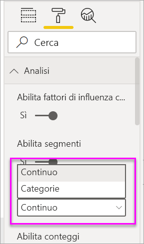

# Creare oggetti visivi Fattori di influenza chiave

[!INCLUDE [power-bi-visuals-desktop-banner](../includes/power-bi-visuals-desktop-banner.md)]

L'oggetto visivo Fattori di influenza chiave favorisce la comprensione dei fattori che stanno alla base di una metrica alla quale si è interessati. Analizza i dati, stila una classifica dei fattori importanti e li visualizza come fattori di influenza chiave. Ad esempio si supponga di voler scoprire che cosa influenza l'avvicendamento dei dipendenti. Un fattore potrebbe essere la durata del contratto, un altro potrebbe essere l'età del dipendente. 
 
## Quando usare i fattori di influenza chiave 
L'oggetto visivo Fattori di influenza chiave è ideale: 
- Per vedere quali fattori influiscono sulla metrica che si sta analizzando.
- Per confrontare l'importanza relativa di questi fattori. Ad esempio, i contratti a breve termine hanno un'influenza maggiore sull'abbandono dei dipendenti rispetto ai contratti a lungo termine? 

## Funzionalità dell'oggetto visivo Fattori di influenza chiave

1. **Schede**: selezionare una scheda per passare da una visualizzazione all'altra. **Fattori di influenza chiave** visualizza gli elementi che contribuiscono maggiormente al valore della metrica selezionata. **Segmenti principali** visualizza i segmenti che contribuiscono maggiormente al valore della metrica selezionata. Un *segmento* è costituito da una combinazione di valori. Ad esempio un segmento potrebbe rappresentare i consumatori che sono clienti da almeno 20 anni e vivono nell'area occidentale. 

2. **Casella di riepilogo a discesa**: valore della metrica in esame. In questo esempio, esaminare la metrica **Rating** (Valutazione). Il valore selezionato è **Low**.

3. **Riformulazione**: favorisce l'interpretazione dell'elemento visivo nel riquadro a sinistra.

4. **Riquadro a sinistra**: il riquadro a sinistra contiene un oggetto visivo. In questo caso il riquadro a sinistra visualizza un elenco dei fattori di influenza chiave principali.

5. **Riformulazione**: favorisce l'interpretazione dell'elemento visivo nel riquadro a destra.

6. **Riquadro a destra**: il riquadro a destra contiene un oggetto visivo. In questo caso il grafico a colonne visualizza tutti i valori del fattore di influenza chiave **Theme** (Tema) selezionato nel riquadro sinistro. Il valore specifico di **usabilità** nel riquadro a sinistra viene visualizzato in verde. Tutti gli altri valori per **Theme** vengono visualizzati in nero.

7. **Linea media**: la media viene calcolata per tutti i valori possibili di **Theme**, salvo per **Usability** (Usabilità), che è il fattore di influenza selezionato. Pertanto il calcolo si applica a tutti i valori in nero. Indica la percentuale degli altri **temi** che hanno avuto valutazioni basse. In questo caso l'11,35% ha avuto una valutazione bassa (indicata dalla linea tratteggiata).

8. **Casella di controllo**: filtra l'oggetto visivo nel riquadro destro per visualizzare solo i valori che sono fattori di influenza per tale campo. In questo esempio verrà filtrato l'oggetto visivo per usability (Usabilità), security (Sicurezza) e navigation (Navigazione).

## Analizzare una metrica categorica
 
Guardare questo video per imparare a creare un oggetto visivo Fattori di influenza chiave con una metrica categorica. Quindi creare un oggetto seguendo questa procedura. 

   > [!NOTE]
   > Questo video usa una versione precedente di Power BI Desktop.
   > 
   > 
<iframe width="560" height="315" src="https://www.youtube.com/embed/fDb5zZ3xmxU" frameborder="0" allow="accelerometer; autoplay; encrypted-media; gyroscope; picture-in-picture" allowfullscreen></iframe>

Il product manager richiede di determinare i fattori per cui i clienti danno valutazioni negative al servizio cloud dell'azienda. Per seguire la procedura, aprire il [file con estensione pbix di commenti e suggerimenti degli utenti](https://github.com/microsoft/powerbi-desktop-samples/tree/master/Monthly%20Desktop%20Blog%20Samples/2019/customerfeedback.pbix) in Power BI Desktop. È anche possibile scaricare il [file di Excel di commenti e suggerimenti dei clienti per il servizio Power BI o Power BI Desktop](https://github.com/microsoft/powerbi-desktop-samples/tree/master/Monthly%20Desktop%20Blog%20Samples/2019/customerfeedback.xlsx). Selezionare uno dei due collegamenti e quindi selezionare **Download** nella pagina di GitHub visualizzata.

> [!NOTE]
> Il set di dati di commenti e suggerimenti dei clienti è basato sul lavoro di [Moro et al., 2014] S. Moro, P. Cortez e P. Rita. "A Data-Driven Approach to Predict the Success of Bank Telemarketing" (Un approccio basato sui dati per la previsione del successo del telemarketing bancario). *Decision Support Systems*, Elsevier, 62:22-31, giugno 2014. 

1. Aprire il report e selezionare l'icona **Fattori di influenza chiave**. 

    

2. Spostare la metrica da esaminare nel campo **Analisi**. Per visualizzare i fattori che influenzano una valutazione bassa del servizio, selezionare **tabella Customer** > **Rating**.

3. Spostare i campi che si ritiene potrebbero influenzare **Rating** nell'area **Spiega in base a**. È possibile spostare tutti i campi desiderati. In questo caso iniziare con:
    - Country-Region 
    - Role in Org (Ruolo nell'organizzazione) 
    - Subscription Type (Tipo di sottoscrizione) 
    - Company size (Dimensione dell'azienda) 
    - Tema
    
4. Lasciare vuoto il campo **Espandi in base a**. Questo campo viene usato solo per l'analisi di una misura o di un campo riepilogativo. 

5. Per concentrarsi sulle classificazioni negative, selezionare **Low** (Bassa) nell'elenco a discesa **Fattore che influisce su Rating in modo che sia**.  

    

L'analisi viene eseguita a livello di tabella per il campo che si sta analizzando. In questo caso si tratta della metrica **Rating**. Questa metrica è definita a livello dei clienti. Ogni cliente ha assegnato un punteggio alto o un punteggio basso. Tutti i fattori esplicativi devono essere definiti a livello del cliente per abilitarne l'uso nell'oggetto visivo. 

Nell'esempio precedente, tutti i fattori esplicativi hanno una relazione uno-a-uno o molti-a-uno con la metrica. In questo caso, ogni cliente ha assegnato un singolo tema alla valutazione. Analogamente, i clienti provengono da un paese specifico e hanno un solo tipo di appartenenza e un solo ruolo all'interno dell'organizzazione. I fattori esplicativi sono già attributi di un cliente e non richiedono trasformazioni. L'oggetto visivo può usarli immediatamente. 

Più avanti nell'esercitazione si esamineranno esempi più complessi con relazioni uno-a-molti. In questi casi, prima di poter eseguire l'analisi è necessario aggregare le colonne fino al livello cliente. 

Anche le misure e le aggregazioni usate come fattori esplicativi vengono valutate al livello tabella della metrica **Analisi**. Si vedranno alcuni esempi più avanti in questo articolo. 

## Interpretare dei fattori di influenza chiave categorici 
Ora si prendono in considerazione i fattori di influenza chiave per le valutazioni basse. 

### Singolo fattore principale che influenza la probabilità di una valutazione bassa

Il cliente in questo esempio può avere tre ruoli: consumer (consumatore), administrator (amministratore) e publisher (editore). L'appartenenza al ruolo consumatore è il fattore principale che contribuisce a una valutazione bassa. 

Più precisamente, i consumatori hanno una probabilità 2,57 volte maggiore di assegnare una valutazione negativa al servizio. Nel grafico dei fattori di influenza chiave, **Role in Org is consumer** (Ruolo nell'organizzazione è consumatore) è al primo posto nell'elenco a sinistra. Se si seleziona **Role in Org is consumer** (Ruolo nell'organizzazione è consumatore), Power BI Visualizza dettagli aggiuntivi nel riquadro a destra. Viene visualizzato l'effetto comparativo di ogni ruolo sulla probabilità di una valutazione bassa.
  
- Il 14,93% dei consumatori assegna un punteggio basso. 
- In media solo il 5,78% di tutti gli altri ruoli assegna un punteggio basso.
- I consumatori hanno una probabilità 2,57 volte maggiore di assegnare un punteggio basso rispetto a tutti gli altri ruoli. È possibile determinare questo dato dividendo la barra verde con la linea tratteggiata rossa. 

### Secondo fattore principale che influenza la probabilità di una valutazione bassa

L'oggetto visivo Fattori di influenza chiave confronta e include in una classifica fattori derivanti da variabili diverse. Il secondo fattore di influenza non ha nulla a che vedere con **Role in Org** (Ruolo nell'organizzazione). Selezionare il secondo fattore di influenza nell'elenco: **Theme is usability** (Il tema è l'usabilità). 

Il secondo fattore di influenza in ordine di importanza è correlato al tema della valutazione del cliente. I clienti che hanno aggiunto un commento sull'usabilità del prodotto avevano una probabilità 2,55 volte maggiore di assegnare un punteggio basso rispetto ai clienti che hanno aggiunto un commento su altri temi, quali l'affidabilità, il design o la velocità. 

È possibile vedere tra gli oggetti visivi che la media, indicata dalla linea rossa punteggiata, è cambiata dal 5,78% all'11,34%. La media è dinamica, perché è basata sulla media di tutti gli altri valori. Per il primo fattore di influenza la media ha escluso il ruolo cliente. Per il secondo fattore di influenza ha escluso il tema dell'usabilità. 
 
Selezionare la casella di controllo **Mostra solo i valori che sono fattori di influenza** per applicare un filtro usando solo i valori influenti. In questo caso, si tratta dei ruoli che determinano un punteggio basso. I dodici temi vengono ridotti ai quattro che Power BI identifica come temi che originano valutazioni basse. 

## Interagire con altri oggetti visivi 
 
Ogni volta che si seleziona un filtro, un filtro dei dati o un altro oggetto visivo nell'area di disegno, l'oggetto visivo Fattori di influenza chiave ripete l'analisi sul nuovo gruppo di dati. Ad esempio è possibile trascinare **Company Size** (Dimensioni dell'azienda) nel report e usarlo come un filtro dei dati. Usarlo per vedere se i fattori di influenza chiave per i clienti enterprise sono diversi da quelli per i clienti comuni. Un'azienda enterprise è un'azienda con oltre 50.000 dipendenti.
 
Se si seleziona **>50,000** l'analisi viene rieseguita e si noterà che i fattori di influenza sono cambiati. Per i clienti di aziende enterprise di grandi dimensioni, il fattore di influenza più importante per le valutazioni basse ha un tema associato alla sicurezza. Può risultare utile approfondire l'analisi, per vedere se sono presenti funzionalità associate alla sicurezza di cui i grandi clienti non sono soddisfatti. 

## Interpretare i fattori di influenza chiave continui 
 
Fin qui si è visto come usare l'oggetto visivo per esplorare l'effetto dei diversi campi categorici sulle valutazioni basse. È anche possibile avere fattori continui come età, altezza e prezzo nel campo **Spiega in base a**. Ora si esamina cosa accade se si sposta **Tenure** (Permanenza) dalla tabella Customer (Cliente) a **Spiega in base a**. Tenure indica da quanto tempo un cliente usa il servizio. 
 
Maggiore è il valore della permanenza, maggiore è la probabilità di ricevere una valutazione bassa. Questa tendenza suggerisce che i clienti a lungo termine hanno più probabilità di assegnare un punteggio negativo. Queste informazioni sono interessanti e può essere utile analizzarle in maggior dettaglio in seguito. 
 
La visualizzazione indica che ogni volta che la permanenza aumenta di 13,44 mesi, anche la probabilità di una valutazione bassa aumenta in media di 1,23 volte. In questo caso 13,44 rappresenta la deviazione standard della permanenza. Pertanto le informazioni dettagliate ricevute analizzano come l'aumento della permanenza in base a un valore di tempo standard (deviazione standard della permanenza) ha effetto sulla probabilità di ricevere una valutazione bassa. 
 
Il grafico a dispersione nel riquadro a destra visualizza la percentuale media di valutazioni basse per ogni valore di permanenza. L'inclinazione viene evidenziata con una linea di tendenza.

## Fattori di influenza chiave continui sottoposti a binning

In alcuni casi è possibile che i fattori continui siano stati trasformati automaticamente in fattori categorici. Ciò è dovuto al fatto che la relazione tra le variabili non è lineare e quindi non è possibile descrivere la relazione come semplicemente crescente o decrescente (come nell'esempio precedente).

Vengono eseguiti test di correlazione per determinare la linearità del fattore di influenza rispetto all'obiettivo. Se l'obiettivo è continuo, viene eseguita la correlazione di Pearson, mentre se è categorico, vengono eseguiti test di correlazione punto-biseriale. Se si rileva che la relazione non è sufficientemente lineare, viene eseguito il binning sotto supervisione, con la generazione di un massimo di 5 contenitori. Per capire quali sono i contenitori più sensati, viene usato un metodo di binning sotto supervisione che esamina la relazione tra il fattore esplicativo e l'obiettivo analizzato.

## Interpretare misure e aggregazioni come fattori di influenza chiave 
 
È possibile usare le misure e le aggregazioni come fattori esplicativi nel contesto dell'analisi. Ad esempio si vuole vedere l'effetto del numero di ticket di supporto clienti o della durata media di un ticket aperto sulla valutazione ricevuta. 
 
In questo caso si vuole vedere se il numero di ticket di supporto associati a un cliente ha effetto sulla valutazione specificata da quel cliente. Si trascina **Support Ticket ID** (ID ticket di supporto) dalla tabella dei ticket di supporto. Dato che un cliente può avere più ticket di supporto, si aggrega l'ID a livello del cliente. L'aggregazione è importante, perché l'analisi viene eseguita a livello del cliente e pertanto tutti i driver devono essere definiti a quel livello di granularità. 
 
Ora si esamina il conteggio degli ID. A ogni riga cliente è associato un numero di ticket di supporto. In questo caso, man mano che il numero di ticket di supporto aumenta, anche la probabilità che la valutazione sia bassa aumenta di 5,51 volte. L'oggetto visivo sul lato destro visualizza il numero medio di ticket di supporto per diversi valori di **Rating** (Valutazione) calcolati a livello del cliente. 

## Interpretare i risultati: Segmenti principali 
 
È possibile usare la scheda **Fattori di influenza chiave** per valutare ogni fattore singolarmente. È anche possibile usare la scheda **Segmenti principali** per visualizzare come una combinazione di fattori influenza la metrica che si sta analizzando. 
 
Inizialmente Segmenti principali visualizza una panoramica di tutti i segmenti trovati da Power BI. L'esempio seguente indica che sono stati trovati sei segmenti. Questi segmenti vengono classificati in base alla percentuale di valutazioni basse incluse nel segmento. Ad esempio, nel segmento 1 il 74,3% delle valutazioni dei clienti sono basse. Più in alto è posizionata la bolla, maggiore è la proporzione di valutazioni basse. Le dimensioni della bolla rappresentano il numero di clienti inclusi nel segmento. 

Se si seleziona una bolla si esegue il drill down nei dettagli del segmento corrispondente. Se ad esempio si seleziona il segmento 1 si noterà che è costituito da clienti relativamente consolidati. Sono clienti da più di 29 mesi e hanno più di quattro ticket di supporto. Infine non sono editori (pertanto sono consumatori o amministratori). 
 
In questo gruppo il 74,3% dei clienti ha dato una valutazione bassa. In media i clienti che danno una valutazione bassa sono l'11,7%, per cui questo segmento include una proporzione molto più elevata di valutazioni basse. La percentuale di valutazioni basse è superiore di circa 63 punti. Si noti anche che il segmento 1 contiene circa il 2,2% dei dati, pertanto rappresenta una parte non trascurabile della popolazione. 

## Aggiunta di conteggi

A volte un fattore di influenza può avere un impatto notevole, ma rappresentare pochissimi dati. **Theme** è **usability**, ad esempio, è il secondo maggior fattore di influenza per le valutazioni basse. Tuttavia solo pochi clienti potrebbero essersi lamentati dell'usabilità. I conteggi consentono di definire le priorità dei fattori di influenza da considerare rilevanti.

È possibile attivare i conteggi nella **scheda Analisi** del riquadro di formattazione.

Una volta attivati i conteggi, viene visualizzato un anello attorno alla bolla di ogni fattore di influenza, che rappresenta la percentuale approssimativa di dati contenuti in tale fattore di influenza. L'estensione dell'anello intorno alla bolla è direttamente proporzionale al numero di dati contenuti. Si può osservare che **Theme** è **usability** contiene una proporzione di dati molto bassa.

È anche possibile usare l'interruttore Ordina per nell'angolo in basso a sinistra dell'oggetto visivo per ordinare le bolle prima per conteggio invece che per impatto. **Subscription Type** è **Premier** è il primo fattore di influenza in base al conteggio.

Se l'anello attorno al cerchio è completo significa che il fattore di influenza contiene il 100% dei dati. Per fare in modo che il tipo di conteggio sia relativo al fattore di influenza principale, usare l'elenco a discesa **Tipo di conteggio** nella **scheda Analisi** del riquadro di formattazione. Ora il fattore di influenza con la maggior quantità di dati sarà rappresentato da un anello completo e tutti gli altri conteggi saranno relativi a esso.

## Analizzare una metrica numerica

Se si sposta un campo numerico non riepilogativo nel campo **Analisi** è possibile scegliere come gestire tale scenario. Per modificare il comportamento dell'oggetto visivo, passare al **riquadro di formattazione** e alternare tra i valori di Tipo di analisi
**Categorie** e **Continuo**.

Il **tipo di analisi Categorie** funziona come descritto in precedenza. Ad esempio, se si stanno esaminando i punteggi del sondaggio compresi tra 1 e 10, si potrebbe chiedere "Quale fattore influisce su Survey Scores (Punteggi sondaggio)in modo che sia 1?"

Il **tipo di analisi Continuo** imposta una domanda di tipo continuo. Nell'esempio precedente, la nuova domanda sarebbe "Quale fattore influisce su Survey Scores in modo che cresca o decresca?"

Questa distinzione è molto utile quando si ha un numero elevato di valori univoci nel campo che si sta analizzando. Nell'esempio riportato di seguito vengono esaminati i prezzi delle case. Non ha molto senso chiedere "Quale fattore influisce su House Price (Prezzo della casa) in modo che sia 156.214?", perché è una domanda molto specifica e i dati a disposizione potrebbero non essere sufficienti per determinare un criterio.

Invece può essere utile chiedere "Quale fattore influisce su House Price in modo che aumenti?", che consente di considerare i prezzi delle case come un intervallo anziché come valori distinti.

## Interpretare i risultati: Fattori di influenza chiave 

In questo scenario si esamina "Quale fattore influisce su House Price in modo che aumenti". Si esamina una serie di fattori esplicativi che possono avere effetto sul prezzo di un immobile, come **Year Built** (Anno di costruzione), **KitchenQual** (Stato della cucina) e **YearRemodAdd** (Anno del restauro). 

Nell'esempio seguente si analizza il fattore di influenza chiave, che è un valore di stato della cucina pari a Excellent (Eccellente). I risultati sono molto simili a quelli ottenuti con l'analisi delle metriche delle categorie, con alcune importanti differenze:

- Il grafico a barre a destra esamina le medie anziché le percentuali. Di conseguenza visualizza il prezzo medio di una casa con una cucina in stato Excellent (barra verde) confrontandolo con il prezzo medio di una casa con una cucina con stato diverso da Excellent (linea punteggiata)
- Il valore nel cerchio è ancora la differenza tra la linea rossa punteggiata e la barra verde, ma viene espresso come numero ($158.49K) anziché come probabilità (1.93x). Pertanto in media le case con una cucina in stato eccellente sono quasi $160K più care delle case senza una cucina in stato eccellente.

Nell'esempio seguente si esamina l'impatto di un fattore di continuità (anno di restauro della casa) sul prezzo della casa. Le differenze rispetto all'analisi dei fattori di influenza continui per le metriche categoriche sono le seguenti:

-   Il grafico a dispersione nel riquadro a destra visualizza il prezzo medio delle case per ogni valore diverso di anno di restauro. 
-   Il valore nella bolla visualizza l'incremento del prezzo medio della casa (in questo caso $2.87k) quando l'anno di restauro della casa viene incrementato in base alla deviazione standard (in questo caso 20 anni)

Infine nel caso delle misure si prende in esame l'anno medio di costruzione di una casa. In questo caso l'analisi è la seguente:

-   Il grafico a dispersione nel riquadro a destra visualizza il prezzo medio delle case per ogni valore diverso nella tabella
-   Il valore nella bolla visualizza l'incremento del prezzo medio della casa (in questo caso $1.35K) quando l'anno medio viene incrementato in base alla deviazione standard (in questo caso 30 anni)

## Interpretare i risultati: Segmenti principali

I segmenti principali per le destinazioni numeriche visualizzano i gruppi in cui i prezzi medi delle case sono superiori a quelli del set di dati complessivo. Ad esempio, di seguito è possibile osservare che **Segment 1** è costituito da case in cui **GarageCars** (Auto parcheggiabili nel garage) è maggiore di 2 e **RoofStyle** (Stile del tetto) è Hip (Moderno). Le case con queste caratteristiche hanno un prezzo medio pari a $355K mentre il prezzo medio complessivo nei dati è pari a $180K.

## Analizzare una metrica costituita da una misura o da una colonna riepilogativa

Nel caso di una misura o di una colonna riepilogativa, l'analisi è impostata sul valore predefinito **Continuo di Tipo di analisi** descritto [sopra](https://docs.microsoft.com/power-bi/visuals/power-bi-visualization-influencers#analyze-a-metric-that-is-numeric). Non è possibile modificare questa impostazione. La differenza principale tra l'analisi di una misura/colonna riepilogativa e quella di una colonna numerica non riepilogativa è il livello di esecuzione dell'analisi.

Nel caso delle colonne non riepilogative, l'analisi viene sempre eseguita a livello di tabella. Nell'esempio precedente relativo al prezzo della casa è stata analizzata la metrica **House Price** (Prezzo della casa) per vedere quali fattori influenzano l'aumento o la diminuzione del prezzo di una casa. L'analisi viene eseguita automaticamente a livello di tabella. La tabella ha un ID univoco per ogni casa, quindi l'analisi viene eseguita a livello di casa.

Per le misure e le colonne riepilogative, il livello dell'analisi non è noto fin dall'inizio. Se **House Price** (Prezzo della casa) fosse riepilogato come **media**, si dovrebbe considerare a quale livello sarebbe opportuno calcolare questo prezzo medio della casa. A livello di quartiere? O a livello di zona?

Le misure e le colonne riepilogative vengono automaticamente analizzate a livello dei campi **Spiega in base a** usati. Si supponga di essere interessati a tre campi in **Spiega in base a**: **Kitchen Quality** (Stato della cucina), **Building Type** (Tipo di stabile) e **Air Conditioning** (Climatizzazione). Il **prezzo medio della casa** verrebbe calcolato per ogni combinazione univoca di questi tre campi. È spesso utile passare a una visualizzazione tabella per esaminare i dati da valutare.

Questa analisi è molto riepilogativa, quindi sarà difficile per il modello di regressione trovare nei dati schemi da cui poter apprendere. Per ottenere risultati migliori, è consigliabile eseguire l'analisi a un livello più dettagliato. Se si volesse analizzare il prezzo della casa a livello di casa, sarebbe necessario aggiungere all'analisi il campo **ID** in modo esplicito. Tuttavia, non si vuole che l'ID della casa sia considerato un fattore di influenza. Non è di nessuna utilità sapere che, man mano che aumenta l'ID di una casa, ne aumenta anche il prezzo. È a questo punto che si rivela utile l'opzione dell'area campi **Espandi in base a**. È possibile usare **Espandi in base a** per aggiungere i campi da usare per impostare il livello dell'analisi senza cercare nuovi fattori di influenza.

Vediamo come appare la visualizzazione dopo aver aggiunto **ID** a **Espandi in base a**. Dopo aver definito il livello in cui valutare la misura, l'interpretazione dei fattori di influenza è identica a quella applicata per le [colonne numeriche non riepilogative](https://docs.microsoft.com/power-bi/visuals/power-bi-visualization-influencers#analyze-a-metric-that-is-numeric).

Per altre informazioni su come analizzare le misure con la visualizzazione dei fattori di influenza chiave, vedere l'esercitazione seguente.

<iframe width="1167" height="631" src="https://www.youtube.com/embed/2X1cW8oPtc8" frameborder="0" allow="accelerometer; autoplay; encrypted-media; gyroscope; picture-in-picture" allowfullscreen></iframe>

## Considerazioni e risoluzione dei problemi 
 
**Quali sono le limitazioni per l'oggetto visivo?** 
 
L'oggetto visivo relativo ai fattori di influenza chiave ha alcune limitazioni:

- Non è disponibile il supporto di DirectQuery
- Non è disponibile il supporto della connessione dinamica ad Azure Analysis Services e SQL Server Analysis Services
- Non è disponibile il supporto della funzionalità Pubblica sul Web
- È necessario .NET Framework 4.6 o versione successiva

**Viene visualizzato un errore indicante che non sono stati trovati fattori di influenza o segmenti. Perché?** 

Questo errore si verifica quando sono stati inclusi campi in **Spiega in base a** ma non è stato rilevato nessun fattore di influenza. 
- La metrica che si stava analizzando è stata inclusa sia in **Analisi** che in **Spiega in base a**. Rimuoverla da **Spiega in base a**. 
- I campi esplicativi hanno un numero eccessivo di categorie con poche osservazioni. In questo scenario la visualizzazione ha difficoltà a determinare quali fattori sono fattori di influenza. È difficile generalizzare sulla base di poche osservazioni. Se si analizza un campo numerico può essere utile passare dall'analisi di tipo **Categorie** all'analisi di tipo **Continuo** nel **riquadro Formattazione** della scheda **Analisi**.
- I fattori esplicativi hanno una quantità di informazioni sufficiente per formulare generalizzazioni, ma la visualizzazione non ha rilevato nessuna correlazione significativa da segnalare.
 
**Un errore segnala che la metrica analizzata non ha una quantità di dati sufficiente per l'esecuzione dell'analisi. Perché?** 

La visualizzazione funziona esaminando i criteri nei dati per un gruppo rispetto ai criteri per altri gruppi. Ad esempio cerca i clienti che hanno dato valutazioni basse e li confronta con i clienti che hanno dato valutazioni elevate. Se i dati nel modello hanno un numero di osservazioni molto ridotto, è difficile definire criteri. Se la visualizzazione non ha dati sufficienti per trovare fattori di influenza significativi, indica che sono necessari più dati per eseguire l'analisi. 

È consigliabile avere almeno 100 osservazioni per lo stato selezionato. In questo caso lo stato è rappresentato dai clienti che passano a un'altra azienda. È anche necessario avere almeno 10 osservazioni per gli stati usati per il confronto. In questo caso, lo stato usato per il confronto è quello dei clienti che non passano a un'altra azienda.

Se si analizza un campo numerico, può essere utile passare dall'analisi di tipo **Categorie** all'analisi di tipo **Continuo** nel **riquadro Formattazione** della scheda **Analisi**.

**Un errore segnala che, quando l'analisi non è riepilogativa, viene sempre eseguita al livello di riga della tabella padre. Non è consentito modificare questo livello tramite i campi "Espandi in base a". Perché?**

Quando si analizza una colonna numerica o categorica, l'analisi viene sempre eseguita a livello di tabella. Se ad esempio si analizzano i prezzi delle case e la tabella contiene una colonna ID, l'analisi verrà eseguita automaticamente a livello di ID della casa. 

Quando si analizza una misura o una colonna riepilogativa, è necessario indicare in modo esplicito il livello in cui eseguire l'analisi. È possibile usare **Espandi in base a** per modificare il livello dell'analisi per le misure e le colonne riepilogative senza aggiungere nuovi fattori di influenza. Se **House price** (Prezzo della casa) fosse definito come misura, sarebbe possibile aggiungere la colonna degli ID delle case a **Espandi in base a** per modificare il livello dell'analisi.

**Un errore indica che un campo in *Spiega in base a* non è correlato in modo univoco alla tabella contenente la metrica che si sta analizzando. Perché?**
 
L'analisi viene eseguita a livello di tabella per il campo che si sta analizzando. Se ad esempio si analizzano commenti e suggerimenti dei clienti per il servizio, è possibile che sia presente una tabella che indica se un cliente ha dato una valutazione elevata o bassa. In questo caso, l'analisi viene eseguita a livello della tabella cliente. 

Se è presente di una tabella correlata che ha un livello di definizione più granulare rispetto alla tabella che contiene la metrica di interesse, viene restituito questo errore. Ecco un esempio: 
 
- Si stanno analizzando i motivi per cui i clienti danno valutazioni basse del servizio.
- Si vuole determinare se il dispositivo in cui il cliente usa il servizio influenza la valutazione.
- Un cliente può usare il servizio in modi diversi.
- Nell'esempio seguente il cliente 10000000 usa sia un browser che un tablet per interagire con il servizio.

Se si prova a usare la colonna del dispositivo come fattore esplicativo, viene visualizzato l'errore seguente: 

Questo errore viene visualizzato perché il dispositivo non è definito a livello dei clienti. Un cliente può usare il servizio su più dispositivi. Perché la visualizzazione possa definire i criteri, è necessario che il dispositivo sia un attributo del cliente. Esistono diverse soluzioni, che dipendono da come l'utente interpreta l'attività: 
 
- È possibile modificare il riepilogo dei dispositivi impostandolo su count (conteggio). Usare ad esempio count se il numero di dispositivi potrebbe influire sul punteggio assegnato da un cliente. 
- È possibile trasformare tramite pivot la colonna del dispositivo per vedere se l'uso del servizio in un dispositivo specifico ha effetto sulla valutazione data dal cliente.
 
In questo esempio, i dati sono stati trasformati tramite pivot per creare nuove colonne per browser, dispositivi mobili e tablet (assicurarsi di eliminare e ricreare le relazioni nella visualizzazione di modellazione dopo la trasformazione dei dati tramite pivot). Ora è possibile usare questi dispositivi specifici in **Spiega in base a**. Tutti i dispositivi risultano essere fattori di influenza e il browser ha l'effetto maggiore sulla valutazione data dai clienti.

Più precisamente, i clienti che non usano il browser per il servizio hanno probabilità 3,79 volte maggiori di dare una valutazione bassa rispetto ai clienti che usano il browser. Più in basso nell'elenco, si noti che per i dispositivi mobili è vero il contrario. I clienti che usano l'app per dispositivi mobili hanno più probabilità di dare una valutazione bassa rispetto ai clienti che non usano l'app. 

**Un avviso indica che le misure non sono state incluse nell'analisi eseguita. Perché?** 

L'analisi viene eseguita a livello di tabella per il campo che si sta analizzando. Se si sta analizzando l'abbandono dei clienti, è possibile che si abbia una tabella che indica se un cliente ha abbandonato o meno l'organizzazione. In questo caso, l'analisi viene eseguita a livello della tabella cliente.
 
Per impostazione predefinita, le misure e le aggregazioni vengono analizzate a livello della tabella. Se fosse presente una misura per la spesa mensile media, questa misura verrebbe analizzata a livello della tabella cliente. 

Se la tabella cliente non ha un identificatore univoco, non è possibile valutare la misura e questa viene ignorata nell'analisi. Per evitare questa situazione, assicurarsi che la tabella con la metrica abbia un identificatore univoco. In questo caso, si tratta della tabella dei clienti e l'identificatore univoco è l'ID cliente. È anche semplice aggiungere una colonna indice usando Power Query.
 
**Un avviso indica che la metrica analizzata ha più di 10 valori unici e che questo valore può influire sulla qualità dell'analisi. Perché?** 

La visualizzazione IA è in grado di analizzare i campi categoria e i campi numerici. Nel caso dei campi categoria un esempio può essere Churn is Yes or No (Abbandono è Sì o No), e Customer Satisfaction is High, Medium, or Low (Indice di soddisfazione dei clienti è Alta, Media o Bassa). L'aumento del numero di categorie da analizzare significa che sono presenti meno osservazioni per categoria. Questa situazione rende più difficile per la visualizzazione trovare criteri nei dati. 

Durante l'analisi dei campi numerici, è possibile scegliere di considerare i campi numerici come testo, nel qual caso si eseguirà la stessa analisi eseguita per i dati categorici (**analisi Categorie**). Se si ha un numero elevato di valori distinti è consigliabile passare all'**analisi di tipo Continuo**, per derivare criteri dall'incremento o dal decremento dei valori anziché considerarli come valori distinti. È possibile passare dall'analisi di tipo **Categorie** all'analisi di tipo **Continuo** nel **riquadro Formattazione** della scheda **Analisi**.

Per ottenere fattori di influenza più rappresentativi è consigliabile raggruppare i valori simili in una singola unità. Se ad esempio si ha una metrica per il prezzo, è probabile che si ottengano risultati ottimali raggruppando i prezzi simili in categorie di tipo High (Alto), Medium (Medio) e Low (Basso) anziché usare prezzi singoli. 

**I dati in uso contengono fattori che dovrebbero essere fattori di influenza chiave, ma non lo sono. Perché si verifica questa situazione?**

Nell'esempio seguente i clienti che sono consumatori registrano valutazioni basse, con un 14,93% di valutazioni basse. Anche il ruolo di amministratore fa registrare una percentuale elevata di valutazioni basse (13,42%) ma non è considerato un fattore di influenza. 

Il motivo è che la visualizzazione considera anche il numero di punti dati quando rileva fattori di influenza. L'esempio seguente ha più di 29.000 consumatori e un numero di amministratori inferiore di 10 volte, circa 2900. Solo 390 amministratori hanno registrato una valutazione bassa. L'oggetto visivo non ha dati sufficienti per determinare se ha trovato un criterio con le valutazioni del ruolo amministratore se si tratta solo di un rilevamento casuale. 

**Quali sono i limiti relativi ai punti dati per i fattori di influenza chiave?**
L'analisi viene eseguita su un campione di 10.000 punti dati. Le bolle sul lato uno mostrano tutti i fattori di influenza trovati. Gli istogrammi e i grafici a dispersione sull'altro lato seguono le strategie di campionamento per gli oggetti visivi di base.

**Come si calcolano i fattori di influenza chiave per l'analisi categorica?**

In background, la visualizzazione Intelligenza artificiale (AI) usa [ML.NET](https://dotnet.microsoft.com/apps/machinelearning-ai/ml-dotnet) per eseguire una regressione logistica per il calcolo dei fattori di influenza chiave. Una regressione logistica è un modello statistico che confronta diversi gruppi. 

Per trovare i fattori all'origine delle valutazioni basse, la regressione logistica esamina la differenza tra i clienti che hanno dato un punteggio basso e quelli che hanno dato un punteggio elevato. Se sono presenti più categorie, ad esempio punteggi alto, neutrale e basso, si esaminano le differenze tra i clienti che hanno assegnato una valutazione bassa e i clienti che non hanno assegnato una valutazione bassa. In questo caso, quali sono le differenze tra i clienti che hanno assegnato una valutazione bassa e i clienti che hanno assegnato una valutazione elevata o neutra? 
 
La regressione logistica ricerca criteri nei dati e prova a determinare le differenze tra i clienti che hanno dato una valutazione bassa e quelli che hanno dato una valutazione elevata. Ad esempio può determinare che i clienti con un numero maggiore di ticket di supporto hanno dato una percentuale molto più elevata di valutazioni basse rispetto ai clienti che hanno pochi ticket di supporto o nessun ticket.
 
La regressione logistica prende in considerazione anche il numero di punti dati presenti. Se ad esempio i clienti con ruolo di amministratore assegnano una proporzione maggiore di valutazioni negative, ma il numero di amministratori è limitato, questo fattore non viene considerato importante. Questo avviene perché il numero di punti dati disponibili non è sufficiente per definire un criterio. Per determinare se un fattore può essere considerato come fattore di influenza, viene usato un test statistico denominato test di Wald. L'oggetto visivo usa un valore p pari a 0,05 per determinare la soglia. 

**Come si calcolano i fattori di influenza chiave per l'analisi numerica?**

In background, la visualizzazione Intelligenza artificiale (AI) usa [ML.NET](https://dotnet.microsoft.com/apps/machinelearning-ai/ml-dotnet) per eseguire una regressione lineare e calcolare i fattori di influenza chiave. Una regressione lineare è un modello statistico che esamina come il risultato del campo che si sta analizzando cambia in base ai fattori esplicativi specificati.

Se ad esempio si analizzano prezzi di case, una regressione lineare esaminerà l'impatto che una cucina in ottime condizioni può avere sul prezzo della casa. Le case con cucine in ottime condizioni hanno in genere prezzi più bassi o più alti rispetto alle case che non hanno cucine in ottime condizioni?

La regressione lineare prende in considerazione anche il numero di punti dati. Ad esempio, se le case con campi da tennis hanno prezzi più elevati ma è presente un numero molto ridotto di case con un campo da tennis, questo fattore non è considerato influente. Questo avviene perché il numero di punti dati disponibili non è sufficiente per definire un criterio. Per determinare se un fattore può essere considerato come fattore di influenza, viene usato un test statistico denominato test di Wald. L'oggetto visivo usa un valore p pari a 0,05 per determinare la soglia. 

**Come vengono calcolati i segmenti?**

In background, la visualizzazione Intelligenza artificiale (AI) usa [ML.NET](https://dotnet.microsoft.com/apps/machinelearning-ai/ml-dotnet) per eseguire un albero delle decisioni per rilevare i sottogruppi di interesse. Lo scopo dell'albero delle decisioni è definire un sottogruppo di punti dati con un valore relativamente alto per la metrica di interesse. Un esempio possono essere i clienti che hanno dato una valutazione bassa o le case con prezzi elevati.

L'albero delle decisioni considera i singoli fattori esplicativi e determina quale fattore offre la migliore *suddivisione*. Se ad esempio si filtrano i dati in modo da includere solo i clienti di aziende di grandi dimensioni, i clienti che hanno dato una valutazione elevata verranno separati da quelli che hanno dato una valutazione bassa? O forse è preferibile filtrare i dati per includere solo i clienti che hanno formulato commenti sulla sicurezza? 

Dopo che l'albero delle decisioni esegue una suddivisione, analizza il sottogruppo di dati e determina la successiva suddivisione ottimale per tali dati. In questo caso, il sottogruppo è quello dei clienti che hanno aggiunto un commento sulla sicurezza. Dopo ogni suddivisione, l'albero delle decisioni determina anche se il numero di punti dati è sufficiente a rendere il gruppo rappresentativo per la deduzione di criteri o se è solo un'anomalia dei dati e pertanto non rappresenta un segmento reale. Viene applicato anche un altro test statistico per verificare la rilevanza statistica della condizione di divisione, con un valore p pari a 0,05. 

Al termine dell'esecuzione, l'albero delle decisioni riunisce tutte le divisioni (ad esempio commenti sulla sicurezza, azienda di grandi dimensioni) e crea filtri di Power BI. Questa combinazione di filtri viene integrata in un segmento dell'oggetto visivo. 
 
**Perché alcuni fattori diventano fattori di influenza o smettono di esserlo man mano che si spostano altri campi nel campo *Spiega in base a*?**

La visualizzazione valuta tutti i fattori esplicativi insieme. Un fattore considerato singolarmente può essere un fattore di influenza, ma se viene preso in considerazione con altri fattori potrebbe non esserlo. Si supponga di voler analizzare le cause per cui il prezzo di una casa è elevato, con il numero di camere da letto e la metratura della casa come fattori esplicativi:

- Di per sé il numero di camere da letto può essere un fattore di origine per i prezzi elevati.
- Se si include nell'analisi la metratura della casa, si passa a considerare le camere in relazione a una metratura costante.
- Se ad esempio le dimensioni della casa sono fissate a 140 metri quadrati, è poco probabile che un aumento continuo del numero di camere da letto faccia aumentare notevolmente il prezzo della casa. 
- Ora le camere da letto potrebbero non essere più un fattore importante come lo erano prima di prendere in considerazione la metratura della casa. 

## Passaggi successivi
- [Grafici combinati in Power BI](power-bi-visualization-combo-chart.md)
- [Tipi di visualizzazione in Power BI](power-bi-visualization-types-for-reports-and-q-and-a.md)
