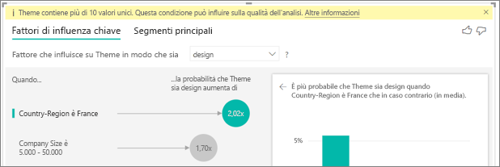

# Oggetto visivo Fattori di influenza chiave
L'oggetto visivo Fattori di influenza chiave favorisce la comprensione dei fattori alla base di una metrica alla quale si è interessati. Analizza i dati, stila una classifica dei fattori importanti e li visualizza come fattori di influenza chiave. Si supponga ad esempio di essere interessati ai motivi che influiscono sull'abbandono dei dipendenti dell'azienda. Un fattore potrebbe essere la durata del contratto, un altro potrebbe essere l'età del dipendente. 
 
## Quando usare i fattori di influenza chiave? 
L'oggetto visivo Fattori di influenza chiave è ideale: 
- Per vedere quali fattori influiscono sulla metrica che si sta analizzando.

- Per confrontare l'importanza relativa di questi fattori. Ad esempio, i contratti a breve termine hanno un'influenza maggiore sull'abbandono dei dipendenti rispetto ai contratti a lungo termine? 

## Requisiti per i fattori di influenza chiave 
La metrica che si analizza deve essere un campo categorico.    

## Funzionalità dell'oggetto visivo Fattori di influenza chiave

    

1. ***Schede*** - Selezionare una scheda per passare da una visualizzazione all'altra. La scheda Fattori di influenza chiave visualizza gli elementi che contribuiscono maggiormente al valore della metrica selezionata. La scheda Segmenti principali visualizza i segmenti che contribuiscono maggiormente al valore della metrica selezionata. Un *segmento* è costituito da una combinazione di valori.  Ad esempio un segmento potrebbe rappresentare i consumatori che sono clienti da almeno vent'anni e vivono nell'area occidentale. 

2. ***Menu a discesa*** - Valore della metrica analizzata. In questo esempio si osserva la metrica **rating** (valutazione) e il valore selezionato è **low** (bassa).    

3. ***Riformulazione*** - Favorisce l'interpretazione dell'elemento visivo nel riquadro sinistro. 

4. ***Riquadro sinistro*** - Il riquadro sinistro contiene un oggetto visivo.  In questo caso il riquadro sinistro visualizza un elenco dei fattori di influenza chiave principali.

5. ***Riformulazione*** - Favorisce l'interpretazione dell'elemento visivo nel riquadro destro.

6. ***Riquadro destro*** - Il riquadro destro contiene un oggetto visivo. In questo caso il grafico a colonne visualizza tutti i valori del **fattore di influenza chiave** **Theme** (Tema) selezionato nel riquadro sinistro. Il valore specifico **Usability** (Usabilità) nel riquadro sinistro è di colore verde e tutti gli altri valori per **Theme** (Tema) sono di colore nero.

7. ***Linea media*** - La media viene calcolata per tutti gli altri valori possibili di **Theme** (Tema), salvo per **Usability** (Usabilità). Pertanto il calcolo si applica a tutti i valori in nero. Indica la percentuale degli altri **temi** che ha restituito valutazioni basse. In altre parole, quando un cliente dà una valutazione, descrive anche il motivo o **tema** della valutazione. Alcuni esempi di temi sono l'usabilità, la velocità, la sicurezza e così via. Secondo l'oggetto visivo nel riquadro a sinistra, il **tema** **Usability** (Usabilità) è il secondo fattore di influenza chiave in ordine di importanza per una valutazione bassa. Se si calcola la media di tutti gli altri temi e il loro contributo a una valutazione **low** (bassa), si ottiene il risultato visualizzato qui in rosso. Di tutti gli altri temi, solo per l'11,35% i valori sono maggiori rispetto a **usability**. 

8. ***Casella di controllo*** - Visualizza solo i valori che sono fattori di influenza.

## Creare un oggetto visivo Fattori di influenza chiave 
 
Guardare questo video per informazioni sulla creazione di un oggetto visivo Fattori di influenza chiave e quindi seguire la procedura riportata di seguito per creare l'oggetto visivo. 

<iframe width="560" height="315" src="https://www.youtube.com/embed/fDb5zZ3xmxU" frameborder="0" allow="accelerometer; autoplay; encrypted-media; gyroscope; picture-in-picture" allowfullscreen></iframe>

Il product manager vuole determinare i fattori per cui i clienti danno valutazioni negative al servizio cloud dell'azienda.  Per seguire la procedura, aprire il [file con estensione pbix di commenti e suggerimenti degli utenti](https://github.com/Microsoft/powerbi-desktop-samples/blob/master/2019/customerfeedback.pbix) in Power BI Desktop. È anche possibile scaricare il [file di Excel di commenti e suggerimenti dei clienti per il servizio Power BI o Power BI Desktop](https://github.com/Microsoft/powerbi-desktop-samples/blob/master/2019/customerfeedback.xlsx). 

> [!NOTE]
> Il set di dati di commenti e suggerimenti dei clienti è basato sul lavoro [Moro et al., 2014] S. Moro, P. Cortez e P. Rita. A Data-Driven Approach to Predict the Success of Bank Telemarketing (Un approccio basato sui dati per la previsione del successo del telemarketing bancario). Decision Support Systems, Elsevier, 62:22 - 31 giugno 2014 

1. Aprire il report e selezionare l'icona Fattori di influenza chiave.  

    

2. Trascinare la metrica da esaminare nel campo **Analisi**. Il campo **Analisi** supporta solo le variabili categoriche (non continue). Poiché l'obiettivo corrente è determinare i motivi alla base di una valutazione **Low** (Bassa) del servizio da parte dei clienti, selezionare **Customer Table (Tabella cliente)** > **Rating (Valutazione)**.    
3. Quindi trascinare i campi che si ritiene potrebbero influenzare **Rating (Valutazione)** nell'area **Spiega in base a**. È possibile trascinare il numero di campi desiderato. In questo caso si inizia con: 
    - Country-Region (Paese-Regione) 
    - Role in Org (Ruolo nell'organizzazione) 
    - Subscription Type (Tipo di sottoscrizione) 
    - Company size (Dimensione dell'azienda) 
    - Theme     
4. Dato che interessano le valutazioni negative, selezionare **Bassa** nell'elenco a discesa **Fattore che influisce su Valutazione in modo che sia**.  

    

L'analisi viene eseguita a livello di tabella per il campo che si sta analizzando. In questo caso la metrica di interesse è **Rating (Valutazione)**, che viene definita a livello del cliente (ogni cliente ha assegnato un punteggio alto o basso al servizio). Tutti fattori esplicativi devono essere definiti a livello del cliente per abilitarne l'uso nell'oggetto visivo. 

Nell'esempio precedente tutti i fattori esplicativi hanno una relazione uno-a-uno o molti-a-uno con la metrica. Ad esempio a ogni punteggio è associato esattamente un tema (corrispondente al tema principale della recensione del cliente). Analogamente i clienti provengono da un paese specifico e hanno un solo tipo di appartenenza e un solo ruolo all'interno dell'organizzazione. Di conseguenza i fattori esplicativi sono già attributi di un cliente e non richiedono trasformazioni, ovvero l'oggetto visivo può usarli immediatamente. 

Più avanti nell'esercitazione si esamineranno esempi più complessi con relazioni uno-a-molti. In questi casi, prima di poter eseguire l'analisi è necessario aggregare le colonne fino al livello cliente.  

Anche le misure e le aggregazioni usate come fattori esplicativi vengono valutate al livello tabella della metrica **Analisi** e si vedranno alcuni esempi più avanti in questo articolo. 

## Interpretazione dei fattori di influenza chiave categorici 
Ora si prendono in considerazione i fattori di influenza chiave per le valutazioni basse. 

### Singolo fattore principale che influenza la probabilità di una valutazione bassa

L'organizzazione ha tre ruoli: consumatori, amministratori ed editori. Si rileva che l'appartenenza al ruolo consumatore è il fattore principale che contribuisce a una valutazione bassa. 

Più precisamente, i consumatori hanno una probabilità 2,57 volte maggiore di assegnare una valutazione negativa. Nel grafico dei fattori di influenza chiave, **Role in Org is consumer** (Ruolo nell'organizzazione è consumatore) è al primo posto nell'elenco a sinistra. Se si seleziona **Role in Org is consumer** (Ruolo nell'organizzazione è consumatore), Power BI visualizza dettagli aggiuntivi nel riquadro destro, ovvero l'effetto comparativo di ogni **ruolo** sulla probabilità di una valutazione bassa.
  
- Il 14,93% dei consumatori assegna un punteggio basso  
- In media solo il 5,78% di tutti gli altri ruoli assegna un punteggio basso 
- Pertanto i consumatori hanno una probabilità 2,57 volte maggiore di assegnare un punteggio basso rispetto a tutti gli altri ruoli (differenza tra la barra verde e la linea rossa punteggiata) 

### Secondo fattore singolo che influenza la probabilità di una valutazione bassa

L'oggetto visivo Fattori di influenza chiave è in grado di confrontare e includere in una classifica fattori derivanti da variabili diverse.  Il secondo fattore di influenza non ha nulla a che vedere con **Role in Org** (Ruolo nell'organizzazione).  Selezionare il secondo fattore di influenza nell'elenco: **Theme is usability** (Il tema è l'usabilità). 

Qui si nota che il secondo fattore di influenza in ordine di importanza è correlato al tema della valutazione del cliente. I clienti che hanno aggiunto un commento sull'*usabilità* del prodotto avevano una probabilità 2,21 volte più alta di assegnare un punteggio basso rispetto ai clienti che hanno aggiunto un commento su altri temi, quali l'affidabilità, il design o la velocità. 

È possibile vedere tra gli oggetti visivi che la media (linea rossa punteggiata) è cambiata dal 5,78% all'11,34%. La media è dinamica, perché è basata sulla media di tutti gli altri valori. Nel caso del primo fattore di influenza la media escludeva il ruolo del cliente, mentre nel caso del secondo fattore escludeva il tema dell'usabilità. 
 
Se si seleziona la casella nella parte inferiore dell'oggetto visivo, la visualizzazione viene filtrata e include solo i valori influenti (in questo caso i ruoli che determinano un punteggio basso). Pertanto si passa dalla visualizzazione di 12 temi a quella dei soli quattro temi che Power BI ha identificato come fattori che originano valutazioni basse. 

## Interazione con altri oggetti visivi 
 
Ogni volta che un utente fa clic su un filtro, un filtro dei dati o un altro oggetto visivo nell'area di disegno, l'oggetto visivo Fattori di influenza chiave ripete l'analisi sul nuovo gruppo di dati. Ad esempio è possibile trascinare Company Size (Dimensioni dell'azienda) nel report e usarlo come un filtro dei dati. Si vuole vedere se i fattori di influenza chiave per i clienti enterprise (aziende con personale superiore a 50.000 unità) sono diversi da quelli per i clienti comuni.  
 
Se si seleziona **> 50.000** l'analisi viene rieseguita e si noterà che i fattori di influenza sono cambiati. Per i clienti di aziende di grandi dimensioni, il fattore di influenza più importante per le valutazioni basse ha un **tema** associato alla **sicurezza**. Può risultare utile approfondire l'analisi, per vedere se sono presenti funzionalità associate alla sicurezza di cui i grandi clienti non sono soddisfatti. 

## Interpretazione dei fattori di influenza chiave continui 
 
Fin qui l'oggetto visivo è stato usato per esplorare l'effetto dei diversi campi categorici sulle valutazioni basse. È anche possibile fare in modo che "Spiega in base a" includa fattori continui (ad esempio, età, altezza, prezzo). Ora si esamina cosa accade se si include "Tenure" (Permanenza) dalla tabella Customer (Cliente) a "Spiega in base a". Tenure (Permanenza) indica da quanto tempo il cliente usa il servizio. 
 
Si rileva che maggiore è il valore di **Tenure** (Permanenza), maggiore è la probabilità di ricevere una valutazione bassa. Questa tendenza suggerisce che i clienti che usano il servizio da più tempo hanno maggiori probabilità di dare un punteggio negativo. Si tratta di informazioni dettagliate interessanti, che vale la pena approfondire in seguito.  
 
La visualizzazione indica che ogni volta che la permanenza aumenta di 13,44 mesi, anche la probabilità di una valutazione bassa aumenta in media di 1,23 volte. In questo caso 13,44 rappresenta la deviazione standard della permanenza. Pertanto le informazioni dettagliate ricevute analizzano come l'aumento della permanenza con un valore di tempo standard (deviazione standard della permanenza) ha effetto sulla probabilità di ricevere una valutazione bassa. 
 
Il grafico a dispersione sul lato destro definisce la percentuale media di valutazioni basse per ogni valore di permanenza e include una linea di tendenza per evidenziare l'inclinazione.  

## Interpretazione di misure e aggregati come fattori di influenza chiave 
 
Infine gli utenti possono usare le misure e le aggregazioni come fattori esplicativi nel contesto dell'analisi. Ad esempio si vuole vedere l'effetto del numero di ticket di supporto clienti o della durata media di un ticket aperto sulla valutazione ricevuta. 
 
In questo caso si vuole vedere se il numero di ticket di supporto che ha un cliente ha effetto sulla valutazione specificata da quel cliente. Si trascina l'ID ticket di supporto dalla tabella Support Ticket (Ticket di supporto). Dato che un cliente può avere più ticket di supporto, è necessario aggregare l'ID a livello del cliente. Questa aggregazione è importante, perché l'analisi viene eseguita a livello del cliente e pertanto tutti i driver devono essere definiti a quel livello di granularità. 
 
Si vuole esaminare il numero di ID (in modo che a ogni riga cliente sia associato un conteggio del numero di ticket corrispondenti). In questo caso si rileva che man mano che il numero di ticket di supporto aumenta, anche la probabilità che la valutazione sia bassa aumenta di 5,51 volte. L'oggetto visivo sul lato destro visualizza il numero medio di ticket di supporto per diversi valori di Rating (Valutazione) (calcolati a livello del cliente). 

## Interpretazione dei risultati: segmenti principali 
 
Mentre la scheda "Fattori di influenza chiave" consente di valutare ogni singolo fattore, gli utenti possono passare a "Segmenti principali" per visualizzare l'effetto di una combinazione di fattori sulla metrica che stanno analizzando. 
 
Inizialmente Segmenti principali visualizza una panoramica di tutti i segmenti trovati da Power BI. Nell'esempio seguente si noterà che sono stati rilevati sei segmenti. Questi segmenti vengono classificati in base alla percentuale di valutazioni basse incluse nel segmento. Ad esempio nel segmento 1 il 74,3% delle valutazioni dei clienti sono basse.  Più in alto è posizionata la bolla, maggiore è la proporzione di valutazioni basse. Le dimensioni della bolla rappresentano invece il numero di clienti inclusi nel segmento. 

Se si seleziona una bolla si esegue il drill down nei dettagli del segmento corrispondente. Se ad esempio si seleziona il segmento 1, si nota che è costituito da clienti relativamente fedeli (che sono clienti da oltre 29 mesi) e hanno un numero elevato di ticket di supporto (maggiore di 4). Infine non sono editori (pertanto sono consumatori o amministratori).  
 
Il 74,3% dei clienti di questo gruppo ha dato una valutazione bassa. In media i clienti che danno una valutazione bassa sono l'11,7%, per cui questo segmento include una proporzione molto più elevata di valutazioni basse (superiore di 63 punti percentuali alla media). Si noti anche che il segmento 1 contiene circa il 2,2% dei dati, pertanto rappresenta una parte non trascurabile della popolazione. 

## Considerazioni e risoluzione dei problemi 
 
**Quali sono le limitazioni per l'anteprima?** 
 
L'oggetto visivo Fattori di influenza chiave è attualmente in anteprima pubblica e gli utenti devono tenere presenti diverse limitazioni. Le funzionalità attualmente non disponibili includono: 
- Analisi delle metriche corrispondenti ad aggregazioni/misure 
- Uso dell'oggetto visivo in Power BI Embedded
- Uso dell'oggetto visivo nelle app per dispositivi mobili Power BI
- Supporto della sicurezza a livello di riga 
- Supporto di DirectQuery 
- Supporto delle connessioni dinamiche 
 
**Un messaggio di errore indica che non sono stati trovati fattori di influenza/segmenti. Perché?**  

Questo errore si verifica quando sono stati inclusi campi in **Spiega in base a** ma non è stato rilevato nessun fattore di influenza.   
- La metrica che si stava analizzando è stata inclusa sia in "Analisi" che in "Spiega in base a" (è necessario rimuoverla da **Spiega in base a**) 
- I campi esplicativi hanno un numero eccessivo di categorie con poche osservazioni. La visualizzazione ha difficoltà a determinare quali fattori sono fattori di influenza, perché è difficile generalizzare a partire da una base di osservazioni limitata 
- I fattori esplicativi dispongono di una quantità di informazioni sufficiente per formulare generalizzazioni, ma la visualizzazione non ha rilevato nessuna correlazione significativa da elaborare 
 
**Un errore segnala che la metrica analizzata non dispone di una quantità di dati sufficiente per l'esecuzione dell'analisi. Perché?**  

La visualizzazione funziona esaminando i criteri nei dati di un gruppo (ad esempio i clienti che hanno dato valutazioni basse) rispetto ad altri gruppi (ad esempio i clienti che hanno dato valutazioni elevate). Se i dati nel modello hanno un numero di osservazioni molto ridotto, è difficile definire criteri. Se la visualizzazione non dispone di dati sufficienti per trovare fattori di influenza significativi, sono necessari più dati per eseguire l'analisi. È consigliabile avere almeno 100 osservazioni per lo stato selezionato (clienti che abbandonano) e almeno 10 osservazioni per gli stati in uso per il confronto (clienti che non abbandonano).  
 
**Un errore indica che un campo in "Spiega in base a" non è correlato in modo univoco alla tabella contenente la metrica che si sta analizzando. Perché?**  
 
L'analisi viene eseguita a livello di tabella per il campo che si sta analizzando. Se ad esempio si stanno analizzando commenti e suggerimenti dei clienti per il servizio, è possibile che sia presente una tabella che indica se un cliente ha dato una valutazione elevata o bassa. In questo caso, l'analisi viene eseguita a livello della tabella cliente. 

Se è presente di una tabella correlata che ha un livello di definizione più granulare rispetto alla tabella che contiene la metrica di interesse, viene restituito questo errore. Ecco un esempio: 
 
- Si stanno analizzando i motivi per cui i clienti danno valutazioni basse del servizio 
- Si è interessati a visualizzare se il dispositivo in cui il cliente usa il servizio influenza la valutazione 
- Un cliente può usare il servizio in modi diversi   
- Nell'esempio seguente il cliente 10000000 usa sia un browser che un tablet per interagire con il servizio 

Se si prova a usare la colonna del dispositivo come fattore esplicativo, viene visualizzato l'errore seguente: 

Questo avviene perché il dispositivo non è definito al livello del cliente: un cliente può usare il servizio su più dispositivi. Perché la visualizzazione possa definire i criteri, è necessario che il dispositivo diventi un attributo del cliente. In questo caso sono disponibili diverse soluzioni in base alla conoscenza dell'ambiente: 
 
- È possibile modificare il riepilogo dei dispositivi impostandolo ad esempio su Conteggio se si ritiene che il numero di dispositivi possa avere effetto sul punteggio dato da un cliente 
- È possibile trasformare tramite pivot la colonna del dispositivo per vedere se l'uso del servizio in un dispositivo specifico ha effetto sulla valutazione data dal cliente  
 
In questo esempio i dati sono stati trasformati tramite pivot per creare nuove colonne "browser", "mobile" (dispositivo mobile) e "tablet". Ora è possibile usare questi risultati in "Spiega in base a". Si rileva che tutti i dispositivi risultano essere fattori di influenza e che il browser ha l'impatto maggiore sulla valutazione data dai clienti. 

Più precisamente, i clienti che non usano il browser per il servizio hanno probabilità 3,79 volte maggiori di dare una valutazione bassa rispetto ai clienti che usano il browser. Più in basso nell'elenco si noterà che nel caso dei dispositivi mobili è vero il contrario. I clienti che usano l'app per dispositivi mobili hanno più probabilità di dare una valutazione bassa rispetto ai clienti che non usano l'app.  

**Un avviso indica che le misure non sono state incluse nell'analisi effettuata. Perché?** 

L'analisi viene eseguita a livello di tabella per il campo che si sta analizzando. Se si sta analizzando l'abbandono dei clienti, è possibile che si abbia una tabella che indica se un cliente ha abbandonato o meno l'organizzazione. In questo caso, l'analisi viene eseguita a livello della tabella cliente.
 
Per impostazione predefinita, le misure e le aggregazioni vengono analizzate a questo livello di tabella. Se fosse presente una misura per "Spesa mensile media", questa misura verrebbe analizzata a livello della tabella cliente.  

Se la tabella cliente non ha un identificatore univoco, non è possibile valutare la misura e questa viene ignorata nell'analisi. Per evitare questo problema, assicurarsi che la tabella contenente la metrica (in questo caso la tabella cliente) contenga un identificatore univoco (ad esempio ID cliente). È anche molto semplice aggiungere una colonna indice usando Power Query.
 
**Un avviso indica che la metrica analizzata ha più di 10 valori unici e che questo può influire sulla qualità dell'analisi. Perché?**  

La visualizzazione Intelligenza artificiale è ottimizzata per l'analisi delle categorie, ad esempio Churn (Abbandono) è "Yes" o "No", Customer Satisfaction (Indice di soddisfazione dei clienti) è "High" (Alta), "Medium" (Media) o "Low" (Bassa) e così via. All'aumento del numero di categorie da analizzare corrisponde una riduzione del numero di osservazioni per ogni categoria e ciò rende più difficile per la visualizzazione definire criteri per i dati. 

Per ottenere fattori di influenza più rappresentativi è consigliabile raggruppare i valori simili in una singola unità. Se ad esempio si ha una metrica per il prezzo, è probabile che si ottengano risultati ottimali raggruppando i prezzi simili in bucket di tipo "High" (Alto), "Medium" (Medio), "Low" (Basso) anziché usare prezzi singoli. 

**I dati contengono fattori che dovrebbero essere fattori di influenza chiave, ma non lo sono. Perché si verifica questa situazione?**

Nell'esempio seguente i clienti che sono consumatori fanno registrare valutazioni basse (il 14,93% delle valutazioni). È interessante notare che anche il ruolo di amministratore fa registrare una percentuale elevata di valutazioni basse (13,42 %) ma non è considerato un fattore di influenza. 

Il motivo è che per la definizione dei fattori di influenza la visualizzazione prende in considerazione anche il numero di punti dati. Nell'esempio seguente sono presenti oltre 29.000 clienti consumatori, mentre il numero di amministratori è inferiore di 10 volte (circa 2900). Inoltre solo 390 amministratori hanno registrato una valutazione bassa. Pertanto l'oggetto visivo non dispone di dati sufficienti per determinare se le valutazioni del ruolo amministratore sono criteri o se sono solo un rilevamento casuale.  

**Come vengono calcolati i fattori di influenza chiave?**

In background, la visualizzazione Intelligenza artificiale (AI) usa [ML.NET](https://dotnet.microsoft.com/apps/machinelearning-ai/ml-dotnet) per eseguire una regressione logistica per calcolare i fattori di influenza chiave. Una regressione logistica è un modello statistico che confronta diversi gruppi. Se si stavano cercando i fattori all'origine delle valutazioni basse, la regressione logistica esamina la differenza tra i clienti che hanno dato un punteggio basso e quelli che hanno dato un punteggio elevato. Se sono presenti più categorie (punteggio elevato, neutro, basso) si esamina la differenza tra quelle che hanno dato una valutazione bassa e quelle che non hanno dato una valutazione bassa (come si differenziano da quelle che hanno dato una valutazione elevata o una valutazione neutra). 
 
La regressione logistica ricerca criteri nei dati e prova a determinare le differenze tra i clienti che hanno dato una valutazione bassa e quelli che hanno dato una valutazione elevata. Ad esempio può determinare che i clienti con un numero maggiore di ticket di supporto hanno dato una percentuale molto più elevata di valutazioni basse rispetto ai clienti che hanno pochi ticket di supporto o nessun ticket.
 
La regressione logistica prende in considerazione anche il numero di punti dati presenti. Se ad esempio i clienti con ruolo di amministratore assegnano una proporzione maggiore di valutazioni negative, ma il numero di amministratori è limitato, questo fattore non viene considerato importante. Il motivo è che i punti dati presenti non sono sufficienti per definire criteri. Per determinare se un fattore può essere considerato come fattore di influenza, viene usato un test statistico (test di Wald). L'oggetto visivo usa un valore p pari a 0,05 per determinare la soglia. 

**Come vengono calcolati i segmenti?**

In background, la visualizzazione Intelligenza artificiale (AI) usa [ML.NET](https://dotnet.microsoft.com/apps/machinelearning-ai/ml-dotnet) per eseguire un albero delle decisioni per rilevare i sottogruppi di interesse. Lo scopo dell'albero delle decisioni è definire un sottogruppo di punti dati con un valore relativamente alto per la metrica di interesse (ad esempio i clienti che ha dato una valutazione bassa). 

L'albero delle decisioni considera i singoli fattori esplicativi e determina quale fattore offre la migliore suddivisione. Se ad esempio si filtrano i dati in modo da includere solo i clienti di aziende di grandi dimensioni, i clienti che hanno dato una valutazione elevata verranno separati da quelli che hanno dato una valutazione bassa? O forse è preferibile filtrare i dati per includere solo i clienti che hanno formulato commenti sulla sicurezza? 

Quando l'albero delle decisioni esegue una divisione, accetta il sottogruppo di dati (ad esempio i clienti che hanno aggiunto un commento sulla sicurezza) e prova a definire la suddivisione successiva più opportuna solo a partire da quei dati. Dopo ogni divisione, l'albero delle decisioni determina anche se il numero di punti dati è sufficiente a rendere il gruppo rappresentativo per la deduzione di criteri o se può essere solo un'anomalia dei dati e pertanto non rappresenta un segmento reale. Viene applicato anche un altro test statistico per verificare la rilevanza statistica della condizione di divisione, con un valore p pari a 0,05. 

Al termine dell'esecuzione, l'albero delle decisioni riunisce tutte le divisioni (commenti sulla sicurezza, azienda di grandi dimensioni) e crea filtri di Power BI. Questa combinazione di filtri viene integrata in un segmento dell'oggetto visivo. 
 
**Perché alcuni fattori diventano fattori di influenza o smettono di esserlo man mano che si trascinano altri campi in "Spiega in base a"?**

La visualizzazione valuta tutti i fattori esplicativi insieme. Ciò significa che di per sé un fattore potrebbe essere un fattore di influenza, ma se viene preso in considerazione con altri fattori potrebbe smettere di esserlo. Si supponga di analizzare le cause per cui il prezzo di una casa è elevato, con il numero di camere da letto e la metratura della casa come fattori esplicativi: 
- Di per sé il numero di camere da letto può essere un fattore di origine per i prezzi elevati 
- Se si include nell'analisi la metratura della casa, si passa a considerare le camere in relazione a una metratura costante 
- Se ad esempio la metratura della casa è pari a circa 140 metri quadri, è poco probabile che a un aumento del numero di camere da letto corrisponda un aumento notevole del prezzo della casa. Il numero di camere da letto non è più un fattore così importante come lo era prima che venisse inclusa la metratura della casa. 

## Passaggi successivi
[Grafici combinati in Power BI](power-bi-visualization-combo-chart.md)

[Tipi di visualizzazione in Power BI](power-bi-visualization-types-for-reports-and-q-and-a.md)
