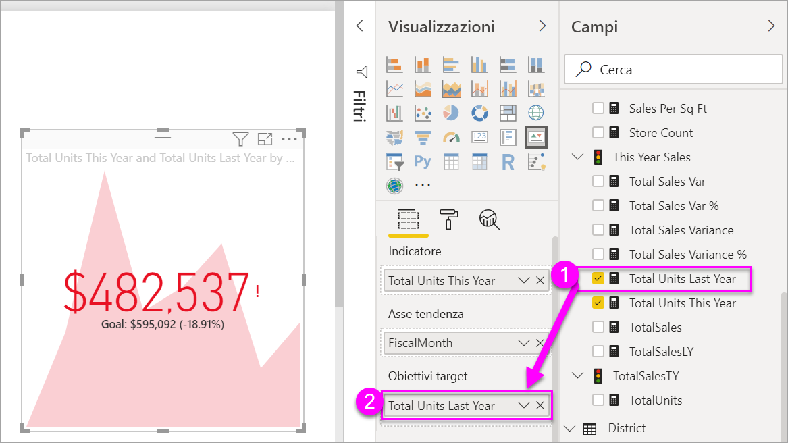

# Oggetti visivi indicatore di prestazioni chiave (KPI)

Un indicatore di prestazioni chiave (KPI) è un segnale visivo che comunica lo stato di avanzamento verso un obiettivo misurabile. Per altre informazioni sugli indicatori KPI, vedere [Indicatori di prestazioni chiave (KPI) in PowerPivot](/previous-versions/sql/sql-server-2012/hh272050(v=sql.110)).

Il video seguente mostra come creare singoli oggetti visivi di metrica: misuratori, schede e indicatori KPI.

<iframe width="560" height="315" src="https://www.youtube.com/embed/xmja6EpqaO0?list=PL1N57mwBHtN0JFoKSR0n-tBkUJHeMP2cP" frameborder="0" allowfullscreen></iframe>

## Quando usare un indicatore KPI

Gli indicatori KPI rappresentano un'ottima scelta nelle seguenti situazioni:

* Per misurare lo stato di avanzamento. Risponde alla domanda "per cosa sono avanti o indietro?"

* Per misurare la distanza da un obiettivo. Risponde alla domanda "quanto sono avanti o indietro?"

## Requisiti degli indicatori di prestazioni chiave

I progettisti basano gli oggetti visivi per gli indicatori KPI su una misura specifica. Lo scopo dell'indicatore KPI è agevolare la valutazione del valore e dello stato corrente di una metrica rispetto a un valore di destinazione definito. Un oggetto visivo indicatore KPI richiede una misura *di base* che restituisca un valore e una misura o un valore di *destinazione*, nonché una *soglia* o un *obiettivo*.

I set di dati degli indicatori KPI devono contenere valori obiettivo per gli indicatori KPI. Se il set di dati non contiene i valori obiettivo, è possibile crearli aggiungendo un foglio di Excel con obiettivi al modello di dati o al file PBIX.

## Prerequisiti

Se non si è ancora iscritti a Power BI, [iscriversi per ottenere una versione di prova gratuita](https://app.powerbi.com/signupredirect?pbi_source=web) prima di iniziare.

* [Power BI Desktop](https://powerbi.microsoft.com/get-started/) è gratuito.

* [File PBIX di Retail Analysis Sample](http://download.microsoft.com/download/9/6/D/96DDC2FF-2568-491D-AAFA-AFDD6F763AE3/Retail%20Analysis%20Sample%20PBIX.pbix)

## Come creare un indicatore KPI

Per seguire la procedura, aprire il [file con estensione pbix dell'esempio di analisi delle vendite al dettaglio](http://download.microsoft.com/download/9/6/D/96DDC2FF-2568-491D-AAFA-AFDD6F763AE3/Retail%20Analysis%20Sample%20PBIX.pbix) in Power BI Desktop. Verrà creato un indicatore KPI che misura lo stato di avanzamento verso il raggiungimento di un obiettivo di vendita.

1. Aprire **Retail Analysis Sample** nella visualizzazione report .

1. Seleziona  per aggiungere una nuova pagina.

1. Nel riquadro **Campi** selezionare **Sales > Total Units This Year**.  Questo valore sarà l'indicatore.

1. Aggiungere **Time > FiscalMonth**.  Questo valore rappresenterà la tendenza.

1. Nell'angolo superiore destro dell'oggetto visivo selezionare i puntini di sospensione e verificare che Power BI abbia disposto le colonne in ordine crescente per **FiscalMonth**.

    > [!IMPORTANT]
    > Dopo la conversione della visualizzazione in un indicatore KPI, **non** sono disponibili opzioni di ordinamento. È necessario applicare ora l'ordinamento corretto.

    

    Dopo aver applicato l'ordine corretto, l'oggetto visivo avrà un aspetto simile al seguente:

    

1. Convertire l'oggetto visivo in un indicatore KPI selezionando l'icona dell'indicatore **KPI** nel riquadro **Visualizzazioni**.

    

1. Per aggiungere un obiettivo, trascinare **Total Units Last Year** nel campo **Obiettivi target**.

    

1. È facoltativamente possibile formattare l'indicatore KPI selezionando l'icona del rullo per aprire il riquadro formattazione.

    * **Indicatore**: controlla l'unità di visualizzazione dell'indicatore e i decimali.

    * **Asse tendenza**: se impostato su **Attiva**, l'oggetto visivo mostra l'asse della tendenza come sfondo dell'oggetto visivo indicatore KPI.  

    * **Obiettivi**: se impostato su **Attiva**, l'oggetto visivo mostra l'obiettivo e la distanza dall'obiettivo in percentuale.

    * **Codifica a colori > Direzione**: alcuni indicatori KPI sono considerati migliori per i valori *più alti*, altri sono considerati migliori per i valori *più bassi*. Ad esempio, gli utili piuttosto che i tempi di attesa. In genere un valore di utili più elevato è migliore rispetto a un valore maggiore del tempo di attesa. Selezionare **Massimo è corretto** e modificare facoltativamente le impostazioni dei colori.

Gli indicatori KPI sono disponibili anche nel servizio Power BI e nei dispositivi mobili. Offrono la possibilità di essere sempre aggiornati sulle prestazioni dell'azienda.

## Considerazioni e risoluzione dei problemi

Se l'indicatore KPI non è simile al precedente, è possibile che non sia stato applicato l'ordinamento in base a **FiscalMonth**. Gli indicatori KPI non hanno un'opzione di ordinamento. È necessario ricominciare e impostare l'ordinamento in base a **FiscalMonth** *prima* di convertire la visualizzazione in un indicatore KPI.

## Passaggi successivi

* [Suggerimenti e consigli per le visualizzazioni mappa di Power BI](power-bi-map-tips-and-tricks.md)

* [Tipi di visualizzazione in Power BI](power-bi-visualization-types-for-reports-and-q-and-a.md)

Altre domande? [Provare la community di Power BI](http://community.powerbi.com/)
