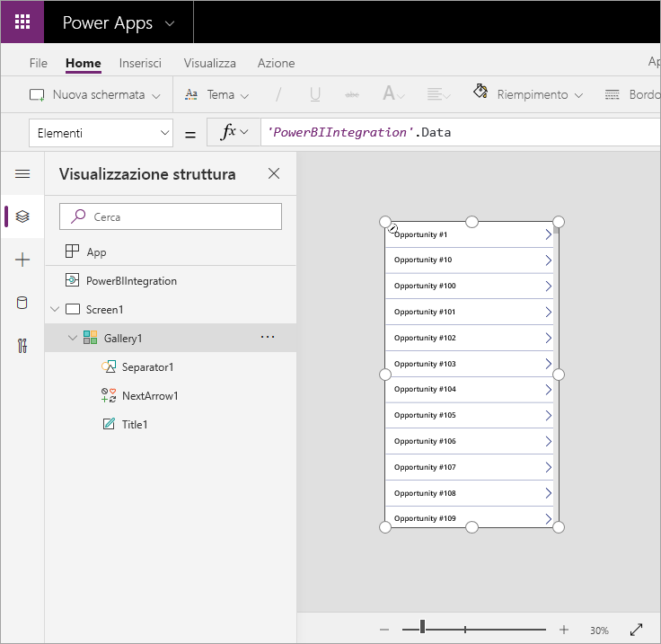

# Esercitazione: Incorporare un oggetto visivo di Power Apps in un report di Power BI

Questa esercitazione usa l'oggetto visivo di Power Apps per creare una nuova app incorporata in un report di esempio di Power BI. Questa app interagisce con altri oggetti visivi presenti nel report.

Se non si ha una sottoscrizione a Power Apps, [creare un account gratuito](https://web.powerapps.com/signup?redirect=marketing&email=) prima di iniziare.

In questa esercitazione viene illustrato come:
> [!div class="checklist"]
> * Aggiungere un oggetto visivo di Power Apps a un report di Power BI
> * Usare Power Apps per creare una nuova app che usa i dati del report di Power BI
> * Visualizzare e interagire con l'oggetto visivo di Power Apps nel report

## Prerequisiti

* Browser [Google Chrome](https://www.google.com/chrome/browser/) o [Microsoft Edge](https://www.microsoft.com/windows/microsoft-edge)
* Una [sottoscrizione di Power BI](https://docs.microsoft.com/power-bi/service-self-service-signup-for-power-bi) con l'[Esempio di analisi delle opportunità](https://docs.microsoft.com/power-bi/sample-opportunity-analysis#get-the-content-pack-for-this-sample) installato
* Conoscenza di come [creare app in Power Apps](https://docs.microsoft.com/powerapps/maker/canvas-apps/data-platform-create-app-scratch) e come [modificare i report di Power BI](https://docs.microsoft.com/power-bi/service-the-report-editor-take-a-tour)

## Creare una nuova app
Quando si aggiunge l'oggetto visivo di Power Apps al report, viene avviato Power Apps Studio con una connessione dati dinamica tra Power Apps e Power BI.

1. Aprire il report Opportunity Analysis Sample e selezionare la pagina *Upcoming Opportunities*. 

2. Spostare e ridimensionare alcuni dei riquadri del report per ottenere spazio per il nuovo oggetto visivo.

    

2. Dal riquadro Visualizzazioni selezionare l'icona Power Apps, quindi ridimensionare l'oggetto visivo per adattarlo allo spazio creato.

    

3. Nel riquadro **Campi** selezionare **Nome**, **Product Code** (Codice prodotto) e **Sales Stage** (Fase vendite). 

    

4. Nell'oggetto visivo di Power Apps selezionare l'ambiente di Power Apps in cui si vuole creare l'app, quindi selezionare **Crea nuovo**.

    

    In Power Apps Studio si può osservare che viene creata un'app di base con una *raccolta* che visualizza uno dei campi selezionati in Power BI.

    

5.  Ridimensionare la raccolta in modo che occupi solo la metà della schermata. 

6. Nel riquadro sinistro selezionare **Screen1**, quindi impostare la proprietà **Riempimento** su "Blu chiaro", per una migliore visualizzazione nel report.

    

6. Creare spazio per un controllo etichetta. 

    

8. Nella **raccolta** inserire un controllo etichetta di testo.

   

7. Trascinare l'etichetta nella parte inferiore dell'oggetto visivo. Impostare la proprietà **Text** su `"Opportunity Count: " & CountRows(Gallery1.AllItems)`. Viene ora visualizzato il numero totale di opportunità nel set di dati.

    

    

7. Salvare l'app con il nome "Opportunities app". 

    

## Visualizzare l'app nel report
L'app è ora disponibile nel report di Power BI e interagisce con altri oggetti visivi perché condivide la stessa origine dati.

Nel report di Power BI selezionare **Gen** nel filtro dei dati, che consente di applicare il filtro all'intero report compresi i dati nell'app.

Si noti che il numero di opportunità nell'app corrisponde al conteggio in alto a sinistra del report. È possibile selezionare altri elementi nel report e i dati nell'app vengono aggiornati di conseguenza.

## Pulire le risorse
Se non si vuole più usare l'esempio di analisi delle opportunità, è possibile eliminare il dashboard, il report e il set di dati.

## Passaggi successivi
[Oggetto visivo Domande e risposte](power-bi-visualization-types-for-reports-and-q-and-a.md)