# Introduzione agli oggetti visivi Domande e risposte di Power BI

[!INCLUDE [power-bi-service-new-look-include](../includes/power-bi-service-new-look-include.md)]

## Che cosa sono gli oggetti visivi Domande e risposte?

L'oggetto visivo Domande e risposte consente agli utenti di porre domande in linguaggio naturale e ottenere risposte sotto forma di oggetti visivi. 

[!INCLUDE [power-bi-visuals-desktop-banner](../includes/power-bi-visuals-desktop-banner.md)]

L'oggetto visivo Domande e risposte può essere usato come strumento per gli *utenti* per ottenere rapidamente risposte ai dati in uso e per i *progettisti* per creare oggetti visivi nei report facendo semplicemente doppio clic in un punto qualsiasi di un report e usando il linguaggio naturale per iniziare. Dal momento che si comporta come qualsiasi altro oggetto visivo, a Domande e risposte può essere applicato il filtro incrociato o l'evidenziazione incrociata, oltre a essere supportati anche i segnalibri. L'oggetto visivo Domande e risposte supporta anche i temi e le altre opzioni di formattazione predefinite disponibili in Power BI.

L'oggetto visivo Domande e risposte è costituito da quattro componenti principali:

- Casella della domanda, dove gli utenti digitano le loro domande e dove compaiono suggerimenti per aiutarli a completarle.
- Elenco prepopolato di domande suggerite.
- Icona per convertire l'oggetto visivo Domande e risposte in un oggetto visivo standard. 
- Icona per aprire gli strumenti di Domande e risposte che consentono ai progettisti di configurare il motore del linguaggio naturale sottostante.

## Prerequisiti

1. Questa esercitazione usa il [file Sales & Marketing Sample PBIX](https://download.microsoft.com/download/9/7/6/9767913A-29DB-40CF-8944-9AC2BC940C53/Sales%20and%20Marketing%20Sample%20PBIX.pbix). 

1. Nella sezione in alto a sinistra della barra dei menu di Power BI Desktop selezionare **File** > **Apri**.
   
2. Trovare la copia del **file Sales & Marketing Sample PBIX**.

1. Aprire il file nella visualizzazione Report. .

1. Selezione  per aggiungere una nuova pagina.

Se viene visualizzato un errore durante la creazione di un oggetto visivo Domande e risposte, assicurarsi di consultare la sezione delle [limitazioni](../natural-language/q-and-a-limitations.md) per verificare se la configurazione dell'origine dati è supportata.

## Creare un oggetto visivo Domande e risposte usando una domanda suggerita
In questo esercizio verrà selezionata una delle domande suggerite per creare l'oggetto visivo Domande e risposte. 

1. Partire da una pagina di report vuota e selezionare l'icona dell'oggetto visivo Domande e risposte dal riquadro Visualizzazioni.

    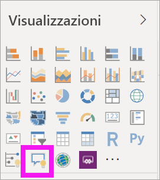

2. Trascinare il bordo per ridimensionare l'oggetto visivo.

    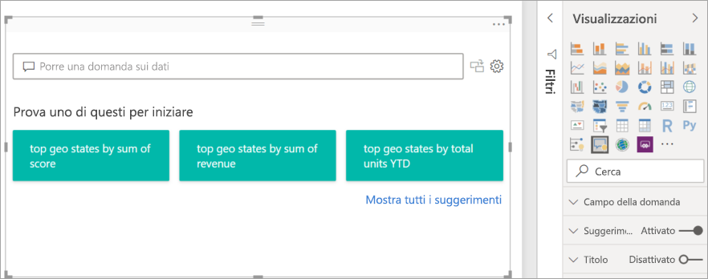

3. Per creare l'oggetto visivo, selezionare una delle domande suggerite o iniziare a digitare nella casella della domanda. In questo esempio è stato selezionato il suggerimento relativo agli **stati principali per somma dei ricavi**. Power BI seleziona automaticamente il tipo di oggetto visivo migliore da usare. In questo caso viene selezionata una mappa.

    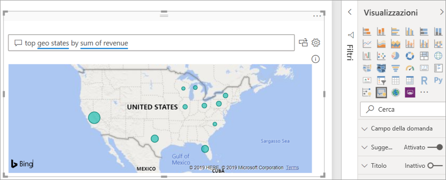

    È anche possibile indicare a Power BI il tipo di oggetto visivo da usare aggiungendolo alla query in linguaggio naturale. Tenere presente che non tutti i tipi di oggetti visivi funzioneranno o avranno senso con i dati in uso. Questi dati, ad esempio, non producono un grafico a dispersione particolarmente utile, ma risultano più significativi sotto forma di mappa colorata.

    

## Creare un oggetto visivo Domande e risposte usando una query in linguaggio naturale
Nell'esempio precedente è stata selezionata una delle domande suggerite per creare l'oggetto visivo Domande e risposte.  In questo esercizio verrà digitata una domanda personalizzata. Quando si digita una domanda, Power BI supporta l'utente con funzionalità di completamento automatico, suggerimenti e feedback.

Se non si è certi del tipo di domande da porre o della terminologia da usare, espandere **Mostra tutti i suggerimenti** o esaminare il riquadro Campi sul lato destro dell'area di disegno. In questo modo si acquisirà familiarità con i termini e il contenuto del set di dati di Sales & Marketing.

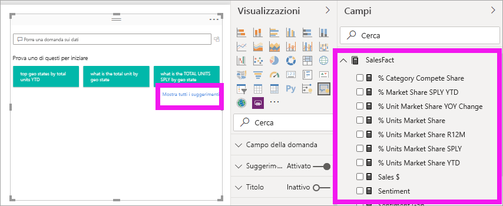

1. Digitare una domanda nel campo Domande e risposte. Power BI aggiunge una sottolineatura rossa alle parole che non riconosce. Quando possibile, Power BI aiuta a definire le parole non riconosciute.  Nel primo esempio riportato di seguito è appropriato selezionare uno dei due suggerimenti proposti.  

    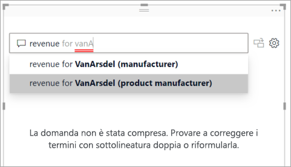

2. Mentre si va avanti a digitare, Power BI informa l'utente che non è in grado di comprendere la domanda e tenta di aiutarlo. Nell'esempio riportato di seguito Power BI chiede "Si intendeva..." e suggerisce un modo diverso per formulare una domanda usando la terminologia del set di dati. 

    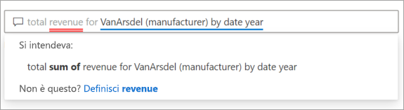

5. Con il supporto di Power BI, è stato possibile porre una domanda con tutti i termini riconoscibili. Power BI visualizza i risultati sotto forma di grafico a linee. 

    

6. L'oggetto visivo verrà ora modificato in un istogramma. 

    

7.  Aggiungere altri oggetti visivi alla pagina del report e vedere in che modo l'oggetto visivo Domande e risposte interagisce con gli altri oggetti visivi nella pagina. In questo esempio, l'oggetto visivo Domande e risposte ha applicato un filtro incrociato al grafico a linee e alla mappa e l'evidenziazione incrociata al grafico a barre.

    

## Formattare e personalizzare l'oggetto visivo Domande e risposte
L'oggetto visivo Domande e risposte può essere personalizzato usando il riquadro di formattazione e applicando un tema. 

### Applicare un tema
Quando si seleziona un tema, quest'ultimo viene applicato all'intera pagina del report. Ci sono molti temi tra cui scegliere, quindi è consigliabile provarli tutti fino a ottenere l'aspetto desiderato. 

1. Nella barra dei menu selezionare la scheda **Home** e scegliere **Cambia tema**. 

    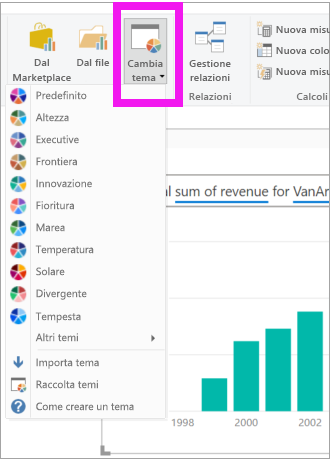

    
    
2. In questo esempio è stata selezionata l'opzione **Altri temi** > **Adatto ai daltonici**.

    

### Formattare l'oggetto visivo Domande e risposte
Formattare l'oggetto visivo Domande e risposte, il campo della domanda e il modo in cui vengono visualizzati i suggerimenti. È possibile modificare qualsiasi elemento, dallo sfondo di un titolo al colore del passaggio del mouse, per le parole che non vengono riconosciute. In questo esempio è stato aggiunto uno sfondo grigio alla casella della domanda e le sottolineature sono state modificate in giallo e verde. Il titolo è centrato e ha uno sfondo giallo. 

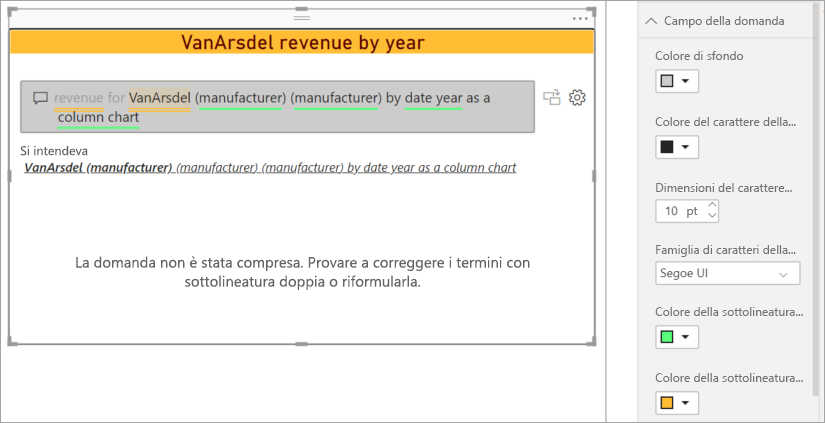

## Convertire l'oggetto visivo Domande e risposte in un oggetto visivo standard
L'oggetto visivo istogramma adatto ai daltonici è stato parzialmente formattato, con l'aggiunta di un titolo e di un bordo. A questo punto è possibile convertirlo in un oggetto visivo standard all'interno del report e aggiungerlo anche a un dashboard.

Selezionare l'icona  per **trasformare questo risultato di Domande e risposte in un oggetto visivo standard**.

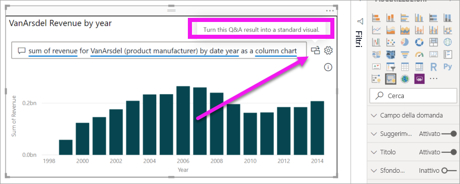

Questo oggetto visivo non è più un oggetto visivo Domande e risposte, ma è un istogramma standard e può essere aggiunto a un dashboard. All'interno del report questo oggetto visivo si comporta come gli altri oggetti visivi standard. Si noti che il riquadro Visualizzazioni mostra un'icona Istogramma selezionata al posto dell'icona dell'oggetto visivo Domande e risposte.

Se si usa il ***servizio Power BI***, è ora possibile aggiungere l'oggetto visivo a un dashboard selezionando l'icona Aggiungi. 

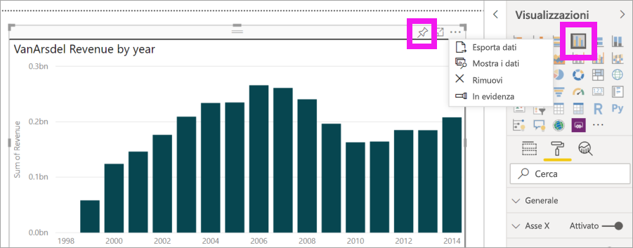

## Funzionalità avanzate dell'oggetto visivo Domande e risposte
Selezionando l'icona a forma di ingranaggio si apre il riquadro Strumenti dell'oggetto visivo Domande e risposte. 

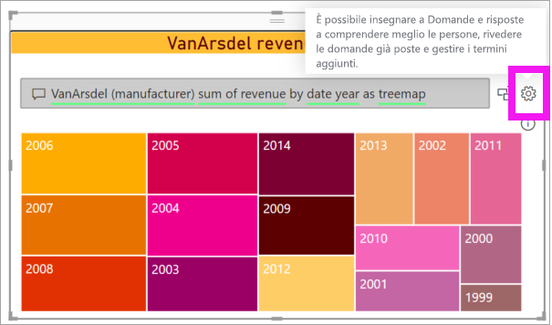

Usare il riquadro Strumenti per insegnare a Domande e risposte i termini che non è in grado di riconoscere, gestire tali termini e gestire le domande suggerite per il set di dati e il report. Nel riquadro Strumenti è inoltre possibile esaminare le domande poste con questo oggetto visivo Domande e risposte e visualizzare le domande contrassegnate dagli utenti. Per altre informazioni, vedere [Introduzione agli strumenti per Domande e risposte](../natural-language/q-and-a-tooling-intro.md).

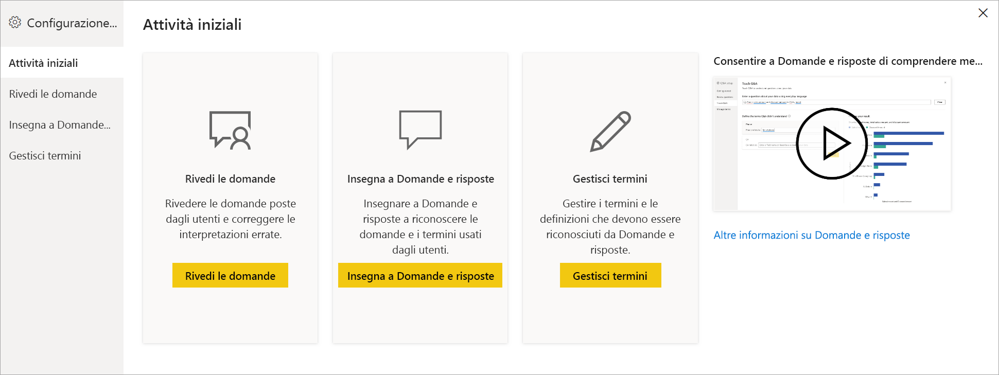

## Considerazioni e risoluzione dei problemi
L'oggetto visivo Domande e risposte si integra con Office e Bing per tentare di trovare una corrispondenza tra le parole comuni non riconosciute e i campi del set di dati.  

## Passaggi successivi

Esistono diversi modi per integrare il linguaggio naturale. Per altre informazioni, vedere gli articoli seguenti:

* [Strumenti di Domande e risposte](../natural-language/q-and-a-tooling-intro.md)
* [Procedure consigliate per Domande e risposte](../natural-language/q-and-a-best-practices.md)
