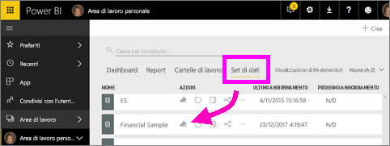
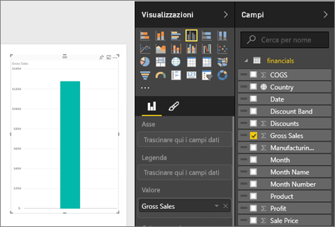
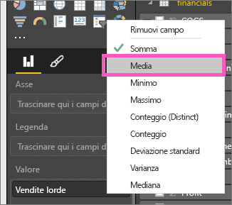
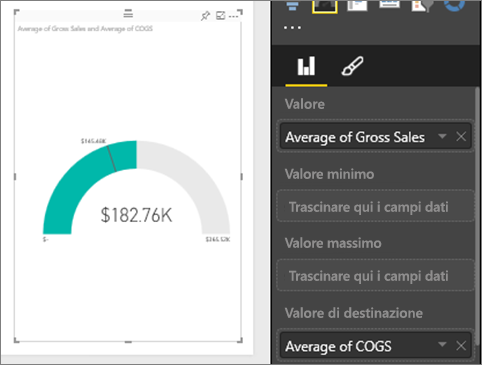
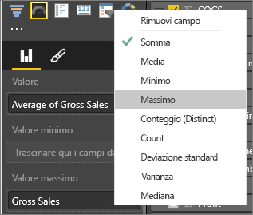
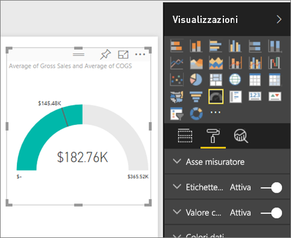
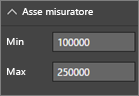
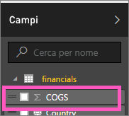
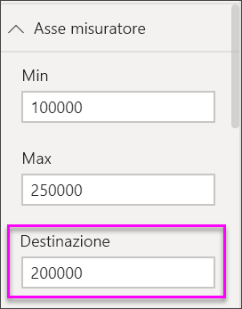

# Grafici a misuratore radiale in Power BI
Un grafico a misuratore radiale è contraddistinto da un arco circolare e consente di visualizzare un unico valore che misura lo stato rispetto al raggiungimento di un obiettivo o a un indicatore KPI.  L'obiettivo, o valore di destinazione, è rappresentato dalla linea (lancetta). Lo stato rispetto al raggiungimento dell'obiettivo è rappresentato dall'ombreggiatura.  Il valore che rappresenta lo stato è visualizzato in grassetto all'interno dell'arco. Tutti i valori possibili sono distribuiti uniformemente lungo l'arco, da quello minimo (all'estrema sinistra) a quello massimo (all'estrema destra).

Nell'esempio seguente un rivenditore di auto vuole tenere traccia delle vendite medie mensili del team vendite. L'obiettivo è 140 ed è rappresentato dalla lancetta nera.  Il valore minimo possibile per le vendite medie è pari a 0, mentre quello massimo è stato impostato su 200.  L'ombreggiatura blu mostra che al momento per il mese corrente la media è pari all'incirca a 120 vendite, ma manca ancora una settimana al raggiungimento dell'obiettivo.

## Quando usare un misuratore radiale
I misuratori radiali sono ideali per:

* mostrare lo stato rispetto al raggiungimento di un obiettivo
* rappresentare una misura percentile, ad esempio un indicatore KPI
* mostrare l'integrità di una singola misura
* visualizzare informazioni facilmente comprensibili e analizzabili

### Prerequisiti
 - Servizio Power BI o Power BI Desktop
 - Cartella di lavoro di Excel di esempio Financial: [scaricare l'esempio direttamente](http://go.microsoft.com/fwlink/?LinkID=521962).

## Creare un misuratore radiale di base
Queste istruzioni usano il servizio Power BI. Per seguire la procedura, accedere a Power BI e aprire il file di Excel relativo all'esempio Financial.  

In alternativa, il video seguente mostra come creare singoli oggetti visivi di metrica: misuratori, schede e indicatori KPI.

<iframe width="560" height="315" src="https://www.youtube.com/embed/xmja6EpqaO0?list=PL1N57mwBHtN0JFoKSR0n-tBkUJHeMP2cP" frameborder="0" allowfullscreen></iframe>

### Passaggio 1: Aprire il file di Excel relativo all'esempio Financial
1. [Scaricare il file di Excel dell'esempio Financial](../sample-financial-download.md), se non è già disponibile. Ricordare il percorso in cui è stato salvato.

2. Per aprire il file nel ***servizio Power BI***, selezionare **Recupera dati \> File**, quindi passare al percorso in cui è stato salvato il file. Selezionare **Importa**. L'esempio Financial viene aggiunto all'area di lavoro come set di dati.

3. Dall'elenco di contenuti **Set di dati** selezionare l'**esempio Financial** per aprirlo in modalità di esplorazione.

    

### Passaggio 2: Creare un misuratore per tenere traccia delle vendite lorde
1. Nel riquadro **Campi** selezionare **Gross Sales**.
   
   
2. Modificare l'aggregazione impostandola su **Media**.
   
   
3. Selezionare l'icona del misuratore  per convertire l'istogramma in un misuratore.
   
   Per impostazione predefinita, Power BI crea un grafico a misuratore in cui si presuppone che il valore corrente (in questo caso Average of Gross Sales) sia a metà strada nel misuratore. Dal momento che il valore di Average Gross Sales è pari a 182.760 dollari, il valore iniziale (minimo) è impostato su 0 e quello finale (massimo) sul doppio del valore corrente.
   
   

### Passaggio 3: Impostare un valore target
1. Trascinare **COGS** nell'area **Valore target** .
2. Modificare l'aggregazione impostandola su **Media**.
   Power BI aggiunge una lancetta che rappresenta il valore target pari a **145.480 dollari**. Notare che il valore di destinazione è stato superato.
   
   
   
   > [!NOTE]
   > È anche possibile immettere manualmente un valore target.  Vedere "Utilizzare le opzioni di formattazione per impostare manualmente i valori minimo, massimo e target" di seguito.
   > 
   > 

### Passaggio 4: Aggiungere un valore massimo
Nel passaggio 2, Power BI usa il campo Valore per impostare automaticamente i valori minimo (inizio) e massimo (fine).  A questo punto è possibile vedere cosa succede impostando il valore massimo.  Supponiamo che invece di usare un valore doppio a quello corrente come valore massimo possibile, si voglia impostarlo sul valore massimo di Gross Sales nel set di dati. 

1. Trascinare **Gross Sales** dall'elenco **Campi** nell'area **Valore massimo** .
2. Modificare l'aggregazione impostandola su **Max**.
   
   
   
   Il misuratore viene ridisegnato con un nuovo valore finale, pari a 1,21 milioni di vendite lorde.
   
   

### Passaggio 5: Salvare il report
1. [Salvare il report](../service-report-save.md).
2. [Aggiungere il grafico a misuratore come riquadro del dashboard](../service-dashboard-pin-tile-from-report.md). 

## Utilizzare le opzioni di formattazione per impostare manualmente i valori minimo, massimo e target
1. Rimuovere **Max of Gross Sales** dall’area **Maximum value** .
2. Aprire il riquadro formattazione selezionando l'icona del rullo.
   
   
3. Espandere l’ **asse del misuratore** e immettere i valori per **Min** e **Max**.
   
    
4. Rimuovere il valore target corrente rimuovendo il segno di spunta accanto a **COGS**.
   
    
5. Quando il campo **Target** viene visualizzato sotto **Asse del misuratore**, immettere un valore.
   
    
6. Facoltativamente, continuare la formattazione del grafico del misuratore.

## Passaggio successivo

[Grafici a misuratore radiale in Power BI](power-bi-visualization-kpi.md)

[Tipi di visualizzazione in Power BI](power-bi-visualization-types-for-reports-and-q-and-a.md)
