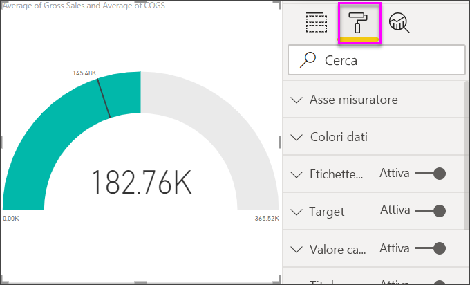
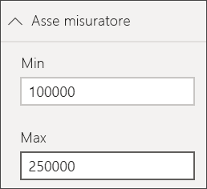

# Grafici a misuratore radiale in Power BI

Un grafico a misuratore radiale è contraddistinto da un arco circolare e mostra un unico valore che misura lo stato rispetto al raggiungimento di un obiettivo o a un indicatore di prestazioni chiave (KPI). La linea (o *lancetta*) rappresenta il valore dell'obiettivo o di destinazione. L'ombreggiatura rappresenta lo stato di avanzamento rispetto al raggiungimento di tale obiettivo. Il valore all'interno dell'arco rappresenta il valore dello stato di avanzamento. Power BI distribuisce uniformemente tutti i valori possibili lungo l'arco, da quello minimo (all'estrema sinistra) a quello massimo (all'estrema destra).

In questo esempio un rivenditore di auto vuole tenere traccia delle vendite medie mensili del team di vendita. La lancetta rappresenta un obiettivo di vendita di 140 auto. Il valore minimo possibile per le vendite medie è pari a 0, mentre quello massimo è 200.  L'ombreggiatura blu mostra che per il mese corrente la media del team è pari all'incirca a 120 vendite, ma manca ancora una settimana per raggiungere l'obiettivo.

Il video seguente mostra come creare singoli oggetti visivi di metrica: misuratori, schede e indicatori KPI.

<iframe width="560" height="315" src="https://www.youtube.com/embed/xmja6EpqaO0?list=PL1N57mwBHtN0JFoKSR0n-tBkUJHeMP2cP" frameborder="0" allowfullscreen></iframe>

## Quando usare un misuratore radiale

I misuratori radiali sono ideali per:

* Mostrare lo stato rispetto al raggiungimento di un obiettivo.

* Rappresentare una misura percentile, ad esempio un indicatore KPI.

* Mostrare l'integrità di una singola misura.

* Visualizzare informazioni che possono essere esaminate e comprese rapidamente.

## Prerequisiti

* Servizio Power BI o Power BI Desktop

* Cartella di lavoro di Excel di esempio Financial: [scaricare l'esempio direttamente](http://go.microsoft.com/fwlink/?LinkID=521962).

## Creare un misuratore radiale di base

Queste istruzioni usano il servizio Power BI. Per seguire la procedura, accedere a Power BI e aprire il file di Excel relativo all'esempio Financial.

### Passaggio 1: Aprire il file di Excel relativo all'esempio Financial

1. Se non è già disponibile, scaricare il [file di Excel Financial Sample](../sample-financial-download.md). Ricordare il percorso in cui viene salvato.

1. All'interno del servizio Power BI, selezionare **Recupera dati** > **File**.

1. Selezionare **File locale** e passare al percorso del file di esempio.

1. Selezionare **Importa**. Power BI aggiunge Financial Sample all'area di lavoro personale come set di dati.

1. Nell'elenco di contenuto **Set di dati** selezionare l'icona **Crea report** per  **Financial Sample**.

    

### Passaggio 2: Creare un misuratore per tenere traccia delle vendite lorde

Quando è stata selezionata l'icona **Crea report** nella sezione precedente, Power BI ha creato un report vuoto nella visualizzazione di modifica.

1. Nel riquadro **Campi** selezionare **Gross Sales**.

   

1. Modificare l'aggregazione impostandola su **Media**.

   

1. Selezionare l'icona del misuratore  per convertire l'istogramma in un grafico a misuratore.

    

    A seconda di quando si scarica il file **Financial Sample**, è possibile che i numerosi visualizzati non corrispondano a quelli in questo articolo.

    > [!TIP]
    > Per impostazione predefinita, Power BI crea un grafico a misuratore in cui si presuppone che il valore corrente (in questo caso **Average of Gross Sales**) sia a metà strada nel misuratore. Dal momento che il valore di **Average Gross Sales** è pari a 182.760 dollari, il valore iniziale (minimo) è impostato su 0 e quello finale (massimo) sul doppio del valore corrente.

### Passaggio 3: Impostare un valore di destinazione

1. Trascinare **COGS** dal riquadro **Campi** all'area **Valore di destinazione**.

1. Modificare l'aggregazione impostandola su **Media**.

   Power BI aggiunge una lancetta che rappresenta il valore target pari a **145.480 dollari**.

   

    Notare che il valore di destinazione è stato superato.

   > [!NOTE]
   > È anche possibile immettere manualmente un valore target. Vedere la sezione [Usare le opzioni di formattazione manuale per impostare i valori minimo, massimo e di destinazione](#use-manual-format-options-to-set-minimum-maximum-and-target-values).

### Passaggio 4: Impostare un valore massimo

Nel passaggio 2 Power BI ha usato il campo **Valore** per impostare automaticamente i valori minimo e massimo. Potrebbe però essere necessario, ad esempio, impostare un valore massimo personalizzato. Si supponga che invece di usare un valore doppio di quello corrente come valore massimo possibile, si voglia impostarlo sul valore massimo di Gross Sales nel set di dati.

1. Trascinare **Gross Sales** dal riquadro **Campi** nell'area **Valore massimo**.

1. Modificare l'aggregazione impostandola su **Max**.

   

   Il misuratore viene ridisegnato con un nuovo valore finale, pari a 1,21 milioni di vendite lorde.

   

### Passaggio 5: Salva il report

1. [Salvare il report](../service-report-save.md).

1. [Aggiungere il grafico a misuratore come riquadro del dashboard](../service-dashboard-pin-tile-from-report.md). 

## Usare le opzioni di formattazione manuale per impostare i valori minimo, massimo e di destinazione

1. Rimuovere **Max of Gross Sales** dall’area **Maximum value** .

1. Selezionare l'icona del rullo per aprire il riquadro **Formato**.

   

1. Espandere **Asse misuratore** e immettere i valori per **Minimo** e **Massimo**.

    

1. Deselezionare l'opzione **COGS** nel riquadro **Campi** per rimuovere il valore di destinazione.

    

1. Quando il campo **Target** viene visualizzato sotto **Asse del misuratore**, immettere un valore.

     

1. Facoltativamente, continuare la formattazione del grafico del misuratore.

Dopo aver completato questi passaggi si otterrà un grafico a misuratore simile al seguente:

## Passaggio successivo

* [Oggetti visivi indicatore di prestazioni chiave (KPI)](power-bi-visualization-kpi.md)

* [Tipi di visualizzazione in Power BI](power-bi-visualization-types-for-reports-and-q-and-a.md)

Altre domande? [Provare la community di Power BI](http://community.powerbi.com/)