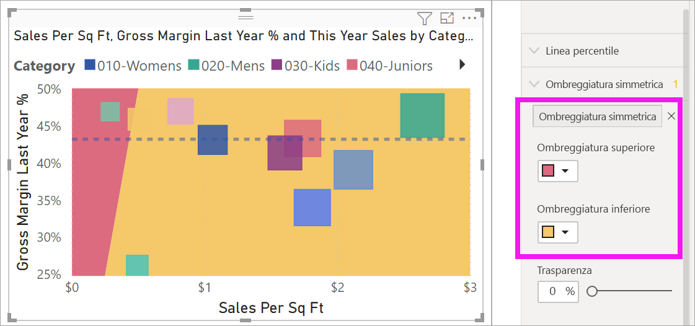

# Grafici a dispersione, grafici a bolle e tracciati a punti in Power BI

[!INCLUDE [power-bi-visuals-desktop-banner](../includes/power-bi-visuals-desktop-banner.md)]

Un grafico a dispersione ha sempre due assi di valori per mostrare un set di dati numerici lungo un asse orizzontale e un altro set di valori numerici lungo un asse verticale. Nel grafico vengono visualizzati i punti in corrispondenza dell'intersezione di un valore numerico x e un valore numerico y, combinando questi valori in punti dati singoli. Power BI può distribuire questi punti dati uniformemente o in maniera non uniforme sull'asse orizzontale, a seconda dei dati rappresentati nel grafico.

Guardare questo video per seguire la creazione del grafico a dispersione e quindi seguire la procedura riportata più avanti per crearne uno.
   > [!NOTE]
   > Questo video usa una versione precedente di Power BI Desktop.
   > 
   > 
<iframe width="560" height="315" src="https://www.youtube.com/embed/PVcfPoVE3Ys?list=PL1N57mwBHtN0JFoKSR0n-tBkUJHeMP2cP" frameborder="0" allowfullscreen></iframe>

È possibile impostare il numero di punti dati fino a un massimo di 10.000.  

## Quando usare un grafico a dispersione, un grafico a bolle o un tracciato a punti

### Grafici a dispersione e a bolle

Un grafico a dispersione mostra la relazione tra due valori numerici. Un grafico a bolle sostituisce i punti dati con bolle, con le *dimensioni* della bolla che rappresentano una terza dimensione aggiuntiva dei dati.

I grafici a dispersione rappresentano un'ottima scelta nelle seguenti situazioni:

* Per visualizzare le relazioni tra due valori numerici.

* Per tracciare due gruppi di numeri come un'unica serie di coordinate x e y.

* Al posto di un grafico a linee quando si vuole modificare la scala dell'asse orizzontale.

* Per trasformare l'asse orizzontale in una scala logaritmica.

* Per visualizzare i dati del foglio di lavoro che includono coppie o set raggruppati di valori.

    > [!TIP]
    > In un grafico a dispersione, è possibile regolare le scale indipendenti degli assi per visualizzare ulteriori informazioni sui valori raggruppati.

* Per visualizzare modelli in grandi set di dati, ad esempio tramite la visualizzazione di tendenze lineari o non lineari, cluster e outlier.

* Per confrontare numeri elevati di punti dati indipendentemente dal tempo.  Maggiore è la quantità di dati inclusi in un grafico a dispersione, migliore saranno i confronti che è possibile ottenere.

Oltre alle potenzialità offerte dai grafici a dispersione, i grafici a bolle rappresentano un'ottima scelta nelle situazioni seguenti:

* Se i dati includono tre serie di dati contenenti ciascuna un set di valori.

* Per presentare i dati finanziari.  Dimensioni delle bolle diverse sono utili per evidenziare visivamente valori specifici.

* Per usare i quadranti.

### Tracciati a punti

Un tracciato a punti è simile a un grafico a bolle e a un grafico a dispersione, ma viene usato per tracciare dati categorici lungo l'asse X.

Questi grafici sono un'ottima scelta se si vogliono includere dati categorici lungo l'asse X.

## Prerequisiti

Questa esercitazione usa il [file Retail Analysis Sample PBIX](https://download.microsoft.com/download/9/6/D/96DDC2FF-2568-491D-AAFA-AFDD6F763AE3/Retail%20Analysis%20Sample%20PBIX.pbix).

1. Nella sezione in alto a sinistra della barra dei menu selezionare **File** > **Apri**
   
2. Trovare la copia del **file Retail Analysis Sample PBIX**

1. Aprire il **file Retail Analysis Sample PBIX** nella visualizzazione report .

1. Select  per aggiungere una nuova pagina.

## Creare un grafico a dispersione

1. Iniziare da una pagina di report vuota e selezionare i campi seguenti dal riquadro **Campi**:

    * **Vendite** > **Vendite per piedi quadrati**

    * **Vendite** >  **% di scostamento vendite totali**

    * **Distretto** > **Distretto**

    

1. Nel riquadro **Visualizzazioni** selezionare  per convertire l'istogramma a colonne raggruppate in un grafico a dispersione.

   

1. Trascinare **Zona** da **Dettagli** in **Legenda**.

    Power BI visualizza un grafico a dispersione che rappresenta **Total Sales Variance %** lungo l'asse Y e **Sales Per Square Feet** lungo l'asse X. I colori del punto dati rappresentano le zone:

    

Ora si aggiungerà una terza dimensione.

## Creare un grafico a bolle

1. Dal riquadro **Campi** trascinare **Sales** > **This Year Sales** > **Valore** nell'area **Dimensioni**. I punti dati si espandono in volumi proporzionati al valore delle vendite.

   

1. Passare il mouse su una bolla. La dimensione della bolla riflette il valore delle **Vendite di quest’anno**.

    

1. È possibile impostare il numero di punti dati da mostrare nel grafico a bolle nella sezione **Formato** del riquadro **Visualizzazioni** espandendo **Generale** e modificando **Volume dati**.

    

    È possibile impostare il volume dei dati su un numero massimo di 10.000. All'approssimarsi del numero massimo, è consigliabile eseguire un test per garantire migliori prestazioni.

    > [!NOTE]
    > Più punti dati possono comportare tempi di caricamento più lunghi. Se si sceglie di pubblicare report con limiti ai livelli più elevati della scala, assicurarsi di testare i report anche nel Web e nei dispositivi mobili. È importante verificare che le prestazioni del grafico corrispondano alle aspettative degli utenti.

1. Continuare a formattare i colori della visualizzazione, le etichette, i titoli, lo sfondo e altro ancora. Per [migliorare l'accessibilità](../desktop-accessibility.md), considerare la possibilità di aggiungere forme di marcatore a ogni riga. Per selezionare la forma del marcatore, espandere **Forme**, selezionare **Forma del marcatore** e selezionare una forma.

    

    Cambiare la forma del marcatore in rombo, triangolo o quadrato. L'uso di una forma del marcatore diversa per ogni riga consente agli utenti dei report di distinguere più facilmente le linee dalle aree.

1. Aprire il riquadro Analisi  per aggiungere altre informazioni alla visualizzazione.  
    - Aggiungere una linea mediana. Selezionare **Linea mediana** > **Aggiungi**. Per impostazione predefinita, Power BI aggiunge una linea mediana per *Sales per sq ft*. Questo non è molto utile perché, come si può vedere, ci sono 10 punti dati e la mediana verrà creata con cinque punti dati su ciascun lato. Impostare invece **Misura** su *Total Sales Variance %* .  

        

    - Aggiungere l'ombreggiatura simmetrica per indicare quali punti hanno un valore superiore della misura dell'asse x rispetto alla misura dell'asse y e viceversa. Quando si attiva l'ombreggiatura simmetrica nel riquadro Analisi, Power BI mostra lo sfondo del grafico a dispersione simmetricamente in base ai limiti superiore e inferiore dell'asse corrente. È un modo molto rapido per identificare la misura dell'asse favorita da un punto dati, specialmente in presenza di un intervallo di asse diverso per l'asse x e l'asse y.

        a. Cambiare il campo **Total sales variance %** in **Gross margin last year %**

        

        b. Dal riquadro Analisi aggiungere **Ombreggiatura simmetrica**. Come si può vedere dall'ombreggiatura, Hosiery (la bolla verde nell'area ombreggiata rosa) è l'unica categoria che favorisce il margine lordo rispetto alle vendite al metro quadro. 

        

    - Continuare a esplorare il riquadro Analisi per scoprire informazioni dettagliate interessanti nei dati. 

        

## Creare un tracciato a punti

Per creare un tracciato a punti, sostituire il campo dell'**asse X** numerico con un campo categorico.

Dal riquadro **Asse X** rimuovere **Sales per sq ft** e sostituirlo con **District** > **District Manager**.

## Considerazioni e risoluzione dei problemi

### Il grafico a dispersione presenta solo un punto dati

Il grafico a dispersione ha solo un punto dati che aggrega tutti i valori sugli assi X e Y?  O forse aggrega tutti i valori lungo una singola riga orizzontale o verticale?

Aggiungere un campo all'area **Dettagli** per indicare a Power BI come raggruppare i valori. Il campo deve essere univoco per ogni punto che si desidera tracciare. Ad esempio un numero di riga semplice o un campo ID.

Se non è disponibile un elemento di questo tipo nei dati, creare un campo che concatena i valori X e Y in un elemento univoco per ogni punto:

Per creare un nuovo campo, [usare l'Editor di query di Power BI Desktop per aggiungere una colonna indice](../desktop-add-custom-column.md) al set di dati. Aggiungere quindi la colonna all'area **Dettagli** della visualizzazione.

## Passaggi successivi

Potrebbero essere interessanti anche gli articoli seguenti:

* [Campionamento ad alta densità nei grafici a dispersione di Power BI](desktop-high-density-scatter-charts.md)
* [Tipi di visualizzazione in Power BI](power-bi-visualization-types-for-reports-and-q-and-a.md)
* [Suggerimenti per ordinare e distribuire i tracciati di dati nei report di Power BI](../guidance/report-tips-sort-distribute-data-plots.md)

Altre domande? [Provare la community di Power BI](https://community.powerbi.com/)
