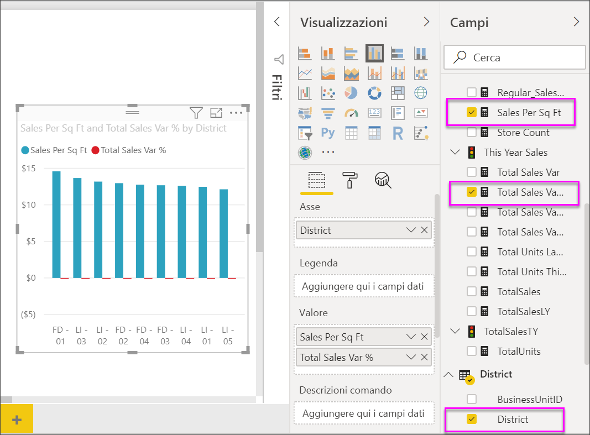
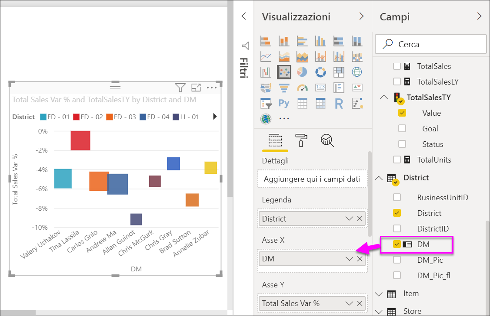

# Grafici a dispersione, grafici a bolle e tracciati a punti in Power BI
Un grafico a dispersione ha sempre due assi di valori per mostrare un set di valori numerici lungo un asse orizzontale e un altro set di dati numerici lungo un asse verticale. Nel grafico vengono visualizzati i punti in corrispondenza dell'intersezione di un valore numerico x e un valore numerico y, combinando questi valori in punti dati singoli. Questi punti dati possono essere distribuiti uniformemente o in maniera non uniforme sull'asse orizzontale, a seconda dei dati.

Un grafico a bolle sostituisce i punti dati con bolle, con le *dimensioni* della bolla che rappresentano una dimensione aggiuntiva dei dati.

Un tracciato a punti è simile a un grafico a bolle e a un grafico a dispersione, ad eccezione del fatto che è possibile tracciare dati numerici o categorici lungo l'asse X. 

È possibile impostare il numero di punti dati fino a un massimo di 10.000.  

## Quando usare un grafico a dispersione o un grafico a bolle
### I grafici a dispersione rappresentano un'ottima scelta nelle seguenti situazioni:
* per visualizzare le relazioni tra 2 (a dispersione) o 3 (a bolle) valori **numerici** .
* Per tracciare due gruppi di numeri come un'unica serie di coordinate xy.
* al posto di un grafico a linee quando si desidera modificare la scala dell'asse orizzontale    
* per attivare l'asse orizzontale in una scala logaritmica.
* per visualizzare i dati del foglio di lavoro che include valori a coppie o a insiemi raggruppati. In un grafico a dispersione, è possibile regolare le scale indipendenti degli assi per visualizzare ulteriori informazioni sui valori raggruppati.
* per visualizzare modelli in grandi set di dati, ad esempio tramite la visualizzazione di tendenze lineare o non lineari, cluster e outlier.
* Per confrontare numeri elevati di punti dati indipendentemente dal tempo.  Maggiore la quantità di dati inclusi in un grafico a dispersione, migliore saranno i confronti che è possibile ottenere.

### I grafici a bolle rappresentano un'ottima scelta nelle seguenti situazioni:
* se i dati dispongono di 3 serie di dati contenenti ciascuna un set di valori.
* per presentare i dati finanziari.  Dimensioni delle bolle diverse sono utili per evidenziare visivamente valori specifici.
* per utilizzare i quadranti.

### I tracciati a punti rappresentano un'ottima scelta in alternativa ai grafici a dispersione o a bolle:
* Se si vogliono includere dati categorici lungo l'asse X

## Creare un grafico a dispersione
Guardare questo video per seguire la creazione del grafico a dispersione e quindi seguire la procedura riportata più avanti per crearne uno.

<iframe width="560" height="315" src="https://www.youtube.com/embed/PVcfPoVE3Ys?list=PL1N57mwBHtN0JFoKSR0n-tBkUJHeMP2cP" frameborder="0" allowfullscreen></iframe>

Per queste istruzioni si usa l'esempio di analisi delle vendite al dettaglio. Per seguire le istruzioni, [scaricare l'esempio](../sample-datasets.md) per il servizio Power BI (app.powerbi.com) o Power BI Desktop.   

1. Aprire il report in Visualizzazione di modifica e selezionare l'icona a forma di segno più di colore giallo per creare una pagina di report vuota.
 
2. Nel riquadro Campi selezionare i campi seguenti:
   - **Vendite** > **Vendite per piedi quadrati**
   - **Vendite** > **% di scostamento vendite totali**
   - **Distretto** > **Distretto**

     

     Se si usa il servizio Power BI, assicurarsi di aprire il report nella [Visualizzazione di modifica](../service-interact-with-a-report-in-editing-view.md).

3. Convertire in un grafico a dispersione. Dal riquadro Visualizzazione selezionare l'icona del grafico a dispersione.

   .

4. Trascinare **Zona** da **Dettagli** in **Legenda**. Viene visualizzato un grafico a dispersione che tiene traccia della **% della varianza delle vendite totali** lungo l'asse Y e delle **vendite per ogni piede quadrato** lungo l'asse X. I colori del punto dati rappresentano le zone:

    

Ora si aggiungerà una terza dimensione.

## Creare un grafico a bolle

1. Dal riquadro **Campi**, trascinare **Vendite** > **Vendite di quest'anno** > **Valore** all'area **Dimensioni**. I punti dati si espandono in volumi proporzionati al valore delle vendite.
   
   

2. Passare il mouse su una bolla. La dimensione della bolla riflette il valore delle **Vendite di quest’anno**.
   
    

3. È possibile impostare il numero di punti dati da visualizzare nel grafico a bolle nella sezione **Formattazione** del riquadro **Visualizzazioni** espandendo la scheda **Generale** e modificando **Volume dati**. È possibile impostare il volume dei dati su un numero massimo di 10.000. All'approssimarsi del numero massimo, è consigliabile eseguire un test per garantire migliori prestazioni. 

     

   Poiché un numero maggiore di punti dati può comportare tempi di caricamento più lunghi, se si sceglie di pubblicare report con limiti corrispondenti ai livelli più elevati della scala, assicurarsi di eseguire test dei report sul Web e in dispositivi mobili, per garantire che le prestazioni soddisfino le aspettative degli utenti. 

4. È possibile [formattare i colori della visualizzazione, le etichette, i titoli, lo sfondo e altro ancora](service-getting-started-with-color-formatting-and-axis-properties.md). Per [migliorare l'accessibilità](../desktop-accessibility.md), considerare la possibilità di aggiungere forme di marcatore a ogni riga. L'uso di una forma del marcatore diversa per ogni riga semplifica per gli utenti dei report la distinzione tra le righe o le aree. Per selezionare la forma del marcatore, espandere la scheda **Forme** e quindi selezionare una forma per il marcatore.

      

   È anche possibile cambiare la forma del marcatore in diamante, triangolo o quadrato:

   

## Creare un tracciato a punti
Per creare un tracciato a punti, sostituire il campo dell'asse X numerico con un campo categorico.

Dal riquadro **Asse X** rimuovere **Sales per sq ft** e sostituirlo con **District > DM**.
   

## Considerazioni e risoluzione dei problemi

### **Il grafico a dispersione presenta solo un punto dati**
Il grafico a dispersione ha solo un punto dati che aggrega tutti i valori sugli assi X e Y?  O forse aggrega tutti i valori lungo una singola riga orizzontale o verticale?

Aggiungere un campo all’area **Dettagli** per indicare a Power BI come raggruppare i valori. Il campo deve essere univoco per ogni punto che si vuole tracciare, come un semplice campo del numero di riga o dell'ID.

O se non si dispone di questo nei dati, è possibile creare un campo che concatena i valori X e Y in un elemento univoco per ogni punto:

Per creare un nuovo campo, [usare l'Editor di query di Power BI Desktop per aggiungere una colonna indice](../desktop-add-custom-column.md) al set di dati.  Quindi aggiungere la colonna all’area **Dettagli** della visualizzazione.

## Passaggi successivi

[Grafici a dispersione ad alta densità](desktop-high-density-scatter-charts.md)

[Tipi di visualizzazione in Power BI](power-bi-visualization-types-for-reports-and-q-and-a.md)

