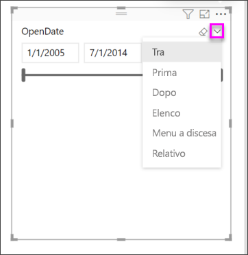
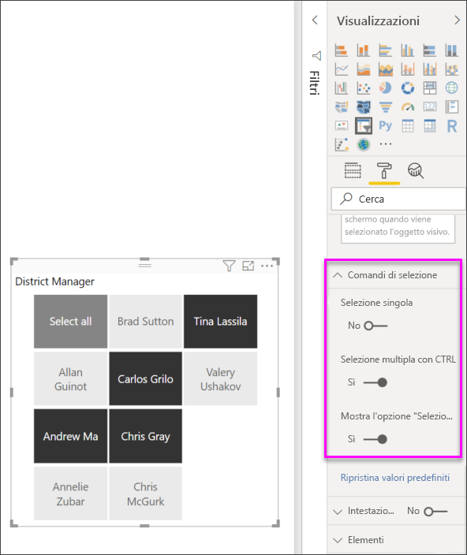

# Filtri dei dati in Power BI

[!INCLUDE [power-bi-visuals-desktop-banner](../includes/power-bi-visuals-desktop-banner.md)]

Si desidera consentire ai lettori dei report di esaminare le metriche relative alle vendite complessive, ma anche evidenziare le prestazioni per i singoli direttori di zona relative a diversi intervalli di tempo. A tal fine, è possibile creare report separati o grafici comparativi oppure usare i filtri dei dati. Un filtro dei dati offre una modalità di filtro alternativa che consente di ridurre la parte del set di dati mostrata nelle altre visualizzazioni all'interno di un report. 

In questa esercitazione viene usato l'[esempio di analisi delle vendite al dettaglio](../sample-retail-analysis.md) disponibile gratuitamente per illustrare una procedura dettagliata per creare, formattare e usare filtri dei dati basati su un elenco o un intervallo di date. Si noterà che vi sono molti modi per formattare e usare i filtri dei dati. 

## Quando usare un filtro dei dati
I filtri dei dati rappresentano un'ottima scelta quando si vuole eseguire quanto segue:

* Visualizzare filtri importanti o di uso comune nell'area di disegno del report in modo da facilitare l'accesso.
* Facilitare la visualizzazione dello stato filtrato corrente senza dover aprire un elenco a discesa. 
* Filtrare per colonne non necessarie e nascoste nelle tabelle di dati.
* Creare più report mirati inserendo i filtri dei dati in corrispondenza di oggetti visivi importanti.

I filtri dei dati di Power BI presentano le limitazioni seguenti:

- I filtri dei dati non supportano i campi di input.
- Il drill-down non è supportato per i filtri dei dati.

## Creare filtri dei dati

**Creare un nuovo filtro dei dati in base al direttore di zona**

Questa esercitazione usa il [file Retail Analysis Sample PBIX](http://download.microsoft.com/download/9/6/D/96DDC2FF-2568-491D-AAFA-AFDD6F763AE3/Retail%20Analysis%20Sample%20PBIX.pbix).

1. Nella sezione in alto a sinistra della barra dei menu selezionare **File** > **Apri**
   
2. Trovare la copia del **file Retail Analysis Sample PBIX**

1. Aprire il **file Retail Analysis Sample PBIX** nella visualizzazione report .

1. Seleziona  per aggiungere una nuova pagina.

2. Nella pagina Overview, senza elementi selezionati nel canvas, selezionare l'icona **Filtro dei dati**  nel riquadro **Visualizzazioni** per creare un nuovo filtro dei dati. 
3. Con il nuovo filtro dei dati selezionato, selezionare **District** > **DM** nel riquadro Campi per popolare il filtro dei dati. Il nuovo filtro dei dati è costituito da un elenco di nomi preceduti da caselle di selezione. 
    
    
    
4. Ridimensionare e trascinare il filtro dei dati e gli altri elementi nel canvas per liberare spazio per il filtro. Si noti che i nomi degli elementi del filtro dei dati vengono troncati se si riducono troppo le dimensioni del filtro. 
5. Selezionare i nomi nel filtro dei dati e osservare gli effetti prodotti sulle altre visualizzazioni nella pagina. Selezionare di nuovo i nomi per deselezionarli e tenere premuto **CTRL** per selezionare più nomi. Selezionando tutti i nomi si ottiene lo stesso effetto di quando nessun nome è selezionato. 

6. In alternativa, selezionare l'icona del rullo per formattare il filtro dei dati. Le opzioni sono tantissime per poterle descrivere tutte. È consigliabile provarle e creare un filtro dei dati adatto. Negli esempi seguenti il primo filtro dei dati usa un orientamento orizzontale e sfondi colorati per gli elementi. Il secondo filtro dei dati ha mantenuto l'orientamento verticale, mentre colora il testo per un aspetto più standard.

   
>[!TIP]
>Per impostazione predefinita, gli elementi del filtro dei dati con elenco vengono elencati in ordine crescente. Per visualizzarli in ordine decrescente, selezionare i puntini di sospensione ( **...** ) nell'angolo superiore destro del filtro dei dati e scegliere **Ordinamento decrescente**.

**Per creare un nuovo filtro dei dati in base a un intervallo di date**

1. Senza elementi selezionati nel canvas, selezionare l'elenco a discesa **Store** nel riquadro Campi e trascinare **OpenDate** nell'area **Valori** nel riquadro Visualizzazioni per creare una nuova visualizzazione.
2. Con la nuova visualizzazione selezionata, selezionare l'icona **Filtro dei dati** per convertire la nuova visualizzazione in un filtro dei dati. Quest'ultimo consiste in un dispositivo di scorrimento con un intervallo di date specificato.
    
    

    
4. Ridimensionare e trascinare il filtro dei dati e gli altri elementi nel canvas per liberare spazio per il filtro. Si noti che le dimensioni del dispositivo di scorrimento cambiano in base a quelle del filtro dei dati, ma il controllo non è più visibile e le date vengono troncate se si riducono troppo le dimensioni del filtro. 
4. Selezionare diversi intervalli di date con il dispositivo di scorrimento oppure selezionare un campo data per digitare un valore o visualizzare un calendario popup per una selezione più precisa. Osservare gli effetti sulle altre visualizzazioni nella pagina.
    
    >[!NOTE]
    >I tipi di dati numerici e data/ora generano per impostazione predefinita filtri dei dati con dispositivi di scorrimento per intervalli. A partire dall'aggiornamento di Power BI del mese di febbraio 2018, i dispositivi di scorrimento per intervalli di numeri interi si allineano ai numeri interi anziché mostrare i valori decimali. 

5. Per modificare il tipo di filtro dei dati, passare il puntatore del mouse sull'area in alto a destra del filtro selezionato, selezionare la freccia in giù e scegliere una delle altre opzioni, ad esempio **Elenco** o **Prima**. Osservare come cambiano le opzioni di selezione e l'aspetto del filtro dei dati. 
 
    

Per altre informazioni sulla creazione e l'uso di filtri dei dati per un intervallo numerico, guardare il video seguente e vedere [Usare il filtro dei dati per l'intervallo numerico in Power BI Desktop](../desktop-slicer-numeric-range.md).
   > [!NOTE]
   > Questo video usa una versione precedente di Power BI Desktop.
   > 
   > 
<iframe width="560" height="315" src="https://www.youtube.com/embed/zIZPA0UrJyA" frameborder="0" allowfullscreen></iframe> 

## Controllare su quali oggetti visivi della pagina hanno effetto i filtri dei dati
Per impostazione predefinita, i filtri dei dati in una pagina di report hanno effetto su tutte le altre visualizzazioni nella pagina, incluse le interazioni tra le visualizzazioni. Mentre si scelgono i valori nell'elenco e nei dispositivi di scorrimento delle date appena creati, osservare gli effetti prodotti sulle altre visualizzazioni. I dati filtrati risultano da un'intersezione dei valori selezionati in entrambi i filtri dei dati. 

È possibile usare **Interazioni oggetti visivi** per impedire che alcune visualizzazioni nella pagina abbiano effetto su altre. Nella pagina **Panoramica** il grafico "Total Sales Variance by FiscalMonth and District Manager" (Varianza vendite complessive per mese fiscale e direttore di zona) mostra i dati comparativi delle vendite complessive per i responsabili di zona in base al mese, che si desidera mantenere sempre visibili. Per impedire alle selezioni del filtro dei dati di filtrare i dati in questo grafico, è possibile usare **Interazioni oggetti visivi**. 

1. Con il filtro dei dati District Manager nella pagina **District Monthly Sales** selezionata:
    - In Power BI Desktop fare clic sul menu **Formatta** in **Strumenti visivi** e selezionare **Modifica interazioni**.
   
   I controlli del filtro  vengono visualizzati sopra tutti gli altri oggetti visivi della pagina. Inizialmente tutte le icone **Filtro** sono selezionate.
   
2. Selezionare l'icona **Nessuno** sopra il grafico **Total Sales Variance by FiscalMonth and District Manager** (Varianza vendite complessive per mese fiscale e direttore di zona) per impedire l'applicazione del filtro dei dati al grafico. 
3. Selezionare il filtro dei dati **Mese** e quindi di nuovo l'icona **Nessuno** sopra il grafico **Total Sales Variance da FiscalMonth and District Manager** (Varianza vendite complessive per mese fiscale e direttore di zona) per impedire l'applicazione del filtro dei dati al grafico. Per effetto di queste impostazioni, quando si selezionano nomi e intervalli di date nei filtri dei dati, il grafico Total Sales Variance dal grafico FiscalMonth and District Manager (Varianza vendite complessive per mese fiscale e direttore di zona) rimane invariato. 

Per altre informazioni sulla modifica delle interazioni, vedere [Interazioni tra le visualizzazioni in un report di Power BI](../service-reports-visual-interactions.md).

## Sincronizzare e usare i filtri dei dati in altre pagine
A partire dall'aggiornamento di febbraio 2018 di Power BI, è possibile sincronizzare un filtro dei dati e usarlo in una pagina qualsiasi o in tutte le pagine di un report. 

Nel report corrente la pagina **District Monthly Sales** contiene anche un filtro dei dati **District Manager**. E se si volesse tale filtro dei dati anche nella pagina **Overview**? Anche nella pagina **New Stores** è disponibile una sezione che contiene però solo informazioni relative all'elemento **Store Name**. Con il riquadro **Sincronizza filtri dei dati** è possibile sincronizzare il filtro dei dati **District Manager** con queste pagine in modo che le selezioni del filtro in una delle tre abbiano effetto sulle visualizzazioni in tutte le altre.

1. Nel menu **Visualizza** di Power BI Desktop selezionare **Sincronizza filtri dei dati**.

    

1.  Il riquadro **Sincronizza filtri dei dati** viene visualizzato tra il riquadro **Filtri** e **Visualizzazioni**.  

    

1. Nella pagina **District Monthly Sales** selezionare il filtro dei dati **District Manager**. 
    
    
    
3. Nella colonna **Sincronizza** selezionare la pagina **New Stores** e la pagina **Overview** per sincronizzare il filtro dei dati **District Monthly Sales** in tali pagine. 
    
3. Nella colonna **Visibile** selezionare la pagina **New Stores** e la pagina **Overview**. Il riquadro **Sincronizza filtri dei dati** dovrebbe ora essere simile all'immagine seguente:

    

1. Osservare gli effetti delle impostazioni di sincronizzazione e visibilità del filtro dei dati nelle altre pagine. Nella pagina **District Monthly Sales** (Vendite mensili zona) il filtro dei dati **District Manager** (Direttore di zona) mostra ora le stesse selezioni del filtro dei dati nella pagina **Panoramica**. Nella pagina **New Stores** (Nuovi punti vendita) le selezioni del filtro dei dati **District Manager** (Direttore di zona) hanno effetto su quelle disponibili nel filtro dei dati **Store Name** (Nome punto vendita). 
    
    >[!TIP]
    >Anche se inizialmente il filtro dei dati appare nelle pagine sincronizzate con le stesse dimensioni e nella stessa posizione rispetto alla pagina originale, è possibile spostare, ridimensionare e formattare in modo indipendente i filtri dei dati sincronizzati nelle varie pagine. 

>[!NOTE]
>Se si sincronizza un filtro dei dati con una pagina, senza renderlo visibile in tale pagina, le selezioni dei filtro definite nelle altre pagine hanno comunque effetto sui dati visualizzati nella pagina.
 
## Formattare i filtri dei dati
A seconda del tipo di filtro dei dati sono disponibili diverse opzioni di formattazione. Usando l'orientamento **Orizzontale**, il layout **Reattivo** e la colorazione **Elemento**, è possibile generare pulsanti o riquadri, anziché voci di elenco standard, e ridimensionare gli elementi del filtro dei dati in base a layout e dimensioni dello schermo differenti.  

1. Con il filtro dei dati **District Manager** selezionato in una pagina qualsiasi, nel riquadro **Visualizzazioni** selezionare l'icona **Formatta**  per visualizzare i controlli di formattazione. 
    
    
    
2. Selezionare la freccia a discesa accanto a ogni categoria per visualizzare e modificare le opzioni. 

### Opzioni generali
1. Selezionare il rosso in **Colore bordo** e modificare **Spessore bordo** impostandolo su "2". In questo modo vengono impostati il colore e lo spessore dei bordi e delle sottolineature degli elementi e delle intestazioni, se abilitati. 
2. In **Orientamento** è selezionata per impostazione predefinita l'opzione **Verticale**. Selezionare **Orizzontale** per generare un filtro dei dati con riquadri o pulsanti disposti in orizzontale e frecce di scorrimento per accedere agli elementi che non rientrano nell'area visualizzata del filtro.
    
    
    
3. Attivare il layout **Reattivo** per modificare le dimensioni e la disposizione degli elementi del filtro dei dati in base alle dimensioni dello schermo e del filtro. Per i filtri dei dati con elenco, il layout reattivo è disponibile solo nell'orientamento orizzontale e impedisce che gli elementi vengano troncati su schermi di piccole dimensioni. Per i filtri dei dati con dispositivo di scorrimento per intervalli, la formattazione reattiva modifica lo stile di tale dispositivo, che può essere ridimensionato in modo più flessibile. Entrambi i tipi di filtri dei dati diventano icone di filtro in caso di dimensioni di visualizzazione molto ridotte. 
    
    
    
    >[!NOTE]
    >Le modifiche del layout reattivo possono sostituire formattazioni specifiche di intestazioni o elementi impostate precedentemente. 
    
4. Impostare le dimensioni e la posizione del filtro dei dati con precisione numerica in **Posizione X**, **Posizione Y**, **Larghezza**, e **Altezza** o spostare e ridimensionare il filtro dei dati direttamente nel canvas. Provare a impostare dimensioni e disposizioni diverse per gli elementi e osservare come la formattazione reattiva cambia di conseguenza.  

    

Per altre informazioni sull'orientamento orizzontale e il layout reattivo, vedere [Creare un filtro dei dati reattivo e ridimensionabile in Power BI](../power-bi-slicer-filter-responsive.md).

### Opzioni dei comandi di selezione (solo per filtri dei dati con elenco)
1. **Mostra l'opzione "Seleziona tutto"** è disattivata per impostazione predefinita **.** Attivarla per aggiungere al filtro dei dati un'opzione **Seleziona tutto** che consenta di selezionare o deselezionare alternativamente tutti gli elementi **.** Quando tutti gli elementi sono selezionati, è possibile fare clic o toccare un elemento per deselezionarlo, attivando così un filtro di tipo "esclusivo". 
    
    
    
2. L'opzione **Selezione singola** è attivata per impostazione predefinita **.** Fare clic o toccare ogni singolo elemento per selezionarlo e fare clic o toccare tenendo premuto **CTRL** per selezionare più elementi. **Disattivare** **Selezione singola** per consentire la selezione di più elementi senza tenere premuto **CTRL**. Fare clic o toccare di nuovo un elemento per deselezionarlo. 

### Opzioni del titolo
L'opzione **Titolo** è **attiva** per impostazione predefinita e visualizza il nome del campo dati nella parte superiore del filtro dei dati. 
1. È possibile formattare il testo del titolo per rendere il **Colore carattere** rosso, le **Dimensioni testo** pari a 14 pt, impostare al centro l'**Allineamento** e usare Arial Black come **Famiglia di caratteri**. 

### Opzioni degli elementi (solo per filtri dei dati con elenco)
1. Formattare il testo e lo sfondo degli elementi in modo che il **Colore carattere** sia nero, lo **Sfondo** rosso chiaro, le **Dimensioni testo** pari a 10 pt e la **Famiglia di caratteri** Arial. 
2. In **Bordo** scegliere **Cornice** per disegnare un bordo intorno a ogni elemento con le dimensioni e il colore impostati nelle opzioni **Generali**. 
    
    
    
    >[!TIP]
    >- Con **Orientamento > Orizzontale**, gli elementi deselezionati vengono visualizzati con i colori del testo e dello sfondo selezionati, mentre gli elementi selezionati usano l'impostazione predefinita, in genere sfondo nero con testo bianco.
    >- Con **Orientamento > Verticale**, gli elementi vengono visualizzati sempre con i colori impostati e le caselle di selezione sono sempre nere quando sono selezionate. 

### Opzioni degli input di date/numerici e del dispositivo di scorrimento (solo per filtri dei dati con dispositivo di scorrimento per intervalli)
- Le opzioni degli input di date/numerici sono identiche a quelle degli **elementi** per i filtri dei dati con elenco, ad eccezione del fatto non è disponibile l'opzione **Bordo** o quella per la sottolineatura.
- Le opzioni del dispositivo di scorrimento per intervalli consentono di impostare il colore del dispositivo oppure di disattivare il dispositivo lasciando solo gli input numerici **.**

### Altre opzioni di formattazione
Le altre opzioni di formattazione sono disattivate per impostazione predefinita. Quando vengono impostate su **On**: 
- **Sfondo:** consente di aggiungere un colore di sfondo per tutto il filtro dei dati e ne imposta la trasparenza.
- **Blocca proporzioni:** mantiene la forma del filtro dei dati se viene ridimensionato.
- **Bordo:** consente di aggiungere un bordo di 1 pixel intorno al filtro dei dati e ne imposta il colore. Il bordo del filtro dei dati è indipendente dall'impostazione Bordo nelle impostazioni generali e non ne viene influenzato. 

## Passaggi successivi
[Tipi di visualizzazione in Power BI](power-bi-visualization-types-for-reports-and-q-and-a.md)

[Tabelle in Power BI](power-bi-visualization-tables.md)

