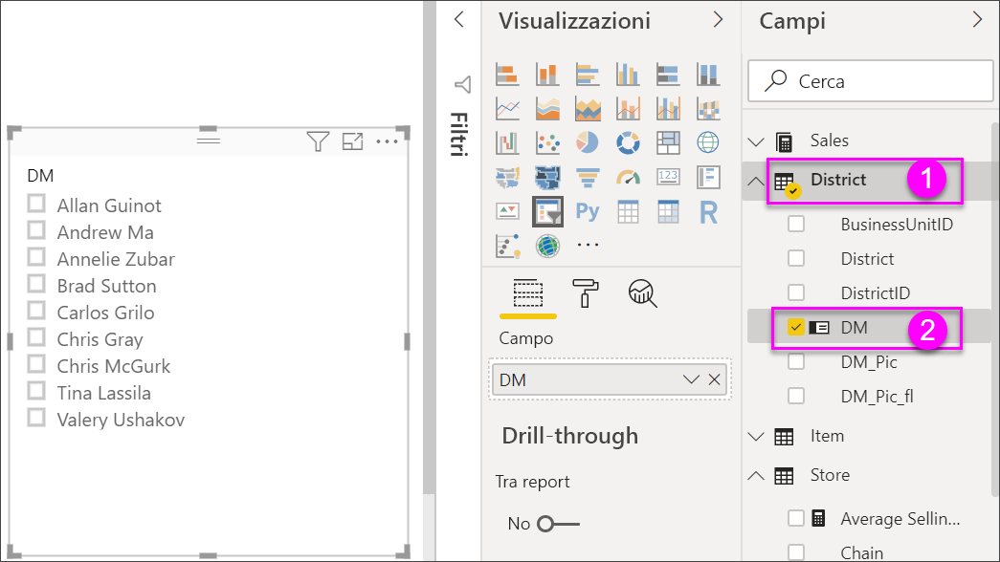
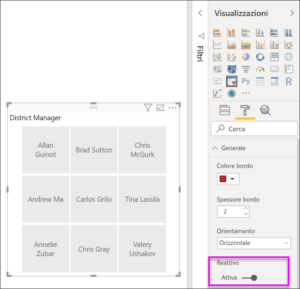

# Filtri dei dati in Power BI

[!INCLUDE [applies-to](../includes/applies-to.md)] [!INCLUDE [yes-desktop](../includes/yes-desktop.md)] [!INCLUDE [yes-service](../includes/yes-service.md)]

Si supponga di voler consentire ai lettori dei report di esaminare le metriche relative alle vendite complessive, ma anche di evidenziare le prestazioni per i singoli direttori di zona relative a diversi intervalli di tempo. A tal fine, è possibile creare report separati o grafici comparativi oppure è possibile usare i *filtri dei dati*. Un filtro dei dati offre una modalità di filtro alternativa che consente di ridurre la parte del set di dati mostrata nelle altre visualizzazioni all'interno di un report. 

Questo articolo illustra la creazione e la formattazione di un filtro dei dati di base, tramite il pacchetto [Retail Analysis Sample](../sample-retail-analysis.md) gratuito. Spiega anche come è possibile controllare quali oggetti visivi sono interessati da un filtro dei dati e come eseguire la sincronizzazione con i filtri dei dati in altre pagine. Di seguito sono riportati alcuni altri articoli che illustrano come creare tipi specifici di filtri dei dati:

- [Filtri dei dati per l'intervallo numerico](../desktop-slicer-numeric-range.md).
- [Filtro dei dati per la data relativa](desktop-slicer-filter-date-range.md).
- [Filtri dei dati ridimensionabili](../power-bi-slicer-filter-responsive.md) reattivi.
- [Filtri dei dati per la gerarchia](../create-reports/power-bi-slicer-hierarchy-multiple-fields.md) con più campi.

## Quando usare un filtro dei dati
I filtri dei dati rappresentano un'ottima scelta quando si vuole eseguire quanto segue:

* Visualizzare filtri importanti o di uso comune nell'area di disegno del report in modo da facilitare l'accesso.
* Facilitare la visualizzazione dello stato filtrato corrente senza dover aprire un elenco a discesa. 
* Filtrare per colonne non necessarie e nascoste nelle tabelle di dati.
* Creare più report mirati inserendo i filtri dei dati in corrispondenza di oggetti visivi importanti.

I filtri dei dati di Power BI non supportano:

- Campi di input
- Drilldown

## Creare un filtro dei dati

Questo filtro dei dati filtra i dati in base al direttore di zona. Per proseguire con questa procedura, scaricare il [file Retail Analysis sample PBIX](https://download.microsoft.com/download/9/6/D/96DDC2FF-2568-491D-AAFA-AFDD6F763AE3/Retail%20Analysis%20Sample%20PBIX.pbix).

1. Aprire Power BI Desktop e nella barra dei menu selezionare **File** > **Apri**.
   
1. Passare al file **Retail Analysis Sample PBIX.pbix**, quindi selezionare **Apri**.

1. Nel riquadro sinistro selezionare l'icona **Report** per aprire il file in visualizzazione report.

1. Nella pagina **Overview**, senza elementi selezionati nell'area di disegno del report, selezionare l'icona **Filtro dei dati** nel riquadro **Visualizzazioni** per creare un nuovo filtro dei dati. 

1. Con il nuovo filtro dei dati selezionato, selezionare **District** > **DM** nel riquadro **Campi** per popolare il filtro dei dati. 

    Il nuovo filtro dei dati viene ora popolato con un elenco di nomi di direttori di zona con le relative caselle di selezione.
    
    
    
1. Ridimensionare e trascinare gli elementi nell'area di disegno per liberare spazio per il filtro. Si noti che, se si riducono troppo le dimensioni del filtro dei dati, i nomi degli elementi vengono troncati. 

1. Selezionare i nomi nel filtro dei dati e osservare gli effetti prodotti sulle altre visualizzazioni nella pagina. Selezionare di nuovo i nomi per deselezionarli o tenere premuto **CTRL** per selezionare più nomi. Selezionando tutti i nomi si ottiene lo stesso effetto di quando nessun nome è selezionato. 

1. In alternativa, selezionare **Formato** (icona del rullo) nel riquadro **Visualizzazioni** per formattare il filtro dei dati. 

   Le opzioni sono tantissime per poterle descrivere tutte. È consigliabile provarle e creare un filtro dei dati adatto. Nell'immagine seguente il primo filtro dei dati ha un orientamento orizzontale e sfondi colorati per gli elementi. Il secondo filtro dei dati ha un aspetto più standard, con un orientamento verticale e testo colorato.

   

   >[!TIP]
   >Per impostazione predefinita, gli elementi dell'elenco del filtro dei dati vengono elencati in ordine crescente. Per visualizzarli in ordine decrescente, selezionare i puntini di sospensione ( **...** ) nell'angolo superiore destro del filtro dei dati e scegliere **Ordinamento decrescente**.

## Controllare su quali oggetti visivi della pagina hanno effetto i filtri dei dati
Per impostazione predefinita, i filtri dei dati in una pagina di report hanno effetto su tutte le altre visualizzazioni nella pagina, incluse le interazioni tra le visualizzazioni. Mentre si scelgono i valori nell'elenco e nei dispositivi di scorrimento delle date appena creati, osservare gli effetti prodotti sulle altre visualizzazioni. I dati filtrati risultano da un'intersezione dei valori selezionati in entrambi i filtri dei dati. 

Usare le interazioni degli oggetti visivi per impedire che alcune visualizzazioni nella pagina abbiano effetto su altre. Nella pagina **Overview** il grafico **Total Sales Variance by FiscalMonth and District Manager** (Varianza vendite complessive per mese fiscale e direttore di zona) mostra i dati comparativi delle vendite complessive per i direttori di zona in base al mese, che si vogliono mantenere sempre visibili. Per impedire alle selezioni del filtro dei dati di filtrare i dati in questo grafico, usare le interazioni degli oggetti visivi. 

1. Passare alla pagina **Overview** del report e quindi selezionare il filtro dei dati **DM** creato in precedenza.

1. Nel menu di Power BI Desktop fare clic sul menu **Formatta** in **Strumenti visivi** e quindi selezionare **Modifica interazioni**.
   
   I controlli del filtro , ognuno con un'opzione **Filtro** e un'opzione **Nessuno**, vengono visualizzati sopra tutti gli oggetti visivi della pagina. L'opzione **Filtro** è inizialmente preselezionata in tutti i controlli.
   
1. Selezionare l'opzione **Nessuno** nel filtro sopra il grafico **Total Sales Variance by FiscalMonth and District Manager** (Varianza vendite complessive per mese fiscale e direttore di zona) per impedire l'applicazione del filtro dei dati **DM** al grafico. 

1. Selezionare il filtro dei dati **OpenDate** e quindi selezionare l'opzione **Nessuno** sopra il grafico **Total Sales Variance by FiscalMonth and District Manager** per impedire l'applicazione del filtro dei dati. 

   Per effetto di queste impostazioni, quando si selezionano nomi e intervalli di date nei filtri dei dati, il grafico **Total Sales Variance by FiscalMonth and District Manager** (Varianza vendite complessive per mese fiscale e direttore di zona) rimane invariato.

Per altre informazioni sulla modifica delle interazioni, vedere [Modificare l'interazione degli oggetti visivi in un report di Power BI](../service-reports-visual-interactions.md).

## Sincronizzare e usare i filtri dei dati in altre pagine
A partire dall'aggiornamento di febbraio 2018 di Power BI, è possibile sincronizzare un filtro dei dati e usarlo in una pagina qualsiasi o in tutte le pagine di un report. 

Nel report corrente la pagina **District Monthly Sales** contiene un filtro dei dati **District Manager**. E se si volesse tale filtro dei dati anche nella pagina **New Stores**? Nella pagina **New Stores** è disponibile un filtro dei dati che contiene però solo informazioni relative all'elemento **Store Name**. Con il riquadro **Sincronizza filtri dei dati**, è possibile sincronizzare il filtro dei dati **District Manager** con queste pagine in modo che le selezioni del filtro in una delle tre abbiano effetto sulle visualizzazioni in tutte le altre.

1. Nel menu **Visualizza** di Power BI Desktop selezionare **Sincronizza filtri dei dati**.

    

    Il riquadro **Sincronizza filtri dei dati** viene visualizzato tra i riquadri **Filtri** e **Visualizzazioni**.

    

1. Nella pagina **District Monthly Sales** del report selezionare il filtro dei dati **District Manager**. 

    Poiché è già stato creato un filtro dei dati **District Manager** (**DM**) nella pagina **Overview**, il riquadro **Sincronizza filtri dei dati** è simile al seguente:
    
    
    
1. Nella colonna **Sincronizza** del riquadro **Sincronizza filtri dei dati** selezionare le pagine **Overview**, **District Monthly Sales** e **New Stores**. 

    Questa selezione determina la sincronizzazione tra le tre pagine del filtro dei dati **District Monthly Sales**. 
    
1. Nella colonna **Visibile** del riquadro **Sincronizza filtri dei dati** selezionare la pagina **New Stores**. 

    Questa selezione determina la visibilità del filtro dei dati **District Monthly Sales** in queste tre pagine. Il riquadro **Sincronizza filtri dei dati** ha ora l'aspetto seguente:

    

1. Osservare gli effetti delle impostazioni di sincronizzazione e visibilità del filtro dei dati nelle altre pagine. Si noti che nella pagina **District Monthly Sales** (Vendite mensili zona) il filtro dei dati **District Manager** (Direttore di zona) mostra ora le stesse selezioni del filtro dei dati nella pagina **Overview**. Nella pagina **New Stores** (Nuovi punti vendita) il filtro dei dati **District Manager** (Direttore di zona) è ora visibile e le selezioni hanno effetto su quelle visibili nel filtro dei dati **Store Name** (Nome punto vendita). 
    
    >[!TIP]
    >Anche se inizialmente il filtro dei dati appare nelle pagine sincronizzate con le stesse dimensioni e nella stessa posizione rispetto alla pagina originale, è possibile spostare, ridimensionare e formattare in modo indipendente i filtri dei dati sincronizzati nelle varie pagine. 

    >[!NOTE]
    >Se si sincronizza un filtro dei dati con una pagina, senza renderlo visibile in tale pagina, le selezioni del filtro definite nelle altre pagine hanno comunque effetto sui dati visualizzati nella pagina.
 
## Formattare i filtri dei dati
A seconda del tipo di filtro dei dati sono disponibili diverse opzioni di formattazione. Usando l'orientamento **Orizzontale**, il layout **Reattivo** e la colorazione **Elemento**, è possibile generare pulsanti o riquadri, anziché voci di elenco standard, e ridimensionare gli elementi del filtro dei dati in base a layout e dimensioni dello schermo differenti.  

1. Con il filtro dei dati **District Manager** selezionato in una pagina qualsiasi, nel riquadro **Visualizzazioni** selezionare l'icona **Formatta** per visualizzare i controlli di formattazione. 
    
    
    
1. Selezionare la freccia a discesa accanto a ogni categoria per visualizzare e modificare le opzioni. 

### Opzioni generali
1. In **Formatta** selezionare **Generale**, selezionare un colore rosso in **Colore bordo** e quindi impostare **Spessore bordo** su *2*. 

    Questa impostazione modifica il colore e lo spessore dei bordi e delle sottolineature degli elementi e delle intestazioni.

1. Per **Orientamento** è selezionata per impostazione predefinita l'opzione **Verticale**. Selezionare **Orizzontale** per generare un filtro dei dati con riquadri o pulsanti disposti in orizzontale e frecce di scorrimento per accedere agli elementi che non rientrano nell'area visualizzata del filtro.
    
    
    
1. Impostare su **Sì** il layout **Reattivo** per modificare le dimensioni e la disposizione degli elementi del filtro dei dati in base alle dimensioni dello schermo e del filtro. 

    Per i filtri dei dati con elenco, il layout reattivo impedisce che gli elementi vengano troncati su schermi di piccole dimensioni. È disponibile solo per gli orientamenti orizzontali. Per i filtri dei dati con dispositivo di scorrimento per intervalli, la formattazione reattiva modifica lo stile di tale dispositivo, che può essere ridimensionato in modo più flessibile. Entrambi i tipi di filtri dei dati diventano icone di filtro in caso di dimensioni di visualizzazione ridotte.
    
    
    
    >[!NOTE]
    >Le modifiche del layout reattivo possono sostituire formattazioni specifiche di intestazioni o elementi impostate precedentemente. 
    
1. In **Posizione X**, **Posizione Y**, **Larghezza** e **Altezza** impostare le dimensioni e la posizione del filtro dei dati con precisione numerica o spostare e ridimensionare il filtro dei dati direttamente nell'area di disegno. 

    Provare a impostare dimensioni e disposizioni diverse per gli elementi e osservare come la formattazione reattiva cambia di conseguenza. Queste opzioni sono disponibili solo quando si selezionano gli orientamenti orizzontali. 

    

Per altre informazioni sugli orientamenti orizzontali e i layout reattivi, vedere [Creare un filtro dei dati reattivo e ridimensionabile in Power BI](../power-bi-slicer-filter-responsive.md).

### Opzioni dei comandi di selezione (solo per filtri dei dati con elenco)
1. In **Comandi di selezione** impostare **Mostra l'opzione "Seleziona tutto"** su **Sì** per aggiungere un elemento **Seleziona tutto** al filtro dei dati. 

    **Mostra l'opzione "Seleziona tutto"** è impostata su **No** per impostazione predefinita. Se abilitata, questa opzione, quando viene attivata/disattivata, seleziona o deseleziona tutti gli elementi. Se si selezionano tutti gli elementi, selezionando un elemento lo si deseleziona, consentendo un tipo di filtro *non è*.
    
    
    
1. Impostare **Selezione singola** su **No** per poter selezionare più elementi senza dover tenere premuto **CTRL**. 

    L'opzione **Selezione singola** è impostata su **Sì** per impostazione predefinita. Per selezionare un elemento è necessario selezionare l'elemento stesso, mentre tenendo premuto **CTRL** è possibile selezionare più elementi. Selezionare nuovamente un elemento per deselezionarlo.

### Opzioni del titolo
**Titolo** è impostato su **Sì** per impostazione predefinita. Questa selezione mostra il nome del campo dati nella parte superiore del filtro dei dati. 
- Per questo articolo, formattare il testo del titolo come segue: 
   - **Colore carattere**: rosso
   - **Dimensioni testo**: **14 pt**
   - **Allineamento**: **Centro**
   - **Famiglia di caratteri**: **Arial Black**

### Opzioni degli elementi (solo per filtri dei dati con elenco)
1. Per questo articolo, formattare le opzioni di **Elementi** come segue:
    - **Colore carattere**: nero
    - **Sfondo**: rosso chiaro
    - **Dimensioni testo**: **10 pt**
    - **Famiglia di caratteri**: **Arial**
 
1. Per **Bordo** scegliere **Cornice** per disegnare un bordo intorno a ogni elemento con le dimensioni e il colore impostati nelle opzioni **Generali**. 
    
    
    
    >[!TIP]
    >- Se si seleziona **Generale** > **Orientamento** > **Orizzontale**, gli elementi deselezionati vengono visualizzati con i colori del testo e dello sfondo selezionati, mentre gli elementi selezionati usano l'impostazione predefinita, in genere sfondo nero con testo bianco.
    >- Se si seleziona **Generale** > **Orientamento > Verticale**, gli elementi vengono visualizzati sempre con i colori selezionati e le caselle di selezione sono sempre nere quando sono selezionate. 

### Opzioni degli input di date/numerici e del dispositivo di scorrimento (solo per filtri dei dati con dispositivo di scorrimento per intervalli)
- Per i filtri dei dati con elenco, le opzioni degli input di date/numerici sono identiche a quelle delle opzioni di **Elementi**, a eccezione del fatto non è disponibile l'opzione per il bordo o quella per la sottolineatura.
- Le opzioni di **Dispositivo di scorrimento** consentono di impostare il colore del dispositivo di scorrimento per intervalli oppure di impostare il dispositivo su **No** lasciando solo gli input numerici.

### Altre opzioni di formattazione
Le altre opzioni di formattazione sono impostate su **No** per impostazione predefinita. Per controllare queste opzioni, impostarle su **Sì**: 
- **Sfondo**: aggiunge un colore di sfondo per il filtro dei dati e ne imposta la trasparenza.
- **Blocca proporzioni**: mantiene la forma del filtro dei dati se viene ridimensionato.
- **Bordo**: aggiunge un bordo intorno al filtro dei dati e ne imposta il colore. Il bordo del filtro dei dati è indipendente dalle impostazioni **Generali** e non ne viene influenzato. 

## Passaggi successivi
Per altre informazioni, vedere gli articoli seguenti:

- [Tipi di visualizzazione in Power BI](power-bi-visualization-types-for-reports-and-q-and-a.md)

- [Tabelle in Power BI](power-bi-visualization-tables.md)

