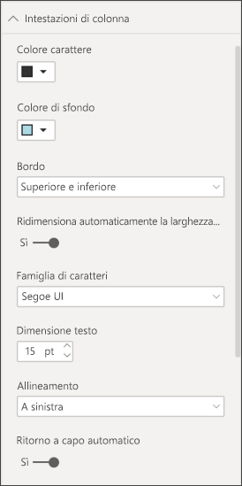
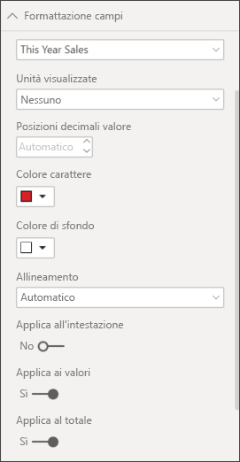
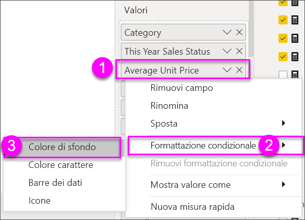
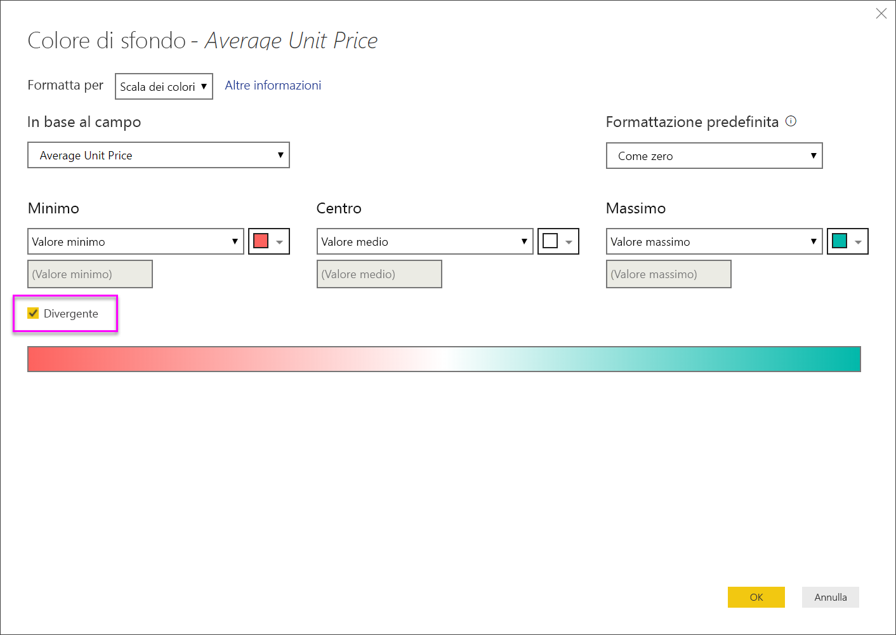
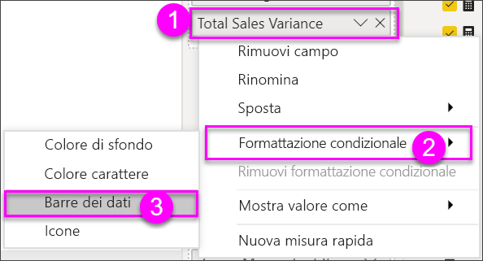
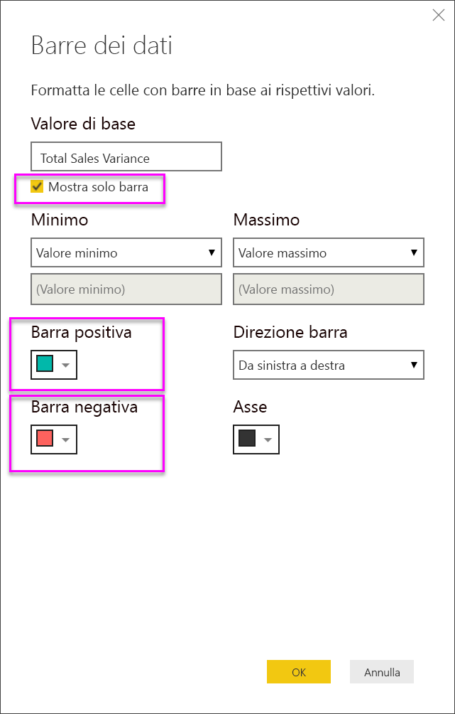
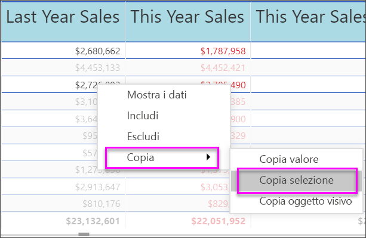

# Tabelle nei report e nei dashboard di Power BI
Una tabella è una griglia contenente dati correlati in una serie logica di righe e colonne. Può anche contenere intestazioni e una riga per i totali. Le tabelle funzionano bene con confronti quantitativi in cui si analizzano molti valori per una singola categoria. Ad esempio, questa tabella mostra 5 diverse misure per **Categoria**.

Creare tabelle nei report e applicare l'evidenziazione incrociata degli elementi all'interno della tabella con altri oggetti visivi nella stessa pagina del report.  È anche possibile selezionare singole celle, colonne e righe e usare l'evidenziazione incrociata. Le selezioni di singole celle o di più celle possono essere copiate e incollate in altre applicazioni.

## Quando usare una tabella
Le tabelle rappresentano un'ottima scelta nelle seguenti situazioni:

* visualizzare e confrontare dati dettagliati e valori esatti (anziché rappresentazioni visive)
* visualizzare i dati in un formato tabulare
* visualizzare i dati numerici per categorie   

> [!NOTE]
> Se una tabella contiene troppi valori, è consigliabile convertirla in una matrice e/o usare il drill-down. Il numero massimo di punti dati visualizzato da una tabella è 3.500.

## Prerequisiti
- Servizio Power BI o Power BI Desktop
- Esempio di analisi delle vendite al dettaglio

## Creare una tabella
Verrà creata la tabella raffigurata nell'immagine precedente per visualizzare i valori delle vendite per categoria di elemento. Per seguire la procedura, accedere al servizio Power BI e selezionare **Recupera dati \> Esempi \> Esempio di analisi delle vendite al dettaglio > Connetti** e scegliere **Vai al dashboard**. Per creare una visualizzazione sono necessarie autorizzazioni di modifica per il set di dati e per il report. Fortunatamente, gli esempi di Power BI sono tutti modificabili. Nei report condivisi da altri utenti non sarà possibile creare visualizzazioni.

1. Dal riquadro di spostamento a sinistra selezionare **Aree di lavoro > Area di lavoro personale**.    
2. Selezionare la scheda Set di dati e scorrere in basso fino al set di dati Esempio di analisi delle vendite al dettaglio appena aggiunto.  Selezionare l'icona **Crea report**.

    
2. Nell'editor di report, selezionare **Elemento** > **Categoria**.  Power BI crea automaticamente una tabella che elenca tutte le categorie.

    
3. Selezionare **Sales > Average Unit Price** e **Sales > Last Year Sales** e **Sales > This Year Sales** e scegliere tutte e tre le opzioni (Value, Goal, Status).   
4. Nel riquadro Visualizzazioni, trovare l'area **Valori** e trascinare i valori fino a quando l'ordine delle colonne del grafico corrisponde alla prima immagine in questa pagina.  L'area Valori dovrebbe essere simile alla seguente.

    
5. Aggiungere la tabella al dashboard selezionando l'icona Aggiungi  

     

## Formattare la tabella
È possibile formattare una tabella in diversi modi. Di seguito sono descritti alcuni dei modi possibili. Un ottimo modo per apprendere le altre opzioni di formattazione consiste nell'aprire il riquadro Formattazione (icona del rullo ) ed esplorare.

* Provare a formattare la griglia della tabella. In questo caso è stata aggiunta una griglia blu verticale, è stato aggiunto spazio alle righe e sono state lievemente aumentate le dimensioni di profilo e testo.

    

    
* Per le intestazioni di colonna è stato modificato il colore di sfondo, aggiunto un profilo e sono state aumentate le dimensioni del carattere. 

    

    

* È anche possibile applicare la formattazione a singole colonne e intestazioni di colonna. Per iniziare, espandere **Formattazione campi** e dall'elenco a discesa selezionare la colonna da formattare. A seconda dei valori di colonna, Formattazione campi consente di definire impostazioni come le unità visualizzate, il colore del carattere, il numero di posizioni decimali, lo sfondo, l'allineamento e altro ancora. Dopo aver modificato le impostazioni, decidere se applicarle anche all'intestazione e alla riga dei totali.

    

* Dopo alcune operazioni di formattazione aggiuntive, ecco la tabella definitiva. Poiché sono disponibili numerose opzioni di formattazione, il modo migliore per imparare a usarle è quello di iniziare con la formattazione predefinita, aprire il riquadro Formattazione  ed esaminare le diverse opzioni. 

    

### Formattazione condizionale
Un tipo di formattazione è detto *formattazione condizionale* e viene applicata ai campi nell'area **Valori** del riquadro **Visualizzazioni** nel servizio Power BI o in Power BI Desktop. 

Con la formattazione condizionale per le tabelle, è possibile specificare i colori di sfondo e dei caratteri della cella personalizzati in base ai relativi valori, incluse le sfumature. 

1. Nel riquadro **Visualizzazioni** in Power BI Desktop o nel servizio Power BI selezionare la freccia rivolta verso il basso accanto al valore nell'area **Valori** che si vuole formattare o fare clic con il pulsante destro del mouse sul campo. È possibile gestire la formattazione condizionale solo per i campi nell'area **Valori** dell'area **Campi**.

    
2. Selezionare **Scale dei colori di sfondo**. Nella finestra di dialogo visualizzata, è possibile configurare il colore, così come il valore *minimo* e *massimo*. Se si seleziona la casella **Divergente**, è possibile configurare anche un valore *Centro* facoltativo.

    

    Di seguito saranno applicate alcune regole di formattazione personalizzata ai valori del prezzo unitario medio (Average Unit Price). Selezionare **Divergente**, aggiungere alcuni colori e scegliere **OK**. 

    
3. Aggiungere un nuovo campo alla tabella che contiene valori sia positivi sia negativi.  Selezionare **Sales > Total Sales Variance**. 

    
4. Aggiungere la formattazione condizionale della barra dei dati selezionando la freccia giù accanto a **Total Sales Variance** e scegliendo **Formattazione condizionale > Barre dei dati**.

    
5. Nella finestra di dialogo visualizzata, impostare i colori di **Barra positiva**, **Barra negativa**, inserire un segno di spunta accanto a **Mostra solo barra** e apportare le modifiche desiderate.

    

    Quando si seleziona **OK**, le barre dei dati sostituiscono i valori numerici nella tabella, rendendo più semplice l'analisi.

    
6. Per rimuovere la formattazione condizionale da una visualizzazione, è sufficiente fare nuovamente clic con il pulsante destro del mouse sul campo e selezionare **Rimuovi formattazione condizionale**.

> [!TIP]
> La formattazione condizionale è disponibile anche nel riquadro di formattazione (icona del rullo). Selezionare il valore da formattare e quindi impostare **Scale di colori** o **Barre dei dati** su **Sì** per applicare le impostazioni predefinite oppure selezionare **Controlli avanzati** per personalizzare le impostazioni.
> 
## Copiare i valori dalle tabelle di Power BI per l'uso in altre applicazioni

La tabella o la matrice può avere contenuto che si desidera usare in altre applicazioni, ad esempio Dynamics CRM, Excel e anche altri report di Power BI. Con il menu di scelta rapida di Power BI è possibile copiare una singola cella o una selezione di celle negli Appunti e incollare la selezione nell'altra applicazione.

* Per copiare il valore di una singola cella, selezionare la cella, fare clic con il pulsante destro del mouse e scegliere **Copia valore**. Con il valore della cella non formattato negli Appunti, è ora possibile incollarlo in un'altra applicazione.

    

* Per copiare più di una singola cella, selezionare un intervallo di celle o usare CTRL per selezionare una o più celle. La copia includerà le intestazioni di colonna e riga.

    

    La copia include le intestazioni di colonna e riga.

    

## Regolare la larghezza della colonna di una tabella
A volte Power BI tronca un'intestazione di colonna in un report o un dashboard. Per visualizzare il nome dell'intera colonna, passare il mouse sullo spazio a destra dell'intestazione per visualizzare le doppie frecce, selezionare e trascinare.

## Considerazioni e risoluzione dei problemi
* Quando si applica la formattazione di colonna, è possibile scegliere una sola opzione di allineamento per colonna: Automatico, A sinistra, Al centro, A destra. In genere, una colonna contiene solo testo o solo numeri e non una combinazione di testo e numeri. Tuttavia, nei casi in cui una colonna contenga numeri e testo, l'opzione **Automatico** allinea il testo a sinistra e i numeri a destra. Questo comportamento supporta le lingue con lettura da sinistra a destra.   

## Passaggi successivi

[Mappe ad albero in Power BI](power-bi-visualization-treemaps.md)

[Tipi di visualizzazione in Power BI](power-bi-visualization-types-for-reports-and-q-and-a.md)