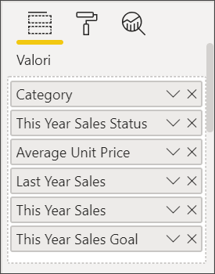
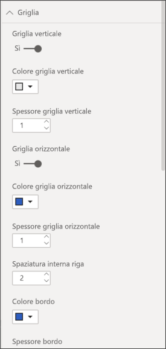
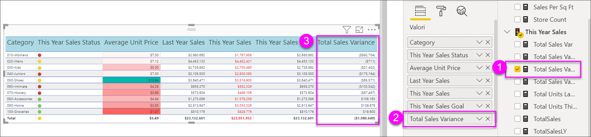

# Tabelle nei report e nei dashboard di Power BI

[!INCLUDE[consumer-appliesto-nyyn](../includes/consumer-appliesto-nyyn.md)]

[!INCLUDE [power-bi-visuals-desktop-banner](../includes/power-bi-visuals-desktop-banner.md)]

Una tabella è una griglia contenente dati correlati in una serie logica di righe e colonne. Può anche contenere intestazioni e una riga per i totali. Le tabelle sono particolarmente utili per i confronti quantitativi in cui si analizzano molti valori per una singola categoria. Ad esempio, questa tabella mostra cinque diverse misure per **Categoria**.

È possibile creare tabelle nei report e applicare l'evidenziazione incrociata degli elementi all'interno di una tabella con altri oggetti visivi nella stessa pagina del report. È anche possibile selezionare singole celle, colonne e righe e usare l'evidenziazione incrociata, nonché copiare e incollare singole celle e selezioni di più celle in altre applicazioni.

## Quando usare una tabella

Le tabelle rappresentano un'ottima scelta nelle seguenti situazioni:

* Per visualizzare e confrontare dati dettagliati e valori esatti (anziché rappresentazioni visive).

* Per visualizzare i dati in un formato tabulare.

* Per visualizzare i dati numerici per categorie.

## Prerequisito

Questa esercitazione usa il [file Retail Analysis Sample PBIX](https://download.microsoft.com/download/9/6/D/96DDC2FF-2568-491D-AAFA-AFDD6F763AE3/Retail%20Analysis%20Sample%20PBIX.pbix).

1. Nella sezione in alto a sinistra della barra dei menu selezionare **File** > **Apri**
   
2. Trovare la copia del **file Retail Analysis Sample PBIX**

1. Aprire il **file Retail Analysis Sample PBIX** nella visualizzazione report .

1. Seleziona  per aggiungere una nuova pagina.

> [!NOTE]
> Per condividere il report con un collega di Power BI, è necessario che entrambi gli utenti abbiano licenze di Power BI Pro individuali o che il report venga salvato nella capacità Premium.

## Creare una tabella

Si creerà la tabella raffigurata all'inizio dell'articolo per visualizzare i valori delle vendite per categoria di elemento.

1. Nel riquadro **Campi** selezionare **Elemento** > **Categoria**.

    Power BI crea automaticamente una tabella che elenca tutte le categorie.

    

1. Selezionare **Sales > Average Unit Price** (Vendite > Prezzo unitario medio) e **Sales > Last Year Sales** (Vendite > Vendite ultimo anno).

1. Selezionare quindi **Sales > This Year Sales** (Vendite > Vendite anno in corso) e tutte e tre le opzioni: **Valore**, **Obiettivo** e **Stato**.

1. Nel riquadro **Visualizzazioni** trovare l'area **Valori** e selezionare i valori finché l'ordine delle colonne del grafico non corrisponde alla prima immagine in questa pagina. Se necessario, trascinare i valori nell'area. L'area **Valori** dovrebbe avere un aspetto simile al seguente:

    

## Formattare la tabella

Esistono molti modi per formattare una tabella. In questo articolo ne sono descritti solo alcuni. Un ottimo modo per ottenere informazioni sulle altre opzioni di formattazione consiste nell'aprire il riquadro **Formato** (icona del rullo ) ed esplorare le opzioni disponibili.

* Provare a formattare la griglia della tabella. Si inserirà una griglia blu verticale, si aggiungerà spazio alle righe e si aumenteranno lievemente le dimensioni del profilo e del testo.

    

    

* Per le intestazioni di colonna, cambiare il colore di sfondo, aggiungere un profilo e aumentare la dimensione del carattere.

    

    

* È anche possibile applicare la formattazione a singole colonne e intestazioni di colonna. Per iniziare, espandere **Formattazione campi** e dall'elenco a discesa selezionare la colonna da formattare. A seconda dei valori di colonna, **Formattazione campi** consente di definire impostazioni come le unità visualizzate, il colore del carattere, il numero di posizioni decimali, lo sfondo, l'allineamento e altro ancora. Dopo aver modificato le impostazioni, decidere se applicarle anche all'intestazione e alla riga dei totali.

    

    

* Dopo alcune operazioni di formattazione aggiuntive, ecco la tabella definitiva.

    

### Formattazione condizionale

*Formattazione condizionale* è un tipo di formattazione. Power BI può applicare la formattazione condizionale a uno qualsiasi dei campi aggiunti nell'area **Valori** del riquadro **Visualizzazioni**.

Con la formattazione condizionale per le tabelle, è possibile specificare icone, URL, colori di sfondo delle celle e colori dei caratteri in base ai valori delle celle, inclusi i colori sfumati.

1. Nel riquadro **Formato** aprire la scheda **Formattazione condizionale**.

    

1. Selezionare un campo da formattare e impostare su Sì il dispositivo di scorrimento **Colore di sfondo**. Power BI applica una sfumatura in base ai valori nella colonna. Per modificare i colori predefiniti, selezionare **Controlli avanzati**.

    Se si seleziona l'opzione **Divergente**, è possibile configurare anche un valore **Centro** facoltativo.

    

    Di seguito saranno applicate alcune regole di formattazione personalizzata ai valori del prezzo unitario medio (Average Unit Price). Selezionare **Divergente**, aggiungere alcuni colori e scegliere **OK**.

    
1. Aggiungere un nuovo campo alla tabella che contiene valori sia positivi sia negativi. Selezionare **Sales > Total Sales Variance**.

    

1. Aggiungere la formattazione condizionale delle barre dei dati impostando su Sì il dispositivo di scorrimento **Barre dei dati**.  

    

1. Per personalizzare le barre dei dati, selezionare **Controlli avanzati**. Nella finestra di dialogo visualizzata impostare i colori di **Barra positiva** e **Barra negativa**, selezionare l'opzione **Mostra solo barra** e apportare le modifiche desiderate.

    

1. Seleziona **OK**.

    Le barre dei dati sostituiscono i valori numerici nella tabella, rendendo più semplice l'analisi.

    

1. Aggiungere indicatori visivi alla tabella con *icone condizionali*.  Nella scheda **Formattazione condizionale** selezionare **Vendite anno corrente** dall'elenco a discesa. Impostare su **Sì** il dispositivo di scorrimento **Icone**.  Per personalizzare le icone, selezionare **Controlli avanzati**.

    

## Copiare i valori dalle tabelle di Power BI per l'uso in altre applicazioni

La tabella o la matrice può avere contenuto che si desidera usare in altre applicazioni, ad esempio Dynamics CRM, Excel e anche altri report di Power BI. In Power BI, quando si fa clic con il pulsante destro del mouse all'interno di una cella, è possibile copiare negli Appunti i dati di una singola cella o di una selezione di celle e incollarli nelle altre applicazioni.

Per copiare il valore di una singola cella:

1. Selezionare la cella da copiare.

1. Fare clic con il pulsante destro del mouse all'interno della cella.

1. Selezionare **Copia** > **Copia valore**.

    

    Il valore della cella non formattato negli Appunti può essere incollato in un'altra applicazione.

Per copiare più celle:

1. Selezionare un intervallo di celle oppure premere **CTRL** per selezionare una o più celle.

1. Fare clic con il pulsante destro del mouse all'interno di una delle celle selezionate.

1. Selezionare **Copia** > **Copia selezione**.

    

## Regolare la larghezza della colonna di una tabella

A volte Power BI tronca un'intestazione di colonna in un report o un dashboard. Per visualizzare il nome della colonna per intero, passare il mouse sullo spazio a destra dell'intestazione in modo da visualizzare le doppie frecce, selezionare e trascinare.

## Considerazioni e risoluzione dei problemi

* Quando si applica la formattazione di colonna, è possibile scegliere una sola opzione di allineamento per colonna: **Automatico**, **A sinistra**, **Al centro**, **A destra**. In genere, una colonna contiene solo testo o solo numeri e non una combinazione di testo e numeri. Se una colonna contiene numeri e testo, l'opzione **Automatico** allinea il testo a sinistra e i numeri a destra. Questo comportamento supporta le lingue con lettura da sinistra a destra.

* Se i dati di testo nelle celle o nelle intestazioni della tabella contengono caratteri di nuova riga, questi caratteri vengono ignorati a meno che si selezioni l'opzione "Ritorno a capo automatico" nella scheda del riquadro di formattazione associato all'elemento. 

## Passaggi successivi

* [Mappe ad albero in Power BI](power-bi-visualization-treemaps.md)

* [Tipi di visualizzazione in Power BI](power-bi-visualization-types-for-reports-and-q-and-a.md)
