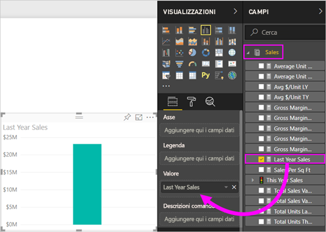
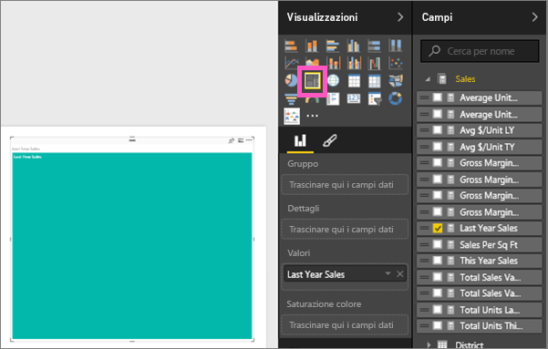
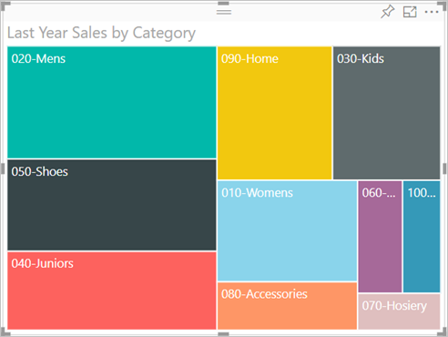
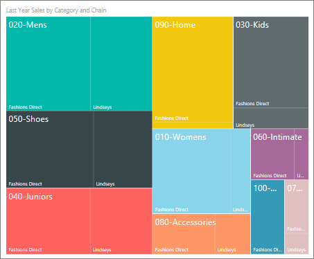
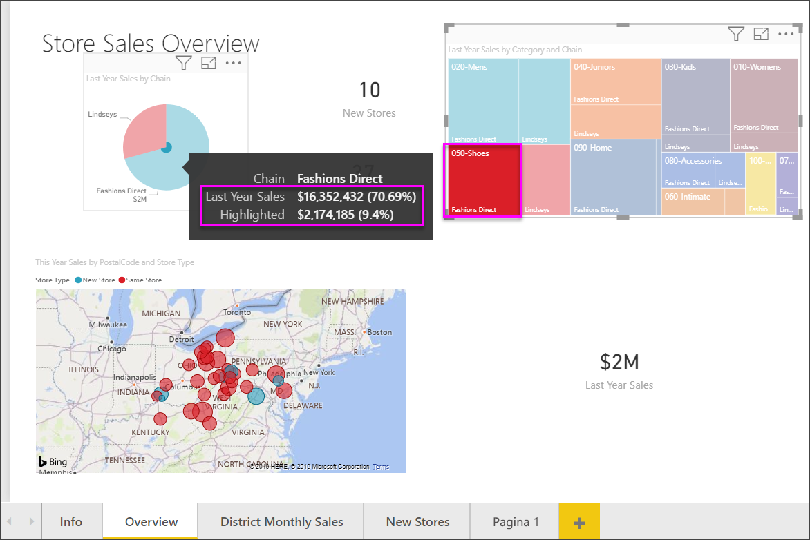

# Mappe ad albero in Power BI
Le mappe ad albero mostrano dati gerarchici in un set di rettangoli annidati.  Ogni livello della gerarchia è rappresentato da un rettangolo colorato (detto anche "ramo") che contiene altri rettangoli ("foglie").  Lo spazio all'interno di ogni rettangolo viene allocato in base al valore in corso di misurazione e i rettangoli vengono disposti per dimensione dall'angolo superiore sinistro (il più grande) all'angolo inferiore destro (il più piccolo).

Se, ad esempio, si analizzano le vendite, i rettangoli di livello superiore (detti anche *rami*) possono rappresentare le categorie di abbigliamento **Urban**, **Rural**, **Youth** e **Mix**.  I rettangoli delle categorie possono essere suddivisi in rettangoli più piccoli, detti anche *foglie*, che rappresentano i produttori di abbigliamento all'interno della rispettiva categoria. Le dimensioni e l'ombreggiatura di questi rettangoli più piccoli si basano sul numero di capi venduti.  

Nel ramo **Urban** citato in precedenza, è stato venduto un numero elevato di capi `Maximus`, un numero inferiore di capi `Natura` e `Fama` e un numero basso di capi `Leo`.  Il ramo **Urban** della mappa ad albero avrà quindi:
* il rettangolo più grande per `Maximus` nell'angolo superiore sinistro
* rettangoli leggermente più piccoli per `Natura` e `Fama`
* molti altri rettangoli per tutti gli altri capi venduti 
* un rettangolo molto piccolo per `Leo`.  

È anche possibile confrontare il numero di articoli venduti nelle altre categorie di abbigliamento confrontando le dimensioni e l'ombreggiatura di ogni nodo foglia: i rettangoli più grandi e più scuri rappresentano valori più alti.

## Quando usare una mappa ad albero
La mappe ad albero rappresentano un'ottima scelta nelle seguenti situazioni:

* per visualizzare grandi quantità di dati gerarchici.
* quando un grafico a barre non consente di gestire in modo efficiente un numero elevato di valori.
* per visualizzare le proporzioni tra le singole parti e l'insieme.
* per mostrare il modello di distribuzione della misura nei vari livelli di categorie nella gerarchia.
* per visualizzare gli attributi mediante la dimensione e la codifica a colori.
* per individuare modelli, outlier, elementi più importanti ed eccezioni.

### Prerequisiti
 - Servizio Power BI o Power BI Desktop
 - Esempio di analisi delle vendite al dettaglio

## Creare una mappa ad albero di base
Se si preferisce prima assistere alla creazione di una mappa ad albero,  Andare al minuto 2:10 di questo video per vedere come creare una mappa ad albero.

<iframe width="560" height="315" src="https://www.youtube.com/embed/IkJda4O7oGs" frameborder="0" allowfullscreen></iframe>

In alternativa, creare autonomamente una mappa ad albero personalizzata. Per queste istruzioni si usa l'esempio di analisi delle vendite al dettaglio. Per seguire la procedura, accedere al servizio Power BI e selezionare **Recupera dati \> Esempi \> Esempio di analisi delle vendite al dettaglio \> Connetti \> Vai al dashboard**. Per creare visualizzazioni in un report sono necessarie autorizzazioni di modifica per il set di dati e il report. Fortunatamente, gli esempi di Power BI sono modificabili. Ma non è possibile aggiungere visualizzazioni a un report che un altro utente ha condiviso con l'utente corrente.  

1. Selezionare il riquadro "Total Stores" per aprire il report di esempio di analisi delle vendite al dettaglio.    
2. Aprire la [visualizzazione di modifica](../service-interact-with-a-report-in-editing-view.md) e selezionare la misura **Sales** > **Last Years Sales**.   
      
3. Convertire il grafico in una mappa ad albero.  
      
4. Trascinare **Item** > **Category** nell'area **Gruppo**. Power BI crea una mappa ad albero in cui le dimensioni dei rettangoli si basano sul totale delle vendite e in cui il colore rappresenta la categoria.  In sintesi, è stata creata una gerarchia che descrive visivamente la dimensione relativa del totale delle vendite per categoria.  La categoria **Mens** è quella con il volume di vendite maggiore, mentre la categoria **Hosiery** è quella con il volume minore.   
      
5. Trascinare**Store** > **Chain** nell'area **Dettagli** per completare la mappa ad albero. A questo punto è possibile confrontare le vendite dell'anno per categoria e catena.   
   
   
   > [!NOTE]
   > Le opzioni Saturazione colore e Dettagli non possono essere usate contemporaneamente.
   > 
   > 
5. Passare il mouse su un’area **Chain** per visualizzare la descrizione comando per la parte del titolo della **Categoria**.  Se ad esempio si posiziona il mouse su **Fashions Direct** nel rettangolo **090-Home**, viene visualizzata la descrizione comando per la parte relativa a Fashions Direct della categoria Home.  
   
6. [Aggiungere la mappa ad albero come riquadro del dashboard (aggiungendo l'oggetto visivo)](../service-dashboard-tiles.md). 
7. [Salvare il report](../service-report-save.md).

## Evidenziazione e filtro incrociato
Per informazioni sull'uso del riquadro Filtri, vedere [Aggiungere un filtro a un report](../power-bi-report-add-filter.md).

Se si evidenzia una categoria o un dettaglio in una mappa ad albero, vengono applicati l'evidenziazione incrociata e i filtri incrociati nelle altre visualizzazioni della pagina del report e viceversa. Per seguire la procedura, aggiungere alcuni oggetti visivi alla pagina del report o copiare la mappa ad albero in una delle altre pagine non vuote in questo report.

1. Nella mappa ad albero selezionare una voce Category o Chain all'interno di una categoria.  per evidenziare in modo incrociato le altre visualizzazioni nella pagina. Se ad esempio si seleziona **050-Shoes**, viene mostrato che l'anno scorso sono state vendute scarpe per 3.640.471 dollari, di cui 2.174.185 dollari riferiti a Fashions Direct.  
   

2. Nel grafico a torta **Last Year Sales by Chain** selezionare la sezione **Fashions Direct** per applicare un filtro incrociato alla mappa ad albero.  
       

3. Per gestire il modo in cui i grafici si evidenziano e applicano i filtri incrociati tra di loro, vedere [Interazioni tra le visualizzazioni in un report di Power BI](../service-reports-visual-interactions.md).

## Passaggi successivi

[Grafici a cascata in Power BI](power-bi-visualization-waterfall-charts.md)

[Tipi di visualizzazione in Power BI](power-bi-visualization-types-for-reports-and-q-and-a.md)