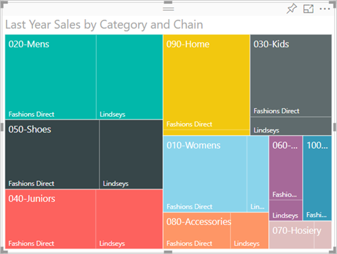

# Mappe ad albero in Power BI

[!INCLUDE [power-bi-visuals-desktop-banner](../includes/power-bi-visuals-desktop-banner.md)]

Le mappe ad albero mostrano dati gerarchici in un set di rettangoli annidati. Ogni livello della gerarchia è rappresentato da un rettangolo colorato (ramo) che contiene rettangoli più piccoli (foglie). Power BI basa le dimensioni dello spazio all'interno di ogni rettangolo sul valore misurato. I rettangoli vengono disposti per dimensioni dall'angolo superiore sinistro (il più grande) all'angolo inferiore destro (il più piccolo).

Ad esempio, per l'analisi delle vendite potrebbero essere disponibili rami di primo livello per le categorie di abbigliamento: **Urban**, **Rural**, **Youth** e **Mix**. Power BI suddividerebbe i rettangoli delle categorie in foglie, per i produttori di abbigliamento all'interno di tale categoria. I rettangoli foglia verrebbero dimensionati e ombreggiati in base al numero di articoli venduti.

Nel ramo **Urban** citato in precedenza, è stato venduto un numero elevato di capi **VanArsdel**, un numero minore di capi **Natura** e **Fama** e solo pochi capi **Leo**. Il ramo **Urban** della mappa ad albero ha quindi:

* Il rettangolo più grande per **VanArsdel** nell'angolo superiore sinistro.

* Rettangoli leggermente più piccoli per **Natura** e **Fama**.

* Molti altri rettangoli per tutti gli altri capi venduti.

* Un rettangolo molto piccolo per **Leo**.

È anche possibile confrontare il numero di articoli venduti nelle altre categorie di abbigliamento confrontando le dimensioni e l'ombreggiatura di ogni nodo foglia: i rettangoli più grandi e più scuri rappresentano valori più alti.

Se si preferisce prima assistere alla creazione di una mappa ad albero, Andare al minuto 2:10 di questo video per vedere come creare una mappa ad albero.

   > [!NOTE]
   > Questo video usa una versione precedente di Power BI Desktop.
   > 
   > 

<iframe width="560" height="315" src="https://www.youtube.com/embed/IkJda4O7oGs" frameborder="0" allowfullscreen></iframe>

## Quando usare una mappa ad albero

La mappe ad albero rappresentano un'ottima scelta nelle seguenti situazioni:

* Per visualizzare grandi quantità di dati gerarchici.

* Quando un grafico a barre non consente di gestire in modo efficiente un numero di valori elevato.

* Per visualizzare le proporzioni tra le singole parti e l'insieme.

* Per mostrare il modello di distribuzione della misura nei vari livelli di categorie nella gerarchia.

* Per visualizzare gli attributi mediante le dimensioni e la codifica a colori.

* Per individuare modelli, outlier, elementi con il maggiore contributo ed eccezioni.

## Prerequisito

Questa esercitazione usa il [file Retail Analysis Sample PBIX](https://download.microsoft.com/download/9/6/D/96DDC2FF-2568-491D-AAFA-AFDD6F763AE3/Retail%20Analysis%20Sample%20PBIX.pbix).

1. Nella sezione in alto a sinistra della barra dei menu selezionare **File** > **Apri**
   
2. Trovare la copia del **file Retail Analysis Sample PBIX**

1. Aprire il **file Retail Analysis Sample PBIX** nella visualizzazione report .

1. Select  per aggiungere una nuova pagina.

Dopo avere scaricato il set di dati **Retail Analysis Sample**, è possibile iniziare.

## Creare una mappa ad albero di base

Verrà creato un report e si aggiungerà una mappa ad albero semplice.

1. Dal riquadro **Campi** selezionare la misura **Sales** > **Last Year Sales**.

   

1. Selezionare l'icona della mappa ad albero  per convertire il grafico in una mappa ad albero.

   

1. Selezionare **Elemento** > **Categoria** per aggiungere **Categoria** all'area **Gruppo**.

    Power BI crea una mappa ad albero in cui le dimensioni dei rettangoli si basano sul totale delle vendite e in cui il colore rappresenta la categoria. In sintesi, è stata creata una gerarchia che descrive visivamente la dimensione relativa del totale delle vendite per categoria. La categoria **Mens** è quella con il volume di vendite maggiore, mentre la categoria **Hosiery** è quella con il volume minore.

    

1. Selezionare **Store** > **Chain** per aggiungere **Chain** nell’area **Dettagli** per completare la mappa ad albero. A questo punto è possibile confrontare le vendite dell'anno per categoria e catena.

   

   > [!NOTE]
   > Le opzioni Saturazione colore e Dettagli non possono essere usate contemporaneamente.

1. Passare il mouse su un’area **Chain** per visualizzare la descrizione comando per la parte del titolo della **Categoria**.

    Se ad esempio si posiziona il mouse su **Fashions Direct** nel rettangolo **090-Home**, viene visualizzata la descrizione comando per la parte relativa a Fashions Direct della categoria Home.

   

## Evidenziazione e filtro incrociato

Se si evidenzia una **categoria** o un **dettaglio** in una mappa ad albero, vengono applicati l'evidenziazione incrociata e i filtri incrociati nelle altre visualizzazioni nella pagina del report. Per seguire la procedura, aggiungere alcuni oggetti visivi alla pagina del report o copiare la mappa ad albero in una delle altre pagine in questo report. La mappa ad albero illustrata di seguito è stata copiata nella pagina **Overview**. 

1. Nella mappa ad albero selezionare una voce **Category** o **Chain** all'interno di una **categoria**. Verrà applicata l'evidenziazione incrociata alle altre visualizzazioni nella pagina. Se si seleziona **050-Shoes**, ad esempio, viene mostrato che l'anno scorso sono state vendute scarpe per **16.352.432** dollari, di cui **2.174.185** dollari riferiti a **Fashions Direct**.

   

1. Nel grafico a torta **Last Year Sales by Chain** selezionare la sezione **Fashions Direct** per applicare un filtro incrociato alla mappa ad albero.
   

1. Per gestire il modo in cui i grafici applicano reciprocamente l'evidenziazione incrociata e il filtro incrociato, vedere [Modificare l'interazione degli oggetti visivi in un report di Power BI](../service-reports-visual-interactions.md).

## Passaggi successivi

* [Grafici a cascata in Power BI](power-bi-visualization-waterfall-charts.md)

* [Tipi di visualizzazione in Power BI](power-bi-visualization-types-for-reports-and-q-and-a.md)
