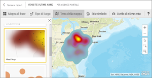

# Tipi di visualizzazione in Power BI
## Visualizzazioni di Power BI
Verranno presto aggiunte nuove visualizzazioni.

Visitare [Microsoft AppSource](https://appsource.microsoft.com/marketplace/apps?product=power-bi-visuals), dove è possibile trovare un elenco costantemente aggiornato di [oggetti visivi personalizzati](../power-bi-custom-visuals.md) da scaricare e usare nei propri dashboard e report. Approccio creativo [Informazioni su come creare oggetti visivi personalizzati e aggiungerli al sito della community](../developer/office-store.md).  

## Elenco delle visualizzazioni disponibili in Power BI
Tutte queste visualizzazioni possono essere aggiunte ai report di Power BI, specificate in domande e risposte e aggiunte al dashboard.

### Grafici ad area: di base (su più livelli) e in pila

>[!TIP]
>Il grafico ad area di base si basa sul grafico a linee, in cui l'area compresa tra l'asse e la linea viene riempita.

Per altre informazioni, vedere [Grafico ad aree di base](power-bi-visualization-basic-area-chart.md).

### Grafici a barre e istogrammi

 

>[!TIP]
>I grafici a barre sono l'impostazione standard per esaminare un valore specifico in categorie diverse.

### Schede: con più righe

### Schede: con numero singolo

Per altre informazioni [Creare una scheda (riquadro per numeri elevati)](power-bi-visualization-card.md).

### Grafici combinati

>[!TIP]
>Un grafico combinato combina un istogramma e un grafico a linee. Scegliere *Grafico a linee e istogramma a colonne in pila* o *Grafico a linee e istogramma a colonne raggruppate*.

Per altre informazioni, vedere [Grafici combinati in Power BI](power-bi-visualization-combo-chart.md).

### Grafici ad anello

>[!TIP]
>I grafici ad anello sono simili ai grafici a torta.  Indicano la relazione delle parti a un intero.

Per altre informazioni, vedere [Grafici ad anello in Power BI](power-bi-visualization-doughnut-charts.md).

### Grafici a imbuto

>[!TIP]
>I grafici a imbuto aiutano a visualizzare un processo caratterizzato da fasi e da un flusso sequenziale di elementi da una fase a quella successiva.  Usare un grafico a imbuto quando esiste un flusso sequenziale tra fasi, ad esempio un processo di vendita che inizia con i lead e termina con l'evasione dell'ordine di acquisto.

Per altre informazioni, vedere [Grafici a imbuto in Power BI](power-bi-visualization-funnel-charts.md).

### Grafici di misuratore

>[!TIP]
>Visualizza lo stato corrente nel contesto di un obiettivo.

Per altre informazioni, vedere [Grafici a misuratore radiale in Power BI](power-bi-visualization-radial-gauge-charts.md).

### Grafico dei fattori di influenza chiave

Un grafico dei fattori di influenza chiave visualizza i collaboratori principali di un risultato o valore selezionato.

Per altre informazioni, vedere [Grafici dei fattori di influenza chiave in Power BI](power-bi-visualization-influencers.md)

### Indicatori KPI

>[!TIP]
>Visualizza lo stato di avanzamento verso un obiettivo misurabile.

Per altre informazioni, vedere [Indicatori KPI in Power BI](power-bi-visualization-kpi.md).

### Grafici a linee

>[!TIP]
>Evidenziano la forma complessiva di un'intera serie di valori, in genere nel tempo.

### Mappe: mappe di base

>[!TIP]
>Vengono usate per associare informazioni categoriche e quantitative a posizioni nello spazio.

Per altre informazioni, vedere l'articolo relativo a [suggerimenti e consigli per le visualizzazioni mappa](power-bi-map-tips-and-tricks.md).

### Mappe: Mappe di ArcGIS

Per altre informazioni, vedere [Mappe ArcGIS in Power BI](power-bi-visualization-arcgis.md).

### Mappe: mappe colorate (Choropleth)

>[!TIP]
>Più intenso è il colore, maggiore è il valore.

Per altre informazioni, vedere [Mappe colorate in Power BI](power-bi-visualization-filled-maps-choropleths.md).

### Mappe: mappe delle forme

>[!TIP]
>Confronta le aree in base al colore.

Per altre informazioni, vedere [Mappe delle forme in Power BI](desktop-shape-map.md).

### Matrice

>[!TIP]
>Una tabella supporta due dimensioni, ma una matrice rende più semplice visualizzare i dati in modo significativo su più dimensioni, supportando un layout con rientri. La matrice aggrega automaticamente i dati e consente il drill-down. 

Per altre informazioni, vedere [Oggetti visivi matrice in Power BI](desktop-matrix-visual.md).

### Grafici a torta

>[!TIP]
>I grafici a torta indicano la relazione tra un intero e le parti. 

### Oggetti visivi script R

>[!TIP]
>Gli oggetti visivi creati con gli script R, comunemente denominati *oggetti visivi R*, possono presentare funzionalità avanzate di modifica della forma dei dati e analisi, ad esempio le previsioni, usando le funzionalità avanzate di analisi e visualizzazione di R. Gli oggetti visivi R possono essere creati in Power BI Desktop e pubblicati nel servizio Power BI.   

Per altre informazioni, vedere [Oggetti visivi R in Power BI](service-r-visuals.md).

### Grafico a nastri

>[!TIP]
>I grafici a nastri indicano quale categoria di dati ha il rango più elevato (il valore più grande). I grafici a nastri rappresentano una valida opzione nella visualizzazione delle variazioni di posizione, con il valore massimo visualizzato sempre in cima per ogni periodo di tempo.

Per altre informazioni, vedere [Grafici a nastri in Power BI](desktop-ribbon-charts.md).

### Grafici a dispersione e a bolle

>[!TIP]
>Visualizzare le relazioni tra 2 (a dispersione) o 3 (bolla) misure quantitative, come si verificano, in quale ordine e così via.

Per altre informazioni, vedere [Grafici a dispersione in Power BI](power-bi-visualization-scatter.md).

### Grafico a dispersione - Alta densità

>[!TIP]
>Troppi punti dati in un oggetto visivo possono bloccarlo. Per garantire l'accuratezza della visualizzazione, viene quindi usato un algoritmo di campionamento sofisticato.

Per altre informazioni, vedere [Grafici a dispersione ad alta densità in Power BI](desktop-high-density-scatter-charts.md).

### Filtri dei dati

Per altre informazioni, vedere [Filtri dei dati in Power BI](power-bi-visualization-slicers.md).

### Immagini autonome

Per altre informazioni, vedere [Aggiungere un widget di immagine a un dashboard](../service-dashboard-add-widget.md).

### Tabelle

>[!TIP]
>Funzionano correttamente con confronti quantitativi tra elementi in cui sono presenti molte categorie.

Per altre informazioni, vedere [Utilizzare le tabelle in Power BI](power-bi-visualization-tables.md).

### Mappe ad albero

Per altre informazioni, vedere [Mappe ad albero in Power BI](power-bi-visualization-treemaps.md).

>[!TIP]
>Sono grafici di rettangoli colorati, con dimensione che rappresenta valore.  Possono essere gerarchici, con rettangoli nidificati all'interno di rettangoli principali.

### Grafici a cascata

>[!TIP]
>I grafici a cascata mostrano il totale aggiornato ogni volta che si aggiungono o sottraggono valori.

Per altre informazioni, vedere [Grafici a cascata in Power BI](power-bi-visualization-waterfall-charts.md).

## Indicare a Domande e risposte quali visualizzazioni usare
Quando si digitano query in linguaggio naturale con le Domande e risposte di Power BI, è possibile specificare il tipo di visualizzazione;  ad esempio:

“***sales by state as a treemap***“

## Passaggi successivi
[Visualizzazioni nei report di Power BI](power-bi-report-visualizations.md)    
[Riferimento all'oggetto visivo a destra da sqlbi.com](http://www.sqlbi.com/wp-content/uploads/videotrainings/dashboarddesign/visuals-reference-may2017-A3.pdf)