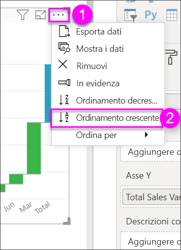

# Grafici a cascata in Power BI

I grafici a cascata mostrano il totale aggiornato ogni volta che Power BI aggiunge e sottrae valori. Sono utili per comprendere in che modo un valore iniziale (ad esempio, il reddito netto) è interessato da una serie di modifiche positive e negative.

Le colonne sono contraddistinte dal colore per poter notare rapidamente gli aumenti e le diminuzioni. Le colonne del valore iniziale e del valore finale spesso [iniziano sull'asse orizzontale](https://support.office.com/article/Create-a-waterfall-chart-in-Office-2016-for-Windows-8de1ece4-ff21-4d37-acd7-546f5527f185#BKMK_Float "iniziano sull’asse orizzontale"), mentre i valori intermedi sono colonne mobili. In virtù di questo stile, i grafici a cascata sono noti anche come grafici a ponte.

<iframe width="560" height="315" src="https://www.youtube.com/embed/qKRZPBnaUXM" frameborder="0" allow="autoplay; encrypted-media" allowfullscreen></iframe>

## Quando usare un grafico a cascata

I grafici a cascata rappresentano un'ottima scelta nelle seguenti situazioni:

* In presenza di modifiche per la misura nel tempo, per una serie o per categorie diverse.

* Per controllare le principali modifiche che contribuiscono a determinare il valore totale.

* Per rappresentare graficamente il profitto annuo di un'azienda mostrando le varie fonti di ricavi e calcolare il profitto (o la perdita) totale.

* Per illustrare il numero di dipendenti iniziale e finale dell'azienda in un anno.

* Per visualizzare la quantità di denaro incassata e spesa ogni mese e il saldo corrente per il proprio conto.

## Prerequisiti

* Servizio Power BI o Power BI Desktop

* Report Retail Analysis Sample

## Ottenere il report Retail Analysis Sample

Per queste istruzioni si usa l'esempio di analisi delle vendite al dettaglio. Per creare una visualizzazione sono necessarie autorizzazioni di modifica per il set di dati e per il report. Fortunatamente, gli esempi di Power BI sono tutti modificabili. Non è possibile creare visualizzazioni nei report condivisi da altri utenti. Per seguire la procedura, scaricare il [report Retail Analysis Sample](../sample-datasets.md).

Dopo avere scaricato il set di dati **Retail Analysis Sample**, è possibile iniziare.

## Creare un grafico a cascata

Verrà creato un grafico a cascata che visualizza la varianza delle vendite (confronto tra vendite stimate ed effettive) per mese.

1. Da **Area di lavoro personale** selezionare **Set di dati** > **Crea report**.

    

1. Dal riquadro **Campi** selezionare **Sales** > **Total Sales Variance**.

   

1. Selezionare l'icona del grafico a cascata  per convertire il grafico in una mappa ad albero.

    Se **Total Sales Variance** non è presente nell'area **Asse Y**, trascinarlo in quell'area.

    

1. Selezionare **Time** > **FiscalMonth** per aggiungerlo all'area **Categoria**.

    

1. Assicurarsi che Power BI abbia ordinato il grafico a cascata in ordine cronologico. Selezionare i puntini di sospensione (...) nell'angolo superiore destro del grafico.

    Verificare che vi sia un indicatore giallo a sinistra delle opzioni **Ordinamento crescente** e **FiscalMonth**

    

    È anche possibile esaminare i valori dell'asse X e vedere che sono in ordine da **Jan** ad **Aug**.

    Approfondire ulteriormente per scoprire qual è il fattore che contribuisce maggiormente ai cambiamenti da un mese all'altro.

1. Trascinare **Store** > **Territory** sul bucket **Breakdown**.

    

    Per impostazione predefinita, Power BI aggiunge i primi cinque territori che contribuiscono agli aumenti o alle diminuzioni ogni mese.

    

    In questo caso si è interessati solo ai primi due.

1. Nel riquadro **Formato** selezionare **Scomposizione** e impostare **Numero massimo scomposizioni** su **2**.

    

    Una rapida analisi rivela che i territori di Ohio e Pennsylvania sono quelli che contribuiscono maggiormente agli spostamenti, sia negativi che positivi, nel grafico a cascata.

    

    È una scoperta interessante. Ohio e Pennsylvania hanno un notevole impatto perché le vendite in questi due territori sono molto più elevate rispetto agli altri territori? È possibile scoprirlo.

1. Creare una mappa che esamini il valore delle vendite per l'anno in corso e quello delle vendite dell'anno precedente per territorio.

    

    La mappa supporta la teoria perché mostra che questi due territori hanno avuto il valore di vendite più alto lo scorso anno (dimensioni bolla) e quest'anno (ombreggiatura bolla).

## Evidenziazione e filtro incrociato

Per informazioni sull'uso del riquadro **Filtri**, vedere [Aggiungere un filtro a un report nella visualizzazione di modifica](../power-bi-report-add-filter.md).

Evidenziando una colonna in un grafico a cascata viene applicato il filtro incrociato nelle altre visualizzazioni nella pagina del report e viceversa. Tuttavia, la colonna **Totale** non attiva l'evidenziazione e non risponde al filtro incrociato.

## Passaggi successivi

* [Modificare l'interazione degli oggetti visivi in un report di Power BI](../service-reports-visual-interactions.md)

* [Tipi di visualizzazione in Power BI](power-bi-visualization-types-for-reports-and-q-and-a.md)
