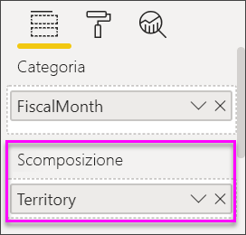

# Grafici a cascata in Power BI

[!INCLUDE [power-bi-visuals-desktop-banner](../includes/power-bi-visuals-desktop-banner.md)]

I grafici a cascata mostrano il totale aggiornato ogni volta che Power BI aggiunge e sottrae valori. Sono utili per comprendere in che modo un valore iniziale (ad esempio, il reddito netto) è interessato da una serie di modifiche positive e negative.

Le colonne sono contraddistinte dal colore per poter notare rapidamente gli aumenti e le diminuzioni. Le colonne del valore iniziale e del valore finale spesso [iniziano sull'asse orizzontale](https://support.office.com/article/Create-a-waterfall-chart-in-Office-2016-for-Windows-8de1ece4-ff21-4d37-acd7-546f5527f185#BKMK_Float "iniziano sull’asse orizzontale"), mentre i valori intermedi sono colonne mobili. In virtù di questo stile, i grafici a cascata sono noti anche come grafici a ponte.

   > [!NOTE]
   > Questo video usa una versione precedente di Power BI Desktop.
   > 
   > 

<iframe width="560" height="315" src="https://www.youtube.com/embed/qKRZPBnaUXM" frameborder="0" allow="autoplay; encrypted-media" allowfullscreen></iframe>

## Quando usare un grafico a cascata

I grafici a cascata rappresentano un'ottima scelta nelle seguenti situazioni:

* In presenza di modifiche per la misura nel tempo, per una serie o per categorie diverse.

* Per controllare le principali modifiche che contribuiscono a determinare il valore totale.

* Per rappresentare graficamente il profitto annuo di un'azienda mostrando le varie fonti di ricavi e calcolare il profitto (o la perdita) totale.

* Per illustrare il numero di dipendenti iniziale e finale dell'azienda in un anno.

* Per visualizzare la quantità di denaro incassata e spesa ogni mese e il saldo corrente per il proprio conto.

## Prerequisito

Questa esercitazione usa il [file Retail Analysis Sample PBIX](http://download.microsoft.com/download/9/6/D/96DDC2FF-2568-491D-AAFA-AFDD6F763AE3/Retail%20Analysis%20Sample%20PBIX.pbix).

1. Nella sezione in alto a sinistra della barra dei menu selezionare **File** > **Apri**
   
2. Trovare la copia del **file Retail Analysis Sample PBIX**

1. Aprire il **file Retail Analysis Sample PBIX** nella visualizzazione report .

1. Seleziona  per aggiungere una nuova pagina.

## Creare un grafico a cascata

Verrà creato un grafico a cascata che visualizza la varianza delle vendite (confronto tra vendite stimate ed effettive) per mese.

1. Dal riquadro **Campi** selezionare **Sales** > **Total Sales Variance**.

   

1. Selezionare l'icona del grafico a cascata 

    

1. Selezionare **Time** > **FiscalMonth** per aggiungerlo all'area **Categoria**.

    

1. Assicurarsi che Power BI abbia ordinato il grafico a cascata in ordine cronologico. Selezionare i puntini di sospensione (...) nell'angolo superiore destro del grafico.

    Per questo esempio si selezionerà **Ordinamento crescente**

    Verificare che sia presente un indicatore giallo a sinistra di **Ordinamento crescente**. Ciò indica che l'opzione selezionata viene applicata.

    

    Fare quindi clic su **Ordina per** e selezionare **FiscalMonth**. Come nel passaggio precedente, un indicatore giallo accanto alla selezione indica quando l'opzione di selezione viene applicata.

    

    È anche possibile esaminare i valori dell'asse X e vedere che sono in ordine da **Jan** ad **Aug**.

    Approfondire ulteriormente per scoprire qual è il fattore che contribuisce maggiormente ai cambiamenti da un mese all'altro.

1.  Selezionare **Store** > **Territory** per aggiungere **Territory** al bucket **Scomposizione**.

    

    Per impostazione predefinita, Power BI aggiunge i primi cinque territori che contribuiscono agli aumenti o alle diminuzioni ogni mese. Nell'immagine seguente il riquadro visualizzazione è stato espanso per includere più dati. 

    

    In questo caso si è interessati solo ai primi due.

1. Nel riquadro **Formato** selezionare **Scomposizione** e impostare **Numero massimo scomposizioni** su **2**.

    

    Una rapida analisi rivela che i territori di Ohio e Pennsylvania sono quelli che contribuiscono maggiormente agli spostamenti, sia negativi che positivi, nel grafico a cascata.

    

## Passaggi successivi

* [Modificare l'interazione degli oggetti visivi in un report di Power BI](../service-reports-visual-interactions.md)

* [Tipi di visualizzazione in Power BI](power-bi-visualization-types-for-reports-and-q-and-a.md)
