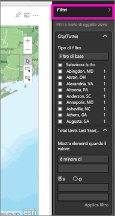
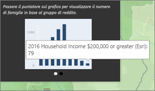
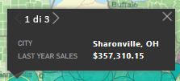

# Interazione con le mappe ArcGIS in Power BI
Questo argomento è stato scritto dal punto di vista di una persona che *utilizza* una mappa ArcGIS nel servizio Power BI, in Power BI Desktop o in Power BI per dispositivi mobili. Quando l'autore condivide una mappa ArcGIS con l'utente, è possibile interagire con essa in svariati modi.  Per altre informazioni sulla creazione di una mappa ArcGIS, vedere l'[esercitazione Mappe di ArcGIS di Esri](../power-bi-visualization-arcgis.md).

Dalla combinazione tra le mappe ArcGIS e Power BI nasce una soluzione di mapping di livello superiore, che non si limita alla presentazione di punti su una mappa. Le opzioni disponibili tra mappe di base, tipi di posizione, temi, stili per i simboli e livelli di riferimento aiutano a creare visualizzazioni mappa ricche di dettagli e di grande impatto visivo. La combinazione di livelli di dati autorevoli (ad esempio dati di censimento) su una mappa con l'analisi spaziale consente di ottenere informazioni più approfondite sui dati nella visualizzazione.

> [!TIP]
> GIS è l'acronimo per Geographic Information Science (Scienza delle informazioni geografiche).
> 

L'esempio illustrato corrisponde alla mappa ArcGIS creata nell'[esercitazione Mappe di ArcGIS di Esri](../power-bi-visualization-arcgis.md), che prende in esame le vendite dello scorso anno in base alla città e usa una mappa base delle strade, simboli di bolle per la rappresentazione delle dimensioni e un livello di riferimento per il reddito familiare medio. La mappa contiene tre puntine e il raggio del tempo di guida (in viola).

> [!TIP]
> Visitare la [pagina di Esri su Power BI](https://www.esri.com/powerbi) per trovare molti esempi e leggere testimonianze. Vedere quindi l'[introduzione a Mappe ArcGIS per Power BI](https://doc.arcgis.com/en/maps-for-powerbi/get-started/about-maps-for-power-bi.htm) fornita da Esri.
> 
> 

 

## Consenso dell'utente
La prima volta che un collega condivide una mappa ArcGIS, Power BI visualizzerà un prompt dei comandi. ArcGIS Maps for Power BI è fornito da Esri (www.esri.com) e il relativo uso è soggetto alle condizioni e all'informativa sulla privacy di Esri. Gli utenti di Power BI che vogliono usare le mappe ArcGIS per gli oggetti visivi di Power BI devono confermare il proprio consenso nell'apposita finestra.

## Strumenti di selezione
Mappe ArcGIS per Power BI consente tre modalità di selezione. È possibile selezionare un massimo di 250 punti dati alla volta.

 Selezionare singoli punti dati.

 Disegna un rettangolo sulla mappa e seleziona i punti dati in essi contenuti. Usare CTRL per selezionare più aree rettangolari.

 Consente di usare i limiti o i poligoni all'interno dei layer di riferimento per selezionare i punti dati in essi contenuti.

 

## Interazione con una mappa ArcGIS
Le funzionalità disponibili variano a seconda che si sia l'*autore* (persona che ha creato la mappa) o il *consumatore* (qualcuno che ha condiviso una mappa ArcGIS qualcuno con l'utente). Se si interagisce con una mappa ArcGIS come consumatore, ovvero in [Visualizzazione di lettura](../consumer/end-user-reading-view.md), ecco le azioni disponibili.

* Come con altri tipi di visualizzazione, è possibile [aggiungere ai dashboard](../service-dashboard-pin-tile-from-report.md), [visualizzare](../consumer/end-user-show-data.md) e/o [esportare i dati sottostanti](power-bi-visualization-export-data.md) e visualizzare la mappa in [modalità messa a fuoco](../consumer/end-user-focus.md) e a [schermo intero](../service-fullscreen-mode.md).    
* Espandere il riquadro **Filtri** per esplorare la mappa usando i filtri. Quando si chiude il report, i filtri che sono stati applicati non vengono salvati.    
      
* Se la mappa ha un livello di riferimento, selezionare le posizioni per visualizzare i dettagli in una descrizione comando. In questo caso, è stata selezionata Adams County e sono visualizzati i dati del livello di riferimento sul reddito familiare medio che l'autore ha aggiunto alla mappa.
  
      
  
    Anche in questo caso si ottiene un grafico. Selezionare una barra nel grafico per analizzare i dati. Vengono visualizzate 79 famiglie in Adams County che guadagnano almeno 200.000 USD.
  
    
  
    Selezionare la freccia per visualizzare tutti i grafici aggiuntivi.
* Passare il mouse sui simboli di posizione della mappa base per visualizzare i dettagli in una descrizione comando.     
  
  
  > [!TIP]
  > Può essere necessario ingrandire per selezionare una posizione specifica.  Se invece le posizioni si sovrappongono, Power BI potrebbe presentare più descrizioni comando alla volta. Selezionare le frecce per spostarsi tra le descrizioni comandi
  > 
  > 
  > 
  > 
* Se l'autore ha aggiunto un livello Infografiche alla mappa ArcGIS, verranno visualizzati dati aggiuntivi nell'angolo superiore destro della mappa.  Ad esempio, in questo caso l'autore della mappa ha aggiunto "Children under 14" (Minori di 14 anni).
  
    

## Considerazioni e limitazioni
Mappe ArcGIS per Power BI è disponibile nei seguenti servizi e applicazioni:

<table>
<tr><th>Servizio/App</th><th>Disponibilità</th></tr>
<tr>
<td>Power BI Desktop</td>
<td>Sì</td>
</tr>
<tr>
<td>Servizio Power BI (app.powerbi.com)</td>
<td>Sì</td>
</tr>
<tr>
<td>App Power BI per dispositivi mobili</td>
<td>Sì</td>
</tr>
<tr>
<td>Pubblica sul Web di Power BI</td>
<td>No</td>
</tr>
<tr>
<td>Power BI Embedded</td>
<td>No</td>
</tr>
<tr>
<td>Incorporamento del servizio Power BI (PowerBI.com)</td>
<td>No</td>
</tr>
</table>

**Come funziona ArcGIS Maps for Power BI?**
ArcGIS Maps for Power BI è fornito da Esri (www.esri.com). L'uso di ArcGIS Maps for Power BI è soggetto alle [condizioni](https://go.microsoft.com/fwlink/?LinkID=8263222) e all'[informativa sulla privacy](https://go.microsoft.com/fwlink/?LinkID=826323) di Esri. Gli utenti di Power BI che vogliono usare le mappe di ArcGIS per gli oggetti visivi di Power BI devono confermare il proprio consenso nell'apposita finestra. Per informazioni dettagliate, vedere Consenso dell'utente.  L'uso di ArcGIS Maps for Power BI di Esri è soggetti alle condizioni e all'informativa sulla privacy di Esri a cui è possibile accedere anche dal collegamento presente nella finestra di dialogo del consenso. Ogni utente deve confermare il proprio consenso prima di usare ArcGIS Maps for Power BI per la prima volta. Dopo che l'utente ha confermato il proprio consenso, i dati associati all'oggetto visivo vengono inviati ai servizi di Esri almeno per la geocodifica, ovvero la trasformazione delle informazioni sulla località in informazioni su latitudine e longitudine che possono essere rappresentate in una mappa. È probabile che i dati associati alla visualizzazione possano essere inviati ai servizi di Esri. Esri fornisce servizi come mappe di base, analisi spaziale, geocodifica e così via. L'oggetto visivo ArcGIS Maps for Power BI interagisce con questi servizi usando una connessione SSL protetta da un certificato fornito e gestito da Esri. Per altre informazioni su ArcGIS Maps for Power BI, vedere la [pagina del prodotto ArcGIS Maps for Power BI](https://www.esri.com/powerbi) di Esri.

Quando un utente si iscrive a una sottoscrizione Plus offerta da Esri tramite ArcGIS Maps for Power BI, entra in relazione diretta con Esri. Power BI non invia informazioni personali sull'utente a Esri. L'utente accede e considera attendibile un'applicazione AAD fornita da Esri usando la propria identità AAD. In questo modo, l'utente condivide le informazioni personali direttamente con Esri. Dopo che l'utente ha aggiunto il contenuto Plus a un oggetto visivo ArcGIS Maps for Power BI, anche gli altri utenti di Power BI hanno bisogno di una sottoscrizione Plus di Esri per visualizzare o modificare tale contenuto. 

Per domande tecniche dettagliate sul funzionamento di ArcGIS Maps for Power BI di Esri, contattare Esri tramite il sito del supporto.

**La mappa ArcGIS non viene visualizzata**    
In servizi o applicazioni in cui Mappe ArcGIS per Power BI non è disponibile, la visualizzazione verrà mostrata come oggetto visivo vuoto con il logo di Power BI.

**Non tutti i miei indirizzi vengono visualizzati sulla mappa**    
Quando si esegue la geocodifica, l'operazione viene eseguita solo per i primi 1500 indirizzi stradali. La geocodifica dei nomi o dei paesi non è soggetta al limite di 1500 indirizzi.

**È previsto un addebito per l'uso di Mappe ArcGIS per Power BI?**

Mappe ArcGIS per Power BI è disponibile per tutti gli utenti di Power BI senza alcun costo aggiuntivo. È un componente fornito da **Esri** e l'uso è soggetto alle condizioni e informativa sulla privacy fornite da **Esri** come indicato in precedenza in questo articolo.

**Viene visualizzato un messaggio di errore che indica che la cache è piena**

Si tratta di un bug in corso di risoluzione.  Nel frattempo, selezionare il collegamento visualizzato nel messaggio di errore per istruzioni su come cancellare la cache di Power BI.

**È possibile visualizzare le proprie mappe ArcGIS offline?**

No, Power BI richiede la connettività di rete per visualizzare le mappe.

## Passaggi successivi
Chiedere assistenza: **Esri** fornisce una [documentazione completa](https://go.microsoft.com/fwlink/?LinkID=828772) nel set di funzionalità di **Mappe ArcGIS per Power BI**.

È possibile porre domande, ottenere informazioni aggiornate, segnalare problemi e trovare risposte nel [thread della community di Power BI correlato a **Mappe ArcGIS per Power BI**](https://go.microsoft.com/fwlink/?LinkID=828771).

Se si vuole proporre un miglioramento, inviare il suggerimento all'[elenco di idee di Power BI](https://ideas.powerbi.com).

[Pagina del prodotto Mappe ArcGIS per Power BI](https://www.esri.com/powerbi)

