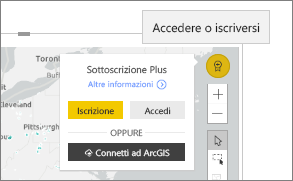

# Interagire con le mappe ArcGIS in Power BI
Questo argomento è stato scritto dal punto di vista di una persona che usa una mappa ArcGIS nel servizio Power BI, in Power BI Desktop o in Power BI per dispositivi mobili. Quando un progettista condivide un oggetto visivo di ArcGIS Maps for Power BI, è possibile interagire con esso in svariati modi.  Per altre informazioni sulla creazione di una mappa ArcGIS, vedere l'[esercitazione sulle mappe ArcGIS di Esri](../visuals/power-bi-visualization-arcgis.md).

Dalla combinazione tra le mappe ArcGIS e Power BI nasce una soluzione di mapping di livello superiore, che non si limita alla presentazione di punti su una mappa. La prima cosa che fa un progettista di report è associare livelli di dati demografici alla mappa. La combinazione di livelli di dati basati sulla località (ad esempio dati di censimento) su una mappa con l'analisi spaziale consente di ottenere informazioni più approfondite sui dati nelle visualizzazioni.

> [!TIP]
> GIS è l'acronimo per Geographic Information System (Sistema informativo geografico).
> 

Questo oggetto visivo di ArcGIS Maps for Power BI mostra le vendite per città dell'anno precedente e usa una mappa stradale e un livello di riferimento relativo al reddito medio delle famiglie. La mappa contiene due puntine (rossa e gialla) e un raggio del tempo di guida (in viola).

> [!TIP]
> Visitare la [pagina di Esri su Power BI](https://www.esri.com/powerbi) per trovare molti esempi e leggere testimonianze. Vedere quindi l'[introduzione ad ArcGIS Maps for Power BI](https://doc.arcgis.com/en/maps-for-powerbi/get-started/about-maps-for-power-bi.htm) fornita da Esri.
> 
> 

## Consenso dell'utente

La prima volta che un collega condivide una mappa ArcGIS, Power BI visualizza una richiesta di consenso. ArcGIS Maps for Power BI è fornito da Esri (https://www.esri.com) ) e il relativo uso è soggetto alle condizioni e all'informativa sulla privacy di Esri. Gli utenti di Power BI che vogliono usare le mappe ArcGIS per gli oggetti visivi di Power BI devono confermare il proprio consenso nell'apposita finestra.

## Informazioni sui livelli

Un oggetto visivo di ArcGIS Maps for Power BI può contenere diversi tipi di livelli di informazioni demografiche sulle località.

### Mappe di base

Ogni oggetto visivo di ArcGIS Maps for Power BI inizia da una mappa di base. Si può pensare a una mappa di base come all'area di disegno dei dati. Una mappa di base può essere un'area di disegno di base scura o chiara

 

o un'area di disegno con dettagli stradali e dei trasporti. 

  

La mappa di base viene applicata interamente all'area di disegno: quando si esegue la panoramica e lo zoom, la mappa viene aggiornata. Fare zoom avanti per visualizzare informazioni su strade e trasporti sempre più dettagliate. Se si fa una panoramica da un continente a un altro, il livello di dettaglio rimane costante. Nell'immagine seguente è stata eseguita una panoramica da Porto a Pechino.

  

### Livelli di riferimento

Un *progettista* di report può aggiungere un solo livello di riferimento. I livelli di riferimento sono ospitati da Esri e forniscono un ulteriore livello di informazioni demografiche su una località. L'esempio seguente ha un livello di riferimento per la densità della popolazione. I colori più scuri rappresentano una densità più elevata.

  

### Infografica

Un *progettista* di report può aggiungere vari livelli di infografica. L'infografica è costituita dagli indicatori visivi visualizzati lungo il lato destro dell'area di disegno visiva. È ospitata da Esri e fornisce un ulteriore livello di informazioni demografiche su una località. All'esempio seguente sono applicate tre infografiche. Non vengono visualizzate sulla mappa in sé, bensì su schede. Le schede di infografica si aggiornano quando si esegue lo zoom o la panoramica e si selezionano aree sulla mappa.

  

### Pins

Le puntine rappresentano località precise, ad esempio una città o un indirizzo. A volte i *progettisti* di report usano le puntine insieme al raggio del tempo di guida. Questo esempio mostra i negozi in un raggio di 80 km da Charlotte, Carolina del Nord.

 

## Interagire con un oggetto visivo ArcGIS Maps for Power BI
Le funzionalità disponibili dipendono dal modo in cui il report è stato condiviso con l'utente e dal tipo di account Power BI dell'utente stesso. Per eventuali domande, rivolgersi all'amministratore di sistema. Il comportamento degli oggetti visivi di ArcGIS Maps for Power BI è simile a quello di altri oggetti visivi in un report. È possibile [mostrare i dati usati per creare la visualizzazione](../consumer/end-user-show-data.md), vedere la mappa in [modalità messa a fuoco e modalità schermo intero](../consumer/end-user-focus.md), [aggiungere commenti](../consumer/end-user-comment.md), [interagire con i filtri](../consumer/end-user-report-filter.md) impostati dal *progettista* del report e altro ancora. Gli oggetti visivi ArcGIS possono applicare filtri incrociati ad altri oggetti visivi nella pagina del report e viceversa.

Passare il mouse sulle posizioni della mappa di base, ad esempio una bolla, per visualizzare le descrizioni comandi. Usare inoltre gli strumenti di selezione visiva ArcGIS per visualizzare descrizioni comando aggiuntive e per effettuare selezioni specifiche sulla mappa di base o sul livello di riferimento.  

### Strumenti di selezione

ArcGIS Maps for Power BI supporta cinque modalità di selezione. È possibile selezionare un massimo di 250 punti dati alla volta.

#### Strumento di selezione singola

 

Selezionare un punto dati, una bolla, una puntina o un singolo punto dati dal livello di riferimento. Power BI visualizzerà una descrizione comando con i dettagli relativi alla selezione. Lo strumento di selezione singola applica filtri incrociati agli altri oggetti visivi sulla pagina del report in base alla selezione effettuata e aggiorna le schede di infografica per l'area selezionata. 

Nell'immagine seguente è stato selezionato un punto dati corrispondente a una bolla marrone sulla mappa di base. Power BI:
- evidenzia la selezione,
- visualizza una descrizione comando per il punto dati, 
- aggiorna le schede di infografica in modo da visualizzare solo i dati relativi alla selezione e
- evidenzia i dati incrociati sull'istogramma.

Se la mappa ha un livello di riferimento, selezionando le posizioni vengono visualizzati i dettagli in una descrizione comando. Nell'immagine seguente è selezionata la contea di Seneca e sono visualizzati i dati del livello di riferimento (densità della popolazione) aggiunto alla mappa dal *progettista* del report. In questo esempio il punto dati include due diverse contee, quindi la descrizione comando contiene due pagine. Ogni pagina contiene un grafico. Selezionare una barra nel grafico per visualizzare altri dettagli. 

> [!TIP]
  > In alcuni casi è possibile ridurre il numero di pagine della descrizione comando facendo zoom avanti per selezionare una posizione specifica.  Se invece le posizioni si sovrappongono, Power BI potrebbe presentare più descrizioni comando alla volta. Selezionare le frecce per spostarsi tra le descrizioni comandi
  > 
  > 

#### Strumento di selezione multipla

 

Disegna un rettangolo sulla mappa e seleziona i punti dati in essi contenuti. Usare CTRL per selezionare più aree rettangolari. Lo strumento di selezione multipla aggiorna le schede di infografica per l'area selezionata ed evidenzia gli altri oggetti visivi nella pagina del report in base alla selezione.

 

#### Strumento del livello di riferimento

 

Consente di usare i limiti o i poligoni all'interno dei layer di riferimento per selezionare i punti dati in essi contenuti. Anche se non è facile da vedere, c'è un contorno giallo sul livello di riferimento. A differenza dello strumento di selezione singola, non viene visualizzata una descrizione comando. Si ottengono invece dati relativi agli eventuali punti dati contenuti all'interno dei bordi del contorno. In questo esempio la selezione contiene effettivamente un punto dati, relativo a un negozio Lindseys in Winston Salem.

 

#### Strumento buffer

 

Consente la selezione di punti dati tramite un livello di buffer. Usare ad esempio questo strumento per selezionare un raggio del tempo di guida e continuare a interagire con il resto del report. Il raggio del tempo di guida rimane attivo e continua a essere riflesso nelle schede di infografica, ma la selezione di altri punti dati nella mappa applica filtri incrociati agli altri oggetti visivi nella pagina del report.

 

#### Strumento di ricerca di somiglianze

 

Consente di trovare posizioni con attributi simili. Prima di tutto occorre selezionare uno o più punti di interesse o percorsi di riferimento, definendo fino a cinque dimensioni da usare nell'analisi. Lo strumento quindi calcola le 10 posizioni sulla mappa più simili alle posizioni di riferimento definite. È quindi possibile usare le schede di infografica per ottenere altre informazioni sui dati demografici relativi a ognuno dei risultati, creare aree di tempo di guida per avere un'idea di ciò che si trova entro un raggio di guida da ognuno di questi percorsi o anche usare lo strumento di ricerca di somiglianze per filtrare il report e ottenere altre informazioni dettagliate. Ma la cosa più importante è che tutti i calcoli vengono eseguiti localmente nel computer, quindi si ha la certezza che i dati riservati rimangano protetti.

## Considerazioni e limitazioni
Mappe ArcGIS per Power BI è disponibile nei seguenti servizi e applicazioni:

|Servizio/App  |Disponibilità  |
|---------|---------|
|Power BI Desktop     |     Sì    |
|Servizio Power BI (app.powerbi.com)     |    Sì     |
|App Power BI per dispositivi mobili     |  Sì      |
|Pubblica sul Web di Power BI     |  No       |
|Power BI Embedded     |     No    |
|Incorporamento del servizio Power BI (PowerBI.com)  | No |

## Come funziona ArcGIS Maps for Power BI?
ArcGIS Maps for Power BI è fornito da Esri (https://www.esri.com) ). L'uso di ArcGIS Maps for Power BI è soggetto alle [condizioni](https://go.microsoft.com/fwlink/?LinkID=8263222) e all'[informativa sulla privacy](https://go.microsoft.com/fwlink/?LinkID=826323) di Esri. Gli utenti di Power BI che vogliono usare le mappe di ArcGIS per gli oggetti visivi di Power BI devono confermare il proprio consenso nell'apposita finestra. Per informazioni dettagliate, vedere Consenso dell'utente.  L'uso di ArcGIS Maps for Power BI di Esri è soggetto alle condizioni e all'informativa sulla privacy di Esri, a cui è possibile accedere anche dal collegamento presente nella finestra di dialogo del consenso. Ogni utente deve confermare il proprio consenso prima di usare ArcGIS Maps for Power BI per la prima volta. Dopo che l'utente ha confermato il proprio consenso, i dati associati all'oggetto visivo vengono inviati ai servizi di Esri almeno per la geocodifica, ovvero la trasformazione delle informazioni sulla località in informazioni su latitudine e longitudine che possono essere rappresentate in una mappa. È probabile che i dati associati alla visualizzazione possano essere inviati ai servizi di Esri. Esri fornisce servizi come mappe di base, analisi spaziale, geocodifica e così via. L'oggetto visivo ArcGIS Maps for Power BI interagisce con questi servizi usando una connessione SSL protetta da un certificato fornito e gestito da Esri. Per altre informazioni su ArcGIS Maps for Power BI, vedere la [pagina del prodotto ArcGIS Maps for Power BI](https://www.esri.com/powerbi) di Esri.

### Power BI Plus

Quando un utente si iscrive a una sottoscrizione Plus offerta da Esri tramite ArcGIS Maps for Power BI, entra in relazione diretta con Esri. Power BI non invia informazioni personali sull'utente a Esri. L'utente accede e considera attendibile un'applicazione AAD fornita da Esri usando la propria identità AAD. In questo modo, l'utente condivide le informazioni personali direttamente con Esri. Dopo che l'utente ha aggiunto il contenuto di Plus a un oggetto visivo ArcGIS Maps for Power BI, anche i colleghi che vogliono visualizzare o modificare tale oggetto hanno bisogno di una sottoscrizione Plus di Esri. 

Per domande tecniche dettagliate sul funzionamento di ArcGIS Maps for Power BI di Esri, contattare Esri tramite il sito del supporto.

## Considerazioni e risoluzione dei problemi

**La mappa ArcGIS non viene visualizzata**    
In servizi o applicazioni in cui Mappe ArcGIS per Power BI non è disponibile, la visualizzazione verrà mostrata come oggetto visivo vuoto con il logo di Power BI.

**Non vengono visualizzate tutte le informazioni sulla mappa**    
Durante la geocodifica di latitudine/longitudine sula mappa, vengono visualizzati fino a 30.000 punti dati. Durante la geocodifica di punti dati come codici postali o indirizzi postali, vengono geocodificati solo i primi 15.000 punti. La geocodifica dei nomi o dei paesi non è soggetta al limite di 1500 indirizzi.

**È previsto un addebito per l'uso di Mappe ArcGIS per Power BI?**

Mappe ArcGIS per Power BI è disponibile per tutti gli utenti di Power BI senza alcun costo aggiuntivo. È un componente fornito da **Esri** e l'uso è soggetto alle condizioni e informativa sulla privacy fornite da **Esri** come indicato in precedenza in questo articolo. Se si sottoscrive ArcGIS **Plus**, è previsto un addebito.

**Viene visualizzato un messaggio di errore che indica che la cache è piena**

Questo comportamento è un bug in corso di risoluzione.  Nel frattempo, selezionare il collegamento visualizzato nel messaggio di errore per istruzioni su come cancellare la cache di Power BI.

**È possibile visualizzare le proprie mappe ArcGIS offline?**

No, Power BI richiede la connettività di rete per visualizzare le mappe.

## Passaggi successivi
Ottenere informazioni: **Esri** fornisce una [documentazione completa](https://go.microsoft.com/fwlink/?LinkID=828772) nel set di funzionalità di **Mappe ArcGIS per Power BI**.

È possibile porre domande, ottenere informazioni aggiornate, segnalare problemi e trovare risposte nel [thread della community di Power BI correlato a **Mappe ArcGIS per Power BI**](https://go.microsoft.com/fwlink/?LinkID=828771).

[Pagina del prodotto Mappe ArcGIS per Power BI](https://www.esri.com/powerbi)
