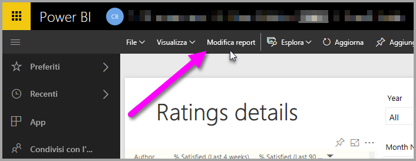
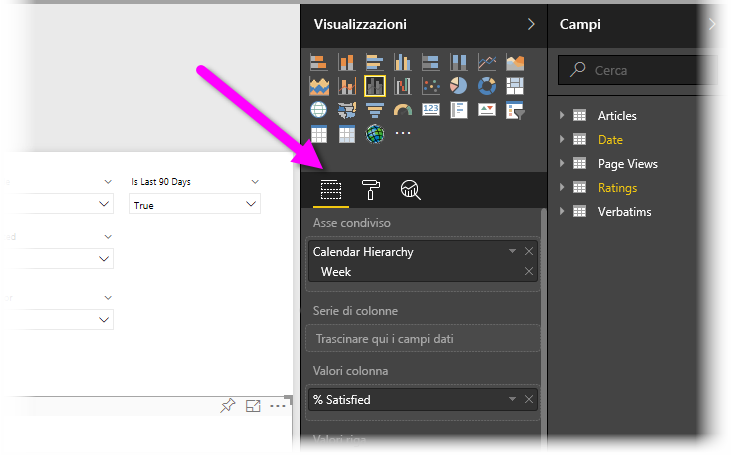
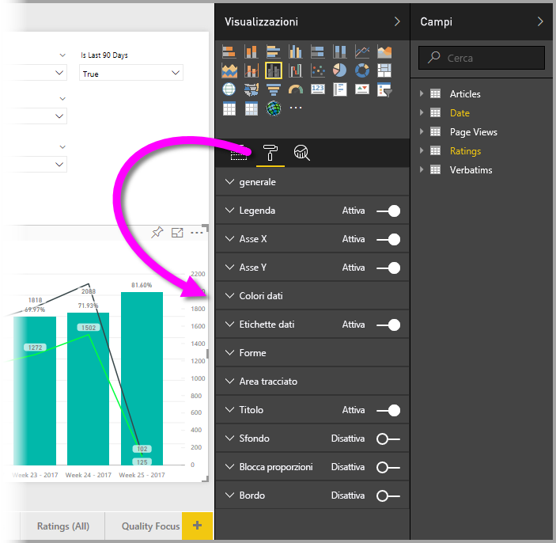
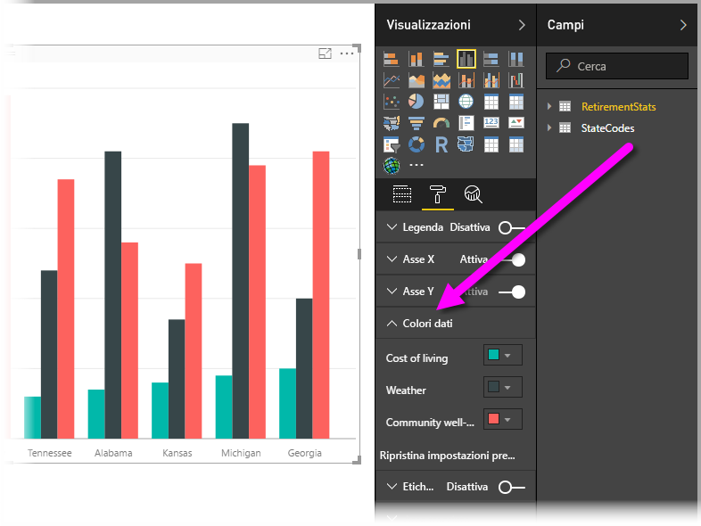
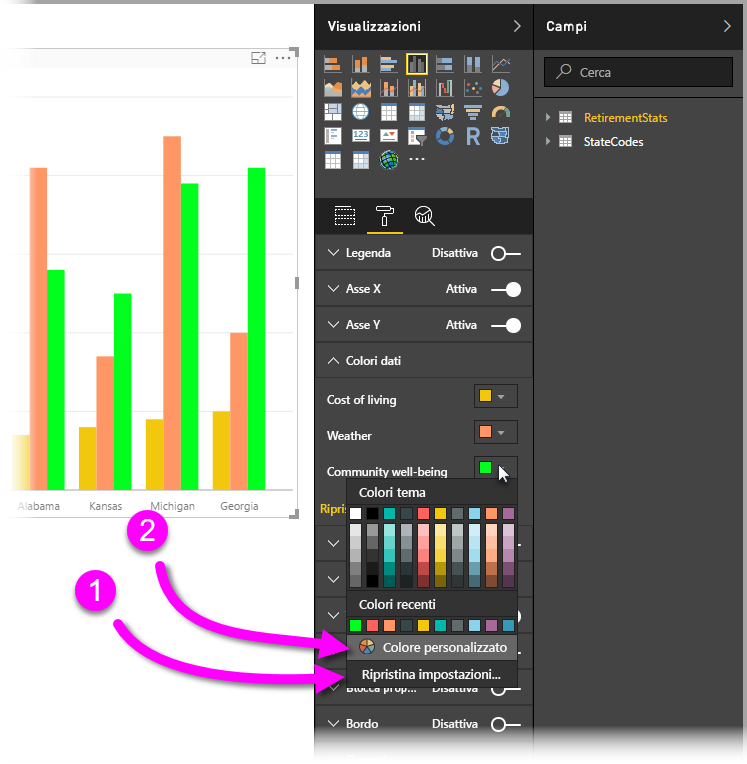
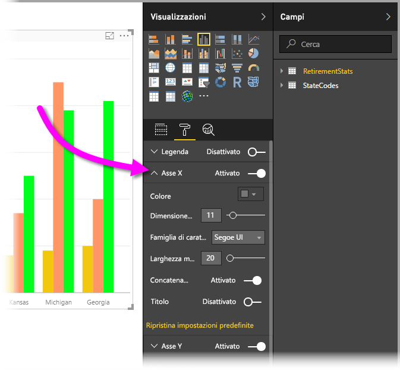

# Introduzione alla formattazione dei colori e alle proprietà degli assi
In **Power BI** è possibile cambiare il colore delle serie di dati, dei punti dati e persino lo sfondo delle visualizzazioni. È anche possibile modificare la presentazione degli assi x e y, in modo da poter controllare completamente l'aspetto di dashboard e report.

Per iniziare, selezionare un **report** nel riquadro **Area di lavoro personale** . Nell'area del menu superiore selezionare **Modifica report**.  

Quando si modifica un report ed è selezionata una visualizzazione, viene visualizzato il riquadro **Visualizzazioni** che consente di aggiungere o modificare le visualizzazioni. Proprio sotto le visualizzazioni disponibili sono presenti tre icone, ovvero **Campi** (una pila di barre), **Formato** (un pennello) e **Analisi** (una lente di ingrandimento). Nell'immagine seguente l'icona **Campi** è selezionata, come indicato dalla presenza di una barra gialla sotto l'icona.

Quando si seleziona **Formato**, l'area sotto l'icona visualizza le personalizzazioni di colori e assi disponibili per la visualizzazione attualmente selezionata.  

È possibile personalizzare numerosi elementi di ogni visualizzazione:

* Legenda
* Asse X
* Asse Y
* Colori dati
* Etichette dati
* Forme
* Area del tracciato
* Titolo
* Sfondo
* Blocca proporzioni
* Bordo

> [!NOTE]
>  
> Non tutti questi elementi sono visibili in ogni tipo di visualizzazione. La visualizzazione selezionata influisce sulle personalizzazioni disponibili, ad esempio l'asse X non è visualizzato se è stato selezionato un grafico a torta perché questo tipo di grafici non contiene l'asse X.

Si noti anche che se non è presente alcuna visualizzazione selezionata, al posto delle icone appare **Filtri**, che consente di applicare filtri a tutte le visualizzazioni della pagina.

Gli esempi seguenti si riferiscono uno all'uso dei colori e l'altro alla modifica delle proprietà di un asse. Le istruzioni fornite consentiranno di personalizzare facilmente colori, assi ed etichette.

## Uso dei colori

La procedura necessaria per personalizzare i colori in un grafico è la seguente.

1. Selezionare un **Istogramma a colonne raggruppate** nell'area di disegno report.
2. Scegliere quindi l'icona **Formato** per visualizzare le personalizzazioni disponibili.
3. Selezionare la piccola freccia verso il basso a sinistra della personalizzazione **Colori dati** . Verranno visualizzare le opzioni specifiche della visualizzazione selezionata che consentono di personalizzare i colori dei dati.
4. L'opzione **Colori dati** si espande verso il basso e visualizza le personalizzazioni disponibili.  
   

A questo punto è possibile selezionare la freccia verso il basso accanto al colore per apportare modifiche in ogni serie di dati disponibile. Provare a impostare il colore giallo per **Cost of living**, l'arancione per **Weather** e verde per **Community well-being**. La schermata seguente illustra l'ultimo passaggio, quello relativo alla modifica del colore per **Cost of living**.  

Le modifiche sono illustrate nell'immagine seguente che mostra un grafico estremamente chiaro. Ecco alcuni elementi da considerare quando si usano i colori. I numeri nell'elenco seguente sono inclusi anche nella schermata seguente e indicano in che punto è possibile accedere a questi elementi o modificarli.

1. Per cambiare i colori, basta selezionare **Ripristina valori predefiniti** per ripristinare le impostazioni predefinite. È possibile eseguire questa operazione per un solo colore o per l'intera visualizzazione.
2. Se il colore desiderato non è presente nella tavolozza, basta selezionare **Colore personalizzato** e sceglierne uno dallo spettro.  
   

Per annullare la modifica appena apportata, è possibile usare il solito tasto di scelta rapida **CTRL+Z**.

## Modifica delle proprietà degli assi

È spesso utile modificare l'asse X o l'asse Y. Come per l'utilizzo dei colori, per modificare un asse è sufficiente selezionare l'icona della freccia rivolta verso il basso a sinistra dell'asse da modificare, come illustrato nell'immagine seguente.  

Per comprimere le opzioni di **Asse X** , selezionare la freccia verso l'alto accanto ad **Asse X**.

Per rimuovere completamente le etichette dell'asse X, usare il pulsante di opzione accanto ad **Asse X**. È anche possibile scegliere di attivare o disattivare i titoli degli assi selezionando il pulsante di opzione accanto a **Titolo**.  

I colori disponibili sono numerosissimi e sono disponibili molte altre personalizzazioni che è possibile applicare a report e dashboard di Power BI.

> [!NOTE]
>  
> Queste personalizzazioni di colori, assi ed elementi correlati, disponibili quando l'icona **Formato** è selezionata, sono disponibili anche in Power BI Desktop.

## Impostazione del colore dai valori di testo

A partire dall'aggiornamento di **Power BI Desktop** di agosto 2018, è possibile impostare colori in base al valore di testo, o codice esadecimale, per un elemento di report specificato. Per altre informazioni, vedere [Formattazione condizionale nelle tabelle](../desktop-conditional-table-formatting.md).

## Passaggi successivi
Per altre informazioni, vedere l'articolo seguente:  

* [Suggerimenti e consigli per la formattazione dei colori in Power BI](service-tips-and-tricks-for-color-formatting.md)  
* [Formattazione condizionale nelle tabelle](../desktop-conditional-table-formatting.md)

