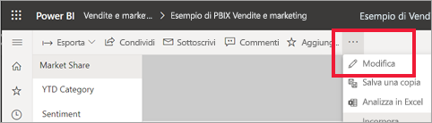
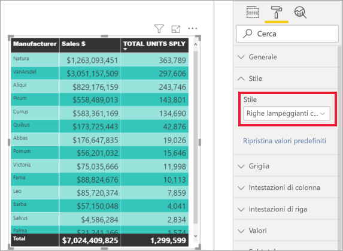

# Introduzione al riquadro di formattazione

[!INCLUDE[consumer-appliesto-nyyn](../includes/consumer-appliesto-nyyn.md)]    

Se si hanno le autorizzazioni di modifica per un report, sono disponibili numerose opzioni di formattazione. Nei report di Power BI è possibile cambiare il colore delle serie di dati, dei punti dati e anche lo sfondo delle visualizzazioni. È inoltre possibile modificare il modo in cui vengono presentati l'asse X e l'asse Y, È anche possibile formattare le proprietà dei tipi di carattere di visualizzazioni, le forme e i titoli. Power BI offre il controllo completo sulla modalità di visualizzazione dei report.

Per iniziare, aprire un report in Power BI Desktop o nel servizio Power BI. Entrambi offrono opzioni di formattazione quasi identiche. Quando si apre un report nel servizio Power BI, assicurarsi di selezionare **Modifica** dalla barra dei menu. 

Quando si modifica un report ed è selezionata una visualizzazione, viene visualizzato il riquadro **Visualizzazioni**. Usare questo riquadro per modificare le visualizzazioni. Proprio sotto il riquadro **Visualizzazioni** sono presenti tre icone: **Campi** (una pila di barre), **Formato** (un rullo) e **Analisi** (una lente di ingrandimento). Nell'immagine seguente è selezionata l'icona **Campi**, come indicato dalla presenza di una barra gialla sotto l'icona.

Quando si seleziona **Formato**, nell'area sotto l'icona sono visualizzate le personalizzazioni disponibili per la visualizzazione attualmente selezionata.  

È possibile personalizzare molti elementi di ogni visualizzazione. Le opzioni disponibili dipendono dall'oggetto visivo selezionato. Alcune opzioni sono:

* Legenda
* Asse X
* Asse Y
* Colori dati
* Etichette dati
* Forme
* Area del tracciato
* Titolo
* Sfondo
* Blocca proporzioni
* Bordo
* Descrizioni comando
* Intestazioni dell'oggetto visivo
* Forme
* Posizione    
e altro ancora.

> [!NOTE]
>  
> Non tutti questi elementi sono visibili in ogni tipo di visualizzazione. La visualizzazione selezionata influisce sulle personalizzazioni disponibili, ad esempio l'asse X non è visualizzato se è stato selezionato un grafico a torta perché questo tipo di grafici non contiene l'asse X.

Si noti anche che se non è presente alcuna visualizzazione selezionata, al posto delle icone appare **Filtri**, che consente di applicare filtri a tutte le visualizzazioni della pagina.

Il modo migliore per imparare a usare le opzioni di formattazione è provarle. È sempre possibile annullare le modifiche o ripristinare le impostazioni predefinite. È disponibile una quantità incredibile di opzioni e ne vengono aggiunte continuamente di nuove. Non è possibile descrivere tutte le opzioni di formattazione in un solo articolo. Ma per iniziare, si possono esaminare subito alcuni elementi. 

1. Modificare i colori usati nell'oggetto visivo   
2. Applicare uno stile    
3. Modificare le proprietà dell'asse    
4. Aggiungere etichette dati    

## Uso dei colori

La procedura necessaria per personalizzare i colori in una visualizzazione è la seguente.

1. Selezionare una visualizzazione per attivarla.

2. Selezionare l'icona del rullo per aprire la scheda Formattazione. Nella scheda Formattazione sono visualizzati tutti gli elementi di formattazione disponibili per l'oggetto visivo selezionato.

    

3. Selezionare **Colori dati** per espandere le personalizzazioni disponibili.  

    

4. Impostare come attivata l'opzione **Mostra tutto** e selezionare colori diversi per le colonne.

    

Di seguito sono riportati alcuni suggerimenti utili per l'uso dei colori. I numeri nell'elenco seguente sono inclusi anche nella schermata seguente e indicano in che punto è possibile accedere a questi elementi o modificarli.

1. Per cambiare i colori, basta selezionare **Ripristina valori predefiniti** per tornare all'impostazione predefinita. 

2. Se non si è soddisfatti della modifica apportata ai colori, selezionare **Ripristina valori predefiniti** nella parte inferiore della sezione **Colori dati** e i colori torneranno alle impostazioni predefinite. 

3. Se il colore desiderato non è presente nella tavolozza, basta selezionare **Colore personalizzato** e sceglierne uno dallo spettro.  

   

Per annullare la modifica appena apportata, è possibile usare il solito tasto di scelta rapida **CTRL+Z**.

## Applicazione di uno stile a una tabella
Alcune visualizzazioni di Power BI hanno un'opzione **Stile**. Con un solo clic, è possibile applicare contemporaneamente alla visualizzazione una serie completa di opzioni di formattazione. 

1. Selezionare una tabella o una matrice per renderle attive.   
1. Aprire la scheda Formattazione e selezionare **Stile**.

   

1. Selezionare uno stile dall'elenco a discesa. 

   

Anche dopo aver applicato uno stile, è possibile continuare a formattare le proprietà, incluso il colore, per la visualizzazione.

## Modifica delle proprietà degli assi

È spesso utile modificare l'asse X o l'asse Y. Come per l'utilizzo dei colori, per modificare un asse è sufficiente selezionare l'icona della freccia rivolta verso il basso a sinistra dell'asse da modificare, come illustrato nell'immagine seguente.  

Nell'esempio seguente l'asse Y è stato formattato:
- spostando le etichette sul lato destro della visualizzazione

- impostando il valore iniziale su zero

- modificando il colore del carattere dell'etichetta in nero

- aumentando la dimensione del carattere dell'etichetta a 12

- aggiungendo un titolo dell'asse Y

    

Per rimuovere completamente le etichette dell'asse, usare il pulsante di opzione accanto ad **Asse X** o **Asse Y**. È anche possibile scegliere di attivare o disattivare i titoli degli assi selezionando il pulsante di opzione accanto a **Titolo**.  

## Aggiunta di etichette dati    

Un ultimo esempio di formattazione prima di iniziare a esplorare autonomamente.  Aggiungere le etichette dati a un grafico ad area. 

Questa è l'immagine *prima*. 

E questa è l'immagine *dopo*.

È stata selezionata la visualizzazione per renderla attiva ed è stata aperta la scheda Formattazione.  Sono state selezionate e attivate le **etichette dati**. Si è aumentato il carattere a 12, la famiglia di caratteri è stata modificata in Arial Black, è stata attivata la **visualizzazione dello sfondo** e per il colore di sfondo è stato selezionato il bianco con una trasparenza del 5%.

Queste sono solo alcune delle attività di formattazione possibili. Aprire un report in modalità di modifica e divertirsi a esplorare il riquadro Formattazione per creare visualizzazioni accattivanti e informative.

## Passaggi successivi
Per altre informazioni, vedere l'articolo seguente: 

* [Condivisione di report](../collaborate-share/service-share-reports.md)

* [Suggerimenti e consigli per la formattazione dei colori in Power BI](service-tips-and-tricks-for-color-formatting.md)  
* [Formattazione condizionale nelle tabelle](../create-reports/desktop-conditional-table-formatting.md)

