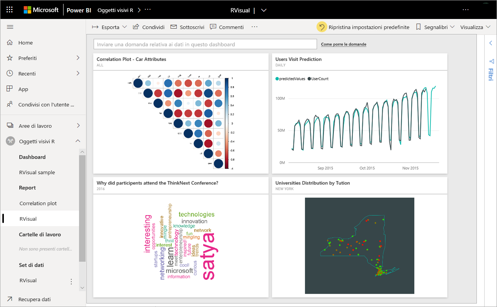
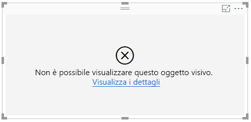

# Creare e usare oggetti visivi R in Power BI
Attualmente gli oggetti visivi R possono essere creati solo in **Power BI Desktop** e quindi pubblicati nel servizio Power BI. Per altre informazioni sulla creazione di oggetti visivi R, vedere [Creare oggetti visivi di Power BI usando R](../desktop-r-visuals.md).

## Visualizzazione di oggetti visivi R nel servizio Power BI
Il servizio Power BI supporta la visualizzazione e l'interazione con oggetti visivi creati con gli script R. Gli oggetti visivi creati con gli script R, comunemente denominati *oggetti visivi R*, possono presentare funzionalità avanzate di data shaping e analisi, ad esempio le previsioni, usando le funzionalità avanzate di analisi e visualizzazione di R.

> [!NOTE]
> Il [linguaggio di programmazione R](https://www.r-project.org/) è uno dei linguaggi di programmazione maggiormente usati da statistici, data scientist e business analyst. Per il linguaggio R è disponibile una community open source che offre oltre 7.000 pacchetti di componenti aggiuntivi nonché gruppi di utenti R ampiamente usati. La versione di R distribuita nel servizio Power BI è *Microsoft R 3.4.4.*
> 
> 

L'immagine seguente mostra un dashboard di Power BI con una raccolta di oggetti visivi R usati per l'analisi avanzata.

Gli oggetti visivi R vengono creati in un [report di Power BI Desktop](../desktop-get-the-desktop.md), simile al report mostrato nell'immagine seguente.

Dopo aver creato il report in **Power BI Desktop**, è possibile pubblicare il report che contiene uno o più oggetti visivi di R nel servizio Power BI. 

 Non tutti i pacchetti R sono supportati nel servizio. L'elenco dei pacchetti attualmente supportati nel servizio Power BI è riportato alla fine di questo articolo.

È possibile scaricare il [file Power BI Desktop di esempio](https://download.microsoft.com/download/D/9/A/D9A65269-D1FC-49F8-8EC3-1217E3A4390F/RVisual_correlation_plot_sample%20SL.pbix) (file PBIX) che contiene alcuni oggetti visivi R utili per vedere il funzionamento del servizio e provare a usarlo.

Gli oggetti visivi R che vengono creati in **Power BI Desktop**, e quindi pubblicati nel servizio Power BI, nella maggior parte dei casi si comportano come qualsiasi altro oggetto visivo nel servizio Power BI; è possibile interagire con essi, filtrarli, suddividerli e quindi aggiungerli a un dashboard oppure condividerli con altri. Per maggiori informazioni sulla condivisione di dashboard e oggetti visivi, vedere [Condividere un dashboard con i colleghi e altri utenti](../service-share-dashboards.md). Rispetto ad altri oggetti visivi, gli oggetti visivi R non possono visualizzare descrizioni comandi e non possono essere usati per filtrare altri oggetti visivi.

Come è possibile vedere nell'immagine seguente, gli oggetti visivi R nel servizio Power BI, in dashboard o report, nella maggior parte dei casi vengono visualizzati e si comportano come qualsiasi altro oggetto visivo e non richiedono la conoscenza dello script R sottostante da parte degli utenti.

## Sicurezza degli script R
Gli oggetti visivi R vengono creati in base agli script R, che potrebbero contenere codice con rischi per la sicurezza o per la privacy.

Tali rischi si manifestano principalmente nella fase di creazione, quando l'autore esegue lo script nel proprio computer.

Il servizio Power BI applica una tecnologia *sandbox* per proteggere gli utenti e il servizio dai rischi per la sicurezza.

Questo approccio basato su *sandbox* impone alcune limitazioni relative agli script R in esecuzione nel servizio Power BI, ad esempio l'accesso a Internet o l'accesso ad altre risorse che non sono necessarie per creare l'oggetto visivo R.

## Errori degli script R
In caso di errore di uno script R, l'oggetto visivo R non viene tracciato e viene visualizzato un messaggio di errore. Per informazioni dettagliate sull'errore, selezionare **Visualizza i dettagli** dall'errore dell'oggetto visivo R nell'area di disegno, come mostrato nell'immagine seguente.

Come ulteriore esempio, l'immagine seguente mostra il messaggio di errore visualizzato quando uno script R non è stato eseguito correttamente a causa di un pacchetto R mancante in Azure.

## Gestione delle licenze
Gli oggetti visivi R richiedono una licenza [Power BI Pro](../service-self-service-signup-for-power-bi.md) per il rendering nei report, l'aggiornamento, il filtro e il filtro incrociato. Per maggiori informazioni sulle licenze Power BI Pro e sugli aspetti che le distinguono dalle licenze gratuite, vedere [Contenuto Power BI Pro: di cosa si tratta?](../service-admin-purchasing-power-bi-pro.md)

Gli utenti della versione di Power BI gratuita possono usare solo i riquadri condivisi nelle aree di lavoro Premium. Vedere [Acquisto di Power BI Pro](../service-admin-purchasing-power-bi-pro.md) per maggiori informazioni.

La tabella seguente descrive le funzionalità degli oggetti visivi R in base alle licenze.

|  |Creare oggetti visivi R in Power BI Desktop  | Creare report del servizio PBI con oggetti visivi R |Visualizzare oggetti visivi R nei report  | Visualizzare riquadri R nei dashboard |
|---------|---------|---------|---------|--------|
|**Guest** (Power BI Embedded)     |  Supportato|  Non supportato      | Supportato solo nella capacità Premium/Azure  | Supportato solo nella capacità Premium/Azure |
|**Tenant non gestito** (dominio non verificato) | Supportato | Non supportato |  Non supportato |Supportato (scenario B2B) |
|**Tenant gestito** con licenza gratuita    |  Supportato       |  Non supportato       |    Supportato solo nella capacità Premium    | Supportato |
**Tenant gestito** con licenza Pro     |   Supportato      | Supportato      | Supportato    |Supportato|

## Limitazioni note
Gli oggetti visivi R nel servizio Power BI presentano alcune limitazioni:

* Il supporto per gli oggetti visivi R è limitato ai pacchetti identificati in [Pacchetti R nel servizio Power BI](../service-r-packages-support.md). Attualmente non è disponibile il supporto per i pacchetti personalizzati.
* Limitazioni relative alle dimensioni di dati: i dati usati dall'oggetto visivo R per il tracciato sono limitati a 150.000 righe. Se vengono selezionate più di 150.000 righe, vengono utilizzate solo le prime 150.000 righe e viene visualizzato un messaggio sull'immagine. Inoltre, i dati di input hanno un limite di 250 MB.
* Risoluzione: tutti gli oggetti visivi R vengono visualizzati a 72 DPI.
* Dispositivo di tracciamento: è supportato solo il tracciamento nel dispositivo predefinito. 
* Limitazione relativa al tempo di calcolo: se un calcolo dell'oggetto visivo R è maggiore di 60 secondi, si verifica il timeout dello script, determinando la generazione di un errore.
* Gli oggetti visivi R vengono aggiornati al momento dell'aggiornamento, del filtraggio e dell'evidenziazione dei dati. Tuttavia, l'immagine stessa non è interattiva e non supporta le descrizioni comandi.
* Gli oggetti visivi R rispondono all'evidenziazione di altri oggetti visivi, ma è possibile fare clic sugli elementi nell'oggetto visivo R per applicare un filtro incrociato ad altri elementi.
* Gli oggetti visivi R non sono attualmente supportati per il tipo di dati *Time*. Usare invece Date/Time.
* Gli oggetti visivi R non vengono visualizzati quando si usa l'opzione **Pubblica sul Web**.
* Gli oggetti visivi R non supportano la ridenominazione delle colonne di input. Durante l'esecuzione dello script si farà riferimento alle colonne con il nome originale.
* Gli oggetti visivi R attualmente non vengono stampati quando si esegue la stampa di dashboard e report.
* Gli oggetti visivi R non sono attualmente supportati nella modalità DirectQuery di Analysis Services.
* Gli oggetti visivi R possono convertire le etichette di testo in elementi grafici. Per eseguire questa operazione nel servizio Power BI, è necessario eseguire questo passaggio aggiuntivo:
  
  * Aggiungere la riga seguente all'inizio dello script R:
    
        powerbi_rEnableShowText =  1
* Per il corretto funzionamento dei tipi di carattere cinesi, giapponesi e coreani nel servizio Power BI è necessario eseguire le operazioni aggiuntive seguenti:
  
  * Installare innanzitutto il pacchetto R *showtext* e tutte le relative dipendenze È possibile farlo eseguendo lo script seguente:
    
        *install.packages("showtext")*
  * Aggiungere quindi la riga seguente all'inizio dello script R:
    
        powerbi_rEnableShowTextForCJKLanguages =  1

## Panoramica dei pacchetti R
I pacchetti R sono raccolte di funzioni, dati e codice compilato di R che vengono combinati in un formato ben definito. Quando si installa R, questo è dotato di un set standard di pacchetti e altri pacchetti sono disponibili per il download e l'installazione. Per usare un pacchetto R dopo l'installazione è necessario caricarlo nella sessione. L'origine principale di pacchetti R gratuiti è CRAN, [Comprehensive R Archive Network](https://cran.r-project.org/web/packages/available_packages_by_name.html).

**Power BI Desktop** può usare qualsiasi tipo di pacchetti R senza alcuna limitazione. È possibile installare pacchetti R da usare in **Power BI Desktop** autonomamente (usando l'[IDE RStudio](https://www.rstudio.com/), ad esempio).

Gli oggetti visivi R nel **servizio Power BI** sono supportati dai pacchetti reperibili nella sezione **Pacchetti supportati** in [questo articolo](../service-r-packages-support.md). Se nell'elenco dei pacchetti supportati non si trova un pacchetto a cui si è interessati, è possibile richiedere il supporto del pacchetto. Per informazioni su come richiedere assistenza, vedere [Pacchetti R nel servizio Power BI](../service-r-packages-support.md).

### Requisiti e limitazioni dei pacchetti R
Ci sono alcuni requisiti e limitazioni per i pacchetti R:

* Il servizio Power BI, nella maggior parte, supporta pacchetti R con licenze software gratuite e open source, ad esempio GPL-2, GPL-3, MIT+ e così via.
* Il servizio Power BI supporta i pacchetti pubblicati in CRAN. Il servizio non supporta i pacchetti R personalizzati o privati. Si consiglia agli utenti di rendere i pacchetti privati disponibili in CRAN prima di richiedere la disponibilità del pacchetto nel servizio Power BI.
* Per **Power BI Desktop** esistono due varianti per i pacchetti R:
  
  * Per gli oggetti visivi R, è possibile installare qualsiasi pacchetto, inclusi i pacchetti R personalizzati
  * Per gli oggetti visivi R personalizzati, sono supportati solo i pacchetti CRAN pubblici per l'installazione automatica dei pacchetti
* Per motivi di privacy e sicurezza, attualmente non sono supportati i pacchetti R che forniscono query client-server sul Web (ad esempio RgoogleMaps) nel servizio. La rete è bloccata per tali tentativi. Per un elenco dei pacchetti R supportati e non supportati, vedere [Pacchetti R nel servizio Power BI](../service-r-packages-support.md).
* Il processo di approvazione per l'inclusione di un nuovo pacchetto R è caratterizzato da una struttura ad albero delle dipendenze; alcune dipendenze la cui installazione è richiesta nel servizio non possono essere supportate.

### Pacchetti supportati:
Per un lungo elenco di pacchetti R supportati (e il breve elenco dei pacchetti non supportati), vedere l'articolo seguente:

* [Pacchetti R nel servizio Power BI](../service-r-packages-support.md)

