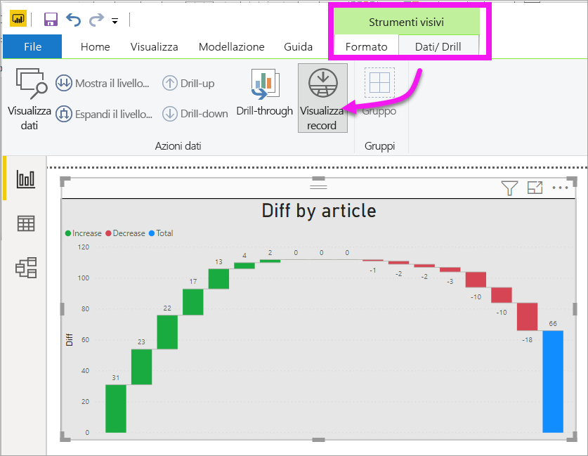
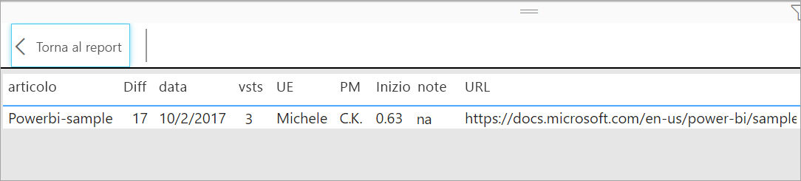

# Visualizzare i dati usati per creare la visualizzazione
## Mostra i dati
Una visualizzazione di Power BI viene costruita sulla base dei dati dei set di dati dell'utente. Se si è interessati a visualizzare il "dietro le quinte", Power BI consente di *visualizzare* i dati usati per creare l'oggetto visivo. Quando si seleziona **Mostra i dati**, Power BI mostra i dati di sotto o accanto alla visualizzazione.

È anche possibile esportare i dati usati per creare la visualizzazione in un file con estensione xlsx o csv e visualizzarlo in Excel. Per altre informazioni, vedere [Esportare dati da visualizzazioni di Power BI](power-bi-visualization-export-data.md).

> [!NOTE]
> Le opzioni *Mostra i dati* ed *Esporta dati* sono disponibili nel servizio Power BI e in Power BI Desktop. Tuttavia, Power BI Desktop offre un livello di dettaglio aggiuntivo: [*Visualizza record* mostra le righe del set di dati effettive](../desktop-see-data-see-records.md).
> 
> 

## Uso di *Mostra i dati* 
1. In Power BI Desktop selezionare una visualizzazione per attivarla.

2. Selezionare **Altre azioni** (...) e scegliere **Mostra i dati**. 
    

3. Per impostazione predefinita, i dati vengono visualizzati sotto l'oggetto visivo.
   
   

4. Per modificare l'orientamento, selezionare il layout verticale  nell'angolo in alto a destra della visualizzazione.
   
   
5. Per esportare i dati in un file CSV, selezionare i puntini di sospensione e scegliere **Esporta dati**.
   
    
   
    Per altre informazioni sull'esportazione dei dati in Excel, vedere [Esportare dati da visualizzazioni di Power BI](power-bi-visualization-export-data.md).
6. Per nascondere i dati, deselezionare **Esplora** > **Mostra i dati**.

## Uso di Visualizza record
È anche possibile concentrarsi su un solo record di dati in una visualizzazione e analizzare i dati sottostanti. 

1. Per usare **Visualizza record** selezionare una visualizzazione per attivarla. 

2. Sulla barra multifunzione desktop selezionare la scheda **Strumenti visivi** > **Dati/Drill** > **Visualizza record**. 

    

3. Selezionare un punto dati o una riga nella visualizzazione. In questo esempio è stata selezionata la quarta colonna da sinistra. Power BI mostra il record del set di dati per questo punto dati.

    

4. Selezionare **Torna al report** per tornare nell'area di disegno report desktop. 

## Considerazioni e risoluzione dei problemi

- Se il pulsante **Visualizza record** nella barra multifunzione è disabilitato e inattivo, significa che la visualizzazione selezionata non supporta questa opzione.
- Non è possibile cambiare i dati in Visualizza record e salvarli nel report.
- Non è possibile usare Visualizza record quando l'oggetto visivo usa una misura calcolata.
- Non è possibile usare Visualizza record quando si è connessi a un modello multidimensionale dinamico.  

## Passaggi successivi
[Esportare dati da visualizzazioni di Power BI](power-bi-visualization-export-data.md)    

Altre domande? [Provare la community di Power BI](https://community.powerbi.com/)

