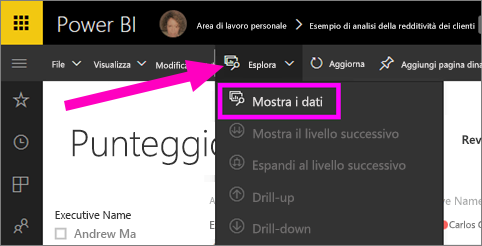
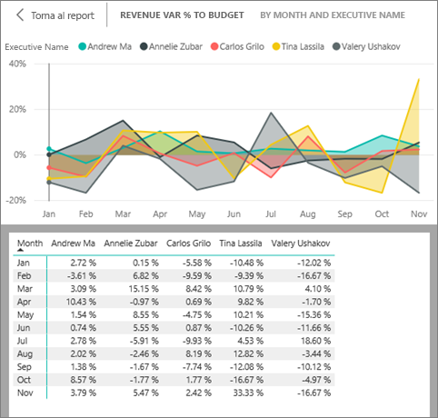
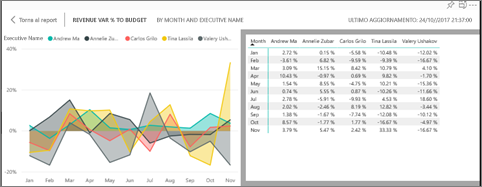

# Visualizzare i dati usati per creare la visualizzazione
## Mostra i dati
Una visualizzazione di Power BI viene costruita sulla base dei dati dei set di dati dell'utente. Se si è interessati a visualizzare il "dietro le quinte", Power BI consente di *visualizzare* i dati usati per creare l'oggetto visivo. Quando si seleziona **Mostra i dati**, Power BI mostra i dati di sotto o accanto alla visualizzazione.

È anche possibile esportare i dati usati per creare la visualizzazione in un file con estensione xlsx o csv e visualizzarlo in Excel. Per altre informazioni, vedere [Esportare dati da visualizzazioni di Power BI](power-bi-visualization-export-data.md).

> [!NOTE]
> Le opzioni *Mostra i dati* ed *Esporta dati* sono disponibili nel servizio Power BI e in Power BI Desktop. Tuttavia, Power BI Desktop offre un livello di dettaglio aggiuntivo: [*Visualizza record* mostra le righe del set di dati effettive](../desktop-see-data-see-records.md).
> 
> 

## Uso di *Mostra i dati* nel servizio Power BI
1. Nel servizio Power BI aprire un report in [Visualizzazione di lettura o Visualizzazione di modifica](../service-interact-with-a-report-in-editing-view.md) e selezionare un oggetto visivo.  Aprire la Visualizzazione report in Power BI Desktop.
2. Per visualizzare i dati su cui si basa l'oggetto visivo, selezionare **Esplora** > **Mostra i dati**.
   
   
3. Per impostazione predefinita, i dati vengono visualizzati sotto l'oggetto visivo.
   
   
4. Per modificare l'orientamento, selezionare il layout verticale  nell'angolo in alto a destra della visualizzazione.
   
   
5. Per esportare i dati in un file CSV, selezionare i puntini di sospensione e scegliere **Esporta dati**.
   
    
   
    Per altre informazioni sull'esportazione dei dati in Excel, vedere [Esportare dati da visualizzazioni di Power BI](power-bi-visualization-export-data.md).
6. Per nascondere i dati, deselezionare **Esplora** > **Mostra i dati**.

## Passaggi successivi
[Esportare dati da visualizzazioni di Power BI](power-bi-visualization-export-data.md)    
[Visualizzazioni nei report di Power BI](power-bi-report-visualizations.md)    
[Report di Power BI](../consumer/end-user-reports.md)    
Altre domande? [Provare la community di Power BI](http://community.powerbi.com/)

