# Suggerimenti e consigli per la formattazione dei colori in Power BI
In Power BI sono disponibili vari modi per personalizzare i dashboard e i report. Questo articolo presenta una raccolta di suggerimenti utili per fare in modo che le visualizzazioni di Power BI siano più accattivanti, interessanti e personalizzate in base alle proprie esigenze.

Sono forniti i suggerimenti seguenti. Se si hanno suggerimenti interessanti, è possibile inviarli. Verranno valutati e, se ritenuti utili, verranno aggiunti a questo elenco.

* Cambiare il colore di un unico punto dati
* Basare i colori di un grafico su un valore numerico
* Basare i colori dei punti dati su un valore di campo
* Personalizzare i colori usati nella scala dei colori
* Usare scale dei colori divergenti
* Come annullare un'operazione in Power BI

Per apportare qualunque modifica, è necessario che sia in corso la modifica di un report: selezionare il **Report** nel riquadro **Area di lavoro personale** , quindi selezionare **Modifica report** nell'area del menu superiore, come mostrato nell'immagine seguente.

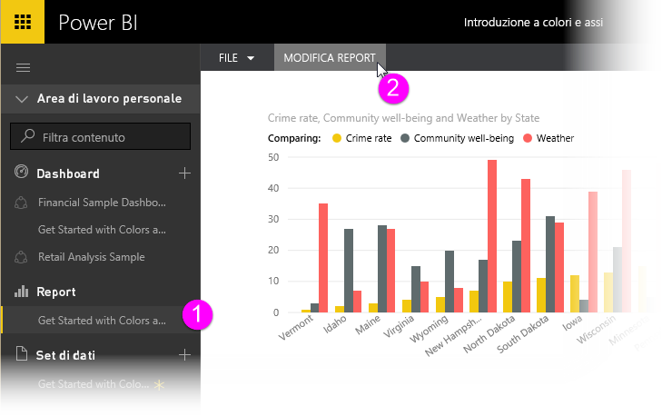

Quando viene visualizzato il riquadro **Visualizzazioni** a destra dell'area di disegno **Report** , è possibile iniziare a personalizzare.

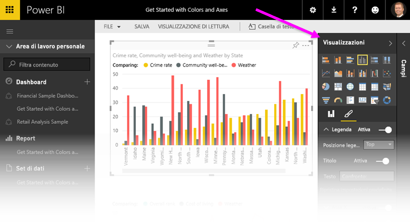

## Cambiare il colore di un unico punto dati
In alcuni casi è utile evidenziare un particolare punto dati, ad esempio le cifre delle vendite per il lancio di un nuovo prodotto o l'aumento dei punteggi di qualità dopo il lancio di un nuovo programma. Con Power BI è possibile evidenziare un particolare punto dati modificandone il colore.

La visualizzazione seguente classifica gli stati in termini di costo della vita. 

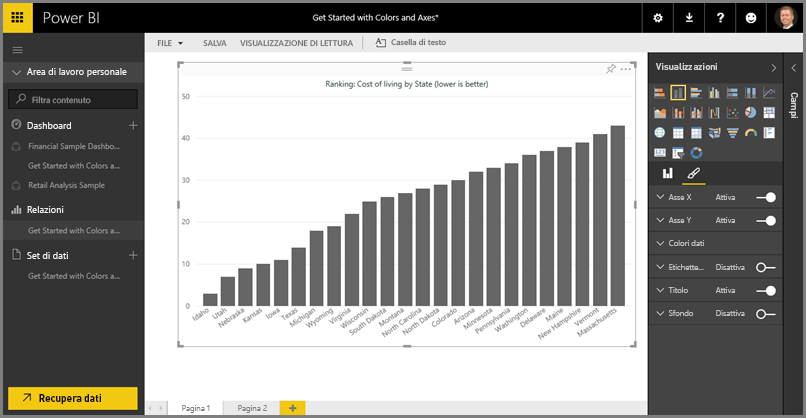

Si supponga di voler evidenziare rapidamente la posizione di Washington nella classifica usando un colore. Ecco i passaggi necessari:

Espandere la sezione **Colori dati** . Verrà visualizzato quanto segue.

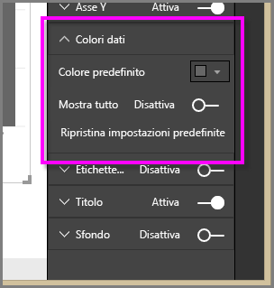

Impostare **Mostra tutto** su **Sì**. Verranno visualizzati i colori per ogni elemento dati nella visualizzazione. Quando si passa il puntatore del mouse sui punti dati, viene abilitato lo scorrimento per consentire la modifica di qualsiasi punto dati.

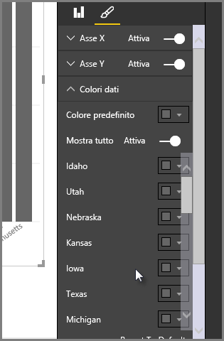

In questo caso selezionare il colore verde per **Washington**. Scorrere fino a **Washington** e selezionare la freccia rivolta verso il basso all'interno della relativa casella del colore per visualizzare la finestra di selezione del colore.

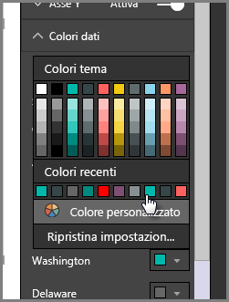

Una volta selezionato, il punto dati **Washington** viene visualizzato con una gradevole tonalità di verde e risalta molto bene.

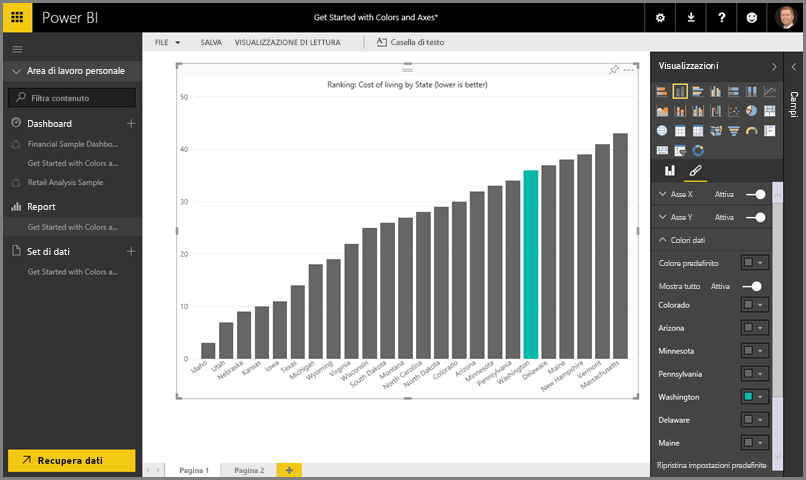

Anche se si cambia tipo di visualizzazione e in seguito si ripristina quella corrente, Power BI ricorda la selezione e mantiene il colore verde per **Washington** .

È anche possibile cambiare il colore di un punto dati per più elementi dati. Nell'immagine seguente **Arizona** è in rosso e **Washington** è ancora verde.

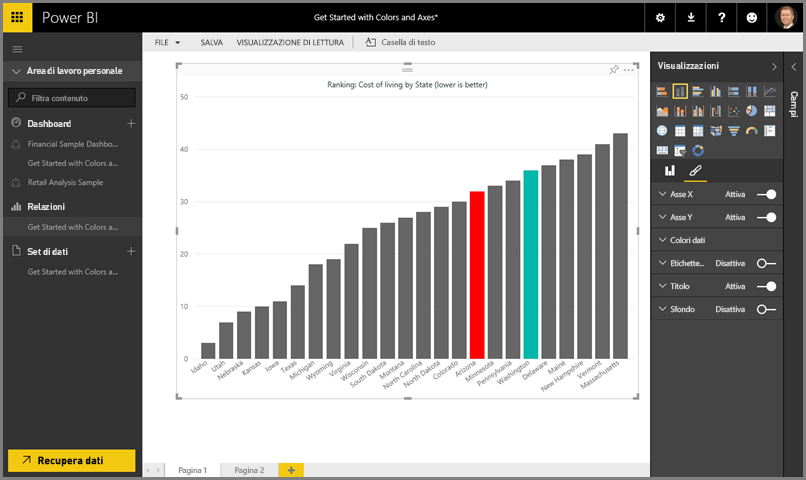

Con i colori è possibile ottenere molti effetti diversi. Nella prossima sezione verranno illustrate le sfumature.

## Basare i colori di un grafico su un valore numerico
I grafici spesso si avvalgono dell'impostazione dinamica dei colori in base al valore numerico di un campo. In questo modo, è possibile presentare un valore diverso rispetto a quello usato per la dimensione di una barra mostrando due valori in un unico grafico. Questa funzionalità consente anche di evidenziare i punti dati al di sopra (o al di sotto) di un determinato valore, magari per evidenziare aree con redditività bassa.

La sezione seguente illustra vari modi per basare il colore su un valore numerico.

## Basare i colori dei punti dati su un valore
Per cambiare il colore in base a un valore, trascinare il campo su cui si vuole basare il colore nell'area **Saturazione colore** nel riquadro **Campo** . Nell'immagine seguente, il campo **Profit before tax** è stato trascinato in **Saturazione colore**. Come si nota, anche se **Velo** ha un valore **Gross Sales** più elevato (la relativa colonna è più alta), **Amarilla** ha un valore **Profit before tax** più elevato (la relativa colonna ha una saturazione di colore maggiore).

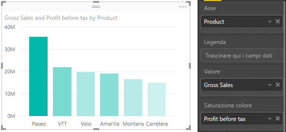

## Personalizzare i colori usati nella scala dei colori
È anche possibile personalizzare i colori usati nella scala dei colori Espandere **Colori dati** per vedere le sfumature di colore usate per visualizzare i dati. Per impostazione predefinita, il valore più basso nei dati viene mappato al colore meno saturo e il valore più alto con al colore più saturo.

La gamma di colori viene mostrata in una barra sfumata che rappresenta lo spettro tra il valore **Minimo** e **Massimo** del colore, con il colore con il valore **Minimo** a sinistra e quello con il valore **Massimo** a destra.

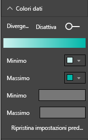

Per cambiare la scala in modo da usare una gamma di colori diversa, selezionare l'elenco a discesa accanto a **Minimo** o **Massimo**e selezionare un colore. Nell'immagine il colore **Massimo** è impostato sul nero e la barra sfumata mostra il nuovo spettro di colore tra **Minimo** e **Massimo**.

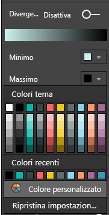

È anche possibile modificare l'associazione tra i valori e questi colori. Nell'immagine seguente, i colori per **Minimo** e **Massimo** sono impostati rispettivamente su arancione e verde.

Si noti che le barre del grafico nella prima immagine riflettono la sfumatura presente nella barra: il valore massimo è verde, quello minimo è arancione e le barre intermedie sono visualizzate con una tonalità di colore nello spettro tra il verde e l'arancione.

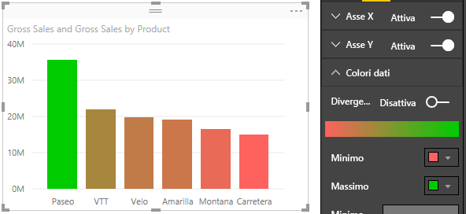

Vediamo ora cosa succede se si specificano valori numerici nelle caselle dei valori **Minimo** e **Massimo** , che si trovano sotto i selettori **Minimo** e **Maximo** , come mostrato nell'immagine seguente. Impostare **Minimo** su 20.000,000 e impostare **Massimo** su 20.000.001.

Impostando questi valori, la sfumatura non viene più applicata ai valori inferiori a **Minimo** o superiori a **Massimo** nel grafico. Tutte le barre con un valore superiore a **Massimo** vengono colorate in verde e quelle con un valore inferiore a **Minimo** in rosso.

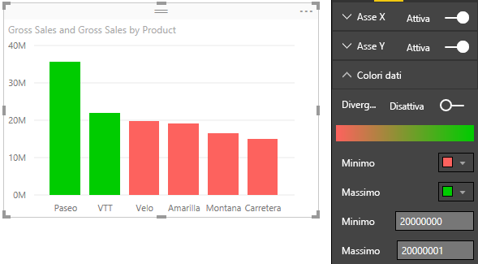

## Usare scale dei colori divergenti
A volte i dati possono avere una scala naturalmente divergente. Ad esempio, un intervallo di temperature ha un centro naturale al punto di congelamento e un punteggio di redditività ha un punto medio (zero) naturale.

Per usare scale di colore divergenti, posizionare il dispositivo di scorrimento **Divergente** su **Sì**. Quando l'opzione **Divergente** è attivata, appaiono un selettore di colore e una casella di valore aggiuntivi, entrambi denominati **Centrale**, come mostrato nella figura seguente.

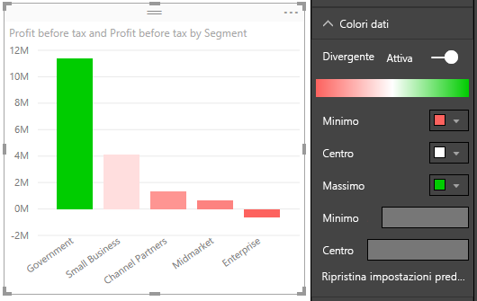

Quando il dispositivo di scorrimento **Divergente** è attivato, è possibile impostare separatamente i colori per **Minimo**, **Massimo** e **Centrale** . Nell'immagine seguente **Centrale** è impostato su uno, quindi le barre con valori al di sopra di uno sono in una sfumatura di verde e le barra al di sotto di uno sono in una sfumatura di rosso.

## Come annullare un'operazione in Power BI
Come molti altri servizi e software Microsoft, Power BI consente di annullare rapidamente l'ultimo comando. Si supponga ad esempio di modificare il colore di un punto dati o di una serie di punti dati e che il colore rappresentato nella visualizzazione non sia di proprio gradimento. Si vorrebbe ripristinare il colore precedente ma non si ricorda esattamente quale colore fosse.

Per **annullare** l'ultima azione o le ultime azioni è sufficiente:

- Premere CTRL+Z

## Commenti e suggerimenti
Se si hanno suggerimenti da condividere, è possibile inviarli. è possibile inviarli. Verranno valutati e, se ritenuti utili, verranno inseriti qui.

>[!NOTE]
>Queste personalizzazioni di colori, assi ed elementi correlati, disponibili quando l'icona **Formato** è selezionata, sono disponibili anche in Power BI Desktop.

## Passaggi successivi
[Introduzione alla formattazione dei colori e alle proprietà degli assi](service-getting-started-with-color-formatting-and-axis-properties.md)

