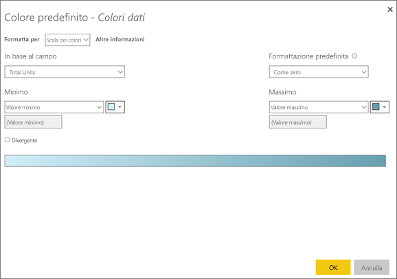

# Suggerimenti e consigli per la formattazione dei colori in Power BI
In Power BI sono disponibili vari modi per personalizzare i dashboard e i report. Questo articolo presenta una raccolta di suggerimenti utili per fare in modo che le visualizzazioni di Power BI siano più accattivanti, interessanti e personalizzate in base alle proprie esigenze.

Sono forniti i suggerimenti seguenti. Se si hanno suggerimenti interessanti, è possibile inviarli. Verranno valutati e, se ritenuti utili, verranno aggiunti a questo elenco.

* Cambiare il colore di un unico punto dati
* Basare i colori di un grafico su un valore numerico
* Basare i colori dei punti dati su un valore di campo
* Personalizzare i colori usati nella scala dei colori
* Usare scale dei colori divergenti
* Come annullare un'operazione in Power BI

Per apportare modifiche, è necessario modificare un report. Aprire il report e quindi scegliere **Modifica report** dall'area del menu superiore, come illustrato nell'immagine seguente.

Quando vengono visualizzati i riquadri **Filtri** e **Visualizzazioni** a destra del canvas del report, è possibile iniziare a personalizzare. Se il riquadro non viene visualizzato, selezionare la freccia nell'angolo superiore destro per aprirlo.

## Cambiare il colore di un unico punto dati
In alcuni casi è utile evidenziare un particolare punto dati, ad esempio le cifre delle vendite per il lancio di un nuovo prodotto o l'aumento dei punteggi di qualità dopo il lancio di un nuovo programma. Con Power BI è possibile evidenziare un particolare punto dati modificandone il colore.

La visualizzazione seguente classifica le unità vendute in base al segmento di prodotto. 

Si supponga ora di voler mettere in evidenza il segmento **Convenience** per mostrare le ottime prestazioni di questo nuovo segmento, usando il colore. Ecco i passaggi necessari:

Espandere la sezione **Colori dati** e spostare il dispositivo di scorrimento di **Mostra tutto** su Sì. Verranno visualizzati i colori per ogni elemento dati nella visualizzazione. Quando si passa il puntatore del mouse sui punti dati, viene abilitato lo scorrimento per consentire la modifica di qualsiasi punto dati.

Impostare il colore arancione per **Convenience**. 

Una volta selezionato, il punto dati **Convenience** viene visualizzato con una gradevole tonalità di arancione e risalta molto bene.

Anche se si cambia tipo di visualizzazione e in seguito si ripristina quella corrente, Power BI ricorda la selezione e mantiene il colore arancione per **Convenience**.

È possibile modificare il colore di un punto dati per uno, alcuni o tutti gli elementi dati nella visualizzazione. Potrebbe essere utile usare i colori aziendali per un oggetto visivo. 

Con i colori è possibile ottenere molti effetti diversi. Nella prossima sezione verranno illustrate le sfumature.

## Basare i colori di un grafico su un valore numerico
I grafici spesso si avvalgono dell'impostazione dinamica dei colori in base al valore numerico di un campo. In questo modo, è possibile presentare un valore diverso rispetto a quello usato per la dimensione di una barra mostrando due valori in un unico grafico. Questa funzionalità consente anche di evidenziare i punti dati al di sopra (o al di sotto) di un determinato valore, magari per evidenziare aree con redditività bassa.

La sezione seguente illustra vari modi per basare il colore su un valore numerico.

## Basare i colori dei punti dati su un valore
Per cambiare il colore in base a un valore, aprire il riquadro di formattazione e selezionare l'opzione **Formattazione condizionale**.  

Nel riquadro Colori predefiniti usare gli elenchi a discesa per identificare i campi da usare per la formattazione condizionale. In questo esempio è stato scelto il campo **Sales fact** > **Total Units** ed è stato selezionato l'azzurro per **Valore minimo** e il blu scuro per **Valore massimo**. 

È anche possibile formattare il colore dell'oggetto visivo usando un campo che non fa parte dell'oggetto visivo. Nell'immagine seguente viene usato **%Market Share SPLY YTD**. 

Si noti che, anche se il numero di unità vendute è maggiore sia per **Productivity** che per **Extreme** (le colonne sono più alte), **Moderation** ha una valore maggiore per **%Market Share SPLY YTD** (la saturazione del colore della colonna è maggiore).

## Personalizzare i colori usati nella scala dei colori
È anche possibile modificare l'associazione tra i valori e questi colori. Nell'immagine seguente, i colori per **Minimo** e **Massimo** sono impostati rispettivamente su arancione e verde.

Si noti che le barre del grafico nella prima immagine riflettono la sfumatura presente nella barra: il valore massimo è verde, quello minimo è arancione e le barre intermedie sono visualizzate con una tonalità di colore nello spettro tra il verde e l'arancione.

A questo punto, vediamo cosa succede se si specificano valori numerici nelle caselle **Minimo** e **Massimo**. Impostare **Minimo** su 3.500 e **Massimo** su 6.000.

Impostando questi valori, la sfumatura non viene più applicata ai valori inferiori a **Minimo** o superiori a **Massimo** nel grafico. Tutte le barre con un valore superiore a **Massimo** vengono colorate in verde e quelle con un valore inferiore a **Minimo** in rosso.

## Usare scale dei colori divergenti
A volte i dati possono avere una scala naturalmente divergente. Ad esempio, un intervallo di temperature ha un centro naturale al punto di congelamento e un punteggio di redditività ha un punto medio (zero) naturale.

Per usare scale di colori divergenti, selezionare l'opzione **Divergente**. Quando l'opzione **Divergente** è attivata, viene visualizzato un selettore di colore aggiuntivo, **Al centro**, come illustrato nella figura seguente.

Quando il dispositivo di scorrimento **Divergente** è attivato, è possibile impostare separatamente i colori per **Minimo**, **Massimo** e **Centrale** . Nell'immagine seguente **Al centro** è impostato su 0,2 per **% Market Share SPLY YTD**, quindi le barre con valori al di sopra di 0,2 sono in una sfumatura di verde e le barra al di sotto di questo valore sono in una sfumatura di rosso.

## Come annullare un'operazione in Power BI
Come molti altri servizi e software Microsoft, Power BI consente di annullare rapidamente l'ultimo comando. Si supponga ad esempio di modificare il colore di un punto dati o di una serie di punti dati e che il colore rappresentato nella visualizzazione non sia di proprio gradimento. Si vorrebbe ripristinare il colore precedente ma non si ricorda esattamente quale colore fosse.

Per **annullare** l'ultima azione o le ultime azioni è sufficiente:

- Premere CTRL+Z

## Commenti e suggerimenti
Se si hanno suggerimenti da condividere, è possibile inviarli. è possibile inviarli. Verranno valutati e, se ritenuti utili, verranno inseriti qui.

>[!NOTE]
>Queste personalizzazioni di colori, assi ed elementi correlati, disponibili quando l'icona **Formato** è selezionata, sono disponibili anche in Power BI Desktop.

## Passaggi successivi
[Introduzione alla formattazione dei colori e alle proprietà degli assi](service-getting-started-with-color-formatting-and-axis-properties.md)

