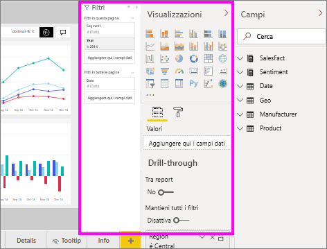

# Suggerimenti e consigli per la formattazione dei colori in Power BI
In Power BI sono disponibili vari modi per personalizzare i dashboard e i report. Questo articolo presenta una raccolta di suggerimenti utili per fare in modo che le visualizzazioni di Power BI siano più accattivanti, interessanti e personalizzate in base alle proprie esigenze.

Sono forniti i suggerimenti seguenti. Se si hanno suggerimenti interessanti, è possibile inviarli. Verranno valutati e, se ritenuti utili, verranno aggiunti a questo elenco.

* Applicare un tema all'intero report
* Cambiare il colore di un unico punto dati
* Formattazione condizionale
* Basare i colori di un grafico su un valore numerico
* Basare i colori dei punti dati su un valore di campo
* Personalizzare i colori usati nella scala dei colori
* Usare scale dei colori divergenti
* Aggiungere il colore alle righe della tabella
* Come annullare un'operazione in Power BI

Per apportare modifiche, è necessario avere le autorizzazioni di modifica per il report. Aprire il report nella visualizzazione **Report** di Power BI Desktop. Nel servizio Power BI significa aprire il report e selezionare **Modifica** dalla barra dei menu, come illustrato nella figura seguente.

Quando vengono visualizzati i riquadri **Filtri** e **Visualizzazioni** a destra del canvas del report, è possibile iniziare a personalizzare. Se i riquadri non vengono visualizzati, selezionare la freccia nell'angolo superiore destro per aprirli.

## Applicare un tema
I temi dei report consentono di applicare modifiche alla struttura dell'intero report, ad esempio usando i colori aziendali, modificando i set di icone o applicando una nuova formattazione visuale predefinita. Quando si applica un tema del report, tutti gli oggetti visivi del report usano i colori e la formattazione del tema selezionato. Per altre informazioni, vedere [Usare i temi dei report](../desktop-report-themes.md)

In questo caso è stato applicato il tema **Innovazione** al report Sales and Marketing.

## Cambiare il colore di un unico punto dati
In alcuni casi è utile evidenziare un particolare punto dati, ad esempio la cifra delle vendite per il lancio di un nuovo prodotto o l'aumento dei punteggi di qualità dopo il lancio di un nuovo programma. Con Power BI è possibile evidenziare un particolare punto dati modificandone il colore.

La visualizzazione seguente classifica le unità vendute in base al segmento di prodotto. 

Si supponga ora di voler mettere in evidenza il segmento **Convenience** per mostrare le ottime prestazioni di questo nuovo segmento, usando il colore. Ecco i passaggi necessari:

Espandere la scheda **Colori dati** e spostare il dispositivo di scorrimento di **Mostra tutto** su Sì. Verranno visualizzati i colori per ogni elemento dati nella visualizzazione. Ora è possibile modificare uno dei punti dati.

Impostare il colore arancione per **Convenience**. 

Una volta selezionato, il punto dati **Convenience** viene visualizzato con una gradevole tonalità di arancione e risalta molto bene.

Anche se si cambia tipo di visualizzazione e in seguito si ripristina quella corrente, Power BI ricorda la selezione e mantiene il colore arancione per **Convenience**.

È possibile modificare il colore di un punto dati per uno, alcuni o tutti gli elementi dati nella visualizzazione. Potrebbe essere utile usare i colori aziendali giallo, verde e blu per un oggetto visivo. 

Con i colori è possibile ottenere molti effetti diversi. Nella prossima sezione è illustrata la formattazione condizionale.

## Formattazione condizionale per le visualizzazioni
Le visualizzazioni spesso si avvalgono dell'impostazione dinamica dei colori in base al valore numerico di un campo. In questo modo, è possibile presentare un valore diverso rispetto a quello usato per la dimensione di una barra mostrando due valori in un unico grafico. Questa funzionalità consente anche di evidenziare i punti dati al di sopra (o al di sotto) di un determinato valore, magari per evidenziare aree con redditività bassa.

La sezione seguente illustra vari modi per basare il colore su un valore numerico.

### Basare i colori dei punti dati su un valore
Per modificare il colore basato su un valore, selezionare una visualizzazione per attivarla. Aprire il riquadro Formattazione selezionando l'icona del rullo e quindi aprire la scheda **Colori dati**. Passare il puntatore sulla scheda, selezionare i tre punti verticali visualizzati e scegliere **Formattazione condizionale**.  

Nel riquadro **Colore predefinito** usare gli elenchi a discesa per identificare i campi da usare per la formattazione condizionale. In questo esempio è stato scelto il campo **Sales fact** > **Total Units** ed è stato selezionato l'azzurro per **Valore minimo** e il blu scuro per **Valore massimo**. 

È anche possibile formattare il colore dell'oggetto visivo usando un campo che non fa parte dell'oggetto visivo. Nell'immagine seguente viene usato **%Market Share SPLY YTD**. 

Si noti che, anche se il numero di unità vendute è maggiore sia per **Productivity** che per **Extreme** (le colonne sono più alte), **Moderation** ha una valore maggiore per **%Market Share SPLY YTD** (la saturazione del colore della colonna è maggiore).

### Personalizzare i colori usati nella scala dei colori
È anche possibile modificare l'associazione tra i valori e questi colori. Nell'immagine seguente, i colori per **Minimo** e **Massimo** sono impostati rispettivamente su arancione e verde.

Si noti che le barre del grafico nella prima immagine riflettono la sfumatura presente nella barra: il valore massimo è verde, quello minimo è arancione e le barre intermedie sono visualizzate con una tonalità di colore nello spettro tra il verde e l'arancione.

A questo punto, vediamo cosa succede se si specificano valori numerici nelle caselle **Minimo** e **Massimo**. Selezionare **Personalizzato** dalle caselle a discesa sia per **Minimo** che per **Massimo** e impostare **Minimo** su 3.500 e **Massimo** su 6.000.

Impostando questi valori, la sfumatura non viene più applicata ai valori inferiori a **Minimo** o superiori a **Massimo** nel grafico. Tutte le barre con un valore superiore a **Massimo** vengono colorate in verde e quelle con un valore inferiore a **Minimo** in rosso.

### Usare scale dei colori divergenti
A volte i dati possono avere una scala naturalmente divergente. Ad esempio, un intervallo di temperature ha un centro naturale al punto di congelamento e un punteggio di redditività ha un punto medio (zero) naturale.

Per usare scale di colori divergenti, selezionare la casella di controllo **Divergente**. Quando l'opzione **Divergente** è attivata, viene visualizzato un selettore di colore aggiuntivo, **Al centro**, come illustrato nella figura seguente.

Quando il dispositivo di scorrimento **Divergente** è attivato, è possibile impostare separatamente i colori per **Minimo**, **Massimo** e **Centrale** . Nell'immagine seguente **Al centro** è impostato su 0,2 per **% Market Share SPLY YTD**, quindi le barre con valori al di sopra di 0,2 sono in una sfumatura di verde e le barra al di sotto di questo valore sono in una sfumatura di rosso.

## Aggiungere il colore alle righe della tabella
Le tabelle e le matrici offrono molte opzioni per la formattazione dei colori. 

Uno dei modi più rapidi per applicare il colore a una tabella o una matrice è aprire la scheda Formattazione e selezionare **Stile**.  Nell'immagine seguente è stata selezionata l'opzione **Righe lampeggianti con intestazione in grassetto**.

Sperimentare altre opzioni di formattazione dei colori. In questa immagine è stato modificato il colore di sfondo in **Intestazioni di colonna** e sono stati modificati sia il **colore di sfondo** che il **colore di sfondo alternativo** per i **valori**(righe).

## Come annullare un'operazione in Power BI
Come molti altri servizi e software Microsoft, Power BI consente di annullare rapidamente l'ultimo comando. Si supponga ad esempio di modificare il colore di un punto dati o di una serie di punti dati e che il colore rappresentato nella visualizzazione non sia di proprio gradimento. Si vorrebbe ripristinare il colore precedente ma non si ricorda esattamente quale colore fosse.

Per **annullare** l'ultima azione o le ultime azioni è sufficiente premere CTRL+Z.

Per rimuovere tutte le modifiche apportate in una scheda Formattazione, selezionare **Ripristina valori predefiniti**.

## Commenti e suggerimenti
Se si hanno suggerimenti da condividere, è possibile inviarli. è possibile inviarli. Verranno valutati e, se ritenuti utili, verranno inseriti qui.

## Passaggi successivi
[Introduzione alla formattazione dei colori e alle proprietà degli assi](service-getting-started-with-color-formatting-and-axis-properties.md)

