# Distribuire Power BI contenuto a utenti Guest esterni usando Azure Active Directory B2B

**Riepilogo:** Si tratta di un white paper tecnico che illustra come distribuire il contenuto agli utenti esterni all'organizzazione usando l'integrazione di Azure Active Directory business-to-business (Azure AD B2B).

**Writer:** Lukasz Pawlowski, Kasper de Jonge

**Revisori tecnici:** Adam Wilson, Sheng Liu, Qian Liang, Sergei Gundorov, Jacob Grimm, Adam Saxton, Maya Shenhav, Nimrod Shalit, Elisabeth Olson

> [!NOTE]
> È possibile salvare o stampare questo white paper selezionando **Stampa** dal browser, quindi selezionando **Salva come PDF**.

## Introduzione

Power BI offre alle organizzazioni una visualizzazione a 360 gradi della propria attività e consente a tutti gli utenti di queste organizzazioni di prendere decisioni intelligenti usando i dati. Molte di queste organizzazioni hanno relazioni complesse e affidabili con partner esterni, client e collaboratori. Queste organizzazioni devono fornire l'accesso sicuro ai dashboard e ai report Power BI agli utenti di questi partner esterni.

Power BI si integra con [Azure Active Directory business-to-business (B2B) Azure ad](https://docs.microsoft.com/azure/active-directory/b2b/what-is-b2b) per consentire una distribuzione sicura del contenuto Power bi agli utenti Guest esterni all'organizzazione, mantenendo al tempo stesso il controllo e l'accesso ai dati interni.

Questo white paper illustra tutti i dettagli necessari per comprendere l'integrazione di Power BI con Azure Active Directory B2B. Vengono descritti il caso d'uso più comune, il programma di installazione, le licenze e la sicurezza a livello di riga.

> [!NOTE]
> Nel corso di questa white paper, si fa riferimento a Azure Active Directory Azure AD e Azure Active Directory business to business come Azure AD B2B.

## Scenari

Contoso è un produttore automobilistico e collabora con molti fornitori diversi che lo forniscono a tutti i componenti, i materiali e i servizi necessari per eseguire le operazioni di produzione. Contoso vuole semplificare la logistica della supply chain e pianificare l'uso di Power BI per monitorare le metriche delle prestazioni chiave della supply chain. Contoso vuole condividere con l'analisi dei partner Supply Chain esterna in modo sicuro e gestibile.

Contoso può consentire le seguenti esperienze per gli utenti esterni usando Power BI e Azure AD B2B.

### Ad hoc per condivisione di elementi

Contoso collabora con un fornitore che compila radiatori per le automobili di contoso. Spesso, devono ottimizzare l'affidabilità dei radiatori usando i dati di tutte le automobili di contoso. Un analista di Contoso USA Power BI per condividere un report sull'affidabilità del radiatore con un tecnico presso il fornitore. Il tecnico riceve un messaggio di posta elettronica con un collegamento per visualizzare il report.

Come descritto in precedenza, questa condivisione ad hoc viene eseguita dagli utenti di business in base alle esigenze. Il collegamento inviato da Power BI all'utente esterno è un collegamento di invito Azure AD B2B. Quando l'utente esterno apre il collegamento, viene chiesto di partecipare all'organizzazione Azure AD di Contoso come utente Guest. Dopo l'accettazione dell'invito, il collegamento apre il report o il Dashboard specifico. Il Azure Active Directory amministratore delega l'autorizzazione per invitare utenti esterni all'organizzazione e sceglie le operazioni che gli utenti possono eseguire dopo aver accettato l'invito, come descritto nella sezione Governance di questo documento. L'analista di Contoso può invitare l'utente guest solo perché l'amministratore Azure AD ha consentito tale azione e l'amministratore Power BI ha consentito agli utenti di invitare gli utenti a visualizzare il contenuto nelle impostazioni del tenant di Power BI.

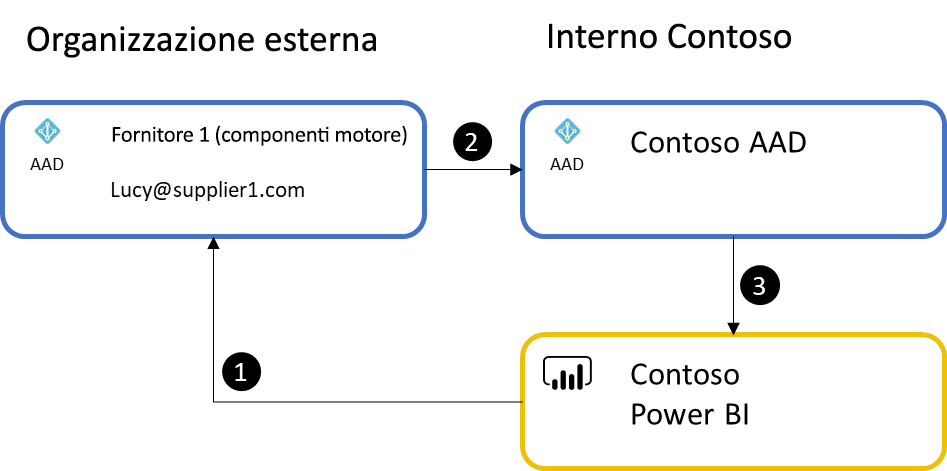

1. Il processo inizia con un utente interno di Contoso che condivide un dashboard o un report con un utente esterno. Se l'utente esterno non è già un Guest nel Azure AD di Contoso, viene invitato. Viene inviato un messaggio di posta elettronica al proprio indirizzo di posta elettronica che include un invito al Azure AD di contoso
2. Il destinatario accetta l'invito al Azure AD di Contoso e viene aggiunto come utente guest nella Azure AD di contoso.
3. Il destinatario viene quindi reindirizzato al dashboard, al report o all'app Power BI, che sono di sola lettura per l'utente.

Il processo è considerato ad hoc poiché gli utenti aziendali in Contoso eseguono l'azione di invito in base alle esigenze aziendali. Ogni elemento condiviso è un singolo collegamento a cui l'utente esterno può accedere per visualizzare il contenuto.

Una volta che l'utente esterno è stato invitato ad accedere alle risorse di Contoso, è possibile creare un account shadow in Contoso Azure AD e non è necessario che venga invitato di nuovo.  La prima volta che tentano di accedere a una risorsa di Contoso, ad esempio un dashboard Power BI, passano attraverso un processo di consenso, che riscatta l'invito.  Se non completano il consenso, non potranno accedere ai contenuti di contoso.  Se si riscontrano problemi durante il riscatto dell'invito tramite il collegamento originale fornito, un amministratore Azure AD può inviare un invito a un collegamento di invito specifico per poterlo riscattare.

### Pianificazione per condivisione elementi

Contoso collabora con un subappaltatore per eseguire un'analisi dell'affidabilità dei radiatori. Il subappaltatore ha un team di 10 persone che necessitano dell'accesso ai dati nell'ambiente Power BI di contoso. L'amministratore di Contoso Azure AD è impegnato a invitare tutti gli utenti e a gestire eventuali aggiunte o modifiche apportate dal personale presso il subappaltatore. L'amministratore di Azure AD crea un gruppo di sicurezza per tutti i dipendenti del subappaltatore. Utilizzando il gruppo di sicurezza, i dipendenti di Contoso possono gestire facilmente l'accesso ai report e assicurarsi che tutti i membri del subappaltatore necessari abbiano accesso a tutti i report, i dashboard e le app Power BI necessari. L'amministratore Azure AD può anche evitare di partecipare al processo di invito, scegliendo di delegare i diritti di invito a un dipendente attendibile presso Contoso o al subappaltatore per garantire la gestione tempestiva del personale.

Alcune organizzazioni richiedono un maggiore controllo sul momento in cui vengono aggiunti utenti esterni, invitano molti utenti in un'organizzazione esterna o in molte organizzazioni esterne. In questi casi, la condivisione pianificata può essere usata per gestire la scalabilità della condivisione, per applicare i criteri aziendali e anche per delegare i diritti alle persone attendibili per invitare e gestire utenti esterni. Azure AD B2B supporta gli inviti pianificati da inviare direttamente [dall'portale di Azure da un amministratore it](https://docs.microsoft.com/azure/active-directory/b2b/add-users-administrator)o tramite [PowerShell usando l'API di gestione degli inviti](https://docs.microsoft.com/azure/active-directory/b2b/customize-invitation-api) in cui è possibile invitare un set di utenti in un'unica azione. Utilizzando l'approccio di invito pianificato, l'organizzazione può controllare gli utenti che possono invitare gli utenti e implementare i processi di approvazione. Le funzionalità avanzate di Azure AD come i gruppi dinamici possono semplificare la gestione automatica dell'appartenenza al gruppo di sicurezza.

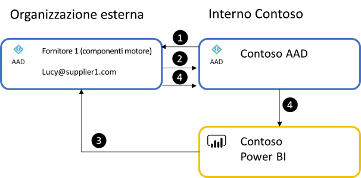

1. Il processo viene interpretato da un amministratore IT che invita l'utente Guest manualmente o tramite l'API fornita da Azure Active Directory
2. L'utente accetta l'invito per l'organizzazione.
3. Una volta che l'utente ha accettato l'invito, un utente in Power BI può condividere un report o un dashboard con l'utente esterno oppure un gruppo di sicurezza in cui si trovano. Analogamente a quanto avviene con la condivisione regolare in Power BI utente esterno riceve un messaggio di posta elettronica con il collegamento all'elemento.
4. Quando l'utente esterno accede al collegamento, la relativa autenticazione nella directory viene passata al Azure AD di Contoso e usata per accedere al contenuto del Power BI.

### Condivisione ad hoc o pianificata di app Power BI

Contoso dispone di un set di report e dashboard che è necessario condividere con uno o più fornitori. Per assicurarsi che tutti gli utenti esterni necessari abbiano accesso a questo contenuto, viene incluso nel pacchetto come app Power BI. Gli utenti esterni vengono aggiunti direttamente all'elenco di accesso all'app o ai gruppi di sicurezza. Un utente presso Contoso invia quindi l'URL dell'app a tutti gli utenti esterni, ad esempio in un messaggio di posta elettronica. Quando gli utenti esterni aprono il collegamento, visualizzano tutto il contenuto in un'unica esperienza facile da esplorare.

L'uso di un'app Power BI semplifica la creazione di un portale BI per i suoi fornitori da contoso. Un elenco di accesso singolo controlla l'accesso a tutti i contenuti necessari riducendo il controllo del tempo sprecato e impostando le autorizzazioni a livello di elemento. Azure AD B2B mantiene l'accesso alla sicurezza utilizzando l'identità nativa del fornitore, in modo che gli utenti non necessitino di credenziali di accesso aggiuntive. Se si usano gli inviti pianificati con i gruppi di sicurezza, la gestione dell'accesso all'app quando il personale si sposta all'interno o all'esterno del progetto viene semplificata. Appartenenza ai gruppi di sicurezza manualmente o tramite [gruppi dinamici](https://docs.microsoft.com/azure/active-directory/b2b/use-dynamic-groups), in modo che tutti gli utenti esterni di un fornitore vengano aggiunti automaticamente al gruppo di sicurezza appropriato.

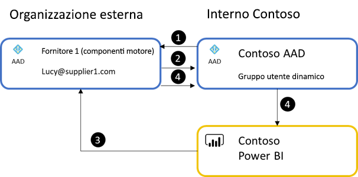

1. Il processo inizia dall'utente invitato all'organizzazione Azure AD di contoso tramite la portale di Azure o PowerShell
2. È possibile aggiungere l'utente a un gruppo di utenti in Azure AD. È possibile utilizzare un gruppo di utenti statico o dinamico, ma i gruppi dinamici consentono di ridurre il lavoro manuale.
3. Agli utenti esterni viene concesso l'accesso all'app Power BI tramite il gruppo di utenti. L'URL dell'app deve essere inviato direttamente all'utente esterno o inserito in un sito a cui ha accesso. Power BI consente di inviare un messaggio di posta elettronica con il collegamento all'app a utenti esterni, ma quando si usano gruppi di utenti la cui appartenenza può cambiare, Power BI non è in grado di inviare a tutti gli utenti esterni gestiti tramite gruppi di utenti.
4. Quando l'utente esterno accede all'URL dell'app Power BI, viene autenticato da Azure AD di Contoso, l'app viene installata per l'utente e l'utente può visualizzare tutti i report e i dashboard contenuti all'interno dell'app.

Le app hanno anche una funzionalità univoca che consente agli autori di app di installare automaticamente l'applicazione per l'utente, in modo che sia disponibile quando l'utente esegue l'accesso. Questa funzionalità viene installata solo automaticamente per gli utenti esterni che fanno già parte dell'organizzazione di Contoso al momento della pubblicazione o dell'aggiornamento dell'applicazione. Pertanto, è consigliabile usare l'approccio di invito pianificato e dipende dall'applicazione pubblicata o aggiornata dopo l'aggiunta degli utenti al Azure AD di contoso. Gli utenti esterni possono sempre installare l'app usando il collegamento all'app.

### Commenti e sottoscrizioni al contenuto tra organizzazioni

Poiché Contoso continua a collaborare con i propri subappaltatori o fornitori, i tecnici esterni devono collaborare strettamente con gli analisti di contoso. Power BI offre diverse funzionalità di collaborazione che consentono agli utenti di comunicare sui contenuti che possono utilizzare. I commenti del dashboard (e presto i commenti di report) consentono agli utenti di discutere i punti dati che vedono e comunicano con gli autori del report per porre domande.

Attualmente, gli utenti Guest esterni possono partecipare ai commenti lasciando commenti e leggendo le risposte. Tuttavia, a differenza degli utenti interni, gli utenti guest non possono essere @mentioned e non ricevono notifiche che hanno ricevuto un commento. Gli utenti guest non possono utilizzare la funzionalità delle sottoscrizioni all'interno Power BI al momento della stesura di questo documento. In una versione futura le restrizioni verranno revocate e l'utente Guest riceverà un messaggio di posta elettronica quando un commento @mentions o quando una sottoscrizione viene recapitata al messaggio di posta elettronica contenente un collegamento al contenuto Power BI.

### Accedere al contenuto nelle app per dispositivi mobili Power BI

In una versione futura, quando gli utenti di Contoso condividono report o dashboard con le relative controparti Guest esterne, Power BI invierà un messaggio di posta elettronica di notifica al Guest. Quando l'utente Guest apre il collegamento al report o al Dashboard sul dispositivo mobile, il contenuto verrà aperto nelle app native Power BI per dispositivi mobili nel dispositivo, se sono installate. L'utente guest sarà quindi in grado di spostarsi tra il contenuto condiviso con loro nel tenant esterno e tornare al relativo contenuto dal tenant principale.

> [!NOTE]
> L'utente Guest non può aprire l'app per dispositivi mobili Power BI e passare immediatamente al tenant esterno, deve iniziare con un collegamento a un elemento nel tenant esterno. Le soluzioni alternative comuni sono descritte nella sezione relativa alla [distribuzione dei collegamenti al contenuto nella Power bi dell'organizzazione padre](#distributing-links-to-content-in-the-parent-organizations-power-bi) più avanti in questo documento.

### Modifica e gestione tra organizzazioni di contenuti Power BI

Contoso e i suoi fornitori e subappaltatori lavorano sempre più a stretto contatto. Spesso un analista del subappaltatore necessita di metriche o visualizzazioni dati aggiuntive da aggiungere a un report che Contoso ha condiviso con loro. I dati devono risiedere nel tenant Power BI di Contoso, ma gli utenti esterni devono essere in grado di modificarli, creare nuovi contenuti e persino distribuirli a utenti appropriati.

Power BI offre un'opzione che consente **agli utenti Guest esterni di modificare e gestire il contenuto** dell'organizzazione. Per impostazione predefinita, gli utenti esterni hanno un'esperienza orientata al consumo di sola lettura. Tuttavia, questa nuova impostazione consente all'amministratore Power BI di scegliere quali utenti esterni possono modificare e gestire il contenuto all'interno della propria organizzazione. Una volta consentiti, l'utente esterno può modificare report, dashboard, pubblicare o aggiornare le app, lavorare nelle aree di lavoro e connettersi ai dati che dispongono delle autorizzazioni per l'uso.

Questo scenario viene descritto in dettaglio nella sezione consentire agli utenti esterni di modificare e gestire il contenuto in Power BI più avanti in questo documento.

## Relazioni organizzative con Power BI e Azure AD B2B

Quando tutti gli utenti di Power BI sono interni all'organizzazione, non è necessario usare Azure AD B2B. Tuttavia, quando due o più organizzazioni desiderano collaborare sui dati e informazioni dettagliate, il supporto di Power BI per Azure AD B2B semplifica ed economicamente conveniente.

Di seguito vengono in genere rilevate strutture organizzative particolarmente adatte per Azure AD collaborazione tra organizzazioni di tipo B2B in Power BI. Azure AD B2B funziona bene nella maggior parte dei casi, ma in alcune situazioni è opportuno considerare gli approcci alternativi più comuni trattati alla fine di questo documento.

### Caso 1: collaborazione diretta tra organizzazioni

La relazione di Contoso con il suo fornitore radiante è un esempio di collaborazione diretta tra le organizzazioni. Poiché sono presenti relativamente pochi utenti presso Contoso e il suo fornitore che necessitano dell'accesso alle informazioni sull'affidabilità del radiatore, l'uso di Azure AD la condivisione esterna basata su B2B è la soluzione ideale. È facile da usare e semplice da amministrare. Si tratta di un modello comune in servizi di consulenza in cui un consulente potrebbe dover compilare contenuto per un'organizzazione.

Questa condivisione viene in genere eseguita inizialmente utilizzando ad hoc per la condivisione di elementi. Tuttavia, man mano che i team crescono o aumentano le relazioni, l'approccio pianificato per la condivisione di elementi diventa il metodo preferito per ridurre il sovraccarico di gestione. Inoltre, la condivisione ad hoc o pianificata di app Power BI, commenti e sottoscrizioni al contenuto tra organizzazioni, l'accesso al contenuto nelle app per dispositivi mobili può entrare in gioco e la modifica e la gestione tra organizzazioni di Power BI contenuto. In particolare, se gli utenti di entrambe le organizzazioni hanno Power BI Pro licenze nelle rispettive organizzazioni, possono usare tali licenze Pro negli ambienti Power BI dell'altro. Questo offre una licenza vantaggiosa perché l'organizzazione che invia l'invito potrebbe non dover pagare una licenza di Power BI Pro per gli utenti esterni. Questo argomento viene illustrato più dettagliatamente nella sezione licenze più avanti in questo documento.

### Caso 2: padre e relative consociate o affiliate

Alcune strutture dell'organizzazione sono più complesse, tra cui consociate parzialmente o interamente di proprietà, società affiliate o relazioni del provider di servizi gestiti. Queste organizzazioni hanno un'organizzazione padre, ad esempio una società di gestione, ma le organizzazioni sottostanti operano in modo semi-autonomo, a volte in base a requisiti regionali diversi. In questo modo, ogni organizzazione dispone di un proprio ambiente Azure AD e separa Power BI tenant.

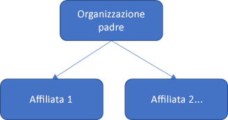

In questa struttura, l'organizzazione padre deve in genere distribuire informazioni standardizzate alle sue filiali. In genere, questa condivisione si verifica usando la condivisione ad hoc o pianificata di Power BI approccio delle app, come illustrato nell'immagine seguente, perché consente la distribuzione di contenuto autorevole standardizzato a destinatari più ampi. In pratica, viene utilizzata una combinazione di tutti gli scenari indicati in precedenza in questo documento.

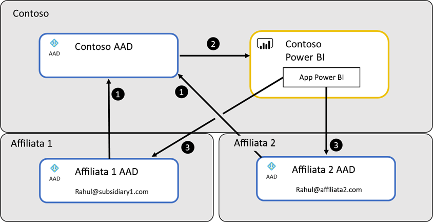

Segue il processo seguente:

1. Gli utenti di ogni filiale sono invitati a Azure AD di contoso
2. Viene quindi pubblicata l'app Power BI per concedere a tali utenti l'accesso ai dati necessari
3. Infine, gli utenti aprono l'app tramite un collegamento assegnato per visualizzare i report

Alcune problematiche importanti sono affrontate dalle organizzazioni in questa struttura:

- Come distribuire i collegamenti al contenuto nell'Power BI dell'organizzazione padre
- Come consentire agli utenti di accedere all'origine dati ospitata dall'organizzazione padre

#### Distribuzione dei collegamenti al contenuto nell'Power BI dell'organizzazione padre

Per distribuire i collegamenti al contenuto vengono comunemente usati tre approcci. Il primo e il più semplice consiste nell'inviare il collegamento all'app agli utenti necessari o di inserirlo in un sito di SharePoint Online da cui è possibile aprirlo. Gli utenti possono quindi aggiungere un segnalibro al collegamento nei browser per un accesso più rapido ai dati necessari.

Il secondo approccio si basa sulla modifica e sulla gestione tra organizzazioni della funzionalità di Power BI contenuto. L'organizzazione padre consente agli utenti delle filiali di accedere ai Power BI e controlla gli elementi a cui possono accedere tramite l'autorizzazione. Questo consente di accedere a Power BI Home in cui l'utente della filiale Visualizza un elenco completo dei contenuti condivisi nel tenant dell'organizzazione padre. Quindi, l'URL dell'ambiente Power BI delle organizzazioni padre viene assegnato agli utenti delle filiali.

L'ultimo approccio usa un'app Power BI creata all'interno del tenant Power BI per ogni filiale. L'app Power BI include un dashboard con [riquadri configurati con l'opzione di collegamento esterno](https://docs.microsoft.com/power-bi/service-dashboard-edit-tile#hyperlink). Quando l'utente preme il riquadro, viene portato al report, al dashboard o all'app appropriata nel Power BI dell'organizzazione padre. Questo approccio offre il vantaggio aggiuntivo che l'app può essere installata automaticamente per tutti gli utenti della filiale ed è disponibile ogni volta che accedono al proprio ambiente Power BI. Un ulteriore vantaggio di questo approccio è che funziona bene con le app per dispositivi mobili Power BI in grado di aprire il collegamento in modo nativo. È anche possibile combinare questa opzione con il secondo approccio per consentire un cambio più semplice tra ambienti Power BI.

#### Consentire agli utenti di accedere alle origini dati ospitate dall'organizzazione padre

Spesso gli analisti di una filiale devono creare una propria analisi usando i dati forniti dall'organizzazione padre. In questo caso, per risolvere il problema si usano comunemente le origini dati cloud.

Il primo approccio sfrutta [Azure Analysis Services](https://docs.microsoft.com/azure/analysis-services/analysis-services-overview) per creare un data warehouse di livello aziendale che soddisfi le esigenze degli analisti nell'ambito dell'elemento padre e delle sue consociate, come illustrato nella figura seguente. Contoso può ospitare i dati e usare funzionalità come la sicurezza a livello di riga per assicurarsi che gli utenti di ogni filiale possano accedere solo ai propri dati. Gli analisti di ogni organizzazione possono accedere al data warehouse tramite Power BI Desktop e pubblicare l'analisi risultante nei rispettivi tenant di Power BI.

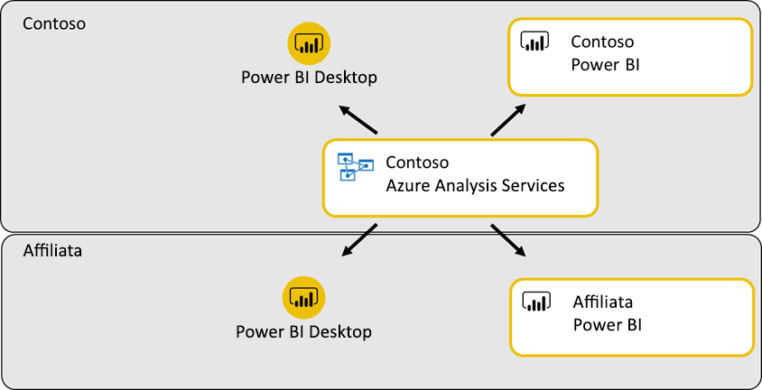

Il secondo approccio si avvale del [database SQL di Azure](https://azure.microsoft.com/services/sql-database/) per creare un data warehouse relazionale per fornire l'accesso ai dati. Questo approccio funziona in modo simile all'approccio Azure Analysis Services, anche se alcune funzionalità, ad esempio la sicurezza a livello di riga, potrebbero essere più difficili da distribuire e mantenere tra le filiali.

Sono inoltre possibili approcci più sofisticati, tuttavia i precedenti sono di gran lunga i più comuni.

### Caso 3: ambiente condiviso tra partner

Contoso può partecipare a una partnership con un concorrente per creare congiuntamente un'auto su una linea di assembly condivisa, ma per distribuire il veicolo con marche diverse o in aree diverse. Questa operazione richiede un'ampia collaborazione e co-proprietà di dati, Intelligence e analisi tra le organizzazioni. Questa struttura è inoltre comune nel settore dei servizi di consulenza in cui un team di consulenti può eseguire analisi basate su progetti per un client.

In pratica, queste strutture sono complesse, come illustrato nella figura seguente, e richiedono il personale per la manutenzione. Per essere efficace, questa struttura si basa sulla modifica e la gestione tra organizzazioni di Power BI funzionalità di contenuto, perché consente alle organizzazioni di riutilizzare Power BI Pro licenze acquistate per i rispettivi tenant di Power BI.

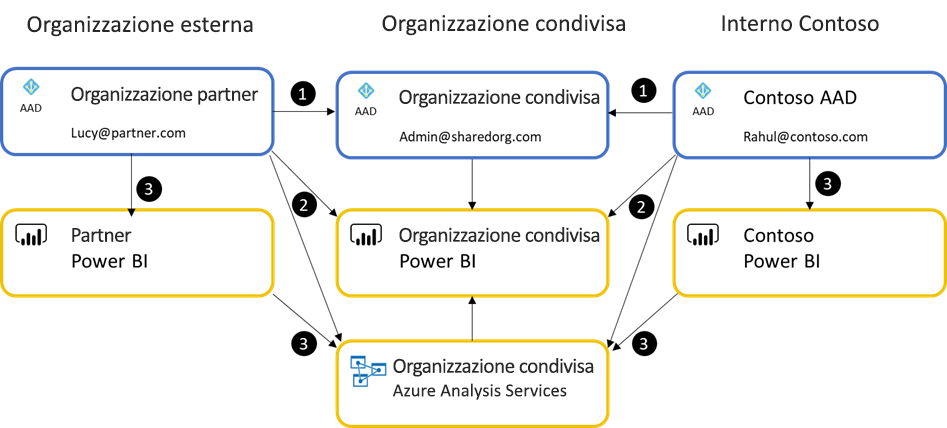

Per stabilire un tenant di Power BI condiviso, è necessario creare un Azure Active Directory ed è necessario acquistare almeno un account utente Power BI Pro per un utente in tale Active Directory. Questo utente invita gli utenti necessari all'organizzazione condivisa. Importante, in questo scenario, gli utenti di Contoso vengono considerati utenti esterni quando operano all'interno del Power BI dell'organizzazione condivisa.

Il processo è il seguente:

1. L'organizzazione condivisa viene stabilita come nuova Azure Active Directory e nella nuova organizzazione viene creato almeno un account utente. A tale utente deve essere assegnata una licenza di Power BI Pro.
2. Questo utente stabilisce quindi un tenant di Power BI e invita gli utenti richiesti da Contoso e dall'organizzazione partner. L'utente stabilisce anche tutti gli asset di dati condivisi, ad esempio Azure Analysis Services. Contoso e gli utenti del partner possono accedere al Power BI dell'organizzazione condivisa come utenti guest. Se è consentito modificare e gestire il contenuto in Power BI gli utenti esterni possono usare Power BI Home, usare le aree di lavoro, caricare o modificare il contenuto e condividere i report. In genere, tutti gli asset condivisi vengono archiviati e accessibili dall'organizzazione condivisa.
3. A seconda del modo in cui le parti accettano di collaborare, ogni organizzazione può sviluppare i propri dati e analisi proprietarie usando risorse di data warehouse condivise. Possono distribuirli ai rispettivi utenti interni usando i tenant di Power BI interni.

### Caso 4: distribuzione a centinaia o migliaia di partner esterni

Mentre Contoso ha creato un report sull'affidabilità del radiatore per un fornitore, ora Contoso desidera creare un set di report standardizzati per centinaia di fornitori. In questo modo contoso garantisce che tutti i fornitori abbiano le analisi necessarie per apportare miglioramenti o per risolvere i difetti di produzione.

Quando un'organizzazione deve distribuire i dati standardizzati e le informazioni dettagliate a molti utenti/organizzazioni esterni, può usare la condivisione ad hoc o pianificata dello scenario Power BI Apps per creare un portale BI in modo rapido e senza costi di sviluppo estesi. Il processo per creare un portale di questo tipo usando un'app Power BI viene trattato nel case study: creazione di un portale BI con Power BI + Azure AD B2B-istruzioni dettagliate più avanti in questo documento.

Una variante comune di questo caso è che un'organizzazione sta provando a condividere informazioni dettagliate con i clienti, soprattutto quando si vuole usare Azure B2C con Power BI. Power BI non supporta Azure B2C in modo nativo. Se si stanno valutando le opzioni per questo caso, è consigliabile usare l'opzione alternativa 2 nell'alternativa comune nella sezione più avanti in questo documento.

## Case Study: creazione di un portale BI con Power BI + Azure AD B2B-istruzioni dettagliate

L'integrazione di Power BI con Azure AD B2B offre a Contoso un metodo semplice e senza problemi per fornire agli utenti guest un accesso sicuro al portale BI. Contoso può essere configurato con tre passaggi:

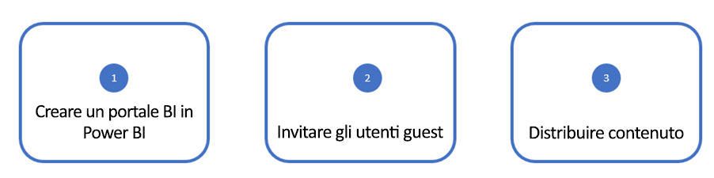

1. Creare un portale BI in Power BI

    La prima attività per Contoso consiste nel creare il portale BI in Power BI. Il portale BI di Contoso sarà costituito da una raccolta di dashboard e report creati per lo scopo che saranno resi disponibili per molti utenti interni e Guest. Il modo consigliato per eseguire questa operazione in Power BI consiste nel compilare un'app Power BI. Altre informazioni sulle [app sono disponibili in Power bi](https://powerbi.microsoft.com/blog/distribute-to-large-audiences-with-power-bi-apps/).

- Il team di business intelligence di Contoso crea un'area di lavoro in Power BI

    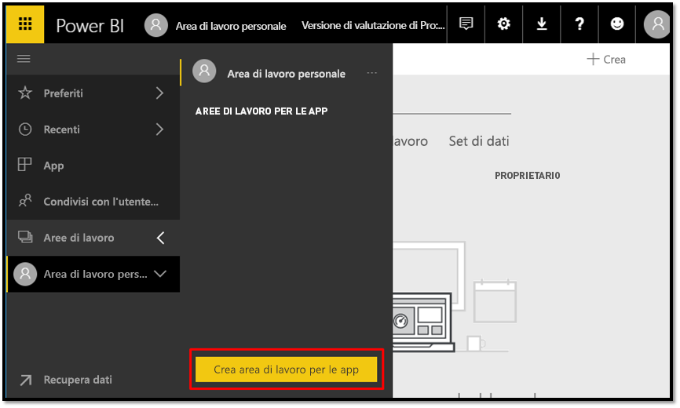
    

- Altri autori vengono aggiunti all'area di lavoro

    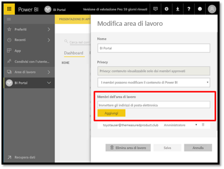

- Il contenuto viene creato nell'area di lavoro

    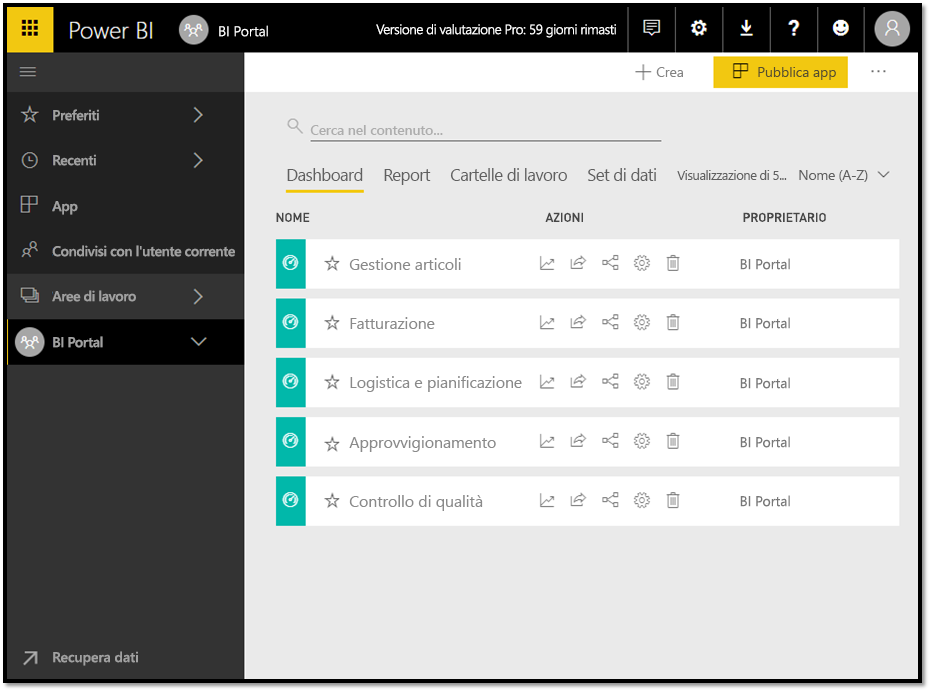

    Ora che il contenuto è stato creato in un'area di lavoro, Contoso è pronto per invitare gli utenti guest nelle organizzazioni partner a utilizzare questo contenuto.

2. Invitare gli utenti guest

    Ci sono due modi per invitare gli utenti Guest al portale di business intelligence di Contoso in Power BI:

    * Inviti pianificati
    * Inviti ad hoc

    **Inviti pianificati**

    Con questo approccio, contoso invita gli utenti guest alla sua Azure AD in anticipo e quindi li distribuisce Power BI contenuto. Contoso può invitare gli utenti Guest dal portale di Azure o tramite PowerShell. Ecco i passaggi per invitare gli utenti Guest dal portale di Azure:

    - L'amministratore Azure AD di Contoso passa a **portale di Azure > Azure Active Directory > utenti e gruppi > tutti gli utenti > nuovo utente Guest**

    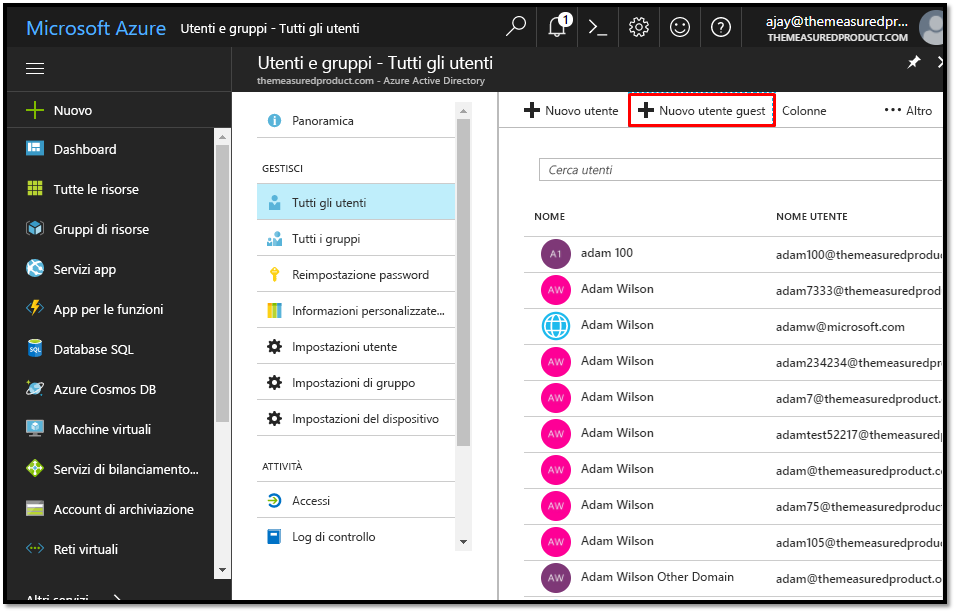

    - Aggiungere un messaggio di invito per gli utenti guest e fare clic su invita

    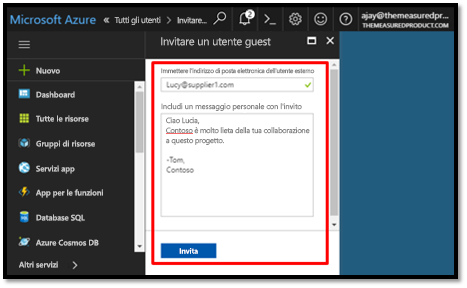

    > [!NOTE]
    > Per invitare gli utenti Guest dal portale di Azure, è necessario un amministratore per la Azure Active Directory del tenant.

    Se contoso vuole invitare molti utenti guest, può farlo usando PowerShell. L'amministratore Azure AD di Contoso archivia gli indirizzi di posta elettronica di tutti gli utenti guest in un file CSV. Ecco [Azure Active Directory codice di collaborazione B2B ed esempi](https://docs.microsoft.com/azure/active-directory/b2b/code-samples) e istruzioni di PowerShell.

    Dopo l'invito, gli utenti Guest ricevono un messaggio di posta elettronica con il collegamento all'invito.

    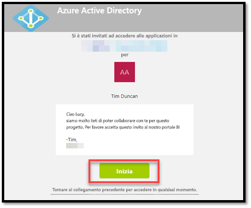

    Una volta che gli utenti Guest fanno clic sul collegamento, possono accedere al contenuto nel tenant di Contoso Azure AD.

    > [!NOTE]
    > È possibile modificare il layout del messaggio di posta elettronica di invito usando la funzionalità di personalizzazione Azure AD come descritto [qui](https://docs.microsoft.com/azure/active-directory/active-directory-b2b-invitation-email).

    **Inviti ad hoc**

    Che cosa accade se Contoso non conosce tutti gli utenti guest che desidera invitare in anticipo? Oppure, cosa accade se l'analista di Contoso che ha creato il portale BI vuole distribuire il contenuto agli utenti Guest? Questo scenario è supportato anche in Power BI con gli inviti ad hoc.

    L'analista può semplicemente aggiungere gli utenti esterni all'elenco di accesso dell'app durante la pubblicazione. Gli utenti Guest ricevono un invito e, una volta accettati, vengono reindirizzati automaticamente al contenuto del Power BI.

    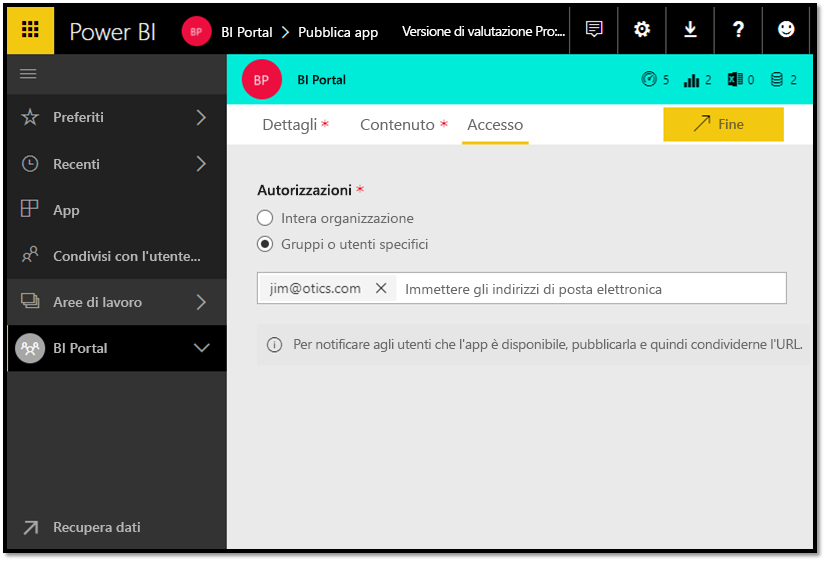

    > [!NOTE]
    > Gli inviti sono necessari solo la prima volta che un utente esterno viene invitato alla propria organizzazione.

3. Distribuisci contenuto

    Ora che il team di business intelligence di Contoso ha creato il portale di business intelligence e ha invitato gli utenti guest, può distribuire il portale ai propri utenti finali, concedendo agli utenti guest l'accesso all'app e la pubblicazione. Power BI completa automaticamente i nomi degli utenti Guest aggiunti in precedenza al tenant di contoso. A questo punto è anche possibile aggiungere inviti ad hoc ad altri utenti guest.

    > [!NOTE]
    > Se si usano i gruppi di sicurezza per gestire l'accesso all'app per utenti esterni, usare l'approccio di invito pianificato e condividere il collegamento all'app direttamente con ogni utente esterno che deve accedervi. In caso contrario, l'utente esterno potrebbe non essere in grado di installare o visualizzare il contenuto all'interno dell'app. _

    Gli utenti Guest ricevono un messaggio di posta elettronica con un collegamento all'app.

    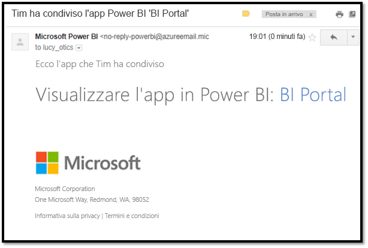

    Quando si fa clic su questo collegamento, agli utenti guest viene richiesto di eseguire l'autenticazione con l'identità dell'organizzazione.

    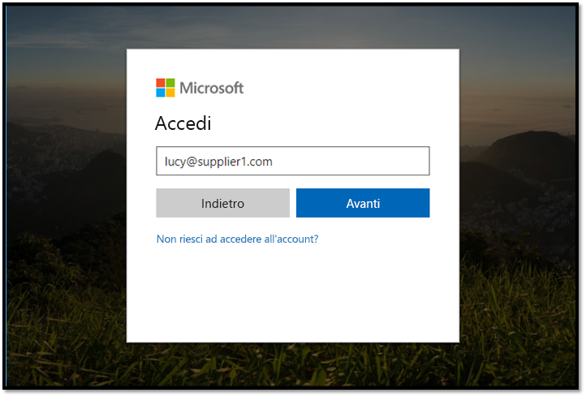

    Una volta autenticati correttamente, vengono reindirizzati all'app BI di contoso.

    

    Gli utenti guest possono successivamente raggiungere l'app di Contoso facendo clic sul collegamento nel messaggio di posta elettronica o inserendo un segnalibro nel collegamento. Contoso è inoltre in grado di semplificare gli utenti Guest aggiungendo questo collegamento a qualsiasi portale Extranet esistente già utilizzato dagli utenti guest.

4. Passaggi successivi

    Usando un'app Power BI e Azure AD B2B, Contoso è stato in grado di creare rapidamente un portale di Business Intelligence per i suoi fornitori in modo senza codice. Questa operazione semplifica significativamente la distribuzione di analisi standardizzate a tutti i fornitori che lo hanno richiesto.

    Sebbene nell'esempio venga illustrato come un singolo report comune possa essere distribuito tra i fornitori, Power BI possibile procedere in modo più approfondito. Per assicurarsi che ogni partner veda solo i dati rilevanti, Sicurezza a livello di riga possibile aggiungerli facilmente al report e al modello di dati. La sezione sicurezza dei dati per partner esterni più avanti in questo documento descrive questo processo in dettaglio.

    Spesso i singoli report e dashboard devono essere incorporati in un portale esistente. Questa operazione può essere eseguita anche riutilizzando molte delle tecniche illustrate nell'esempio. In questi casi, tuttavia, potrebbe essere più facile incorporare report o dashboard direttamente da un'area di lavoro. Il processo per l'invito e l'assegnazione dell'autorizzazione di sicurezza per gli utenti require rimane invariato.

## Dietro le quinte: in che modo Lucy di Supplier1 è in grado di accedere ai contenuti Power BI dal tenant di contoso?

Ora che abbiamo visto in che modo contoso è in grado di distribuire facilmente Power BI contenuto agli utenti guest nelle organizzazioni partner, possiamo esaminarne il funzionamento.

Quando Contoso ha invitato [lucy@supplier1.com](mailto:lucy@supplier1.com) alla relativa directory, Azure ad crea un collegamento tra [Lucy@supplier1.com](mailto:Lucy@supplier1.com) e il tenant di Contoso Azure ad. Questo collegamento consente Azure AD di tenere presente che Lucy@supplier1.com possibile accedere al contenuto nel tenant di contoso.

Quando Lucy tenta di accedere all'app Power BI di Contoso, Azure AD verifica che Lucy possa accedere al tenant Contoso e quindi fornisce Power BI un token che indica che Lucy è autenticato per accedere al contenuto nel tenant di contoso. Power BI usa questo token per autorizzare e garantire che Lucy abbia accesso all'app Power BI di contoso.

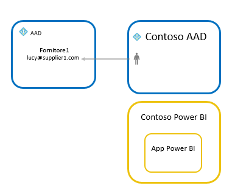

L'integrazione di Power BI con Azure AD B2B funziona con tutti gli indirizzi di posta elettronica aziendali. Se l'utente non dispone di un Azure AD identità, potrebbe essere richiesto di crearne uno. La figura seguente mostra il flusso dettagliato:

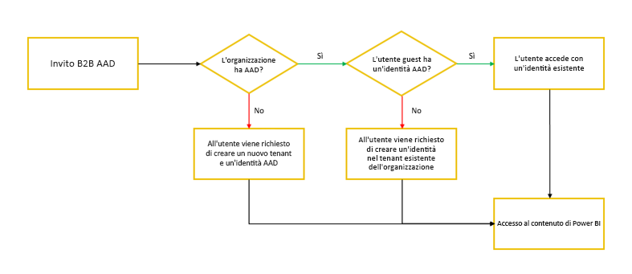

È importante riconoscere che l'account Azure AD verrà usato o creato nell'Azure AD della parte esterna, in modo che Lucy possa usare il nome utente e la password e le relative credenziali smetteranno automaticamente di funzionare in altri tenant ogni volta che Lucy lascia la società quando l'organizzazione usa anche Azure AD.

## Licenze

Contoso può scegliere uno dei tre approcci per concedere le licenze agli utenti Guest dei propri fornitori e organizzazioni partner per accedere ai contenuti Power BI.

> [!NOTE]
> _Il livello gratuito di Azure ad B2B's è sufficiente per l'uso di Power bi con Azure ad B2B. Alcune funzionalità avanzate Azure AD B2B come i gruppi dinamici richiedono licenze aggiuntive. Per ulteriori informazioni, fare riferimento alla documentazione di Azure ad B2B:_ [ _https://docs.microsoft.com/azure/active-directory/b2b/licensing-guidance_ ](https://docs.microsoft.com/azure/active-directory/b2b/licensing-guidance)

### Approccio 1: contoso USA Power BI Premium

Con questo approccio, contoso Acquista Power BI Premium capacità e assegna a questa capacità il contenuto del portale BI. Ciò consente agli utenti guest di organizzazioni partner di accedere all'app Power BI di Contoso senza alcuna licenza Power BI.

Gli utenti esterni sono anche soggetti alle esperienze di consumo offerte dagli utenti "gratuiti" in Power BI durante l'utilizzo del contenuto all'interno Power BI Premium.

Contoso può inoltre sfruttare le altre Power BI funzionalità Premium per le proprie app, ad esempio frequenze di aggiornamento maggiori, capacità dedicata e dimensioni del modello di grandi dimensioni.

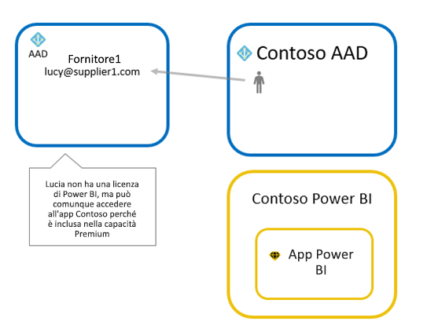

### Approccio 2: Contoso assegna Power BI Pro licenze agli utenti Guest

Con questo approccio, Contoso assegna licenze Pro agli utenti Guest dalle organizzazioni partner. questa operazione può essere eseguita dal centro di amministrazione Microsoft 365 di contoso. Ciò consente agli utenti guest di organizzazioni partner di accedere all'app Power BI di Contoso senza acquistare una licenza. Questo può essere appropriato per la condivisione con utenti esterni la cui organizzazione non ha ancora adottato Power BI.

> [!NOTE]
> La licenza Pro di Contoso viene applicata agli utenti guest solo quando accedono al contenuto nel tenant di contoso. Le licenze Pro abilitano l'accesso a contenuto non in una capacità di Power BI Premium. Tuttavia, gli utenti esterni con una licenza Pro sono limitati per impostazione predefinita a un'esperienza di consumo. Questo può essere modificato usando l'approccio descritto nella sezione _Abilitazione di utenti esterni per modificare e gestire il contenuto all'interno di Power bi_ più avanti in questo documento.

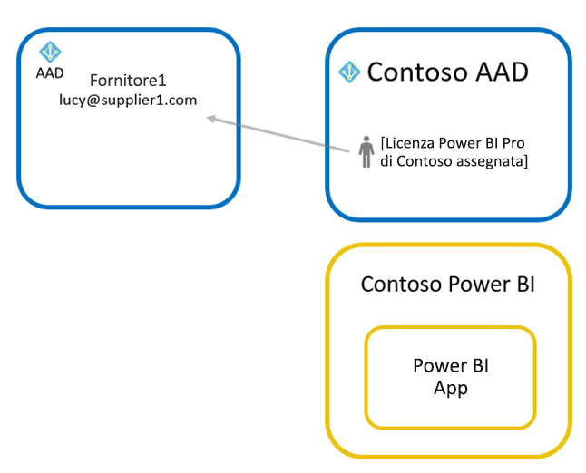

### Approccio 3: gli utenti Guest portano la propria licenza di Power BI Pro

Con questo approccio, Supplier 1 assegna una licenza di Power BI Pro a Lucy. Possono quindi accedere all'app Power BI di Contoso con questa licenza. Poiché Lucy può utilizzare la propria licenza Pro dalla propria organizzazione per l'accesso a un ambiente di Power BI esterno, questo approccio viene talvolta definito BYOL ( _Bring your own License_ ). Se entrambe le organizzazioni usano Power BI, questo offre una licenza vantaggiosa per la soluzione di analisi complessiva e riduce al minimo l'overhead dovuto all'assegnazione di licenze a utenti esterni.

> [!NOTE]
> La licenza Pro fornita a Lucy by Supplier 1 si applica a qualsiasi Power BI tenant in cui Lucy è un utente Guest. Le licenze Pro abilitano l'accesso a contenuto non in una capacità di Power BI Premium. Tuttavia, gli utenti esterni con una licenza Pro sono limitati per impostazione predefinita a un'esperienza di consumo. Questo può essere modificato usando l'approccio descritto nella sezione _Abilitazione di utenti esterni per modificare e gestire il contenuto all'interno di Power bi_ più avanti in questo documento.

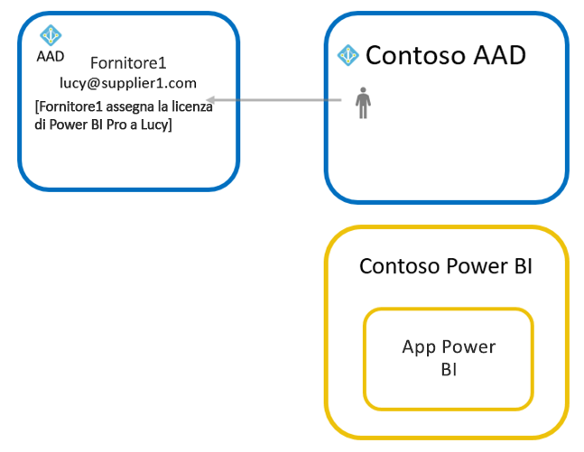

## Sicurezza dei dati per partner esterni

In genere, quando si utilizzano più fornitori esterni, Contoso deve garantire che ogni fornitore veda i dati solo sui propri prodotti. La sicurezza basata sull'utente e la sicurezza dinamica a livello di riga rendono questa operazione facile da eseguire con Power BI.

### Sicurezza basata sull'utente

Una delle funzionalità più potenti di Power BI è Sicurezza a livello di riga. Questa funzionalità consente a Contoso di creare un singolo report e set di dati, ma di applicare regole di sicurezza diverse per ogni utente. Per una spiegazione approfondita, vedere [sicurezza a livello di riga](https://powerbi.microsoft.com/documentation/powerbi-admin-rls/).

L'integrazione di Power BI con Azure AD B2B consente a Contoso di assegnare regole di Sicurezza a livello di riga agli utenti guest non appena vengono invitati al tenant di contoso. Come abbiamo visto prima, Contoso può aggiungere utenti guest tramite inviti pianificati o ad hoc. Se contoso vuole applicare la sicurezza a livello di riga, si consiglia vivamente di usare gli inviti pianificati per aggiungere gli utenti guest in anticipo e assegnarli ai ruoli di sicurezza prima di condividere il contenuto. Se contoso usa invece gli inviti ad hoc, potrebbe essere presente un breve periodo di tempo in cui gli utenti guest non saranno in grado di visualizzare i dati.

> [!NOTE]
> Questo ritardo nell'accesso ai dati protetti dalla sicurezza a livello di riga quando si usano gli inviti ad hoc può supportare le richieste al team IT perché gli utenti visualizzeranno report/Dashboard vuoti o interrotti quando si apre un collegamento di condivisione nel messaggio di posta elettronica ricevuto. Pertanto, è consigliabile utilizzare gli inviti pianificati in questo scenario. * *

Ecco un esempio.

Come affermato in precedenza, Contoso dispone di fornitori in tutto il mondo e vuole assicurarsi che gli utenti delle loro organizzazioni Supplier ottengano informazioni approfondite dai dati provenienti dal proprio territorio.  Tuttavia, gli utenti di Contoso possono accedere a tutti i dati. Anziché creare più report diversi, Contoso crea un singolo report e filtra i dati in base all'utente che la Visualizza.

Per assicurarsi che Contoso sia in grado di filtrare i dati in base agli utenti che si connettono, in Power BI desktop vengono creati due ruoli. Uno per filtrare tutti i dati da SalesTerritory "Europe" e un altro per "America del Nord".

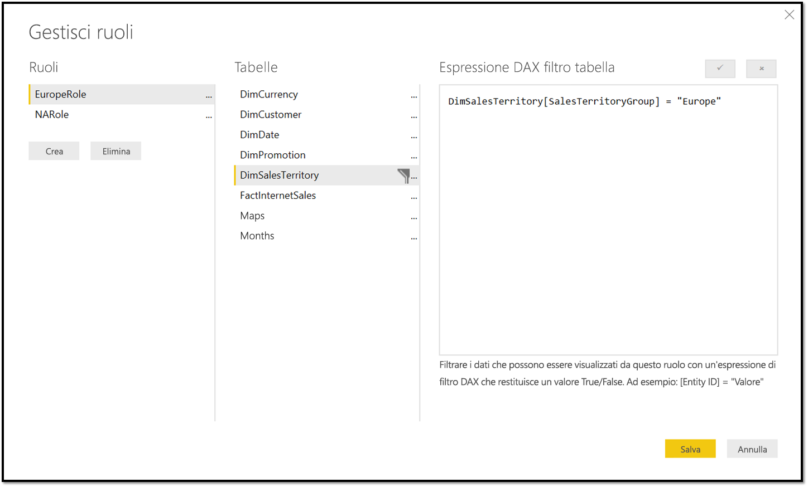

Ogni volta che i ruoli sono definiti nel report, è necessario assegnare un utente a un ruolo specifico per poter accedere ai dati. L'assegnazione dei ruoli si verifica all'interno del servizio Power BI ( **set di impostazioni di sicurezza > sicurezza** )

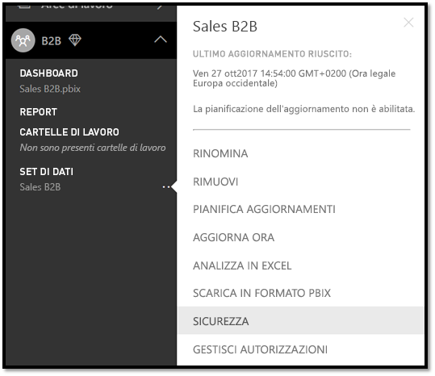

Verrà visualizzata una pagina in cui il team di business intelligence di Contoso può visualizzare i due ruoli creati.  Ora il team di business intelligence di Contoso può assegnare gli utenti ai ruoli.

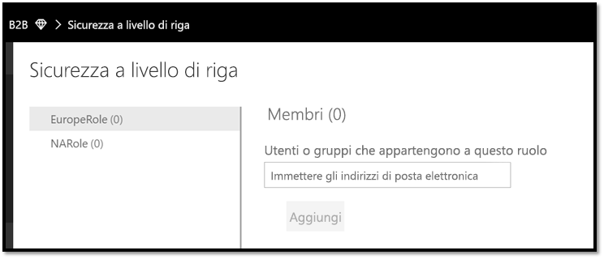

Nell'esempio contoso viene aggiunto un utente in un'organizzazione partner con indirizzo di posta elettronica "[adam@themeasuredproduct.com](mailto:adam@themeasuredproduct.com)" al ruolo Europe:

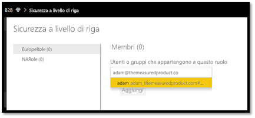

Quando il problema viene risolto da Azure AD, Contoso può visualizzare il nome visualizzato nella finestra pronto per l'aggiunta:

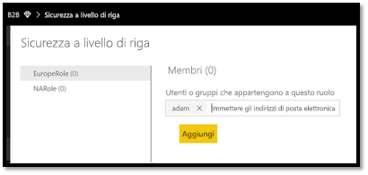

A questo punto, quando l'utente apre l'app che è stata condivisa, viene visualizzato un report con i dati dell'Europa:

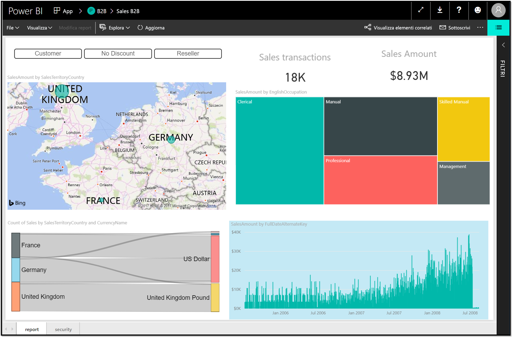

### Sicurezza dinamica a livello di riga

Un altro argomento interessante è vedere come funziona la sicurezza dinamica a livello di riga (RLS) con Azure AD B2B.

In breve, la sicurezza dinamica a livello di riga funziona filtrando i dati nel modello in base al nome utente della persona che si connette a Power BI. Anziché aggiungere più ruoli per gruppi di utenti, è necessario definire gli utenti nel modello. Il modello non verrà descritto in dettaglio qui. Kasper de Jong offre una scrittura dettagliata su tutti i tipi di sicurezza a livello di riga in Power BI Desktop foglio informativo sulla [sicurezza dinamica](https://www.kasperonbi.com/power-bi-desktop-dynamic-security-cheat-sheet/)e in [questo white paper](https://msdn.microsoft.com/library/jj127437.aspx) .

Si osservi un piccolo esempio-Contoso ha un semplice report sulle vendite per gruppi:

A questo punto, questo report deve essere condiviso con due utenti guest e un utente interno. l'utente interno può visualizzare tutti gli elementi, ma gli utenti guest possono visualizzare solo i gruppi a cui hanno accesso. Ciò significa che è necessario filtrare i dati solo per gli utenti guest. Per filtrare i dati in modo appropriato, contoso usa il modello di sicurezza a livello di riga dinamico come descritto nel white paper e nel post di Blog. Ciò significa che contoso aggiunge i nomi utente ai dati stessi:

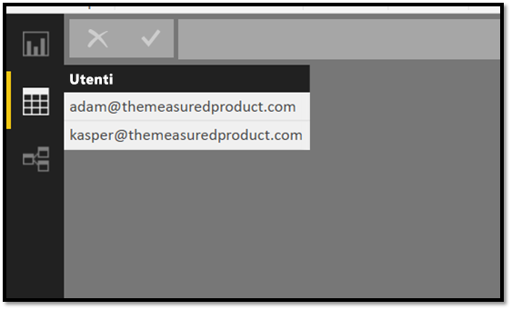

Quindi, Contoso crea il modello di dati corretto che filtra i dati in modo appropriato con le relazioni corrette:

Per filtrare automaticamente i dati in base all'utente che ha eseguito l'accesso, Contoso deve creare un ruolo che passa l'utente che sta effettuando la connessione. In questo caso, Contoso crea due ruoli: il primo è "SecurityRole" che filtra la tabella Users con il nome utente corrente dell'utente connesso a Power BI (funziona anche per Azure AD utenti Guest B2B).

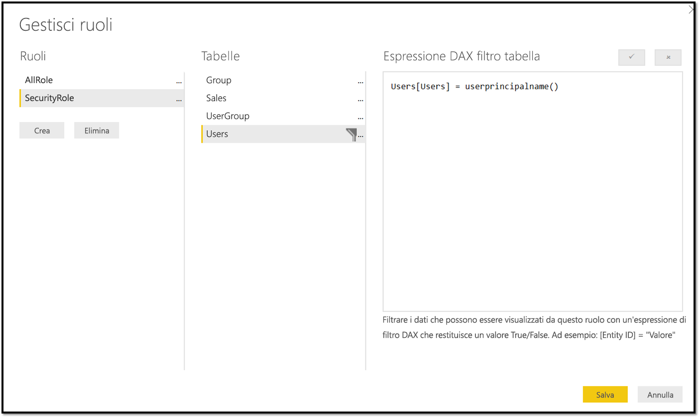

Contoso crea anche un altro "AllRole" per gli utenti interni che possono visualizzare tutti gli elementi, perché questo ruolo non dispone di alcun predicato di sicurezza.

Dopo aver caricato il file di Power BI desktop nel servizio, Contoso può assegnare gli utenti Guest a "SecurityRole" e agli utenti interni a "AllRole"

Ora, quando gli utenti Guest aprono il report, vedono solo le vendite del gruppo A:

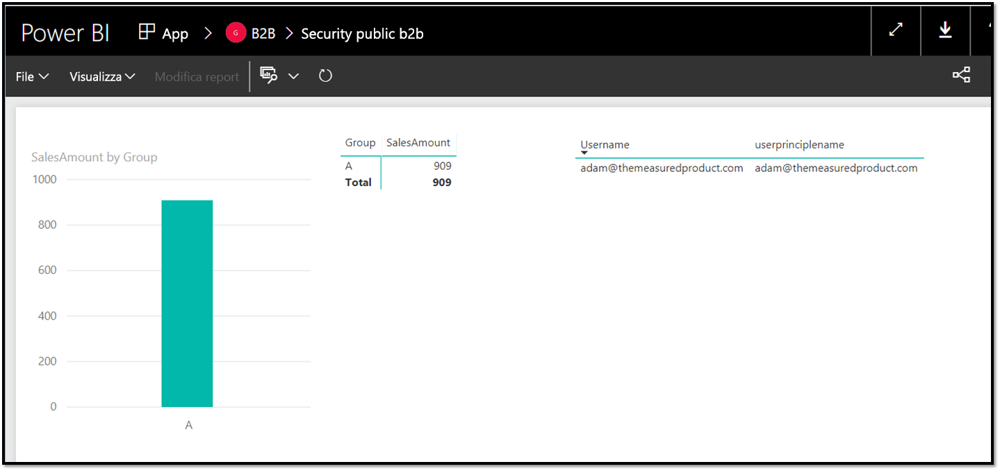

Nella matrice a destra è possibile visualizzare il risultato della funzione USERNAME () e USERPRINCIPALNAME (). entrambi restituiscono l'indirizzo di posta elettronica degli utenti guest.

Ora l'utente interno Visualizza tutti i dati:

Come si può notare, la sicurezza a livello di riga è compatibile con gli utenti interni o Guest.

> [!NOTE]
> Questo scenario funziona anche quando si usa un modello in Azure Analysis Services. In genere, il servizio di analisi di Azure è connesso allo stesso Azure AD della Power BI, in questo caso Azure Analysis Services conosce anche gli utenti Guest invitati tramite Azure AD B2B.

## Connessione alle origini dati locali

Power BI offre la possibilità per Contoso di sfruttare le origini dati locali, ad esempio [SQL Server Analysis Services](https://powerbi.microsoft.com/documentation/powerbi-gateway-enterprise-manage-ssas/) o [SQL Server](https://powerbi.microsoft.com/documentation/powerbi-gateway-kerberos-for-sso-pbi-to-on-premises-data/) direttamente grazie al [gateway dati locale](https://powerbi.microsoft.com/documentation/powerbi-gateway-onprem/). È anche possibile accedere a tali origini dati con le stesse credenziali usate con Power BI.

> [!NOTE]
> Quando si installa un gateway per connettersi al tenant di Power BI, è necessario usare un utente creato nel tenant. Gli utenti esterni non possono installare un gateway e connetterlo al tenant. _

Per gli utenti esterni, questo potrebbe essere più complicato perché gli utenti esterni non sono in genere noti ad Active Directory locale. Power BI offre una soluzione alternativa, consentendo agli amministratori di Contoso di eseguire il mapping dei nomi utente esterni ai nomi utente interni come descritto in [gestire l'origine dati-Analysis Services](https://powerbi.microsoft.com/documentation/powerbi-gateway-enterprise-manage-ssas/). È ad esempio possibile eseguire il mapping di [lucy@supplier1.com](mailto:lucy@supplier1.com) a [lucy\_supplier1\_com #EXT@contoso.com](mailto:lucy_supplier1_com).

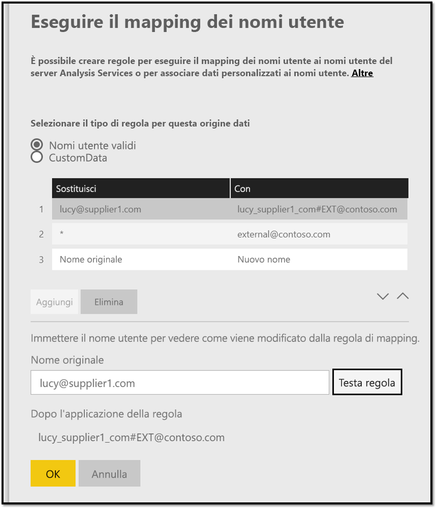

Questo metodo è corretto se Contoso dispone solo di un numero limitato di utenti o se contoso è in grado di eseguire il mapping di tutti gli utenti esterni a un singolo account interno. Per scenari più complessi in cui ogni utente necessita di credenziali proprie, esiste un approccio più avanzato che usa [attributi di Active Directory personalizzati](https://technet.microsoft.com/library/cc961737.aspx) per eseguire il mapping come descritto in [gestire l'origine dati-Analysis Services](https://powerbi.microsoft.com/documentation/powerbi-gateway-enterprise-manage-ssas/). Questo consente all'amministratore di Contoso di definire un mapping per ogni utente nel Azure AD (anche utenti B2B esterni).  Questi attributi possono essere impostati tramite il modello a oggetti di AD tramite script o codice, in modo che contoso possa automatizzare completamente il mapping su invito o in base a una cadenza pianificata.

## Consentire agli utenti esterni di modificare e gestire il contenuto all'interno Power BI

Contoso può consentire agli utenti esterni di contribuire al contenuto all'interno dell'organizzazione, come descritto in precedenza nella sezione relativa alla gestione e alla gestione di Power BI del contenuto tra organizzazioni.

> [!NOTE]
> Per modificare e gestire il contenuto all'interno dell'Power BI dell'organizzazione, l'utente deve disporre di una licenza di Power BI Pro in un'area di lavoro diversa da area di lavoro personale. Gli utenti possono ottenere le licenze Pro come indicato nella sezione _licenze_ di questo documento.

Il portale di amministrazione di Power BI consente **agli utenti Guest esterni di modificare e gestire il contenuto nell'impostazione dell'organizzazione** in impostazioni tenant. Per impostazione predefinita, l'impostazione è impostata su disabled, per indicare che gli utenti esterni ottengono un'esperienza di sola lettura vincolata per impostazione predefinita. L'impostazione si applica agli utenti con UserType impostato su Guest in Azure AD. La tabella seguente descrive i comportamenti riscontrati dagli utenti in base alla loro UserType e al modo in cui vengono configurate le impostazioni.

| **Tipo di utente in Azure AD** | **Consenti agli utenti Guest esterni di modificare e gestire le impostazioni del contenuto** | **Comportamento** |
| --- | --- | --- |
| Guest | Disabilitato per l'utente (impostazione predefinita) | Visualizzazione solo per utilizzo di elementi. Consente l'accesso in sola lettura a report, dashboard e app quando vengono visualizzati tramite un URL inviato all'utente Guest. Power BI app per dispositivi mobili forniscono una visualizzazione di sola lettura all'utente Guest. |
| Guest | Abilitato per l'utente | L'utente esterno può accedere all'esperienza Power BI completa, anche se alcune funzionalità non sono disponibili. L'utente esterno deve accedere a Power BI usando l'URL del servizio Power BI con le informazioni sul tenant incluse. L'utente ottiene l'esperienza principale, un'area di lavoro personale e, in base alle autorizzazioni, può sfogliare, visualizzare e creare contenuto.    Power BI app per dispositivi mobili forniscono una visualizzazione di sola lettura all'utente Guest. |

> [!NOTE]
> Gli utenti esterni in Azure AD possono anche essere impostati sul membro UserType. Questa operazione non è attualmente supportata in Power BI.

Nel portale di amministrazione Power BI l'impostazione è illustrata nell'immagine seguente.

Gli utenti Guest ottengono l'esperienza predefinita di sola lettura e possono modificare e gestire il contenuto. Il valore predefinito è disabled, ovvero tutti gli utenti Guest hanno l'esperienza di sola lettura. L'amministratore Power BI può abilitare l'impostazione per tutti gli utenti guest nell'organizzazione o per specifici gruppi di sicurezza definiti in Azure AD. Nell'immagine seguente, l'amministratore di Contoso Power BI ha creato un gruppo di sicurezza in Azure AD per gestire quali utenti esterni possono modificare e gestire il contenuto nel tenant di contoso.

Per consentire a questi utenti di accedere a Power BI, fornire l'URL del tenant. Per trovare l'URL del tenant, seguire questa procedura.

1. Nel servizio Power BI, nel menu in alto selezionare **? (?** ) e quindi **su Power bi**.
2. Cercare il valore accanto a **URL tenant**. Si tratta dell'URL del tenant che è possibile condividere con gli utenti guest.

    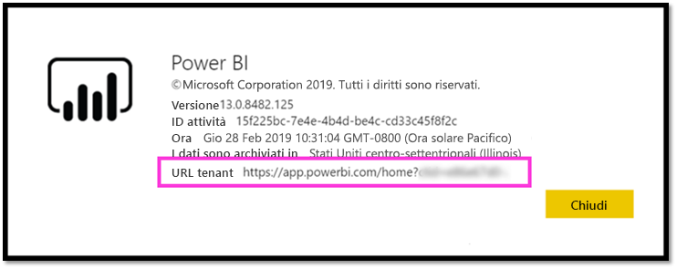

Quando si utilizza l'autorizzazione Consenti agli utenti Guest esterni di modificare e gestire il contenuto dell'organizzazione, gli utenti Guest specificati ottengono l'accesso ai Power BI dell'organizzazione e visualizzano i contenuti per i quali dispongono delle autorizzazioni. Possono accedere a Home, esplorare e contribuire al contenuto nelle aree di lavoro, installare le app dove si trovano nell'elenco di accesso e avere un'area di lavoro personale. Possono creare aree di lavoro che fanno uso dell'esperienza della nuova area di lavoro o esserne amministratori.

> [!NOTE]
> Quando si usa questa opzione, assicurarsi di esaminare la sezione Governance di questo documento, perché le impostazioni predefinite Azure AD impediscono agli utenti guest di usare determinate funzionalità, ad esempio gli utenti che possono causare un'esperienza ridotta. * *

Per gli utenti Guest abilitati tramite il consentire agli utenti Guest esterni di modificare e gestire il contenuto nell'impostazione del tenant dell'organizzazione, alcune esperienze non sono disponibili. Per aggiornare o pubblicare report, gli utenti Guest devono usare l'interfaccia utente Web di servizio Power BI, inclusi i dati di Get per caricare Power BI Desktop file. Le esperienze seguenti non sono supportate:

- Pubblicazione diretta da Power BI Desktop al servizio Power BI
- Gli utenti guest non possono usare Power BI desktop per connettersi ai set di dati del servizio nel servizio Power BI
- Aree di lavoro classiche associate a gruppi di Office 365: l'utente Guest non può creare o essere amministratori di queste aree di lavoro. possono essere membri.
- L'invio di inviti ad hoc non è supportato per gli elenchi di accesso all'area di lavoro
- Power BI Publisher per Excel non è supportato per gli utenti guest
- Gli utenti guest non possono installare un Power BI Gateway e connetterlo all'organizzazione
- Gli utenti guest non possono installare app di pubblicazione per l'intera organizzazione
- Gli utenti guest non possono usare, creare, aggiornare o installare pacchetti di contenuto dell'organizzazione
- Gli utenti guest non possono usare Analizza in Excel
- Non è possibile @mentioned gli utenti guest nella creazione di commenti. questa funzionalità verrà aggiunta in una versione futura.
- Gli utenti guest non possono usare le sottoscrizioni (questa funzionalità verrà aggiunta in una versione futura)
- Gli utenti guest che usano questa funzionalità dovrebbero avere un account aziendale o dell'istituto di istruzione. Gli utenti guest che usano account personali presentano più limitazioni a causa delle restrizioni di accesso.

## Governance

### Impostazioni Azure AD aggiuntive che interessano le esperienze Power BI correlate Azure AD B2B

Quando si usa Azure AD condivisione B2B, l'amministratore Azure Active Directory controlla gli aspetti dell'esperienza dell'utente esterno. Questi controlli sono controllati nella pagina impostazioni di collaborazione esterna all'interno delle impostazioni di Azure Active Directory per il tenant.

Informazioni dettagliate sulle impostazioni sono disponibili qui:

[https://docs.microsoft.com/azure/active-directory/b2b/delegate-invitations](https://docs.microsoft.com/azure/active-directory/b2b/delegate-invitations)

> [!NOTE]
> Per impostazione predefinita, l'opzione autorizzazioni utenti Guest è limitata è impostata su Sì, in modo che gli utenti guest all'interno di Power BI abbiano esperienze limitate, in particolare la condivisione delle interfacce utente non funzionanti per tali utenti. È importante collaborare con l'amministratore di Azure AD per impostarlo su No, come illustrato di seguito per garantire una corretta esperienza. * *

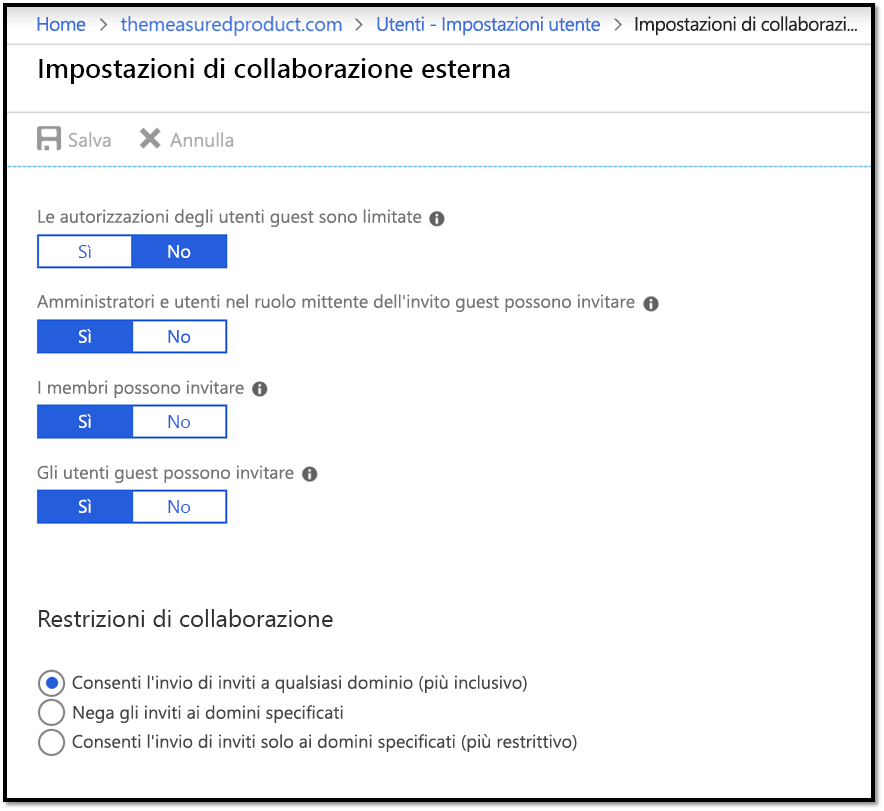

### Controlli invitati Guest

Power BI gli amministratori possono controllare la condivisione esterna solo per Power BI visitando il portale di amministrazione di Power BI. Tuttavia, gli amministratori tenant possono anche controllare la condivisione esterna con diversi criteri Azure AD.  Questi criteri consentono agli amministratori tenant di

- Disattivare gli inviti dagli utenti finali
- Solo gli amministratori e gli utenti nel ruolo mittente dell'invito Guest possono invitare
- Gli amministratori, il ruolo mittente dell'invito Guest e i membri possono invitare
- Tutti gli utenti, inclusi i guest, possono invitare

Per altre informazioni su questi criteri, vedere [delegare gli inviti per Azure Active Directory collaborazione B2B](https://docs.microsoft.com/azure/active-directory/active-directory-b2b-delegate-invitations).

Tutte le azioni Power BI dagli utenti esterni vengono anche [controllate nel portale di controllo](https://powerbi.microsoft.com/documentation/powerbi-admin-auditing/).

### Criteri di accesso condizionale per gli utenti Guest

Contoso può applicare criteri di accesso condizionale per gli utenti guest che accedono al contenuto dal tenant di contoso. È possibile trovare istruzioni dettagliate in [accesso condizionale per gli utenti di collaborazione B2B](https://docs.microsoft.com/azure/active-directory/active-directory-b2b-mfa-instructions).

## Approcci alternativi comuni

Sebbene Azure AD B2B semplifica la condivisione di dati e report tra organizzazioni, esistono molti altri approcci comunemente utilizzati e che potrebbero essere superiori in alcuni casi.

### Opzione alternativa 1: creare identità duplicate per gli utenti partner

Con questa opzione, contoso doveva creare manualmente identità duplicate per ogni utente partner nel tenant Contoso, come illustrato nella figura seguente. All'interno di Power BI, Contoso può condividere le identità assegnate con i report, i dashboard o le app appropriati.

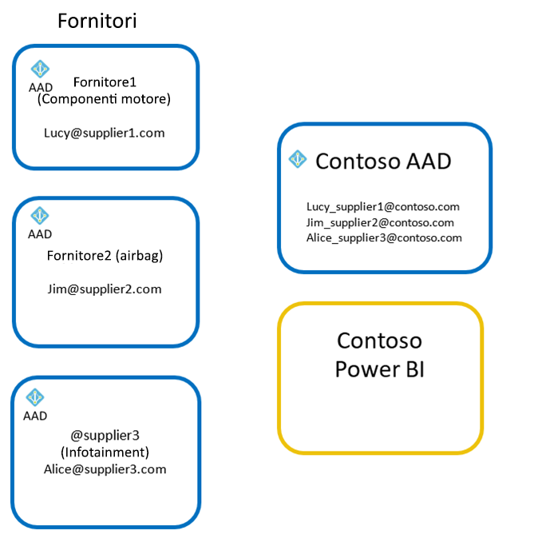

Motivi per scegliere questa alternativa:

- Poiché l'identità dell'utente è controllata dall'organizzazione, qualsiasi servizio correlato, ad esempio posta elettronica, SharePoint e così via, rientra anche nel controllo della propria organizzazione. Gli amministratori IT possono reimpostare le password, disabilitare l'accesso agli account o attività di controllo in questi servizi.
- Gli utenti che utilizzano gli account personali per la propria azienda sono spesso limitati all'accesso a determinati servizi, pertanto potrebbe essere necessario un account aziendale.
- Alcuni servizi funzionano solo sugli utenti dell'organizzazione. Ad esempio, l'uso di Intune per gestire il contenuto nei dispositivi personali/mobili degli utenti esterni con Azure B2B potrebbe non essere possibile.

Motivi per non scegliere questa alternativa:

- Gli utenti delle organizzazioni partner devono ricordare due insiemi di credenziali, uno per accedere al contenuto della propria organizzazione e l'altro per accedere al contenuto da contoso. Questo è un problema per questi utenti guest e molti utenti Guest sono confusi dall'esperienza.
- Contoso deve acquistare e assegnare licenze per utente a tali utenti. Se un utente deve ricevere un messaggio di posta elettronica o usare le applicazioni di Office, è necessario disporre delle licenze appropriate, incluse Power BI Pro per modificare e condividere il contenuto nel Power BI.
- Contoso potrebbe voler applicare criteri di autorizzazione e governance più rigorosi per gli utenti esterni rispetto agli utenti interni. A tale scopo, Contoso deve creare una nomenclatura interna per gli utenti esterni e tutti gli utenti di Contoso devono essere informati su questa nomenclatura.
- Quando l'utente lascia l'organizzazione, continua ad avere accesso alle risorse di contoso fino a quando l'amministratore di Contoso non elimina manualmente il proprio account
- Gli amministratori di Contoso devono gestire l'identità del Guest, tra cui la creazione, la reimpostazione della password e così via.

### Opzione alternativa 2: creare un'applicazione Power BI Embedded personalizzata usando l'autenticazione personalizzata

Un'altra opzione per Contoso è la creazione di un'applicazione Power BI incorporata personalizzata con autenticazione personalizzata ([i dati](https://docs.microsoft.com/power-bi/developer/embedded/embed-sample-for-customers)sono di proprietà dell'app). Sebbene molte organizzazioni non dispongano del tempo o delle risorse necessarie per creare un'applicazione personalizzata per la distribuzione di contenuti Power BI ai partner esterni, per alcune organizzazioni questo è l'approccio migliore e merita una certa considerazione.

Spesso le organizzazioni hanno portali partner esistenti che centralizzano l'accesso a tutte le risorse dell'organizzazione per i partner, forniscono isolamento dalle risorse aziendali interne e offrono esperienze ottimizzate ai partner per supportare molti partner e singoli utenti.

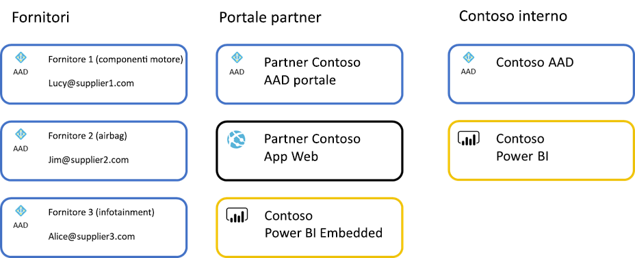

Nell'esempio precedente, gli utenti di ogni fornitore accedono al portale per i partner di Contoso che usa AAD come provider di identità. Potrebbe usare AAD B2B, Azure B2C, le identità native o la Federazione con un numero qualsiasi di altri provider di identità. L'utente effettua l'accesso e accede a una compilazione del portale per i partner usando l'app Web di Azure o un'infrastruttura simile.

All'interno dell'app Web, i report Power BI sono incorporati da una distribuzione di Power BI Embedded. L'app Web semplifica l'accesso ai report e ai servizi correlati in un'esperienza coesa per facilitare l'interazione dei fornitori con contoso. Questo ambiente del portale viene isolato dall'ambiente interno di Azure AAD e da Power BI interno di Contoso per garantire che i fornitori non possano accedere a tali risorse. In genere, i dati vengono archiviati in un partner separato data warehouse per garantire anche l'isolamento dei dati. Questo isolamento presenta dei vantaggi poiché limita il numero di utenti esterni con accesso diretto ai dati dell'organizzazione, limitando i dati potenzialmente disponibili per l'utente esterno e limitando la condivisione accidentale con utenti esterni.

Con Power BI Embedded, il portale può sfruttare le licenze vantaggiose, usando il token dell'app o l'utente Master, oltre alla capacità Premium acquistata nel modello di Azure, che semplifica l'assegnazione delle licenze agli utenti finali e consente di aumentare o ridurre le prestazioni in base all'utilizzo previsto. Il portale può offrire un'esperienza complessiva di qualità e coerenza superiore, poiché i partner accedono a un singolo portale progettato con tutte le esigenze di un partner. Infine, poiché le soluzioni basate su Power BI Embedded sono in genere progettate per essere multi-tenant, rendono più semplice garantire l'isolamento tra le organizzazioni partner.

Motivi per scegliere questa alternativa:

- Gestione più semplice con la crescita del numero di organizzazioni partner. Poiché i partner vengono aggiunti a una directory separata isolata dalla directory AAD interna di Contoso, semplifica le attività di governance e consente di impedire la condivisione accidentale di dati interni a utenti esterni.
- I portali partner tipici sono esperienze altamente personalizzate con esperienze coerenti tra i partner e semplificate per soddisfare le esigenze dei partner tipici. Contoso è quindi in grado di offrire una migliore esperienza complessiva ai partner integrando tutti i servizi necessari in un unico portale.
- I costi di licenza per scenari avanzati, ad esempio la modifica di contenuto all'interno del Power BI Embedded sono coperti dal Power BI Premium acquistato da Azure e non richiedono l'assegnazione di licenze Power BI Pro a tali utenti.
- Fornisce un migliore isolamento tra i partner se architettato come soluzione multi-tenant.
- Il portale per i partner spesso include altri strumenti per i partner oltre Power BI report, dashboard e app.

Motivi per non scegliere questa alternativa:

- È necessario impegnarsi in modo significativo per creare, utilizzare e gestire un portale di questo tipo, rendendolo un investimento significativo in termini di risorse e tempo.
- Il tempo per la soluzione è molto più lungo rispetto all'uso della condivisione B2B poiché è richiesta un'attenta pianificazione ed esecuzione in più flussi di programmazione.
- Se è presente un numero minore di partner, il lavoro richiesto per questa alternativa è probabilmente troppo elevato per giustificare il problema.
- La collaborazione con la condivisione ad hoc è lo scenario principale affrontato dall'organizzazione.
- I report e i dashboard sono diversi per ogni partner. Questa alternativa introduce un sovraccarico di gestione oltre alla semplice condivisione diretta con i partner.

## Domande frequenti

**Contoso può inviare un invito che viene riscattato automaticamente, in modo che l'utente sia semplicemente pronto per l'uso? In alternativa, l'utente deve sempre fare clic sull'URL di riscatto?**

Per poter accedere al contenuto, l'utente finale deve sempre fare clic sull'esperienza di consenso.

Se si invitano molti utenti guest, è consigliabile delegare questa operazione dal core Azure AD amministratori [aggiungendo un utente al ruolo mittente dell'invito Guest nell'organizzazione delle risorse](https://docs.microsoft.com/azure/active-directory/active-directory-b2b-add-guest-to-role). Questo utente può invitare altri utenti nell'organizzazione partner usando l'interfaccia utente di accesso, gli script di PowerShell o le API. In questo modo si riduce il carico amministrativo per gli amministratori Azure AD per invitare o inviare nuovamente gli inviti agli utenti dell'organizzazione partner.

**Contoso può forzare l'autenticazione a più fattori per gli utenti Guest se i partner non hanno l'autenticazione a più fattori?**

Sì. Per altre informazioni, vedere [accesso condizionale per gli utenti di collaborazione B2B](https://docs.microsoft.com/azure/active-directory/active-directory-b2b-mfa-instructions).

**Come funziona la collaborazione B2B quando il partner invitato usa la Federazione per aggiungere la propria autenticazione locale?**

Se il partner ha un tenant di Azure AD federato per l'infrastruttura di autenticazione locale, viene automaticamente eseguita la Single Sign-On locale (SSO). Se il partner non ha un tenant di Azure AD, è possibile creare un account Azure AD per i nuovi utenti.

**È possibile invitare gli utenti guest con gli account di posta elettronica di un utente?**

L'invito di utenti guest con account di posta elettronica consumer è supportato in Power BI. Sono inclusi domini come hotmail.com, outlook.com e gmail.com. Tuttavia, tali utenti potrebbero subire limitazioni oltre a quelle che gli utenti con account aziendali o dell'Istituto di istruzione incontrano.
