# Distribuzione e gestione di capacità di Power BI Premium

**Riepilogo:** Power BI Premium offre prestazioni più coerenti, il supporto per volumi di dati di grandi dimensioni e la flessibilità di una piattaforma di Business Intelligence self-service e aziendale unificata per tutti gli utenti dell'organizzazione. Questo white paper tecnico di livello 300 è stato scritto appositamente per gli amministratori di Power BI e gli autori di contenuti e di editori. Mira ad aiutarli a comprendere il potenziale di Power BI Premium e a spiegare come progettare, distribuire, monitorare e risolvere i problemi relativi alle soluzioni scalabili.

**Autore:** [Peter Myers](https://www.linkedin.com/in/peterjsmyers) (Data Platform MVP e esperto bi indipendente con soluzioni bit per bit)

**Revisori tecnici:** Adam Saxton, Akshai Mirchandani,, Merchant, David Massari, Josh Caplan, Michael Blythe, Nimrod Shalit, Olivier matrat, Swatio Gupta

**Si applica a:** Servizio Power BI, Power BI Premium e capacità Power BI Embedded di Azure

> [!NOTE]
> È possibile salvare o stampare questo white paper selezionando **Stampa** dal browser, quindi selezionando **Salva come PDF**.

## Introduzione a Power BI

Power BI è un servizio di analisi business progettato per fornire informazioni dettagliate che consentono di prendere decisioni rapide e informate. Dal suo rilascio nel 2015, è diventato rapidamente un servizio popolare usato per offrire soluzioni per le organizzazioni più piccole alle aziende.

Viene reso disponibile in due modi: come servizio cloud e come soluzione di creazione di report locale denominata **server di report di Power bi**. \[[1](#endnote-01)\]

Power BI come servizio cloud è una soluzione SaaS (software-as-a-Service) \[[2](#endnote-02)\]. Rappresenta un set di servizi e applicazioni che consentono alle organizzazioni di sviluppare, distribuire, gestire e condividere soluzioni per il monitoraggio dell'attività.

Non è intenzione di questo white paper fornire una descrizione completa del servizio Power BI. Al contrario, è incentrato sugli argomenti relativi all'oggetto di Power BI Premium. Per informazioni generali sui Power BI, consultare la documentazione completa [Power bi](service-admin-premium-multi-geo.md). Per una spiegazione più dettagliata dei servizio Power BI con particolare attenzione al raggiungimento di distribuzioni aziendali con prestazioni ottimali, fare riferimento al white paper sulla pianificazione completa di [una distribuzione di Power BI Enterprise](https://aka.ms/pbienterprisedeploy) .

Nel contesto di questo white paper, questa sezione presenta e descrive le capacità, Power BI tipi di contenuto, le modalità di archiviazione dei modelli e le licenze. La comprensione di questi argomenti è essenziale per la distribuzione e la gestione di Power BI Premium.

### Capacità

Le **capacità** sono un concetto di base Power BI che rappresenta un set di risorse (archiviazione, processore e memoria) usate per ospitare e distribuire Power bi contenuto. Le capacità sono condivise o dedicate. Una **capacità condivisa** è condivisa con altri clienti Microsoft, mentre una **capacità dedicata** è dedicata interamente a un singolo cliente. Le capacità dedicate sono introdotte nell'argomento [capacità Premium](#premium-capacities) .

Nella capacità condivisa i carichi di lavoro vengono eseguiti in risorse di calcolo condivise con altri clienti. Poiché la capacità deve condividere le risorse, vengono imposte limitazioni per garantire una riproduzione equa, ad esempio le dimensioni massime del modello (1 GB) e la frequenza di aggiornamento giornaliero massima (otto volte al giorno).

### Workspaces

Le aree di lavoro Power BI si trovano all'interno delle capacità e rappresentano contenitori di sicurezza, collaborazione e distribuzione. Ogni utente di Power BI ha un'area di lavoro chiamata **Area di lavoro personale**. È possibile creare aree di lavoro aggiuntive per abilitare la collaborazione e la distribuzione, che sono note come **aree di lavoro**. Per impostazione predefinita, le aree di lavoro, incluse quelle personali, vengono create nella capacità condivisa.

### Tipi di contenuto Power BI

Per introdurre Power BI Premium argomenti, è importante iniziare con una descrizione approfondita dell'architettura Power BI, inclusi i tipi di contenuto fondamentali.

Tutto il contenuto del Power BI viene archiviato e gestito all'interno di aree di lavoro che sono contenitori per Power BI contenuto. Ogni utente Power BI dispone di un'area di lavoro personale, ma la procedura consigliata è quella di creare aree di lavoro. Le aree di lavoro consentono la co-proprietà del contenuto e la possibilità di collaborare al contenuto. Offrono inoltre la possibilità di organizzare e distribuire il contenuto a gruppi di destinatari diversi come app.

Il contenuto Power BI seguente viene archiviato nelle aree di lavoro:

- Dataflows
- Datasets
- Cartelle di lavoro
- Relazioni
- Dashboards

#### Dataflows

Power BI i flussi di dati consentono alle organizzazioni di unificare i dati provenienti da origini diverse. Possono essere considerati come dati preparati e gestiti temporaneamente per l'uso nei modelli, ma non possono essere usati direttamente come origine per la creazione di report. Sfruttano l'ampia raccolta di connettori dati Microsoft, consentendo l'inserimento di dati da origini dati locali e basate sul cloud.

I flussi di dati possono essere creati e gestiti solo nelle aree di lavoro e vengono archiviati come entità in Common Data Model (CDM) in Azure Data Lake Storage Gen2. In genere, sono pianificati per l'aggiornamento su base ricorrente per archiviare i dati aggiornati.

Per ulteriori informazioni, vedere il documento relativo alla [preparazione dei dati self-service in Power BI (anteprima)](service-dataflows-overview.md) .

#### Datasets

Power BI set di dati rappresentano un'origine dei dati pronti per la creazione di report e la visualizzazione. Sono disponibili molti tipi di set di impostazioni, creati da:

- Connessione a un modello di dati esistente che non è ospitato in una capacità di Power BI
- Caricamento di un file di Power BI Desktop contenente un modello
- Caricamento di una cartella di lavoro di Excel (contenente una o più tabelle di Excel e/o un modello di dati della cartella di lavoro) o caricamento di un file con valori delimitati da virgole (CSV)
- Uso del servizio Power BI per creare un set di dati di streaming push, streaming o ibrido

Ad eccezione dei set di dati di streaming \[[3](#endnote-03)\], il set di dati rappresenta un modello di dati che sfrutta le tecnologie di modellazione mature di Analysis Services.

Si noti che nella documentazione a volte i set di impostazioni e i modelli di termini sono intercambiabili. Generalmente, dal punto di vista del servizio Power BI viene definito set di **dati** e, dal punto di vista dello sviluppo, viene definito **modello**. Nel contesto di questo white paper significano molto la stessa cosa.

##### Modelli ospitati esternamente

Per la connessione a un modello ospitato esternamente è necessario installare il [gateway dati locale](service-gateway-onprem.md) per connettersi a SQL Server Analysis Services, sia che si tratti di un'infrastruttura distribuita come servizio (IaaS) locale o ospitata da VM. Azure Analysis Services non richiede un gateway. Questo scenario è spesso utile quando esistono investimenti di modelli esistenti, in genere formando parte del data warehouse aziendale (EDW). Consente Power BI di eseguire una **connessione in tempo reale** (LC) per Analysis Services ed esegue tale operazione applicando le autorizzazioni per i dati utilizzando l'identità dell'utente del report Power bi. Per SQL Server Analysis Services sono supportati sia i modelli multidimensionali (cubi) sia i modelli tabulari. Come illustrato nell'immagine seguente, un set di dati di connessione dinamica passa le query ai modelli ospitati esternamente.

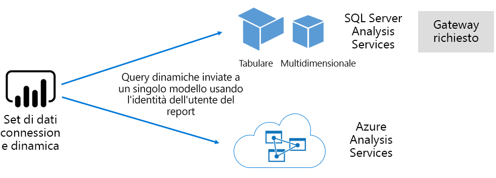

##### Modelli sviluppati da Power BI Desktop

Power BI Desktop: un'applicazione client destinata allo sviluppo Power BI può essere utilizzata per sviluppare un modello che è effettivamente un Analysis Services modello tabulare. È possibile sviluppare i modelli importando dati da flussi di dati, che possono quindi essere integrati con altre origini dati. Sebbene le specifiche relative al modo in cui è possibile ottenere la modellazione esulano dall'ambito di questo white paper, è importante comprendere che esistono tre tipi di modelli diversi, o modalità, che possono essere sviluppati utilizzando Power BI Desktop. Queste modalità determinano se i dati vengono importati nel modello o se rimangono nell'origine dati. Le tre modalità sono: Import, DirectQuery e composite. Una descrizione completa di ogni modalità verrà illustrata nell'argomento [modalità di archiviazione del modello](#model-storage-modes) .

Modelli e modelli ospitati esternamente sviluppati in Power BI desktop possono applicare la sicurezza a livello di riga (RLS) per limitare i dati che possono essere recuperati per un determinato utente. Ad esempio, gli utenti assegnati al gruppo di sicurezza venditori possono visualizzare solo i dati del report per le aree di vendita a cui sono assegnati. I ruoli RLS possono essere dinamici o statici. I **ruoli dinamici** vengono filtrati dall'utente del report, mentre i **ruoli statici** applicano gli stessi filtri a tutti gli utenti assegnati al ruolo.

##### Modelli di cartella di lavoro di Excel

La creazione di set di dati basati su cartelle di lavoro di Excel o file CSV comporterà la creazione automatica di un modello. Le tabelle di Excel e i dati CSV verranno importati per creare tabelle del modello, mentre un modello di dati della cartella di lavoro di Excel verrà trasposto per creare un modello di Power BI. In tutti i casi, i dati del file vengono importati in un modello.

È quindi possibile distinguere tra Power BI set di impostazioni che rappresentano i modelli:

- Sono ospitati nella servizio Power BI o sono ospitati esternamente da Analysis Services
- Possono archiviare i dati importati oppure possono inviare richieste di query pass-through a origini dati sottostanti o una combinazione di entrambi

Di seguito è riportato un riepilogo dei fatti importanti relativi Power BI set di dati che rappresentano i modelli:

- SQL Server Analysis Services modelli ospitati richiedono un gateway per eseguire query LC
- Modelli ospitati da Power BI che importano dati
  - Devono essere completamente caricati in memoria in modo che possano essere sottoposti a query
  - Richiedi aggiornamento per la conservazione dei dati correnti e deve coinvolgere i gateway quando i dati di origine non sono accessibili direttamente su Internet
- I modelli ospitati da Power BI che usano la modalità di archiviazione DirectQuery (DQ) richiedono la connettività ai dati di origine. Quando viene eseguita una query sul modello, Power BI invia query ai dati di origine per recuperare i dati correnti. Questa modalità deve coinvolgere i gateway quando i dati di origine non sono accessibili direttamente tramite Internet.
- I modelli possono applicare regole di sicurezza a livello di riga, applicando filtri per limitare l'accesso ai dati per determinati utenti

Per distribuire e gestire correttamente Power BI Premium, è importante comprendere dove sono ospitati i modelli, la modalità di archiviazione, le dipendenze dai gateway, le dimensioni dei dati importati e il tipo e la frequenza di aggiornamento. Questi possono avere un impatto significativo sulle risorse Power BI Premium. Inoltre, la progettazione del modello stesso, incluse le query di preparazione dei dati e i calcoli, può aggiungere alla combinazione di considerazioni.

È inoltre importante comprendere che i modelli di importazione ospitati da Power BI possono essere aggiornati in base alla pianificazione o essere attivati su richiesta da un utente nel servizio Power BI.

La progettazione di modelli ottimizzati è illustrata più avanti in questo articolo tecnico nell'argomento [ottimizzazione dei modelli](#optimizing-models) .

#### Cartelle di lavoro

Power BI cartelle di lavoro sono un tipo di contenuto Power BI \[[4](#endnote-04)\]. Si tratta di cartelle di lavoro di Excel che sono state caricate nel servizio Power BI e non devono essere confuse con le cartelle di lavoro di Excel caricate che creano set di impostazioni (modelli). Il tipo di contenuto della cartella di lavoro rappresenta una connessione a una cartella di lavoro di, che può essere caricata nella servizio Power BI o rimanere nell'archiviazione cloud in OneDrive o SharePoint Online.

È importante comprendere che questo tipo di contenuto non è disponibile come origine dati per Power BI visualizzazioni dei dati. È invece possibile aprirla come cartella di lavoro nella servizio Power BI usando Excel online. L'intenzione principale di questo tipo di contenuto è consentire l'accesso ai report della cartella di lavoro di Excel legacy dall'interno del servizio Power BI e consentire la visualizzazione delle visualizzazioni dei dati in Power BI Dashboard.

Per ulteriori informazioni, vedere il documento [recuperare i dati da file di cartella di lavoro di Excel](service-excel-workbook-files.md) .

#### Relazioni

Esistono due tipi di report: Power BI report e i report impaginati.

**Power bi report** forniscono un'esperienza interattiva di visualizzazione dei dati che si connette a un singolo set di dati. I report sono spesso progettati per favorire la partecipazione degli utenti, in modo da consentire loro di interagire con una straordinaria gamma di funzionalità, tra cui filtro, sezionamento, filtro incrociato ed evidenziazione, drill up, drill-down, drill-through, Q & un naturale domande sulla lingua, messa a fuoco, navigazione delle pagine, spotlighting, visualizzazione di segnalibri e altro ancora.

Nel contesto di questo white paper è importante comprendere in che modo l'architettura Power BI, Power BI la progettazione di report e le interazioni utente possono avere un effetto sulle risorse servizio Power BI:

- Per caricare e interagire con i report basati sui modelli di importazione, è necessario che il modello sia completamente caricato in memoria (indipendentemente dal fatto che sia ospitato nel servizio Power BI o in un host esterno)
- Ogni oggetto visivo del report genera una query per recuperare i dati eseguendo una query sul modello
- In genere, le interazioni filtro e filtro dei dati comportano l'esecuzione di query sul modello. Se ad esempio si modifica la selezione di un filtro dei dati, per impostazione predefinita è necessario ricaricare ogni oggetto visivo nella pagina \[[5](#endnote-05)\]
- I report Power BI non garantiscono la visualizzazione dei dati correnti e possono richiedere all'utente di aggiornare il report per ricaricare la pagina del report e i relativi oggetti visivi
- Gli utenti possono interagire con le domande e risposte & una funzionalità del linguaggio naturale per porre domande, fornendo la progettazione del report Power BI la consente e il set di dati rappresenta un modello di importazione dati ospitata da Power BI o un set di dati LC configurato per abilitare Q & A

**Report impaginati** che consentono la pubblicazione e il rendering dei report SQL Server Reporting Services (SSRS) (\*formato RDL). Come suggerisce il nome, i report impaginati vengono comunemente usati quando i requisiti stabiliscono la necessità di stampare a una dimensione di pagina fissa o quando sono presenti elenchi variabili di dati che devono essere completamente espansi. Ad esempio, una fattura progettata per il rendering a più pagine (piuttosto che lo scorrimento all'interno di un oggetto visivo) e la stampa.

I due tipi di report supportati forniscono la scelta per gli autori di report, consentendo loro di selezionare il tipo in base ai requisiti e all'utilizzo previsto. In genere, i report Power BI sono ideali per esperienze interattive che consentono all'utente di esplorare e individuare informazioni dettagliate dai dati, mentre i report impaginati sono più adatti ai layout di pagina basati su parametri.

Indipendentemente dal tipo di report, il raggiungimento del carico e degli aggiornamenti dei dati reattivi dei report (in caso di modifica di filtri o parametri) è fondamentale per garantire un'esperienza utente affidabile e con prestazioni ottimali.

#### Dashboards

I dashboard Power BI hanno lo scopo di fornire esperienze di monitoraggio e sono concettualmente molto diversi dai report Power BI. I dashboard sono progettati per la visualizzazione in un singolo riquadro di vetro per esprimere i valori e le visualizzazioni dei dati nei riquadri. In genere, i dashboard offrono un minor numero di esperienze di interazione rispetto a Power BI report, con alcuni progetti di dashboard che non prevedono interazioni. Ad esempio, un dashboard automatico visualizzato in una schermata non touchscreen in una sala server. Un'altra differenza significativa è che i dashboard possono presentare riquadri che consentono di originare dati da più set di dati, mentre un Power BI report può essere basato solo su un singolo set di dati.

È importante comprendere che un dashboard è progettato per il caricamento rapido e per esprimere i dati più aggiornati (noti al servizio Power BI) in qualsiasi momento. Questa operazione viene eseguita memorizzando nella cache i risultati delle query di affiancamento, che viene eseguita per ogni dashboard. Questa operazione deve infatti essere eseguita per ogni utente che ha accesso a un dashboard basato su modelli che applicano la sicurezza a livello di riga dinamica.

Il servizio Power BI aggiorna automaticamente le cache delle query del dashboard immediatamente dopo l'aggiornamento dei modelli di importazione Power BI ospitati. Nel caso dei modelli LC e DQ, il proprietario del set di dati ha un certo livello di controllo sulla frequenza con cui il servizio Power BI aggiorna la cache, che può essere configurata con una frequenza di 15 minuti o raramente come una volta alla settimana. Si noti che gli aggiornamenti della cache di query LC eseguiranno prima una query sui metadati del modello per determinare se un aggiornamento del modello è stato eseguito dall'ultimo aggiornamento della cache e non procederà con l'aggiornamento della cache quando non si è verificato un aggiornamento. Questo controllo non è possibile per i modelli DQ, quindi gli aggiornamenti della cache si verificano se i dati di origine sono stati modificati o meno.

Gli aggiornamenti della cache delle query del dashboard basati su modelli DQ e LC possono avere un notevole effetto sulle risorse servizio Power BI e sulle origini dati esterne. Si consideri un dashboard con 20 riquadri, tutti basati su un modello di Azure Analysis Services che applica la sicurezza a livello di riga dinamica e che viene aggiornato ogni ora e che questo dashboard è condiviso con 100 utenti. Se il set di dati è configurato per l'aggiornamento ogni ora, il risultato sarà di almeno 2000 (20 x 100) di query LC. Questo potrebbe comportare un carico enorme sul servizio Power BI e sulle origini dati esterne e potrebbe anche superare i limiti imposti sulle risorse disponibili. Le risorse e i limiti di capacità sono descritti nell'argomento [nodi Capacity](#capacity-nodes) .

Gli utenti possono interagire con un dashboard in diversi modi, che richiedono risorse servizio Power BI. In particolare, gli amministratori possono:

- Attivare un aggiornamento dei riquadri dei dashboard, che può comportare un aggiornamento su richiesta di tutti i modelli di importazione dati ospitati Power BI correlati
- Interagisci con le domande e risposte & una funzionalità del linguaggio naturale per porre domande (fornendo la progettazione del dashboard e il set di dati è un modello di importazione dati ospitata da Power BI o un set di dati LC configurato per abilitare Q & A)
- Usare la funzionalità Quick Insights per avere Power BI individuare informazioni dettagliate da un set di dati sottostante e rispondere con gli oggetti visivi che li visualizzano e li descrivono (a condizione che il riquadro sia basato su un set di dati Power BI modello di importazione dati ospitato)
- Configurare gli avvisi nei riquadri del dashboard, richiedendo la servizio Power BI di confrontare le soglie per i valori delle sezioni, probabilmente con frequenza oraria, e per notificare agli utenti quando vengono superate le soglie (purché il riquadro visualizzi un singolo valore numerico ed è basato su un set di dati che è un modello di importazione dati ospitato Power BI)

### Modalità di archiviazione modelli

Si ricordi che Power BI Desktop consente lo sviluppo di un modello in una delle tre modalità. È importante comprendere la logica per ogni modalità di archiviazione del modello di dati e i possibili effetti sulle risorse servizio Power BI. In questa sezione vengono presentate tutte e tre le modalità. Questi argomenti verranno descritti in dettaglio più avanti in questo white paper nell'argomento Ottimizzazione dei modelli.

#### Modalità di importazione

La modalità di importazione è la modalità più comune utilizzata per sviluppare modelli a causa delle prestazioni estremamente veloci associate all'esecuzione di query in memoria, alla flessibilità di progettazione disponibile per i modellatori e al supporto per specifiche funzionalità di servizio Power BI (Q & A, Quick Insights e così via). Si tratta della modalità predefinita quando si crea una nuova soluzione Power BI Desktop.

È importante comprendere che i dati importati vengono sempre archiviati su disco e devono essere completamente caricati in memoria per essere sottoposti a query o aggiornati. Una volta in memoria, i modelli di importazione ottengono risultati di query estremamente veloci. È inoltre importante comprendere che non esiste alcun concetto di modello di importazione parzialmente caricato in memoria.

Al momento dell'aggiornamento, i dati vengono compressi e ottimizzati e quindi archiviati su disco dal motore di archiviazione VertiPaq. Quando viene caricato dal disco in memoria, è possibile vedere la compressione 10x, quindi è ragionevole aspettarsi che 10 GB di dati di origine possano comprimere circa 1 GB di dimensioni. Le dimensioni di archiviazione su disco possono ottenere una riduzione del 20% al livello superiore. \[[6](#endnote-06)\]

La flessibilità di progettazione può essere realizzata in tre modi. I modelli di dati possono:

- Integrare i dati mediante la memorizzazione nella cache di dati da più origini dati, indipendentemente dal formato e dal tipo di origine dati
- Utilizzare l'intero set di funzioni di Power Query linguaggio delle formule (definite in modo informale come M) quando si creano query di preparazione dei dati
- Utilizzare l'intero set di funzioni DAX (Data Analysis Expressions) quando si ottimizza il modello con la logica di business, ottenuta con colonne calcolate, tabelle calcolate e misure

Come illustrato nell'immagine seguente, un modello di importazione può integrare i dati da qualsiasi numero di tipi di origini dati supportate.

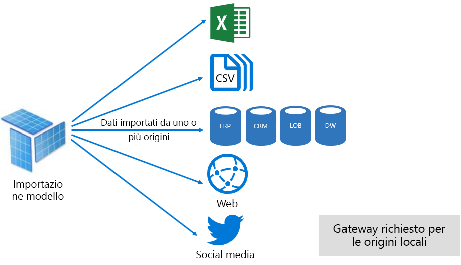

Tuttavia, sebbene ci siano vantaggi interessanti associati ai modelli di importazione, esistono anche degli svantaggi:

- L'intero modello deve essere caricato in memoria prima che Power BI possibile eseguire una query sul modello, in modo da applicare la pressione sulle risorse disponibili quando il numero e le dimensioni dei modelli aumentano
- I dati del modello sono aggiornati solo come aggiornamenti più recenti, quindi è necessario aggiornare i modelli di importazione, preferibilmente in base a una pianificazione
- Un aggiornamento completo rimuove tutti i dati da tutte le tabelle e li ricarica dall'origine dati. Questo può essere molto dispendioso in termini di tempo e risorse per il servizio Power BI e le origini dati. Power BI dispone del supporto per l'aggiornamento incrementale, che consente di evitare il troncamento e il ricaricamento di intere tabelle e viene trattato nell'argomento [ottimizzazione dei modelli ospitati da Power bi](#optimizing-power-bi-hosted-models) .

Dal punto di vista della risorsa servizio Power BI, i modelli di importazione richiedono:

- Memoria sufficiente per caricare il modello durante la query o l'aggiornamento
- Elaborazione di risorse e risorse di memoria aggiuntive per l'aggiornamento dei dati

#### Modalità DirectQuery

I modelli sviluppati in modalità DirectQuery (DQ) non importano dati. Sono invece costituiti solo da metadati che, quando vengono sottoposti a query, generano query native sull'origine dati sottostante.

Ci sono due motivi principali per considerare lo sviluppo di un modello DQ. Il primo motivo è quando i volumi di dati sono troppo grandi, anche quando vengono applicati i metodi di riduzione dei dati, per caricarli in un modello o praticamente aggiornarli. Il secondo motivo è quando i report e i dashboard devono fornire dati "near Real Time", oltre a quelli che è possibile ottenere entro i limiti dell'aggiornamento pianificato (48 volte al giorno per una capacità dedicata).

Ai modelli DQ sono associati diversi vantaggi:

- Importazione dei limiti delle dimensioni del modello non applicabile
- I modelli non richiedono l'aggiornamento
- Gli utenti del report visualizzeranno i dati più recenti quando interagiscono con i filtri dei report e i sezionamenti e potranno aggiornare l'intero report per recuperare i dati correnti
- I riquadri del dashboard, quando basati su modelli DQ, possono essere aggiornati automaticamente con la frequenza di ogni 15 minuti

Esistono tuttavia numerosi svantaggi e limitazioni associati ai modelli DQ:

- Il modello deve essere basato su un'unica origine dati supportata e pertanto l'integrazione dei dati deve essere già stata eseguita nell'origine dati. Le origini dati supportate sono sistemi relazionali e analitici, con supporto per molti archivi dati diffusi \[[7](#endnote-07)\].
- Le prestazioni possono essere lente, che potenzialmente hanno un impatto negativo sulla servizio Power BI (le query possono richiedere un utilizzo elevato della CPU) e sull'origine dati (che potrebbe non essere ottimizzata per le query analitiche)
- Power Query le query non possono essere eccessivamente complesse e sono limitate a M espressioni e funzioni che possono essere trasposte a query native riconosciute dall'origine dati
- Le funzioni DAX sono limitate a quelle che possono essere trasformate in query native riconosciute dall'origine dati e non è previsto alcun supporto per le tabelle calcolate o le funzionalità di Business Intelligence per l'ora predefinite
- Per impostazione predefinita, le query del modello che richiedono il recupero di più di 1 milione righe avranno esito negativo
- I report e i dashboard con più oggetti visivi possono visualizzare risultati incoerenti, soprattutto quando l'origine dati è volatile
- D & A e Quick Insights non sono supportati

Dal punto di vista della risorsa servizio Power BI, i modelli DQ richiedono:

- Memoria minima per il caricamento del modello (solo metadati) quando viene eseguita una query
- Risorse del processore a volte significative per generare ed elaborare le query inviate all'origine dati

Per ulteriori informazioni, vedere la pagina relativa all' [utilizzo della query diretta nel documento Power bi desktop](desktop-use-directquery.md) .

#### Modalità composita

I modelli sviluppati in modalità composita consentono di configurare la modalità di archiviazione per le singole tabelle del modello. Supporta quindi una combinazione di tabelle Import e DQ. Supporta inoltre le tabelle calcolate (definite con DAX) e più origini dati DQ.

La modalità di archiviazione tabelle può essere configurata come Import, DirectQuery o dual. Una tabella configurata come modalità di archiviazione doppia è sia Import che DirectQuery e ciò consente all'servizio Power BI di determinare la modalità più efficiente da utilizzare per una query in base alla query.

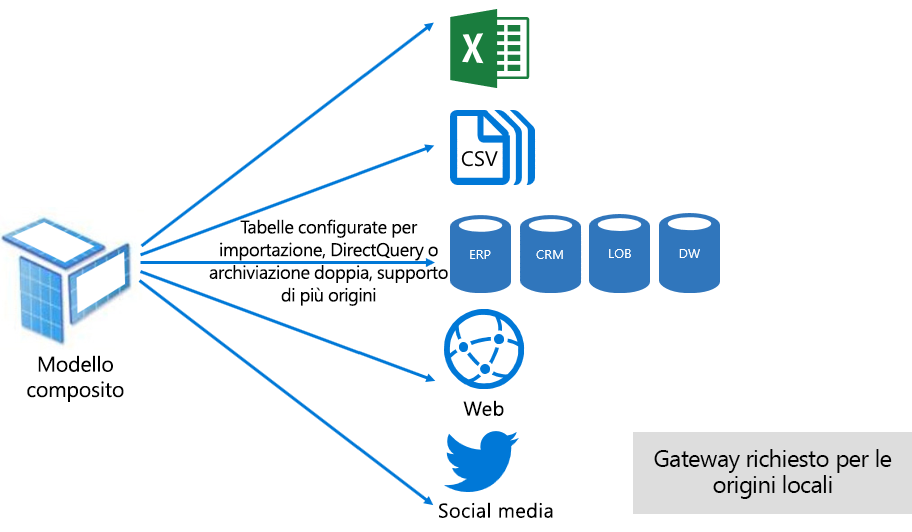

I modelli compositi si impegnano a offrire il meglio delle modalità di importazione e DirectQuery. Quando sono configurati in modo appropriato, possono combinare prestazioni di query elevate dei modelli in memoria con la possibilità di recuperare dati quasi in tempo reale dalle origini dati.

È probabile che i modellistici di dati che sviluppano modelli compositi configurino tabelle di tipo dimensione nelle tabelle di importazione o doppia archiviazione e di tipo fact in modalità DirectQuery. Si consideri, ad esempio, un modello con una tabella di tipo dimensione prodotto in modalità duale e una tabella di tipo fact vendite in modalità DirectQuery. La tabella Product può essere sottoposta a query in modo efficiente e veloce da in memoria per eseguire il rendering di un filtro dei dati del report. È quindi possibile eseguire query sulla tabella Sales in modalità DirectQuery unita in join alla tabella Product correlata. Quest'ultima query potrebbe consentire la generazione di una singola query nativa efficiente per unire le tabelle Product e Sales e applicare il filtro in base ai valori del filtro dei dati.

In generale, è possibile considerare i vantaggi e gli svantaggi associati a ogni modalità del modello da applicare alla modalità di archiviazione tabelle nei modelli compositi.

Per ulteriori informazioni, vedere l'articolo relativo all' [utilizzo di modelli compositi in Power bi desktop](desktop-composite-models.md) documento.

### Gestione delle licenze

Power BI dispone di tre licenze:

- Power BI gratuito
- Power BI Pro
- Power BI Premium

Il **Power bi licenza gratuita** consente a un utente di accedere al servizio Power bi e lavorare all'interno dell'area di lavoro personale pubblicando modelli e report. È importante comprendere che non è possibile condividere Power BI contenuto utilizzando questa licenza. Questa licenza, come suggerisce il nome, è gratuita.

La licenza **Power bi Pro** consente a un utente di creare e collaborare all'interno di aree di lavoro e di condividere e distribuire Power bi contenuto. Possono anche configurare l'aggiornamento per i set di dati in modo che i dati vengano mantenuti automaticamente aggiornati, incluse le origini dati locali. Possono inoltre controllare e gestire la modalità di accesso ai dati e di utilizzo. Questa licenza è necessaria per ricevere contenuto condiviso da altri, a meno che l'utente non sia associato a una capacità di Power BI Premium dedicata.

La licenza **Power bi Premium** è una licenza a livello di tenant e viene discussa nella sezione [Introducing Power bi Premium](#introducing-power-bi-premium) .

Per ulteriori informazioni sulle licenze Power BI, vedere la pagina relativa ai [prezzi Power bi](https://powerbi.microsoft.com/pricing/) .

## Introduzione a Power BI Premium

Power BI Premium offre una piattaforma di Business Intelligence self-service e aziendale unificata con scalabilità, prestazioni affidabili e costi prevedibili. Questa operazione viene eseguita principalmente fornendo risorse dedicate per l'esecuzione del servizio Power BI per l'organizzazione.

Power BI Premium offre inoltre numerose funzionalità aziendali:

- Distribuzione di contenuti conveniente, che consente la condivisione di contenuti di Power BI a utenti senza limiti Power BI, inclusi gli utenti esterni
- Supporto per dimensioni del set di dati più grandi \[[8](#endnote-08)\]
- Frequenze di aggiornamento più elevate dei flussi di data e dei set di impostazioni (fino a 48 volte al giorno)
- Aggiornamento incrementale di flussi di data e DataSet
- Entità collegate al flusso di flussi di flussi e esecuzione parallela di trasformazioni
- Report impaginati
- Server di report di Power BI per la creazione di report locali
- Possibilità di incorporare il contenuto nelle app per conto degli utenti dell'app (PaaS)

Molte di queste funzionalità possono essere sfruttate per offrire soluzioni aziendali efficienti e scalabili e sono descritte nella sezione [ottimizzazione delle capacità Premium](#optimizing-premium-capacities) .

### Sottoscrizioni e licenze

Power BI Premium è una sottoscrizione di Office 365 a livello di tenant disponibile in due famiglie di SKU (Stock-Keeping Unit):

- **Em** SKU (EM1-EM3) per l'incorporamento, che richiedono un impegno annuale, fatturato mensilmente
- SKU **P** (P1-P3) per l'incorporamento e le funzionalità aziendali, che richiedono un impegno mensile o annuale, fatturato mensilmente e include una licenza per l'installazione di server di report di Power bi locale

Un approccio alternativo consiste nell'acquistare una sottoscrizione di Azure Power BI Embedded con una singola famiglia di SKU, ovvero **un** SKU (a1-a6) per l'incorporamento e solo a scopo di test della capacità.

Tutti gli SKU offrono v-core per creare capacità \[[9](#endnote-09)\], ma gli SKU em sono limitati per l'incorporamento di scala ridotta. Anche se l'obiettivo di questo white paper è quello degli SKU P, la maggior parte degli argomenti trattati è pertinente anche per gli SKU A.

A differenza delle SKU della sottoscrizione Premium, le SKU di Azure non richiedono un impegno per un periodo di tempo e vengono fatturare su base oraria. Offrono la massima elasticità permettendo aumenti, riduzioni, sospensioni, ripristini ed eliminazioni.

Azure Power BI Embedded è in gran parte fuori dall'ambito di questo white paper, ma viene trattato nell'argomento approcci di test come opzione pratica ed economica per testare e misurare i carichi di lavoro.

Per altre informazioni sugli SKU di Azure, vedere la [documentazione di azure Power BI embedded](/azure/power-bi-embedded/).

Le sottoscrizioni di Power BI Premium vengono acquistate dagli amministratori nell'interfaccia di amministrazione di Microsoft 365. In particolare, solo gli amministratori globali di Office 365 o gli amministratori della fatturazione possono acquistare SKU.

Una volta acquistato, il tenant riceve un numero corrispondente di v-core da assegnare alle capacità. questa operazione è nota come **pooling v-Core**. Ad esempio, l'acquisto di una SKU P3 fornisce al tenant 32 memorie centrali virtuali.

Per ulteriori informazioni, fare riferimento al documento [come acquistare Power bi Premium](service-admin-premium-purchase.md) .

### Capacità Premium

A differenza di una capacità condivisa in cui i carichi di lavoro vengono eseguiti sulle risorse di calcolo condivise con altri clienti, una **capacità dedicata** è destinata all'uso esclusivo da un'organizzazione. È isolata con risorse di calcolo dedicate che forniscono prestazioni affidabili e coerenti per il contenuto ospitato.

L'obiettivo di questo white paper è la **capacità Premium** , ovvero è associato a uno degli SKU em o P.

#### Nodi delle capacità

Come descritto nell'argomento Subscriptions and Licensing, sono disponibili due Power BI Premium SKU Families: EM e P. Tutti gli SKU di Power BI Premium sono disponibili come nodi di capacità, ognuno dei quali rappresenta una quantità impostata di risorse costituite da processore, memoria e archiviazione. Oltre alle risorse, ogni SKU presenta limiti operativi sul numero di connessioni DirectQuery (DQ) e Live Connection (LC) al secondo e il numero di aggiornamenti paralleli del modello.

L'elaborazione avviene tramite un determinato numero di vCore, suddiviso equamente tra back-end e front-end.

I **vCore di back-end** sono responsabili della funzionalità di Power BI relativa alla memoria centrale che include elaborazione delle query, gestione della cache, esecuzione dei servizi R, aggiornamento dei modelli, elaborazione del linguaggio naturale (Domande e risposte) e rendering lato server di report e immagini. Ai core v-back-end viene assegnata una quantità di memoria fissa, primaria utilizzata per ospitare i modelli, detti anche set di set di impostazioni attivi.

Le memorie centrali di front **-end** sono responsabili del servizio Web, della gestione dei documenti del dashboard e dei report, dell'accesso a Rights Management, della pianificazione, delle API, dei caricamenti e dei download e, in generale, per tutto ciò che riguarda le esperienze utente.

L'archiviazione è impostata su 100 TB per nodo di capacità.

Nella tabella seguente sono descritte le risorse e i limiti di ogni SKU Premium (e le dimensioni equivalenti di uno SKU).

| Nodi delle capacità | Totale vCore | vCore back-end | RAM (GB) | vCore front-end | DQ/LC (al secondo) | Parallelismo di aggiornamento dei modelli |
| --- | --- | --- | --- | --- | --- | --- |
| EM1/A1 | 1 | 0.5 | 3 | 0.5 | 3,75 | 1 |
| EM2/A2 | 2 | 1 | 5 | 1 | 7,5 | 2 |
| EM3/A3 | 4 | 2 | 10 | 2 | 15 | 3 |
| P1/A4 | 8 | 4 | 25 | 4 | 30 | 6 |
| P2/A5 | 16 | 8 | 50 | 8 | 60 | 12 |
| P3/A6 | 32 | 16 | 100 | 16 | 120 | 24 |
| | | | | | | |

#### Carichi di lavoro di capacità

I carichi di lavoro delle capacità sono servizi resi disponibili agli utenti. Per impostazione predefinita, le capacità Premium e Azure supportano solo un carico di lavoro del set di dati associato all'esecuzione di Power BI query che non possono essere disabilitate.

È possibile abilitare carichi di lavoro aggiuntivi per report impaginati, flussi di lavoro e intelligenza artificiale. Ogni carico di lavoro aggiuntivo richiede la configurazione della memoria massima (come percentuale della memoria totale disponibile) che può essere usata dal carico di lavoro.

#### Funzione delle capacità

In ogni momento, il servizio Power BI si impegna a sfruttare al meglio le risorse di capacità senza superare i limiti imposti alla capacità.

Le operazioni di capacità sono classificate come interattive o in background. Le operazioni interattive includono il rendering delle richieste e la risposta alle interazioni dell'utente (applicazione di filtri, query su Domande e risposte e così via). In genere, l'importazione di query del modello comporta un utilizzo intensivo delle risorse di memoria e l'esecuzione di query sui modelli LC/DQ comporta un utilizzo intensivo della CPU Le operazioni in background includono gli aggiornamenti dei flussi di dati e dei modelli di importazione e la memorizzazione nella cache delle query sui dashboard.

È importante comprendere che le operazioni interattive sono sempre prioritarie rispetto alle operazioni in background per garantire la migliore esperienza utente possibile. Se non sono presenti risorse sufficienti, le operazioni in background vengono aggiunte a una coda per essere elaborate quando si liberano le risorse. Le operazioni in background, ad esempio gli aggiornamenti del set di dati e le funzioni di intelligenza artificiale, possono essere arrestate a metà processo dal servizio Power BI e aggiunte a una coda.

È necessario che i modelli di importazione siano completamente caricati in memoria in modo che possano essere sottoposti a query o aggiornati. Il servizio Power BI gestisce l'utilizzo della memoria utilizzando algoritmi sofisticati per garantire il massimo utilizzo della memoria disponibile e può ottenere l'overcommit della capacità: anche se è possibile che una capacità memorizzi molti modelli di importazione (fino a 100 TB per capacità Premium), Quando lo spazio di archiviazione su disco combinato supera la memoria supportata (e la memoria aggiuntiva è necessaria per l'esecuzione di query e l'aggiornamento), non è possibile caricarli tutti in memoria nello stesso momento.

I modelli di importazione vengono quindi caricati e rimossi dalla memoria in base all'utilizzo. Un modello di importazione viene caricato quando viene eseguita una query (operazione interattiva) e non ancora in memoria oppure quando è necessario aggiornarlo (operazione in background).

La rimozione di un modello dalla memoria è **Nota come rimozione ed è** un'operazione che Power bi possibile eseguire rapidamente a seconda delle dimensioni dei modelli. Se non si verifica alcun problema di memoria per la capacità, i modelli vengono semplicemente caricati e mantenuti in memoria. \[[10](#endnote-10)\] tuttavia, quando è disponibile memoria insufficiente per il caricamento di un modello, il servizio Power BI deve prima liberare memoria. Consente di liberare memoria rilevando i modelli che sono diventati inattivi cercando modelli che non sono stati usati negli ultimi tre minuti \[[11](#endnote-11)\]e quindi li hanno rimossi. Se non sono presenti modelli inattivi da rimuovere, il servizio Power BI effettua una ricerca per rimuovere i modelli caricati per le operazioni in background. Questa operazione può includere l'eliminazione dei carichi di lavoro in background come il carico di lavoro di intelligenza artificiale. L'ultima risorsa, dopo 30 secondi di tentativi non riusciti \[[11](#endnote-11)\], consiste nell'interrompere l'operazione interattiva. In questo caso, l'utente del report riceve normalmente una notifica di errore con un suggerimento per riprovare a breve.

È importante sottolineare che la rimozione del set di dati è un comportamento normale e previsto. Questo comportamento mira a ottimizzare l'utilizzo della memoria tramite il caricamento e lo scaricamento dei modelli con dimensioni combinate che possono superare la memoria disponibile. Si tratta di un comportamento legato alla progettazione e completamente trasparente agli utenti dei report. Percentuali di rimozione elevate non indicano necessariamente che la capacità non include risorse sufficienti. Potrebbero tuttavia rappresentare un problema nel caso in cui abbiano effetti negativi sulla velocità di risposta alle query o agli aggiornamenti.

Gli aggiornamenti dei modelli di importazione sono sempre a elevato utilizzo di memoria perché i modelli devono essere caricati in memoria e per l'elaborazione è richiesta memoria aggiuntiva. Un aggiornamento completo può usare circa il doppio della quantità di memoria necessaria per il modello. In questo modo si garantisce che il modello possa essere sottoposto a query anche durante l'elaborazione (le query vengono inviate al modello esistente, fino al completamento dell'aggiornamento e i dati del nuovo modello sono disponibili). Si noti che l'aggiornamento incrementale richiede un minor numero di memoria e può essere completato più velocemente, quindi può ridurre notevolmente la pressione sulle risorse di capacità. Anche gli aggiornamenti possono richiedere un utilizzo elevato della CPU per i modelli, in particolari quelli con trasformazioni Power Query complesse o tabelle/colonne calcolate complesse o basate su tabelle di grandi dimensioni.

Aggiornamenti come le query: è necessario che il modello venga caricato in memoria. Se la memoria non è sufficiente, il servizio Power BI tenta di rimuovere i modelli inattivi e, se l'operazione non è possibile (poiché tutti i modelli sono attivi), il processo di aggiornamento viene inserito in coda. Gli aggiornamenti sono in genere molto più intensivo della CPU, anche in più rispetto alle query. Per questa ragione, sono presenti limiti della capacità relativi al numero di aggiornamenti simultanei che è impostato su 1,5 moltiplicato per il numero di vCore di back-end arrotondato. Se è presente un numero eccessivo di aggiornamenti simultanei, un aggiornamento pianificato verrà inserito in coda. Quando si verificano queste situazioni, il completamento dell'aggiornamento richiede più tempo. Si noti che gli aggiornamenti su richiesta (attivati da una richiesta dell'utente o una chiamata API) eseguiranno un nuovo tentativo tre volte \[[11](#endnote-11)\]e quindi avranno esito negativo se non sono ancora disponibili risorse sufficienti.

## Gestione di Power BI Premium

La gestione di Power BI Premium comporta l'acquisto di sottoscrizioni, la creazione, la gestione e il monitoraggio di capacità Premium.

### Creazione e gestione di capacità

La pagina delle **impostazioni di capacità** del portale di **Amministrazione Power bi** Visualizza il numero di memorie centrali, acquistate e disponibili (ovvero ancora da assegnare a una capacità) e elenca le capacità Premium. La pagina consente agli amministratori globali di Office 365 o servizio Power BI agli amministratori di creare capacità Premium da v-core disponibili o di modificare le capacità Premium esistenti.

Quando si crea una capacità Premium, è necessario che l'amministratore definisca:

- Nome della capacità (univoco all'interno del tenant)
- Amministratori della capacità
- Dimensioni della capacità
- Area per la residenza dei dati \[[12](#endnote-12)\]

È necessario assegnare almeno un amministratore della capacità. Gli utenti assegnati come amministratori della capacità possono:

- Assegnare le aree di lavoro alla capacità
- Gestire le autorizzazioni utente, per aggiungere ulteriori amministratori di capacità o utenti con autorizzazioni di assegnazione (per consentire loro di assegnare le aree di lavoro alla capacità)
- Gestire i carichi di lavoro, per configurare l'utilizzo massimo della memoria per i carichi di lavoro dei report impaginati e dei flussi di dati
- Riavviare la capacità per reimpostare tutte le operazioni in caso di overload del sistema \[[13](#endnote-13)\]

Gli amministratori della capacità non possono accedere al contenuto dell'area di lavoro (a meno che non siano assegnate esplicitamente le autorizzazioni per l'area di lavoro) e non hanno accesso a tutte le aree di amministrazione Power BI, a meno che non vengano assegnate in modo esplicito, ad esempio le metriche di utilizzo, i log In particolare gli amministratori della capacità non hanno le autorizzazioni per creare nuove capacità o ridimensionare le capacità esistenti. Inoltre, vengono assegnati in base alla capacità, assicurando che possano solo visualizzare e gestire le capacità a cui sono assegnati.

È necessario selezionare le dimensioni della capacità da un elenco disponibile di opzioni dello SKU, che è vincolato dal numero di memorie centrali v disponibili nel pool. È possibile creare più capacità dal pool che possono essere originate da uno o più SKU acquistati. Ad esempio, è possibile usare uno SKU P3 (32 vCore) per creare tre capacità: una P2 (16 vCore) e due P1 (2 x 8 vCore). Per ottenere prestazioni e scalabilità migliorate, è possibile creare capacità di dimensioni minori e questo argomento è illustrato nella sezione [ottimizzazione delle capacità Premium](#optimizing-premium-capacities) . Nell'immagine seguente viene illustrata una configurazione di esempio per l'organizzazione fittizia Contoso costituita da cinque capacità Premium (3 x P1 e 2 x P3) con ogni area di lavoro contenitore e diverse aree di lavoro nella capacità condivisa.

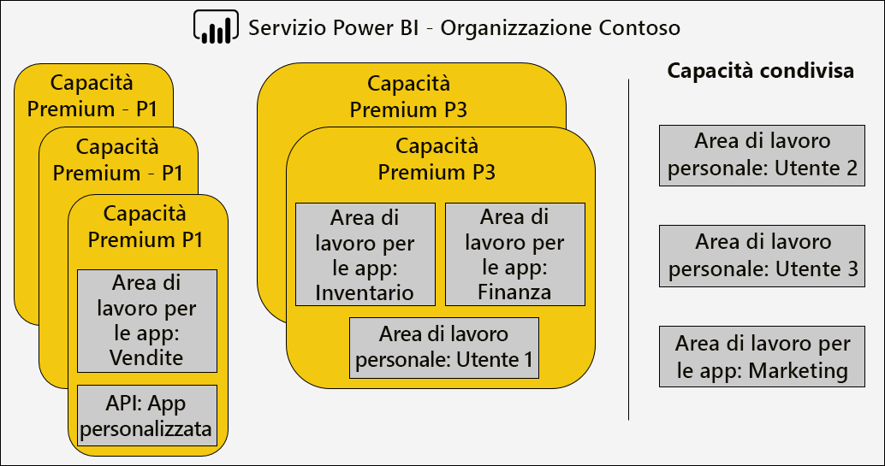

Una capacità Premium può essere assegnata a un'area diversa dall'area principale del tenant Power BI, garantendo il controllo amministrativo sui Data Center (all'interno delle aree geografiche definite) Power BI contenuto. \[[12](#endnote-12)\]

Gli amministratori del servizio Power BI e gli amministratori globali di Office 365 possono modificare le capacità Premium. In particolare, gli amministratori possono:

- Modificare le dimensioni della capacità per aumentare o ridurre le risorse. Tuttavia, non è possibile effettuare il downgrade di uno SKU P a uno SKU EM oppure aggiornare viceversa.
- Aggiungere o rimuovere gli amministratori della capacità
- Aggiungere o rimuovere utenti che dispongono di autorizzazioni di assegnazione
- Aggiungere o rimuovere carichi di lavoro aggiuntivi
- Modificare le aree

Per assegnare un'area di lavoro a una capacità Premium specifica sono necessarie le autorizzazioni di assegnazione. Le autorizzazioni possono essere concesse all'intera organizzazione, a utenti o gruppi specifici.

Per impostazione predefinita, le capacità Premium supportano solo i carichi di lavoro associati all'esecuzione di query di Power BI. Supporta anche tre carichi di lavoro aggiuntivi: **report impaginati**, **flussi**di lavoro e **intelligenza artificiale**. Per ogni carico di lavoro è necessario configurare la memoria massima (come percentuale della memoria totale disponibile) che può essere usata dal carico di lavoro. È importante comprendere che l'aumento delle allocazioni di memoria massime può influito sul numero di modelli attivi che possono essere ospitati e sulla velocità effettiva degli aggiornamenti.

La memoria viene allocata in modo dinamico ai flussi di dati e in modo statico ai report impaginati. Il motivo per l'allocazione statica della memoria massima consiste nel fatto che i report impaginati vengono eseguiti in uno spazio indipendente protetto della capacità. È necessario prestare attenzione quando si imposta la memoria dei report impaginati in quanto riduce la memoria disponibile per il caricamento di modelli.

|                     | EM3                      | P1                       | P2                      | P3                       |
|---------------------|--------------------------|--------------------------|-------------------------|--------------------------|
| Report impaginati | N/D | 20% predefinita; 10% minima | 20% predefinita; 5% minima | 20% predefinita; 2,5% minima |
| Dataflows | 20% predefinita; 8% minima  | 20% predefinita; 4% minima  | 20% predefinita; 2% minima | 20% predefinita; 1% minima  |
| AI | N/D | 20% predefinita; 20% minima  | 20% predefinita; 10% minima | 20% predefinita; 5% minima  |
| | | | | |

L'eliminazione di una capacità Premium è possibile e non comporterà l'eliminazione delle aree di lavoro e del contenuto. Al contrario, sposterà tutte le aree di lavoro assegnate alla capacità condivisa. Quando la capacità Premium è stata creata in un'area diversa, l'area di lavoro viene spostata nella capacità condivisa dell'area Home.

### Assegnazione delle aree di lavoro alle capacità

Le aree di lavoro possono essere assegnate a una capacità Premium nel**portale** di **Amministrazione Power bi**o, per un'area di lavoro, nel riquadro dell' **area di lavoro** .

Gli amministratori della capacità, nonché gli amministratori globali di Office 365 o gli amministratori di servizio Power BI, possono assegnare in blocco le aree di lavoro nel**portale**di **amministrazione di Power bi**. L'assegnazione in blocco può essere applicata ad:

- **Aree di lavoro per utenti** : tutte le aree di lavoro di proprietà di tali utenti, incluse le aree di lavoro personali, vengono assegnate alla capacità Premium. Questo include la riassegnazione delle aree di lavoro quando sono già assegnate a una capacità Premium diversa. Inoltre, agli utenti sono assegnate anche le autorizzazioni di assegnazione dell'area di lavoro.

- **Aree di lavoro specifiche**
- **Le aree di lavoro dell'intera organizzazione** : tutte le aree di lavoro, incluse le aree di lavoro personali, vengono assegnate alla capacità Premium. Inoltre, a tutti gli utenti correnti e futuri vengono assegnate le autorizzazioni di assegnazione dell'area di lavoro. \[[14](#endnote-14)\]

È possibile aggiungere un'area di lavoro a una capacità Premium usando il riquadro **Area di lavoro**, a condizione che l'utente sia un amministratore dell'area di lavoro e abbia le autorizzazioni di assegnazione.

Gli amministratori dell'area di lavoro possono rimuovere un'area di lavoro da una capacità (alla capacità condivisa) senza richiedere l'autorizzazione di assegnazione. La rimozione di aree di lavoro da capacità dedicate consente di rilocare l'area di lavoro nella capacità condivisa. Si noti che la rimozione di un'area di lavoro da una capacità Premium può avere conseguenze negative. È possibile ad esempio che il contenuto condiviso non sia disponibile per gli utenti con licenza gratuita di Power BI o che l'aggiornamento pianificato venga sospeso quando vengono superati i limiti supportati dalle capacità condivise.

Nel servizio Power BI un'area di lavoro assegnata a una capacità Premium è facilmente identificabile dall'icona a rombo nel nome dell'area di lavoro.

### Capacità di monitoraggio

Il monitoraggio delle capacità Premium consente agli amministratori di verificare le prestazioni delle capacità. È possibile monitorare le capacità usando l' [app metrica capacità Power bi Premium](service-admin-premium-monitor-capacity.md) o il portale di [amministrazione di Power bi](service-admin-premium-monitor-portal.md).

#### Interpretazione delle metriche

È necessario monitorare le metriche per acquisire una conoscenza di base dell'utilizzo delle risorse e dell'attività del carico di lavoro. Se la capacità diventa lenta, è importante individuare le metriche da monitorare e le conclusioni che se ne possono trarre.

Per offrire esperienze reattive agli utenti del report e una velocità effettiva delle query più elevata, il completamento delle query dovrebbe richiedere meno di un secondo. Una maggior durata dei processi in background, inclusi gli aggiornamenti, in genere non rappresenta un problema.

In generale, i report lenti possono indicare una capacità con surriscaldamento. Il mancato caricamento dei report può indicare una capacità surriscaldata. In entrambe le situazioni, la causa radice potrebbe essere attribuibile a molti fattori, inclusi i seguenti:

- Le **query non riuscite** indicano sicuramente una pressione della memoria e l'impossibilità di caricare un modello in memoria. Il servizio Power BI tenta di caricare un modello per 30 secondi.

- **Tempi di attesa delle query eccessivi** possono essere dovuti a diverse ragioni:
  - La necessità del servizio Power BI di rimuovere prima i modelli e quindi caricare il modello su cui eseguire la query (si ricorda che le frequenze di rimozione dei set di dati più elevate non sono un'indicazione dello stress della capacità, a meno che non siano accompagnati da tempi di attesa di query lunghi che indicano il thrashing della memoria)
  - Tempi di caricamento del modello (in particolare l'attesa di caricare un modello di grandi dimensioni in memoria)
  - Query con esecuzione prolungata
  - Troppe connessioni LC\DQ (superamento dei limiti di capacità)
  - Saturazione CPU
  - Progettazione di report complessi con un numero eccessivo di oggetti visivi in una pagina (ricordare che ogni oggetto visivo è una query)
- Le **durate delle query prolungate** possono indicare che le progettazioni dei modelli non sono ottimizzate, in particolare quando sono attivi più set di dati in una capacità e un solo set di dati produce durate delle query prolungate. Questo suggerisce che la capacità ha risorse sufficienti e che il set di dati in questione non è ottimale o è semplicemente lento. Le query con esecuzione prolungata possono rappresentare un problema poiché possono bloccare l'accesso alle risorse richieste da altri processi.
- **Tempi di attesa per l'aggiornamento lungo o tempi di attesa delle chiamate di intelligenza artificiale** indicano una quantità di memoria insufficiente a causa di molti modelli attivi che utilizzano la memoria o che un aggiornamento problematico blocca altri aggiornamenti (superando i limiti di aggiornamento parallelo).

Una spiegazione più dettagliata di come usare le metriche è descritta di seguito nella sezione [Optimizing Premium capacities](#optimizing-premium-capacities) .

## Ottimizzazione delle capacità Premium

Quando si verificano problemi di prestazioni della capacità Premium, un primo approccio comune consiste nell'ottimizzare o ottimizzare le soluzioni già distribuite per ripristinare i tempi di risposta accettabili. L'override della logica consiste nell'evitare di acquistare una capacità Premium aggiuntiva, a meno che non possa essere giustificata.

Quando è richiesta una capacità Premium aggiuntiva, sono disponibili due opzioni che verranno discusse più avanti in questa sezione:

- Ridimensionare la capacità Premium
- Aggiungere una nuova capacità Premium

Infine, l'approccio ai test e il dimensionamento della capacità Premium concluderanno questa sezione.

### Procedure consigliate generali

Quando si tenta di ottenere l'utilizzo e le prestazioni migliori, è possibile adottare alcune procedure consigliate per la bacheca. Tra queste sono incluse:

- Uso di aree di lavoro anziché di aree di lavoro personali
- Separazione di business critical e Business Intelligence self-service (SSBI) in diverse capacità

  

- Se si condivide il contenuto solo con Power BI Pro utenti, potrebbe non essere necessario archiviare il contenuto in una capacità dedicata
- Utilizzare capacità dedicate quando si desidera ottenere un tempo di aggiornamento specifico o quando sono necessarie funzionalità specifiche, ad esempio set di impostazioni di grandi dimensioni o report impaginati

### Risoluzione delle domande comuni

L'ottimizzazione delle distribuzioni di Power BI Premium è un argomento complesso che comprende informazioni sui requisiti del carico di lavoro, sulle risorse disponibili e sul loro utilizzo effettivo.

In questo argomento vengono illustrate sette domande di supporto comuni, che descrivono possibili problemi e spiegazioni e informazioni su come identificarli e risolverli.

#### Perché la capacità è lenta e cosa è possibile fare?

Ci sono molti motivi che possono rallentare una capacità Premium. Questa domanda richiede ulteriori informazioni per comprendere cosa si intende per lenta. I report sono lenti da caricare? Oppure i report non vengono caricati? Gli oggetti visivi dei report sono lenti da caricare o aggiornare quando gli utenti interagiscono con il report? Gli aggiornamenti richiedono più tempo del previsto o hanno avuto esperienza in precedenza?

Dopo aver compreso il motivo, è possibile iniziare a esaminare il problema. Le risposte alle sei domande seguenti aiuteranno a risolvere problemi più specifici.

#### Quali contenuti stanno usando la capacità?

È possibile usare l'app **Power BI Premium Capacity Metrics** per filtrare in base alla capacità ed esaminare le metriche delle prestazioni per il contenuto dell'area di lavoro. È possibile esaminare le metriche delle prestazioni e l'utilizzo delle risorse per ora negli ultimi sette giorni per tutto il contenuto archiviato in una capacità Premium. Questo è spesso il primo passaggio da eseguire per la risoluzione di una preoccupazione generale sulle prestazioni della capacità Premium.

Le metriche chiave da monitorare includono informazioni su:

- Conteggio medio CPU e utilizzo elevato
- Media della memoria e del numero di utilizzo elevato e utilizzo della memoria per set di dati specifici, flussi di dati e report impaginati
- Set di impostazioni attivi caricati in memoria
- Durata media e massima delle query
- Tempo medio di attesa query
- Tempo medio di aggiornamento del set di dati e flusso di dati
- Tempi di attesa e tempo di attesa di intelligenza artificiale

Inoltre, nell'app metrica della capacità di Power BI Premium, la memoria attiva Mostra la quantità totale di memoria allocata a un report che non può essere eliminata perché è in uso negli ultimi tre minuti. Un picco elevato nel tempo di attesa dell'aggiornamento potrebbe essere correlato a un set di dati di grandi dimensioni e/o attivo.

Il grafico "Top 5 by Average Duration" evidenzia i primi cinque set di risultati, i report impaginati, i flussi di eventi e le chiamate AI che utilizzano risorse di capacità. I contenuti dei primi cinque elenchi sono candidati per l'analisi e la possibile ottimizzazione.

#### Perché i report sono lenti?

Le tabelle seguenti illustrano i possibili problemi e i modi per identificarli e gestirli.

##### Risorse della capacità insufficienti

| Possibili spiegazioni | Come identificare il problema | Come risolvere il problema |
| --- | --- | --- |
| Memoria attiva totale elevata (il modello non può essere eliminato perché è in uso negli ultimi tre minuti)   Picchi più elevati nei tempi di attesa delle query   Picchi più elevati nei tempi di attesa dell'aggiornamento | Monitorare le metriche di memoria \[[18](#endnote-18)\]e i conteggi di rimozione \[[19](#endnote-19)\] | Riduzione delle dimensioni del modello o conversione in modalità DirectQuery. vedere l'argomento [ottimizzazione dei modelli](#optimizing-models) in questa sezione   Ridimensionare la capacità   Assegnare il contenuto a una capacità diversa |

##### Progettazioni dei report non efficienti

| Possibili spiegazioni | Come identificare il problema | Come risolvere il problema |
| --- | --- | --- |
| Le pagine del report contengono numerosi oggetti visivi (il filtro interattivo può attivare almeno una query per ogni visualizzazione)   Gli oggetti visivi recuperano più dati del necessario | Esaminare le progettazioni di report   Interrogare gli utenti dei report per comprendere la modalità di interazione con i report   Monitorare le metriche delle query del set di dati \[[20](#endnote-20)\] | Riprogettare i report con un minor numero di oggetti visivi per pagina |

##### Set di dati lento (in particolare quando i report sono stati eseguiti correttamente)

| Possibili spiegazioni | Come identificare il problema | Come risolvere il problema |
| --- | --- | --- |
| Volumi sempre maggiori di dati di importazione   Logica di calcolo complessa o inefficiente, inclusi i ruoli RLS   Il modello non è completamente ottimizzato   (DQ/LC) Latenza del gateway   Tempi di risposta delle query di origine DQ lenti | Esaminare le progettazioni di modelli   Contatori delle prestazioni di monitoraggio gateway | Vedere l'argomento [ottimizzazione dei modelli](#optimizing-models) in questa sezione |

##### Utilizzo elevato di report simultanei

| Possibili spiegazioni | Come identificare il problema | Come risolvere il problema |
| --- | --- | --- |
| Tempi di attesa delle query elevati   Saturazione CPU   Limiti di connessione DQ/LC superati | Monitorare l'utilizzo della CPU \[[21](#endnote-21)\], i tempi di attesa delle query e l'utilizzo di DQ/LC \[[22](#endnote-22)\] metriche e le durate delle query, se la fluttuazione può indicare problemi di concorrenza | Ridimensionare la capacità o assegnare il contenuto a una capacità diversa   Riprogettare i report con un minor numero di oggetti visivi per pagina |

#### Perché i report non vengono caricati?

Quando non è possibile caricare i report, si tratta di uno scenario peggiore e un certo segno che la capacità non ha memoria sufficiente e che è troppo riscaldata. Ciò può verificarsi quando sono in corso query attive su tutti i modelli caricati, che quindi non possono essere rimossi, e le operazioni di aggiornamento sono state sospese o ritardate. Il servizio Power BI cercherà di caricare il set di dati per 30 secondi e l'utente riceverà una notifica automatica di errore con un suggerimento di riprovare a breve.

Attualmente non c'è alcuna metrica da monitorare per gli errori di caricamento dei report. È possibile identificare il rischio di questo problema monitorando la memoria di sistema, in particolare l'utilizzo massimo e il periodo di massimo utilizzo. Quantità elevate di rimozioni dei set di dati e lunghi tempi medi di attesa dell'aggiornamento dei set di dati possono indicare il verificarsi di questo problema.

Se ciò accade solo occasionalmente, potrebbe non essere considerato un problema prioritario. Gli utenti del report vengono informati che il servizio è occupato e che devono riprovare dopo un breve periodo di tempo. Se ciò accade troppo spesso, il problema può essere risolto passando a un piano superiore di capacità Premium o assegnando il contenuto a una capacità diversa.

Gli amministratori della capacità (e gli amministratori del servizio Power BI) possono monitorare la metrica **Query Failures** (Errori di query) per determinare quando si verifica questo problema. È anche possibile riavviare la capacità, reimpostando tutte le operazioni in caso di sovraccarico del sistema.

#### Perché gli aggiornamenti non vengono avviati in base alla pianificazione?

Gli orari di inizio degli aggiornamenti pianificati non sono garantiti. Tenere presente che il servizio Power BI dà sempre la priorità alle operazioni interattive rispetto alle operazioni in background. L'aggiornamento è un'operazione in background che può verificarsi quando vengono soddisfatte due condizioni:

- La memoria è sufficiente
- Il numero di aggiornamenti simultanei supportati per la capacità Premium non è stato superato

Quando queste condizioni non vengono soddisfatte, l'aggiornamento viene messo in coda fino a quando le condizioni non sono favorevoli.

Per un aggiornamento completo, tenere presente che è necessario almeno il doppio delle dimensioni di memoria dei set di dati correnti. Se non è disponibile memoria sufficiente, l'aggiornamento non può iniziare fino a quando la rimozione dei modelli non libera memoria, ovvero viene ritardato finché uno o più set di dati non diventano inattivi e possono essere rimossi.

Tenere presente che il numero massimo supportato di aggiornamenti simultanei è impostato su 1,5 volte le memorie centrali virtuali del back-end, arrotondato per eccesso.

Un aggiornamento pianificato non riesce quando non può essere avviato prima dell'ora prevista per l'aggiornamento pianificato successivo. Per un aggiornamento su richiesta attivato manualmente dall'interfaccia utente verranno eseguiti fino a tre tentativi prima di determinare l'esito negativo.

Gli amministratori della capacità (e gli amministratori del servizio Power BI) possono monitorare la metrica **Average Refresh Wait Time (minutes)** (Tempo di attesa medio aggiornamenti - minuti) per determinare il ritardo medio tra l'ora pianificata e l'inizio dell'operazione.

Anche se non si tratta in genere di una priorità amministrativa, facendo in modo che gli aggiornamenti dei dati avvengano quando previsto si garantisce la disponibilità di memoria sufficiente. Ciò può richiedere l'isolamento dei set di dati in capacità con risorse sufficienti note. È anche possibile che gli amministratori coordinino con i proprietari del set di dati per scaglionare o ridurre i tempi di aggiornamento pianificati per ridurre al minimo i conflitti. Si noti che non è possibile che un amministratore possa visualizzare la coda di aggiornamento o recuperare le pianificazioni dei set di dati.

#### Perché gli aggiornamenti sono lenti?

Gli aggiornamenti possono essere lenti o percepiti come lenti (come spiegato nella domanda precedente).

Quando l'aggiornamento è effettivamente lento, le cause possono essere diverse:

- CPU insufficiente (l'aggiornamento può richiedere un utilizzo elevato della CPU)
- Memoria insufficiente, con conseguente sospensione dell'aggiornamento (che richiede l'avvio dell'aggiornamento quando le condizioni sono favorevoli al riavvio)
- Motivi non di capacità, tra cui velocità di risposta del sistema dell'origine dati, latenza di rete, autorizzazioni non valide o velocità effettiva del gateway
- Volume di dati: un buon motivo per configurare l'aggiornamento incrementale, come descritto di seguito

Gli amministratori della capacità (e gli amministratori del servizio Power BI) possono monitorare la metrica **Average Refresh Duration (minutes)** (Durata media aggiornamenti - minuti) per determinare un benchmark per il confronto nel tempo e la metrica **Average Refresh Wait Time (minutes)** (Tempo di attesa medio aggiornamenti - minuti) per determinare il ritardo medio tra l'ora pianificata e l'inizio dell'operazione.

L'aggiornamento incrementale può ridurre significativamente la durata dell'aggiornamento dei dati, in particolare per le tabelle di modelli di grandi dimensioni. L'aggiornamento incrementale offre quattro vantaggi:

- Gli **aggiornamenti sono più rapidi: è** necessario caricare solo un subset di una tabella, ridurre l'utilizzo della CPU e della memoria e il parallelismo può essere maggiore quando si aggiornano più partizioni
- Gli **aggiornamenti vengono eseguiti solo quando richiesto** : i criteri di aggiornamento incrementale possono essere configurati per il caricamento solo quando i dati sono stati modificati
- Gli **aggiornamenti sono più affidabili** : le connessioni con esecuzione più breve a sistemi di origini dati volatili sono meno vulnerabili alla disconnessione
- I **modelli rimangono Trim** : i criteri di aggiornamento incrementale possono essere configurati in modo da rimuovere automaticamente la cronologia oltre un intervallo temporale scorrevole

Per ulteriori informazioni, fare riferimento all' [aggiornamento incrementale in Power bi Premium](service-premium-incremental-refresh.md) documento.

#### Perché gli aggiornamenti dei dati non vengono completati?

Quando un aggiornamento dei dati inizia ma non viene completato, le cause possono essere diverse:

- Memoria insufficiente, anche se è presente un solo modello nella capacità Premium, ovvero le dimensioni del modello sono molto grandi
- Motivi non di capacità, inclusa la disconnessione del sistema origine dati, autorizzazioni non valide o errore del gateway

Gli amministratori della capacità (e gli amministratori del servizio Power BI) possono monitorare la metrica **Refresh Failures due to out of Memory** (Errori di aggiornamento per memoria insufficiente).

#### Perché le chiamate AI non riescono?

Le chiamate AI possono avere esito negativo per diversi motivi. La quantità minima di memoria necessaria per l'avvio del carico di lavoro di intelligenza artificiale è di 5 GB, ma potrebbe non essere sufficiente per alcuni set di dati di input. Ad esempio, il training automatico del modello di machine learning richiede almeno due volte e talvolta più volte le dimensioni del set di dati di input. Inoltre, una chiamata AI viene terminata se per il completamento sono necessarie più di due ore. Per le chiamate di training automatico dei modelli di Machine Learning che non vengono completate in due ore, viene restituito il modello migliore trovato in queste due ore.  Le chiamate di intelligenza artificiale possono anche essere interrotte da richieste interattive, che hanno la precedenza.

Gli amministratori devono monitorare i tempi di attesa di intelligenza artificiale per i segnali di altre richieste che hanno la precedenza. Gli amministratori possono inoltre garantire che sia disponibile memoria sufficiente per il carico di lavoro di intelligenza artificiale rispetto alle dimensioni dei dati di input. Questo può comportare l'isolamento dei carichi di lavoro di intelligenza artificiale per le capacità note a disporre di risorse sufficienti. È anche possibile che gli amministratori coordinino con i proprietari del flusso di file per facilitare lo scaglionamento o la riduzione dei tempi di aggiornamento del flusso di file per ridurre al minimo i conflitti. Si noti che non è possibile che un amministratore possa visualizzare la coda delle chiamate di intelligenza artificiale.

### Ottimizzazione di modelli

La progettazione ottimale del modello è fondamentale per offrire una soluzione efficiente e scalabile. Tuttavia, esula dall'ambito di questo white paper per fornire una descrizione completa. Questa sezione illustra invece le aree principali da tenere in considerazione per l'ottimizzazione dei modelli.

#### Ottimizzazione di modelli ospitati da Power BI

L'ottimizzazione dei modelli ospitati in una capacità Premium può essere eseguita alle origini dati e ai livelli del modello.

Prendere in considerazione le possibilità di ottimizzazione per un modello di importazione:

A livello di origine dati:

- Le origini dati relazionali possono essere ottimizzate per garantire l'aggiornamento più rapido possibile tramite la pre-integrazione dei dati, l'applicazione di indici appropriati, la definizione delle partizioni di tabella che si allineano ai periodi di aggiornamento incrementale e i calcoli materializzazione (al posto del calcolo modellare tabelle e colonne) o aggiungere la logica di calcolo alle viste
- Le origini dati non relazionali possono essere pre-integrate con gli archivi relazionali
- Assicurarsi che i gateway abbiano risorse sufficienti, preferibilmente in computer dedicati, con una larghezza di banda di rete sufficiente e in prossimità delle origini dati.

A livello di modello:

- Le progettazioni delle query Power Query possono ridurre o rimuovere le trasformazioni complesse, in particolare quelle che uniscono origini dati diverse (i data warehouse ottengono questo risultato durante la fase di estrazione, trasformazione e caricamento). Inoltre, verificare che siano impostati i livelli di privacy dell'origine dati appropriati, in questo modo è possibile evitare di richiedere Power BI di caricare i risultati completi per produrre un risultato combinato tra le query.
- La struttura del modello determina i dati da caricare e influisce direttamente sulle dimensioni del modello. Può essere progettata per evitare di caricare dati non necessari mediante la rimozione di colonne, la rimozione di righe (in particolare i dati cronologici) o il caricamento di dati riepilogati (a scapito del caricamento di dati dettagliati). È possibile ottenere una riduzione significativa delle dimensioni rimuovendo le colonne con cardinalità elevata, in particolare quelle di testo, che non consentono l'archiviazione o la compressione in modo molto efficiente.
- È possibile migliorare le prestazioni delle query sui modelli configurando relazioni a direzione singola, a meno che non ci sia un motivo valido per consentire il filtro bidirezionale. Provare anche a usare la funzione CROSSFILTER anziché il filtro bidirezionale.
- Le tabelle delle aggregazioni possono ottenere risposte rapide alle query caricando dati pre-riepilogati, tuttavia ciò comporta un aumento delle dimensioni del modello e quindi tempi di aggiornamento più lunghi. In genere, le tabelle delle aggregazioni devono essere riservate per i modelli di dimensioni molto grandi o le progettazioni di modelli compositi.
- Le tabelle e le colonne calcolate causano un aumento delle dimensioni del modello e quindi tempi di aggiornamento più lunghi. In genere, è possibile ottenere una dimensione di archiviazione inferiore e un tempo di aggiornamento più veloce quando i dati vengono materializzati o calcolati nell'origine dati. Se ciò non è possibile, l'uso di colonne personalizzate di Power Query può offrire una migliore compressione dello spazio di archiviazione.
- Potrebbe essere possibile ottimizzare le espressioni DAX per le misure e le regole per la sicurezza a livello di riga, ad esempio riscrivendo la logica per evitare formule costose.
- L'aggiornamento incrementale può ridurre notevolmente il tempo di aggiornamento e conservare memoria e CPU. È anche possibile configurare l'aggiornamento incrementale per rimuovere i dati cronologici mantenendo contenute le dimensioni del modello.
- Un modello può essere riprogettato come due modelli in presenza di modelli di query diversi e in conflitto. Alcuni report, ad esempio, presentano aggregazioni di alto livello su tutta la cronologia e possono tollerare una latenza di 24 ore. Altri report riguardano i dati odierni e necessitano di un accesso granulare alle singole transazioni. Invece di progettare un singolo modello per soddisfare le esigenze di tutti i report, creare due modelli ottimizzati per i singoli requisiti.

Prendere in considerazione le possibilità di ottimizzazione per un modello DirectQuery. Quando il modello invia richieste di query all'origine dati sottostante, l'ottimizzazione dell'origine dati è fondamentale per la distribuzione di query del modello reattive.

 

A livello di origine dati:

- L'origine dati può essere ottimizzata per garantire l'esecuzione delle query più veloci tramite la pre-integrazione dei dati (che non è possibile a livello di modello), l'applicazione di indici appropriati, la definizione di partizioni di tabella, il materializzazione di dati riepilogati (con viste indicizzate) e riduzione della quantità di calcoli. L'esperienza ottimale viene eseguita quando le query pass-through necessitano solo di filtrare ed eseguire inner join tra tabelle o viste indicizzate.
- Assicurarsi che i gateway dispongano di risorse sufficienti, preferibilmente su computer dedicati, con una larghezza di banda di rete sufficiente e in prossimità dell'origine dati

A livello di modello:

- Power Query le progettazioni delle query devono applicare preferibilmente nessuna trasformazione. in caso contrario, provare a mantenere le trasformazioni in un valore minimo assoluto
- È possibile migliorare le prestazioni delle query sui modelli configurando relazioni a direzione singola, a meno che non ci sia un motivo valido per consentire il filtro bidirezionale. Inoltre, le relazioni tra i modelli devono essere configurate in modo da presupporre che l'integrità referenziale venga applicata (in questo caso) e comporteranno query sull'origine dati utilizzando inner join più efficienti, anziché outer join.
- Evitare di creare Power Query colonne personalizzate della query o di una colonna calcolata del modello: materializzarle nell'origine dati, quando possibile
- Potrebbe essere possibile ottimizzare le espressioni DAX per le misure e le regole per la sicurezza a livello di riga, ad esempio riscrivendo la logica per evitare formule costose.

Prendere in considerazione le possibilità di ottimizzazione per un modello composito. Tenere presente che un modello composito consente una combinazione di tabelle di importazione e DirectQuery.

- In genere, gli argomenti relativi all'ottimizzazione per i modelli Import e DirectQuery si applicano alle tabelle dei modelli compositi che usano queste modalità di archiviazione.
- Solitamente, è possibile cercare di ottenere una progettazione bilanciata configurando le tabelle delle dimensioni (che rappresentano le entità aziendali) con modalità di archiviazione doppia e le tabelle dei fatti (tabelle spesso di grandi dimensioni che rappresentano fatti operativi) con modalità di archiviazione DirectQuery. La modalità di archiviazione duale indica le modalità di archiviazione sia per importazione che per DirectQuery e consente all'servizio Power BI di determinare la modalità di archiviazione più efficiente da usare per la generazione di una query nativa per Passthrough.
- Assicurarsi che i gateway abbiano risorse sufficienti, preferibilmente in computer dedicati, con una larghezza di banda di rete sufficiente e in prossimità delle origini dati.
- Le tabelle delle aggregazioni configurate con la modalità di archiviazione di importazione possono offrire miglioramenti significativi delle prestazioni di query quando vengono usate per riepilogare le tabelle dei fatti in modalità di archiviazione DirectQuery. In questo caso, le tabelle delle aggregazioni fanno aumentare le dimensioni del modello e il tempo di aggiornamento, ma spesso si tratta di un compromesso accettabile per query più veloci.

#### Ottimizzazione di modelli ospitati esternamente

Molte possibilità di ottimizzazione illustrate nell'argomento [ottimizzazione dei modelli ospitati da Power bi](#optimizing-power-bi-hosted-models) si applicano anche ai modelli sviluppati con Azure Analysis Services e SQL Server Analysis Services. Fanno chiaramente eccezione alcune funzionalità che non sono attualmente supportate, inclusi i modelli compositi e le tabelle delle aggregazioni.

Un'ulteriore considerazione per i set di dati ospitati esternamente riguarda l'hosting del database in relazione al servizio Power BI. Per Azure Analysis Services, ciò significa creare la risorsa di Azure nella stessa area del tenant di Power BI (area iniziale). Per SQL Server Analysis Services, per IaaS, ciò significa ospitare la macchina virtuale nella stessa area e per l'ambiente locale significa garantire una configurazione efficiente del gateway.

Può essere anche interessante notare che i database di Azure Analysis Services e i database tabulari di SQL Server Analysis Services richiedono che i relativi modelli vengano caricati completamente in memoria e che rimangano sempre in memoria per supportare le query. Analogamente al servizio Power BI, è necessario che ci sia memoria sufficiente per l'aggiornamento se il modello deve rimanere online durante l'aggiornamento. A differenza del servizio Power BI, non è previsto che i modelli vengano resi automaticamente obsoleti e tolti dalla memoria in base all'utilizzo. Power BI Premium offre quindi un approccio più efficiente per ottimizzare le query sui modelli con un utilizzo di memoria inferiore.

### Pianificazione della capacità

Le dimensioni di una capacità Premium determinano le risorse di memoria e del processore disponibili e i limiti imposti alla capacità. È necessario considerare anche il numero di capacità Premium, poiché la creazione di più capacità Premium può aiutare a isolare i carichi di lavoro l'uno dall'altro. Si noti che lo spazio di archiviazione è di 100 TB per nodo di capacità, quantità probabilmente più che sufficiente per qualsiasi carico di lavoro.

Determinare le dimensioni e il numero di capacità Premium può risultare complesso, soprattutto per le capacità iniziali create. Il primo passaggio per stabilire le dimensioni della capacità è comprendere il carico di lavoro medio che rappresenta l'utilizzo giornaliero previsto. È importante comprendere che non tutti i carichi di lavoro sono uguali. Ad esempio, da un lato 100 utenti simultanei che accedono a una singola pagina di un report che contiene un singolo oggetto visivo è uno scenario le cui esigenze possono essere soddisfatte facilmente. Dall'altro lato, 100 utenti simultanei che accedono a 100 report diversi, ognuno con 100 oggetti visivi nella pagina del report è uno scenario che richiede risorse di capacità molto diverse.

Gli amministratori della capacità dovranno quindi considerare molti fattori specifici dell'ambiente, del contenuto e dell'utilizzo previsto. L'obiettivo principale è ottimizzare l'utilizzo della capacità offrendo tempi di query coerenti, tempi di attesa accettabili e frequenze di rimozione. Ecco alcuni fattori da considerare:

- **Dimensioni del modello e caratteristiche dei dati** : per consentire l'esecuzione di query o l'aggiornamento, è necessario che i modelli di importazione siano completamente caricati in memoria. I set di dati DirectQuery/Connessione dinamica possono richiedere un tempo di elaborazione significativo e probabilmente una quantità di memoria significativa per valutare misure complesse o regole di sicurezza a livello di riga. Le dimensioni della memoria e del processore e la velocità effettiva delle query DirectQuery/Connessione dinamica sono limitate dalle dimensioni della capacità.
- **Modelli attivi simultanei** : l'esecuzione di query simultanee di modelli di importazione diversi offrirà prestazioni di risposta e prestazioni ottimali quando rimangono in memoria. È necessario disporre di memoria sufficiente per ospitare tutti i modelli su cui vengono spesso eseguite query, con memoria aggiuntiva per consentirne l'aggiornamento.
- **Aggiornamento del modello di importazione** : il tipo di aggiornamento (completo o incrementale), la durata e la complessità delle query di Power query e la logica della tabella/colonna calcolata possono avere effetti sulla memoria e soprattutto sull'utilizzo del processore. Gli aggiornamenti simultanei sono limitati dalle dimensioni della capacità (1,5 x memorie centrali virtuali del back-end, con arrotondamento per eccesso.).
- **Query simultanee** : molte query simultanee possono generare report che non rispondono quando le connessioni del processore o LC/DQ superano il limite di capacità. Ciò si verifica in particolare per le pagine dei report che includono molti oggetti visivi.
- **Flussi di data, report impaginati e funzioni di intelligenza artificiale** : la capacità può essere configurata in modo da supportare i flussi di memoria, i report impaginati e le funzioni di intelligenza artificiale, ognuno dei quali richiede una percentuale massima configurabile di memoria della capacità. La memoria viene allocata in modo dinamico ai flussi di lavoro, ma viene allocata staticamente ai report impaginati e al carico di lavoro di intelligenza artificiale.

Oltre a questi fattori, gli amministratori della capacità possono prendere in considerazione la creazione di più capacità. Più capacità consentono l'isolamento dei carichi di lavoro ed è possibile eseguire la configurazione in modo da garantire le risorse per i carichi di lavoro prioritari. È ad esempio possibile creare due capacità per separare i carichi di lavoro business-critical da quelli BI in modalità self-service (SSBI). La capacità business-critical può essere usata per isolare modelli aziendali di grandi dimensioni offrendo risorse garantite e concedendo l'accesso per la creazione solo al reparto IT. La capacità SSBI può essere usata per ospitare un numero sempre maggiore di modelli più piccoli, concedendo l'accesso ai business analyst. Per la capacità SSBI possono a volte verificarsi attese per l'aggiornamento o le query, che sono tollerabili.

Nel tempo, gli amministratori della capacità possono bilanciare le aree di lavoro tra le capacità spostando i contenuti tra le aree di lavoro oppure le aree di lavoro tra le capacità e passando a un piano superiore o inferiore della capacità. In genere, per ospitare modelli di dimensioni maggiori, è possibile aumentare la scalabilità verticale e una maggiore concorrenza.

Tenere presente che l'acquisto di una licenza fornisce al tenant memorie centrali virtuali. L'acquisto di una sottoscrizione **P3** può essere usato per creare da una a quattro capacità Premium, ad esempio 1 x P3, 2 x P2 o 4 x P1. Prima di passare da una capacità P2 a una capacità P3, inoltre, valutare se può essere opportuno dividere le memorie centrali virtuali per creare due capacità P1.

### Approcci di test

Una volta decise le dimensioni della capacità, è possibile eseguire test creando un ambiente controllato. Un'opzione pratica ed economica consiste nel creare una capacità di Azure (SKU A), tenendo presente che la capacità P1 ha le stesse dimensioni di una capacità A4 e le capacità P2 e P3 hanno, rispettivamente, le stesse dimensioni delle capacità A5 e A6. Le capacità di Azure possono essere create rapidamente e vengono fatturate su base oraria. Una volta completati i test, è quindi possibile eliminarle facilmente affinché non vengano addebitati ulteriori costi.

Il contenuto dei test può essere aggiunto alle aree di lavoro create nella capacità di Azure e quindi un singolo utente può eseguire i report per generare un carico di lavoro realistico e rappresentativo delle query. Se sono presenti modelli di importazione, è necessario eseguire anche un aggiornamento per ogni modello. È possibile usare gli strumenti di monitoraggio per esaminare tutte le metriche e comprendere l'utilizzo delle risorse.

È importante che i test siano ripetibili, ovvero che i test vengano eseguiti più volte e che forniscano ogni volta approssimativamente lo stesso risultato. È possibile usare una media di questi risultati per estrapolare e stimare un carico di lavoro in condizioni di produzione reali.

Se si dispone già di una capacità e dei report per i quali si vuole eseguire i test di carico, usare lo [strumento di generazione del carico di PowerShell](https://aka.ms/PowerBILoadTestingTool) per generare rapidamente un test di carico. Lo strumento consente di stimare il numero di istanze di ogni report che la capacità può eseguire in un'ora. È possibile usare lo strumento per valutare le prestazioni della capacità per il rendering di un singolo report o per il rendering di più report diversi in parallelo. Per ulteriori informazioni, vedere il video [Microsoft Power bi: capacità Premium](https://www.youtube.com/watch?time_continue=1860&v=C6vk6wk9dcw).

Per generare un test più complesso, sviluppare un'applicazione di test di carico che simula un carico di lavoro realistico. Per altre informazioni, vedere il webinar [Test di carico di applicazioni Power BI con Visual Studio Load Test](https://www.youtube.com/watch?v=UFbCh5TaR4w).

## Esplorazione di scenari reali

In questa sezione vengono introdotti diversi scenari reali per descrivere problemi comuni o problematiche, come identificarli e come risolverli:

- [Mantenimento di set di dati aggiornati](#keeping-datasets-up-to-date)
- [Identificazione di set di impostazioni di risposta lenta](#identifying-slow-responding-datasets)
- [Identificazione delle cause per i set di impostazioni a risposta lenta sporadica](#identifying-causes-for-sporadically-slow-responding-datasets)
- [Determinare se è disponibile memoria sufficiente](#determining-whether-there-is-enough-memory)
- [Determinare se la CPU è sufficiente](#determining-whether-there-is-enough-cpu)

I passaggi, insieme agli esempi di tabelle e tabelle, sono tratti dall' **app metrica Power bi Premium Capacity** (app) a cui un amministratore di Power bi avrà accesso.

### Mantenimento di set di dati aggiornati

In questo scenario, un'indagine è stata attivata quando gli utenti dovevano lamentarsi che i dati del report talvolta sembravano essere obsoleti o obsoleti.

Nell'app l'amministratore interagisce con l'oggetto visivo degli **aggiornamenti** , ordinando i set di dati in base alle statistiche del **tempo massimo di attesa** in ordine decrescente. In questo modo è possibile rivelare i set di impostazioni con i tempi di attesa più lunghi, raggruppati in base al nome dell'area di lavoro.

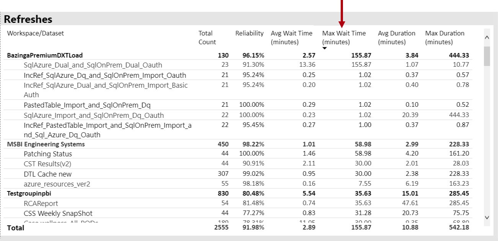

Inoltre, nell'oggetto visivo **tempo medio di attesa aggiornamento orario** si nota che i tempi di attesa dell'aggiornamento vengono raggiunti in modo coerente intorno alle 16.00 ogni giorno.

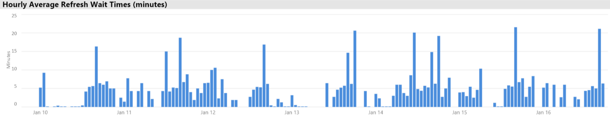

Sono disponibili diverse spiegazioni per i risultati seguenti:

- Troppi tentativi di aggiornamento possono essere eseguiti contemporaneamente, superando i limiti imposti dal nodo capacità (sei aggiornamenti simultanei su P1 con allocazione di memoria predefinita)

- I set di impostazioni da aggiornare possono avere dimensioni eccessive per la memoria disponibile (richiede almeno 2x la memoria necessaria per l'aggiornamento completo)
- Una logica di Power Query inefficiente può causare un picco di utilizzo della memoria durante l'aggiornamento del set di dati. In presenza di una capacità occupata, questo può occasionalmente raggiungere il limite fisico, senza errori di aggiornamento e potenzialmente influire sulle altre operazioni di visualizzazione dei report sulla capacità.
- I set di impostazioni di query frequenti che devono rimanere in memoria possono influire sulla capacità di aggiornamento di altri set di impostazioni, a causa della memoria disponibile limitata

Per risolvere il problema, l'amministratore Power BI può cercare:

- Memoria insufficiente al momento dell'aggiornamento dei dati, quando la memoria disponibile è inferiore a 2x le dimensioni del set di dati da aggiornare
- Set di impostazioni che non sono stati aggiornati e che non si trovavano in memoria prima di un aggiornamento, ma che iniziavano a mostrare il traffico interattivo durante i periodi di aggiornamento intensivo. Per vedere quali set di dati sono stati caricati in memoria in un determinato momento, un amministratore Power BI può esaminare l'area set di dati della scheda **set** di dati nell'app e applicare un filtro incrociato a un determinato momento facendo clic su una delle barre nei **conteggi dei set di dati caricati su base oraria**. Un picco locale (mostrato nell'immagine seguente) indica un'ora in cui più set di impostazioni sono stati caricati in memoria, che potrebbero ritardare l'avvio degli aggiornamenti pianificati
- Sono state eliminate più eliminazioni del set di dati quando è pianificato l'avvio degli aggiornamenti dei dati, a indicare che si è verificato un elevato utilizzo di memoria causato dalla presenza di un numero eccessivo di report interattivi prima del momento dell'aggiornamento. Le eliminazioni del **set di dati e l'utilizzo della memoria oraria** possono indicare chiaramente picchi di sfratti.

La figura seguente mostra un picco locale nei DataSet caricati, che suggerisce l'avvio Interactive di query interattive degli aggiornamenti. Selezionando un periodo di tempo nell'oggetto visivo dei **conteggi dei set di dati caricati ogni ora** **, l'oggetto visivo viene** filtrato incrociato.

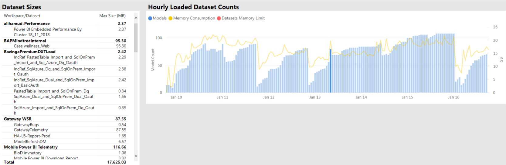

L'amministratore Power BI può tentare di risolvere il problema eseguendo alcune operazioni per verificare che sia disponibile memoria sufficiente per l'aggiornamento dei dati:

- Contattare i proprietari del set di dati e chiedere di scaglionare e distanziare le pianificazioni dell'aggiornamento dati
- Riduzione del carico di query del set di dati tramite la rimozione di dashboard non necessari o riquadri del dashboard, in particolare quelli che applicano la sicurezza
- Velocizzare gli aggiornamenti dei dati ottimizzando la logica di Power Query, le tabelle o le colonne calcolate del modello, riducendo le dimensioni del set di dati o configurando set di dati di grandi dimensioni per eseguire l'aggiornamento dati incrementale

### Identificazione di set di impostazioni di risposta lenta

In questo scenario, un'indagine è stata attivata quando gli utenti lamentavano che determinati report richiedevano molto tempo per l'apertura e a volte si bloccavano.

Nell'app, l'amministratore Power BI può usare l'oggetto visivo **durate delle query** per determinare i set di impostazioni più gravi eseguendo l'ordinamento dei set di impostazioni in base alla **durata media**decrescente. Questo oggetto visivo mostra anche i conteggi delle query del set di dati, quindi è possibile vedere con quale frequenza vengono eseguite query sui set di dati.

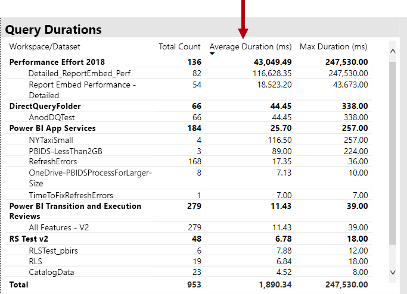

L'amministratore Power BI può fare riferimento all'oggetto visivo di **distribuzione della durata delle query** , che mostra una distribuzione complessiva delle prestazioni delle query bucket (< = 30ms, 0-100 ms e così via) per il periodo di tempo filtrato. In genere, le query che accettano un secondo o meno sono considerate reattive dalla maggior parte degli utenti. le query che hanno più tempo tendono a creare una percezione delle prestazioni non corrette.

L'oggetto visivo di **distribuzione della durata delle query orarie** consente all'amministratore Power BI di identificare i periodi di un'ora in cui le prestazioni della capacità potrebbero essere percepite come scarse. Maggiore è il numero di segmenti a barre che rappresentano le durate delle query in un secondo, maggiore sarà il rischio che gli utenti percepiranno prestazioni ridotte.

L'oggetto visivo è interattivo e quando viene selezionato un segmento della barra, l'oggetto visivo della tabella **durate della query** corrispondente nella pagina del report è filtrato in modo incrociato per visualizzare i set di impostazioni che rappresenta. Questo filtro incrociato consente all'amministratore Power BI di identificare facilmente i set di impostazioni che rispondono lentamente.

Nell'immagine seguente viene illustrato un oggetto visivo filtrato in base alle **distribuzioni di durata delle query orarie**, con particolare attenzione ai set di impostazioni che peggiorano le prestazioni in bucket di un'ora. 

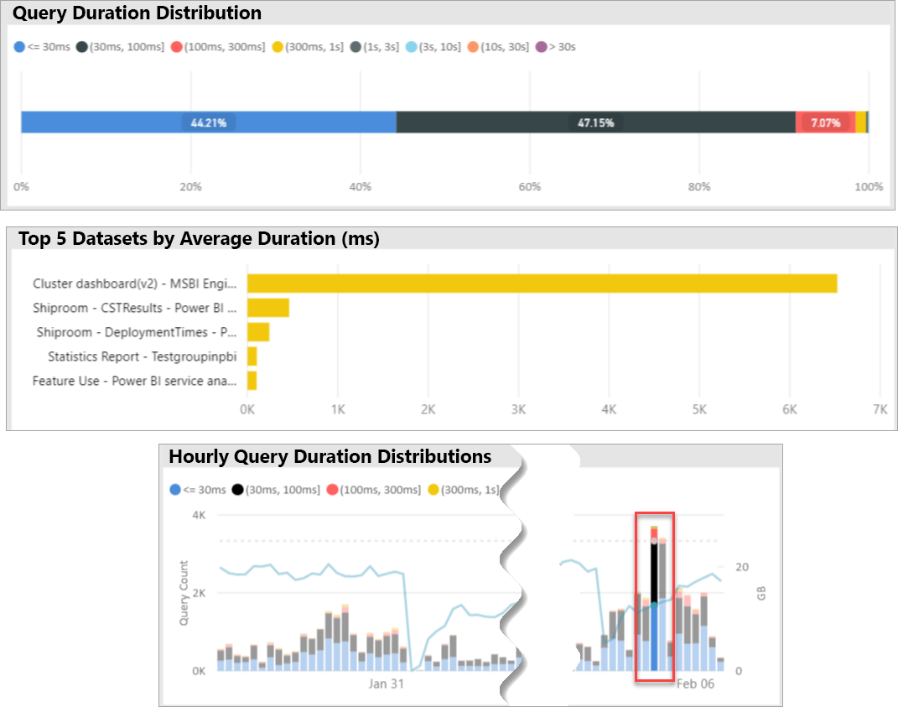

Una volta identificato il set di dati con prestazioni ridotte in un intervallo di tempo di un'ora specifico, l'amministratore Power BI può verificare se le prestazioni non ridotte sono dovute a una capacità di sovraccarico o a un set di dati o a un report progettato in modo non corretto. A tale scopo, possono fare riferimento all'oggetto visivo **tempi di attesa query** e ordinare i set di impostazioni in base al tempo medio di attesa query. Se un'alta percentuale di query è in attesa, è probabile che la causa delle numerose attese di query sia richiesta dal set di dati. Se il tempo medio di attesa delle query è sostanziale (> 100 ms), potrebbe valere la pena esaminare il set di dati e il report per verificare se è possibile effettuare le ottimizzazioni. Ad esempio, forse un numero inferiore di oggetti visivi nelle pagine del report specificate o nell'ottimizzazione di un'espressione DAX.

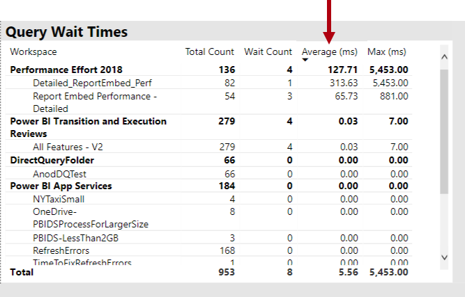

Esistono diversi motivi possibili per la compilazione del tempo di attesa delle query nei set di impostazioni:

- Progettazione di un modello non ottimale, espressioni di misura o persino progettazione di report: tutte le circostanze che possono contribuire a query con esecuzione prolungata che utilizzano livelli elevati di CPU. In questo modo, le nuove query attendono che i thread della CPU diventino disponibili e possano creare un effetto di serie di risorse, ovvero l'ingorgo del traffico, comunemente visualizzato durante i picchi di orario lavorativo La pagina **attese query** sarà la risorsa principale per determinare se i DataSet hanno tempi di attesa di query elevati.
- Un numero elevato di utenti simultanei di capacità (da centinaia a migliaia) che utilizzano lo stesso report o set di dati. Anche i set di impostazioni ben progettati possono essere eseguiti male oltre una soglia di concorrenza. Questa impostazione viene in genere indicata da un singolo set di dati che mostra un valore notevolmente superiore per il numero di query rispetto a quello di altri set di dati, ad esempio query 300K per un set di dati rispetto a < query 30K per tutti gli altri set di dati. A un certo punto, il tempo di attesa della query per questo set di dati inizierà a sfalsarsi e verrà visualizzato nell'oggetto visivo **Durata query** .
- Molti set di impostazioni diversi sono stati sottoposti a query simultaneamente, causando il thrashing come set di impostazioni di frequente per il ciclo di memoria. In questo modo gli utenti possono rallentare le prestazioni quando il set di dati viene caricato in memoria. Per confermare questo problema, l'amministratore Power BI può fare riferimento alle eliminazioni di **set di dati e al consumo di memoria oraria** , che potrebbero indicare che un numero elevato di set di dati caricati in memoria viene rimosso ripetutamente.

### Identificazione delle cause per i set di impostazioni a risposta lenta sporadica

In questo scenario, un'indagine è stata attivata quando gli utenti hanno descritto che gli oggetti visivi del report talvolta si sono rivelati lenti a rispondere o potrebbero non rispondere, ma in altri casi erano accettabili.

All'interno dell'app, è stata usata la sezione **durate query** per trovare il set di dati colpevole nel modo seguente:

- Nelle **durate delle query** l'amministratore ha filtrato il set di dati in base al set di dati (a partire dai set di dati principali sottoposti a query) ed esaminato le barre con filtro incrociato nell'oggetto visivo **distribuzioni di query orarie** .
- Quando una singola barra di un'ora presenta modifiche significative nel rapporto tra tutti i gruppi di durata delle query e altre barre di un'ora per tale set di dati, ovvero i rapporti tra i colori cambiano drasticamente, significa che questo set di dati ha dimostrato una modifica sporadica in prestazioni.
- Le barre di un'ora che mostrano una parte irregolare delle query con prestazioni ridotte, indicano un intervallo di tempo in cui il set di dati è stato influenzato da un effetto adiacente rumoroso, causato da altre attività dei set di dati.

L'immagine seguente mostra un'ora il 30 gennaio, in cui si è verificata una riduzione significativa delle prestazioni di un set di dati, indicata dalla dimensione del bucket di durata di esecuzione "(3, 10s]". Facendo clic sulla barra di un'ora vengono visualizzati tutti i set di risultati caricati in memoria durante tale periodo di tempo, esponendo in tal modo i set di impostazioni dei potenziali colpevoli causando il fastidioso effetto Neighbor.

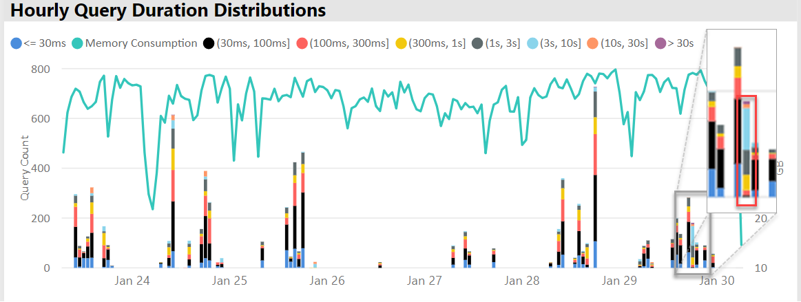

Quando viene identificato un intervallo di tempo problematico, ad esempio durante il 30 gennaio nell'immagine precedente, l'amministratore Power BI può rimuovere tutti i filtri del set di dati, quindi filtrare solo per tale intervallo di tempo per determinare i set di dati su cui è stata eseguita la query attivamente durante questo periodo. Il set di dati colpevole per l'effetto Neighbor vicino è in genere il set di dati con query più alto o quello con la durata media delle query più lunga.

Una soluzione a questo problema potrebbe essere la distribuzione dei set di dati colpevoli su aree di lavoro diverse con capacità Premium diverse o sulla capacità condivisa se sono supportate le dimensioni del set di dati, i requisiti di utilizzo e i modelli di aggiornamento dati.

Potrebbe anche essere vero il contrario. L'amministratore Power BI può identificare i momenti in cui le prestazioni delle query del set di dati migliorano drasticamente e quindi cercano le attività scomparse. Se a questo punto mancano alcune informazioni, questo può essere utile per puntare al problema che causa.

### Determinare se è disponibile memoria sufficiente

Per determinare se è disponibile memoria sufficiente per la capacità per completare i carichi di lavoro, l'amministratore Power BI può fare riferimento all'oggetto visivo **percentuali di memoria utilizzato** nella scheda **set di impostazioni** dell'app. **All** (Total) Memory rappresenta la memoria utilizzata dai set di impostazioni caricati in memoria, indipendentemente dal fatto che vengano attivamente sottoposti a query o elaborati. Memoria **attiva** rappresenta la memoria utilizzata dai set di impostazioni che vengono attivamente elaborati.

In una capacità integra, l'oggetto visivo sarà simile al seguente, mostrando un divario tra tutti i (totali) e la memoria attiva:

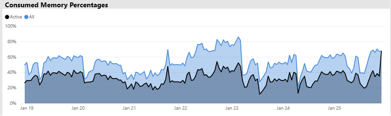

In una capacità in cui si verifica un utilizzo elevato della memoria, lo stesso oggetto visivo mostra chiaramente la memoria attiva e la convergenza della memoria totale, ovvero non è possibile caricare set di impostazioni aggiuntivi in memoria in quel momento. In questo caso, l'amministratore Power BI può fare clic su **riavvio della capacità** (in **Opzioni avanzate** dell'area Impostazioni capacità del portale di amministrazione). Se si riavvia la capacità, tutti i set di dati vengono scaricati dalla memoria e consentono loro di ricaricarli in memoria come richiesto (dalle query o dall'aggiornamento dati).

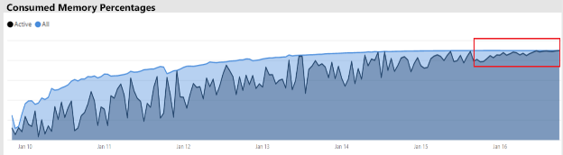

### Determinare se la CPU è sufficiente

In generale, l'utilizzo della CPU medio della capacità deve rimanere inferiore al 80%. Il superamento di questo valore indica che la capacità sta per raggiungere la saturazione della CPU.

Gli effetti della saturazione della CPU sono espressi dalle operazioni che richiedono più tempo del necessario a causa della capacità di eseguire molti commutatori di contesto della CPU durante il tentativo di elaborare tutte le operazioni. In una capacità Premium con un numero elevato di query simultanee, questo è indicato dai tempi di attesa delle query elevati. Una conseguenza di tempi di attesa delle query elevati è la velocità di risposta più bassa del consueto. L'amministratore Power BI può identificare facilmente il momento in cui la CPU è satura visualizzando l'oggetto visivo delle **distribuzioni del tempo di attesa delle query orarie** . I picchi periodici dei conteggi del tempo di attesa delle query indicano una potenziale saturazione della CPU.

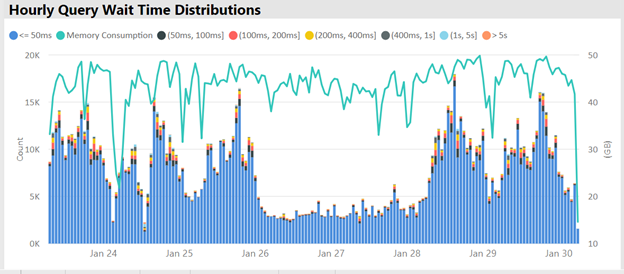

Un modello simile può talvolta essere rilevato in operazioni in background se contribuisce alla saturazione della CPU. Un amministratore Power BI può cercare un picco periodico nei tempi di aggiornamento per un set di dati specifico, che può indicare una saturazione della CPU al momento, probabilmente a causa di altri aggiornamenti del set di dati in corso e/o query interattive. In questo caso, fare riferimento alla vista di **sistema** nell'app potrebbe non rivelare necessariamente che la CPU si trova al 100%. La vista di **sistema** Visualizza le medie orarie, ma la CPU può diventare satura per diversi minuti di operazioni complesse, che vengono visualizzate come picchi di tempo di attesa.

Sono disponibili altre sfumature per vedere l'effetto della saturazione della CPU. Anche se il numero di query in attesa è importante, il tempo di attesa delle query sarà sempre in qualche misura senza causare un calo delle prestazioni percettibile. Alcuni set di impostazioni (con lunghe tempo medio query, che indica complessità o dimensioni) sono più soggetti agli effetti della saturazione della CPU rispetto ad altri. Per identificare facilmente questi set di impostazioni, l'amministratore Power BI può cercare le modifiche apportate alla composizione dei colori delle barre nell'oggetto visivo di **distribuzione del tempo di attesa orario** . Dopo aver individuato una barra outlier, è possibile cercare i set di impostazioni che avevano attese di query durante tale periodo e osservare anche il tempo medio di attesa delle query rispetto alla durata media delle query. Quando queste due metriche sono della stessa grandezza e il carico di lavoro della query per il set di dati non è semplice, è probabile che il set di dati venga influenzato dalla CPU insufficiente.

Questo effetto può essere particolarmente evidente quando un set di dati viene utilizzato in brevi picchi di query ad alta frequenza da parte di più utenti (ad esempio in una sessione di training), causando una saturazione della CPU durante ogni espansione. In questo caso, è possibile che si verifichino tempi di attesa delle query significativi in questo set di dati, oltre che per influire su altri set di dati nella capacità (effetto noisy neighbor).

In alcuni casi, gli amministratori Power BI possono richiedere che i proprietari del set di dati creino un carico di lavoro di query meno volatile creando un dashboard (che esegue periodicamente query con qualsiasi aggiornamento del set di dati per i riquadri memorizzati nella cache) anziché un report Ciò consente di evitare picchi quando il dashboard viene caricato. Questa soluzione potrebbe non essere sempre possibile per determinati requisiti aziendali, tuttavia può essere un modo efficace per evitare la saturazione della CPU, senza apportare modifiche al set di dati.

## Conclusioni

Power BI Premium offre prestazioni più coerenti, il supporto per volumi di dati di grandi dimensioni e la flessibilità di una piattaforma di Business Intelligence self-service e aziendale unificata per tutti gli utenti dell'organizzazione. Questo white paper tecnico di livello 300 è stato scritto appositamente per gli amministratori di Power BI e gli autori di contenuti e di editori. Mira ad aiutarli a comprendere il potenziale di Power BI Premium e a spiegare come progettare, distribuire, monitorare e risolvere i problemi relativi alle soluzioni scalabili.

Per distribuire e gestire Power BI Premium capacità, gli amministratori e gli sviluppatori di modelli richiederanno una conoscenza approfondita del funzionamento delle capacità, del modo in cui possono essere gestiti e monitorati e del modo in cui i modelli possono essere ottimizzati per rispondere in modo appropriato a i problemi di prestazioni e i colli di bottiglia dovrebbero verificarsi.

## Note finali

\[1\] questo documento tecnico riguarda Power BI Premium che è supportato solo dal servizio Power BI cloud, quindi Server di report di Power BI non rientra nell'ambito, tranne per indicare che la licenza necessaria per installare Server di report di Power BI è inclusa in alcuni Power BI Premium SKU.

\[2\] Power BI come servizio cloud quando viene usato per incorporare il contenuto per conto degli utenti dell'applicazione è una piattaforma distribuita come servizio (PaaS). Questo tipo di incorporamento può essere effettuato con due prodotti diversi, uno dei quali è Power BI Premium.

\[3\] i set di impostazioni push, streaming e ibridi non vengono archiviati nelle capacità Premium e pertanto non sono presi in considerazione durante la distribuzione, la gestione e il monitoraggio delle capacità Premium.

\[4\] le cartelle di lavoro di Excel come tipo di contenuto Power BI non vengono archiviate nelle capacità Premium e pertanto non sono una considerazione quando si distribuiscono, gestiscono o monitorano le capacità Premium.

è possibile configurare \[5\] oggetti visivi per ignorare le interazioni del filtro dei dati. Per ulteriori informazioni, vedere le [interazioni di visualizzazione in un documento Power bi report](service-reports-visual-interactions.md) .

\[6\] la differenza di dimensioni può essere determinata confrontando le dimensioni del file Power BI Desktop con la memoria di gestione attività usando per il file.

\[7\] supporto per le origini dati Microsoft includono SQL Server, Brick di dati di Azure, Azure HDInsight Spark (beta), database SQL di Azure e Azure SQL Data Warehouse. Per informazioni sulle origini aggiuntive, fare riferimento alle [origini dati supportate da query diretta in Power bi](desktop-directquery-data-sources.md) documento.

\[8\] Power BI Premium supporta il caricamento di un file di Power BI Desktop (pbix) con dimensioni massime di 10 GB. Una volta caricato, un set di dati può raggiungere dimensioni fino a 12 GB come risultato dell'aggiornamento. Le dimensioni massime di caricamento variano in base allo SKU. Per ulteriori informazioni, vedere il documento [supporto Power bi Premium per set di dati di grandi dimensioni](service-premium-large-datasets.md) .

\[9\] SKU con meno di quattro core v non vengono eseguiti nell'infrastruttura dedicata. Sono inclusi gli SKU EM1, EM2, a1 e a2.

\[10\] rari, i modelli possono essere scaricati dalla memoria a causa di operazioni del servizio.

\[11\] queste tempistiche sono soggette a modifiche in qualsiasi momento.

\[12\] questa funzionalità è denominata multigeo, attualmente in anteprima. La logica di una distribuzione Multi-Geo è in genere finalizzata alla conformità aziendale o di enti pubblici anziché alle prestazioni e alla scalabilità. Il caricamento di report e dashboard comporta comunque richieste all'area iniziale per i metadati. Per ulteriori informazioni, vedere il documento supporto di più aree [geografiche per Power bi Premium (anteprima)](service-admin-premium-multi-geo.md) .

\[13\] è possibile che gli utenti possano causare problemi di prestazioni sovraccaricando il servizio Power BI con i processi, scrivendo query eccessivamente complesse, creando riferimenti circolari e così via.

\[14\] l'opzione per l'assegnazione delle aree di lavoro dell'intera organizzazione non è consigliata e si preferisce un approccio più mirato. In genere, non è consigliabile usare le aree di lavoro personali per il contenuto di produzione.

\[15\] è possibile monitorare gli SKU nell'app o nel portale di Azure, ma non nel portale di amministrazione Power BI. Per monitorare gli SKU, l'aggiornamento del report avrà esito negativo se l'app non è stata aggiunta al ruolo lettore della risorsa. Per ulteriori informazioni, fare riferimento al documento [Monitor Power bi Premium e Power BI embedded capacities](service-admin-premium-monitor-capacity.md) .

\[16\] gli aggiornamenti possono attendere quando la CPU o la memoria non è sufficiente per l'avvio.

\[17\] le dimensioni del set di dati in memoria possono essere maggiori delle dimensioni su disco fino al 20%.

\[18\] utilizzo medio della memoria (GB) e utilizzo massimo della memoria (GB)

\[19\] eliminazioni DataSet

\[20\] query del set di dati, durata media query del set di dati (MS), conteggio attese set di dati e tempo medio di attesa del set di dati (MS)

\[21\] conteggio elevato utilizzo CPU e tempo CPU di utilizzo più elevato (ultimi sette giorni)

\[22\] conteggio utilizzo elevato DQ/LC e DQ/LC tempo di utilizzo più elevato (ultimi sette giorni)
